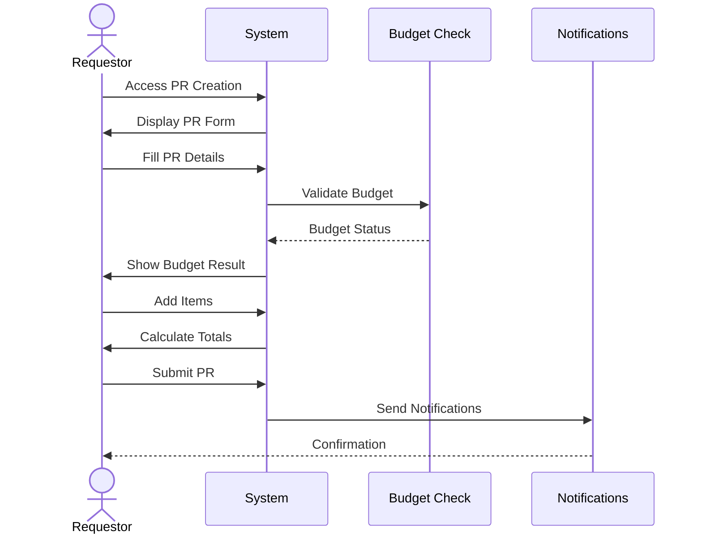
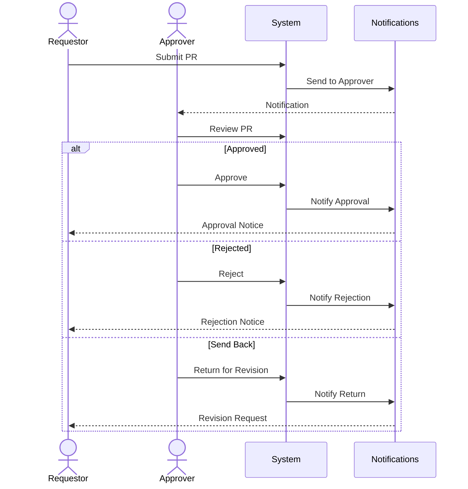
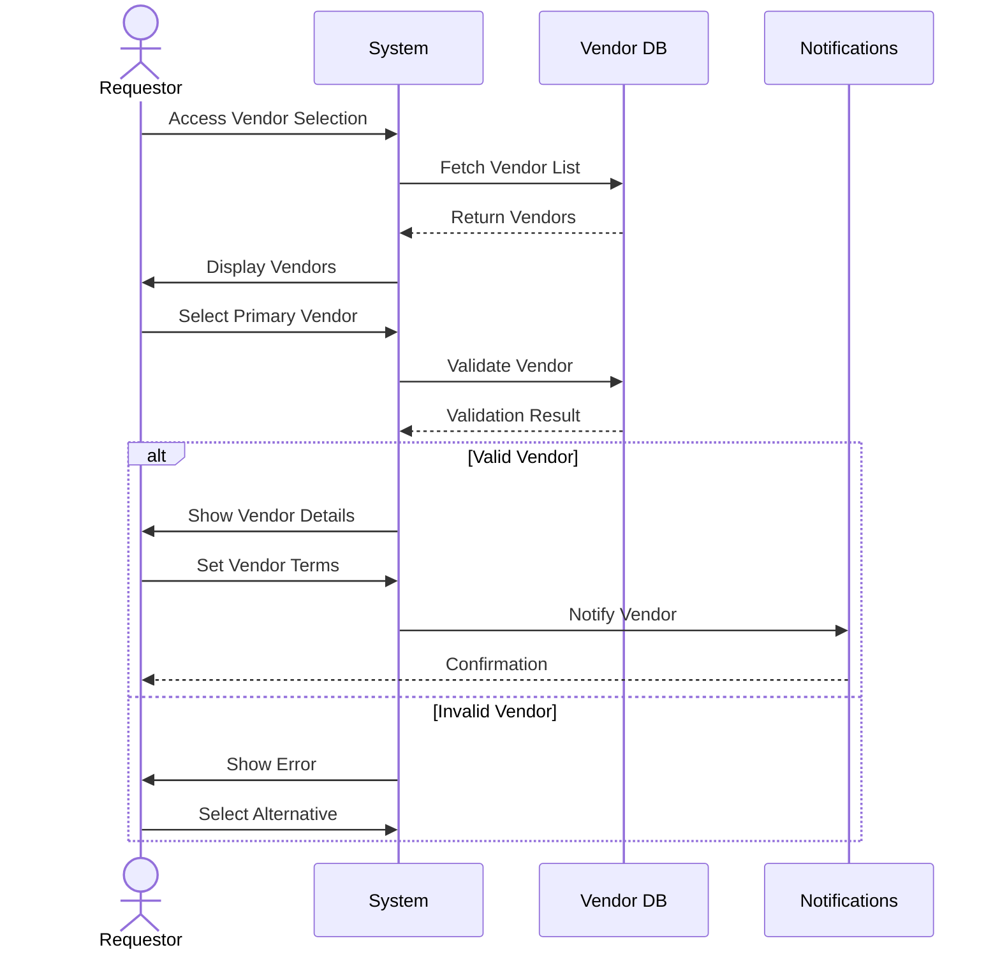
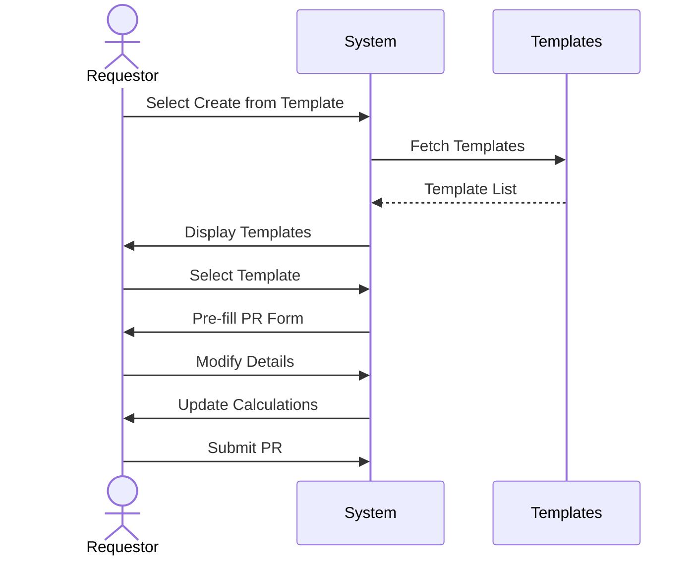
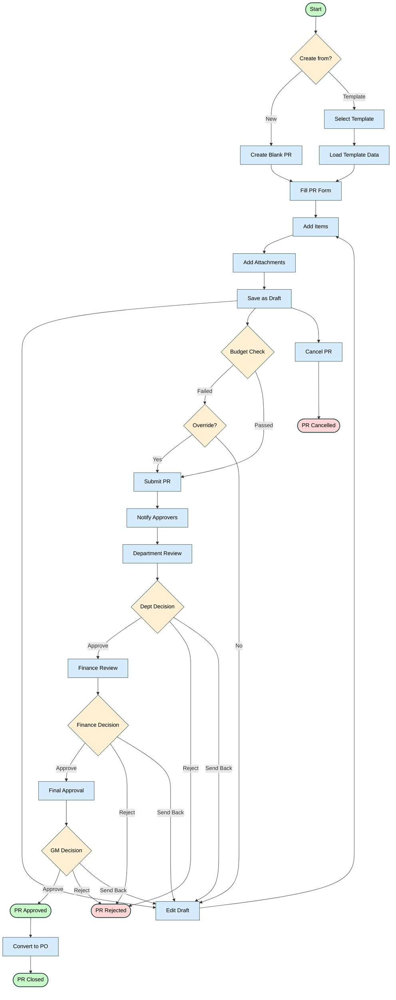
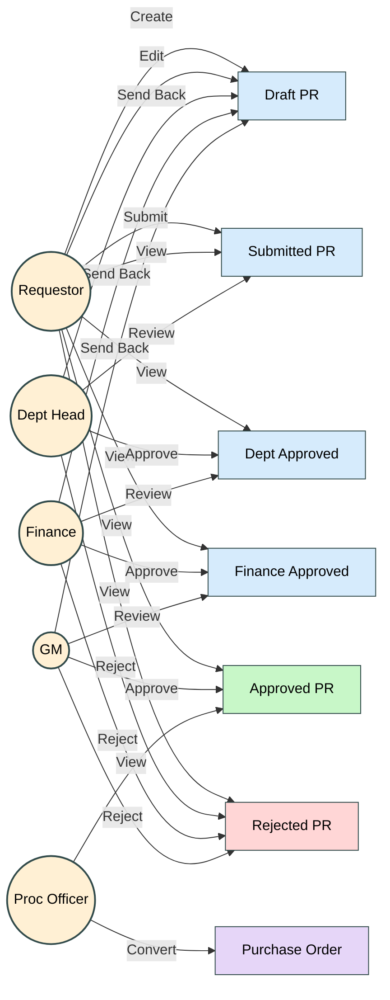
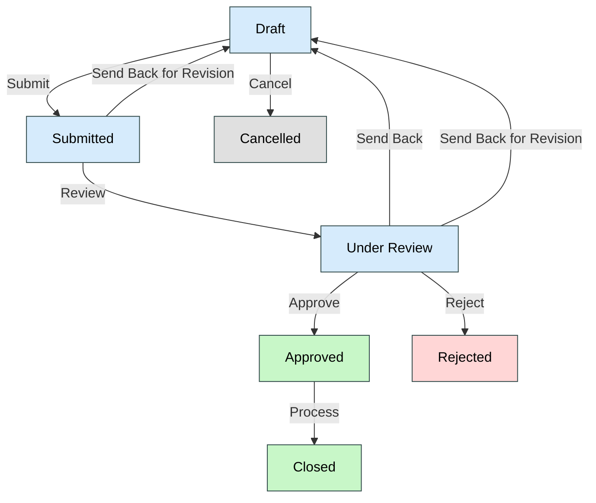

# Purchase Request Module - User Flow Documentation

## 1. Overview

### 1.1 Purpose
This document details the user flows and interactions within the Purchase Request (PR) module, providing step-by-step guidance for all user roles and scenarios.

### 1.2 User Roles
- Requestor
- Department Approver
- Finance Approver
- Budget Controller
- Procurement Officer
- System Administrator

## 2. Main User Flows

### 2.1 Create Purchase Request


### 2.2 Approval Process


### 2.3 Vendor Allocation


### 2.4 Template Usage


## 3. Detailed User Interactions

### 3.1 PR Creation Process
1. Access PR Creation
   - Navigate to PR module
   - Click "Create New PR"
   - Select creation method (blank/template)

2. Fill Header Information
   - Enter/select department
   - Choose currency
   - Set delivery date
   - Add description
   - Select priority
   - Select/assign vendor
   - Set vendor-specific terms

3. Vendor Selection
   - Search vendor database
   - View vendor details
   - Check vendor status
   - Review vendor ratings
   - Verify vendor compliance
   - Check vendor categories
   - Set vendor terms
   - Add alternate vendors

4. Add Items
   - Search/select items
   - Enter quantities
   - Add item notes
   - Set budget categories
   - Review pricing
   - Verify vendor availability
   - Check vendor quotations

5. Attach Documents
   - Upload files
   - Add document descriptions
   - Set document types
   - Review attachments

6. Submit PR
   - Review all details
   - Check budget status
   - Add submission notes
   - Confirm submission

### 3.2 Approval Process
1. Receive Approval Request
   - Get notification
   - Access PR details
   - Review information

2. Review PR Details
   - Check items
   - Verify budget
   - Review attachments
   - Check history

3. Take Action
   - Approve PR
   - Reject PR
   - Return for revision
   - Add comments
   - Set conditions

### 3.3 Template Management
1. Create Template
   - Start from existing PR
   - Set template name
   - Define default values
   - Set access rights

2. Use Template
   - Select template
   - Modify details
   - Update quantities
   - Adjust pricing
   - Submit PR

## 4. Error Handling

### 4.1 Validation Errors
1. Required Fields
   - Display error messages
   - Highlight missing fields
   - Show field requirements

2. Budget Validation
   - Show budget status
   - Display available amount
   - Highlight overages
   - Provide override options

3. Data Format Errors
   - Show format requirements
   - Highlight invalid entries
   - Provide correction guidance

### 4.2 System Errors
1. Connection Issues
   - Show connection status
   - Provide retry options
   - Save draft automatically
   - Recover last state

2. Processing Errors
   - Display error details
   - Provide error codes
   - Show recovery steps
   - Offer support contact

### 4.3 Budget Validation Process
The budget validation process is a critical component of the Purchase Request workflow, ensuring that all requests comply with financial controls and budget allocations.

```mermaid
flowchart TD
    %% Main nodes
    Start([Budget Check]) --> InitialCheck{Initial Budget\nValidation}
    
    %% Initial validation path
    InitialCheck -->|Check| FetchBudget[Fetch Budget Data]
    FetchBudget --> CalculateImpact[Calculate Budget Impact]
    CalculateImpact --> BudgetAvailable{Sufficient\nBudget?}
    
    %% Budget available path
    BudgetAvailable -->|Yes| ValidateSuccess[Budget Validation Passed]
    ValidateSuccess --> DisplayStatus[Display Budget Status]
    DisplayStatus --> AllowSubmit([Allow PR Submission])
    
    %% Budget not available path
    BudgetAvailable -->|No| CheckOverride{Override\nAllowed?}
    
    %% Override paths
    CheckOverride -->|Yes| OverrideRules[Check Override Rules]
    OverrideRules --> RequireApproval{Requires Special\nApproval?}
    RequireApproval -->|Yes| RequestApproval[Request Budget Override Approval]
    RequestApproval --> WaitForApproval[Wait for Override Approval]
    WaitForApproval --> OverrideDecision{Override\nApproved?}
    OverrideDecision -->|Yes| ValidateSuccess
    OverrideDecision -->|No| RejectOverride[Reject Override]
    RejectOverride --> DisplayError[Display Budget Error]
    
    RequireApproval -->|No| ValidateSuccess
    
    %% No override path
    CheckOverride -->|No| DisplayError
    DisplayError --> SuggestOptions[Suggest Options]
    SuggestOptions --> EditOptions{User Action?}
    
    %% Edit options
    EditOptions -->|Reduce Quantities| EditItems[Edit PR Items]
    EditItems --> InitialCheck
    
    EditOptions -->|Change Items| EditItems
    
    EditOptions -->|Cancel PR| CancelPR[Cancel PR]
    CancelPR --> End([End Budget Process])
    
    EditOptions -->|Save as Draft| SaveDraft[Save as Draft]
    SaveDraft --> End
    
    %% Styling with lighter colors
    classDef start fill:#C8F7C8,stroke:#324B4B,stroke-width:2px,color:black
    classDef process fill:#D6EBFC,stroke:#324B4B,stroke-width:1px,color:black
    classDef decision fill:#FFF0D4,stroke:#324B4B,stroke-width:1px,color:black
    classDef terminated fill:#FFD6D6,stroke:#324B4B,stroke-width:2px,color:black
    classDef success fill:#C8F7C8,stroke:#324B4B,stroke-width:2px,color:black
    classDef error fill:#FFD6D6,stroke:#324B4B,stroke-width:1px,color:black
    classDef end fill:#E0E0E0,stroke:#324B4B,stroke-width:2px,color:black
    
    class Start,AllowSubmit,End start
    class FetchBudget,CalculateImpact,ValidateSuccess,DisplayStatus,OverrideRules,RequestApproval,WaitForApproval,RejectOverride,DisplayError,SuggestOptions,EditItems,CancelPR,SaveDraft process
    class InitialCheck,BudgetAvailable,CheckOverride,RequireApproval,OverrideDecision,EditOptions decision
    class ValidateSuccess,AllowSubmit success
    class RejectOverride,DisplayError error
```

#### Budget Validation Steps:

1. **Initial Budget Check**
   - System retrieves current budget data
   - Calculates PR's impact on available budget
   - Compares PR total against available budget

2. **Budget Availability Decision**
   - If sufficient budget exists, validation passes
   - If insufficient budget, system checks override options

3. **Override Process**
   - System checks if user has override permissions
   - Determines if special approval is required
   - Routes override request to appropriate approvers
   - Tracks override approval status

4. **User Options When Budget Insufficient**
   - Reduce quantities or change items
   - Request budget override
   - Save as draft for later submission
   - Cancel the PR

5. **Budget Status Display**
   - Shows current budget allocation
   - Displays PR impact on budget
   - Indicates remaining budget after PR
   - Highlights any budget warnings or errors

## 5. User Interface States

### 5.1 PR Status Indicators
- Draft: Yellow
- Submitted: Blue
- Under Review: Orange
- Approved: Green
- Rejected: Red
- Cancelled: Grey
- Closed: Black
- Sent Back: Purple

### 5.2 Action Availability
- Edit: Draft status only
- Submit: Complete required fields
- Approve: Authorized approvers only
- Cancel: Before final approval
- Close: After completion

## 6. Notifications

### 6.1 Email Notifications
- PR Submission
- Approval Request
- Approval Decision
- Budget Alert
- Status Update
- Action Required

### 6.2 In-App Notifications
- Pending Actions
- Status Changes
- Budget Warnings
- System Messages
- Reminders

## 7. Mobile Experience

### 7.1 Mobile Views
- PR List
- PR Details
- Approval Actions
- Status Updates
- Notifications

### 7.2 Mobile Actions
- View PR Details
- Basic Approvals
- Status Checks
- Notifications
- Comments

## 8. Shortcuts and Quick Actions

### 8.1 Keyboard Shortcuts
- Alt + N: New PR
- Alt + S: Save Draft
- Alt + A: Approve
- Alt + R: Reject
- Ctrl + Enter: Submit

### 8.2 Quick Actions
- Copy PR
- Save Template
- Quick Approve
- Bulk Update
- Export Data

## 9. Help and Support

### 9.1 Contextual Help
- Field descriptions
- Process guidance
- Validation rules
- Error solutions
- Best practices

### 9.2 Support Access
- Help documentation
- Video tutorials
- Support contact
- FAQ access
- Training materials

## 10. Comprehensive Purchase Request Lifecycle

### 10.1 Complete PR Lifecycle Flowchart


### 10.2 Role-Based PR Interaction Diagram


## 11. Appendices

### 11.1 Status Flow Diagram


### 11.2 Screen Maps
1. PR List View
2. PR Creation Form
3. Approval View
4. Template Selection
5. Document Attachment
6. Budget Review
7. Status History
8. Audit Trail

## 12. Sign-off

| Role | Name | Date | Signature |
|------|------|------|-----------|
| UX Designer | | | |
| Business Analyst | | | |
| Training Lead | | | |
| User Representative | | | |
