# Goods Received Note (GRN) Module - Component Structure

This document outlines the component structure and hierarchy for the Goods Received Note module.

## 1. Component Hierarchy

```mermaid
classDiagram
    class GoodsReceiveNotePage {
        +render()
    }
    
    class GoodsReceiveNoteList {
        -grnData: GoodsReceiveNote[]
        -filters: Filters
        -pagination: Pagination
        -selectedItems: string[]
        +handleFilter()
        +handleSort()
        +handleBulkAction()
        +handleItemSelect()
        +handleAddNew()
        +render()
    }
    
    class GoodsReceiveNoteComponent {
        -formData: GoodsReceiveNote
        -mode: GoodsReceiveNoteMode
        -selectedItems: string[]
        -isEditable: boolean
        +handleItemsChange()
        +handleItemSelect()
        +handleSave()
        +handleSubmit()
        +handleStatusChange()
        +handleBulkAction()
        +render()
    }
    
    class GoodsReceiveNoteItems {
        -items: GoodsReceiveNoteItem[]
        -mode: GoodsReceiveNoteMode
        -selectedItems: string[]
        -exchangeRate: number
        -baseCurrency: string
        +handleItemChange()
        +handleItemSelect()
        +handleAddItem()
        +handleRemoveItem()
        +calculateTotals()
        +render()
    }
    
    class ExtraCostsTab {
        -costs: ExtraCost[]
        -mode: GoodsReceiveNoteMode
        +handleCostChange()
        +handleAddCost()
        +handleRemoveCost()
        +handleDistributionMethodChange()
        +calculateDistribution()
        +render()
    }
    
    class StockMovementTab {
        -movements: StockMovement[]
        -mode: GoodsReceiveNoteMode
        +handleMovementChange()
        +render()
    }
    
    class FinancialSummaryTab {
        -summary: FinancialSummary
        -mode: GoodsReceiveNoteMode
        -currency: string
        -baseCurrency: string
        +render()
    }
    
    class TaxTab {
        -taxInvoiceNumber: string
        -taxInvoiceDate: Date
        -documentTotals: DocumentTotals
        -currency: string
        -baseCurrency: string
        -mode: GoodsReceiveNoteMode
        +handleTaxInvoiceChange()
        +render()
    }
    
    class CommentsAttachmentsTab {
        -comments: Comment[]
        -attachments: Attachment[]
        -mode: GoodsReceiveNoteMode
        +handleAddComment()
        +handleAddAttachment()
        +handleRemoveComment()
        +handleRemoveAttachment()
        +render()
    }
    
    class ActivityLogTab {
        -activityLog: ActivityLogEntry[]
        +render()
    }
    
    class BulkActions {
        -selectedItems: string[]
        -actions: Action[]
        +handleAction()
        +render()
    }
    
    class SummaryTotal {
        -grnData: GoodsReceiveNote
        +render()
    }
    
    class ItemDetailForm {
        -item: GoodsReceiveNoteItem
        -mode: GoodsReceiveNoteMode
        +handleChange()
        +handleSave()
        +handleCancel()
        +render()
    }
    
    class FilterBuilder {
        -filters: Filter[]
        -appliedFilters: AppliedFilter[]
        +handleAddFilter()
        +handleRemoveFilter()
        +handleApplyFilters()
        +handleClearFilters()
        +render()
    }
    
    GoodsReceiveNotePage --> GoodsReceiveNoteList
    GoodsReceiveNotePage --> GoodsReceiveNoteComponent
    
    GoodsReceiveNoteList --> FilterBuilder
    GoodsReceiveNoteList --> BulkActions
    
    GoodsReceiveNoteComponent --> GoodsReceiveNoteItems
    GoodsReceiveNoteComponent --> ExtraCostsTab
    GoodsReceiveNoteComponent --> StockMovementTab
    GoodsReceiveNoteComponent --> FinancialSummaryTab
    GoodsReceiveNoteComponent --> TaxTab
    GoodsReceiveNoteComponent --> CommentsAttachmentsTab
    GoodsReceiveNoteComponent --> ActivityLogTab
    GoodsReceiveNoteComponent --> SummaryTotal
    GoodsReceiveNoteComponent --> BulkActions
    
    GoodsReceiveNoteItems --> ItemDetailForm
```



## 2. Component Descriptions

### 2.1 Page Components

#### GoodsReceiveNotePage
- **Purpose**: Main container for the GRN module pages
- **Responsibilities**: 
  - Routing between list and detail views
  - Handling URL parameters
  - Managing page-level state

#### GoodsReceiveNoteList
- **Purpose**: Display a list of GRNs with filtering and sorting
- **Responsibilities**:
  - Fetching GRN data
  - Handling filters and sorting
  - Managing pagination
  - Supporting bulk actions
  - Handling item selection

#### GoodsReceiveNoteComponent
- **Purpose**: Main component for creating, viewing, and editing GRNs
- **Responsibilities**:
  - Managing GRN form data
  - Handling mode switching (view/edit/create)
  - Coordinating between tabs
  - Processing save, submit, and approval actions
  - Managing item selection for bulk actions

### 2.2 Tab Components

#### GoodsReceiveNoteItems
- **Purpose**: Manage GRN items
- **Responsibilities**:
  - Displaying item grid
  - Handling item editing
  - Managing item selection
  - Calculating item totals
  - Supporting add/remove operations

#### ExtraCostsTab
- **Purpose**: Manage extra costs for the GRN
- **Responsibilities**:
  - Displaying cost grid
  - Handling cost editing
  - Managing distribution methods
  - Calculating cost allocations

#### StockMovementTab
- **Purpose**: Display stock movements related to the GRN
- **Responsibilities**:
  - Showing movement history
  - Displaying lot and location details
  - Supporting movement filtering

#### FinancialSummaryTab
- **Purpose**: Display financial summary and journal entries
- **Responsibilities**:
  - Showing accounting entries
  - Displaying account distributions
  - Supporting currency conversion display

#### TaxTab
- **Purpose**: Manage tax information for the GRN
- **Responsibilities**:
  - Handling tax invoice details
  - Displaying tax calculations
  - Supporting tax code management

#### CommentsAttachmentsTab
- **Purpose**: Manage comments and attachments
- **Responsibilities**:
  - Displaying comments and attachments
  - Supporting add/remove operations
  - Handling file uploads

#### ActivityLogTab
- **Purpose**: Display activity log for the GRN
- **Responsibilities**:
  - Showing audit trail
  - Supporting filtering and sorting
  - Displaying user and action details

### 2.3 Utility Components

#### BulkActions
- **Purpose**: Provide bulk action functionality
- **Responsibilities**:
  - Displaying action buttons
  - Handling action execution
  - Managing confirmation dialogs

#### SummaryTotal
- **Purpose**: Display financial totals
- **Responsibilities**:
  - Showing subtotal, tax, discount, and total
  - Supporting currency display
  - Highlighting key financial information

#### ItemDetailForm
- **Purpose**: Edit GRN item details
- **Responsibilities**:
  - Displaying item form
  - Handling field validation
  - Supporting save and cancel operations

#### FilterBuilder
- **Purpose**: Build and apply filters
- **Responsibilities**:
  - Managing filter criteria
  - Handling filter application
  - Supporting filter clearing

## 3. Component Props and State

### 3.1 GoodsReceiveNoteList Props
```typescript
interface GoodsReceiveNoteListProps {
  initialFilters?: Filters;
  onGRNSelect?: (id: string) => void;
  onGRNCreate?: () => void;
}
```

### 3.2 GoodsReceiveNoteComponent Props
```typescript
interface GoodsReceiveNoteComponentProps {
  initialData: GoodsReceiveNote;
  mode: GoodsReceiveNoteMode;
  onSave?: (data: GoodsReceiveNote) => void;
  onSubmit?: (data: GoodsReceiveNote) => void;
  onCancel?: () => void;
  onModeChange?: (mode: GoodsReceiveNoteMode) => void;
}
```

### 3.3 GoodsReceiveNoteItems Props
```typescript
interface GoodsReceiveNoteItemsProps {
  items: GoodsReceiveNoteItem[];
  mode: GoodsReceiveNoteMode;
  selectedItems: string[];
  exchangeRate: number;
  baseCurrency: string;
  onItemsChange: (items: GoodsReceiveNoteItem[]) => void;
  onItemSelect: (itemId: string, selected: boolean) => void;
}
```

### 3.4 ExtraCostsTab Props
```typescript
interface ExtraCostsTabProps {
  initialCosts: ExtraCost[];
  mode: GoodsReceiveNoteMode;
  onCostsChange: (costs: ExtraCost[]) => void;
}
```

### 3.5 StockMovementTab Props
```typescript
interface StockMovementTabProps {
  movements: StockMovement[];
  mode: GoodsReceiveNoteMode;
}
```

### 3.6 FinancialSummaryTab Props
```typescript
interface FinancialSummaryTabProps {
  summary: FinancialSummary | null;
  mode: GoodsReceiveNoteMode;
  currency: string;
  baseCurrency: string;
}
```

### 3.7 TaxTab Props
```typescript
interface TaxTabProps {
  taxInvoiceNumber: string;
  taxInvoiceDate?: Date;
  documentTotals: DocumentTotals;
  currency: string;
  baseCurrency: string;
  mode: GoodsReceiveNoteMode;
  onTaxInvoiceChange: (field: string, value: any) => void;
}
```

### 3.8 BulkActions Props
```typescript
interface BulkActionsProps {
  selectedItems: string[];
  onAction: (action: string, itemIds: string[]) => void;
}
```

### 3.9 SummaryTotal Props
```typescript
interface SummaryTotalProps {
  poData: GoodsReceiveNote;
}
```

### 3.10 ItemDetailForm Props
```typescript
interface ItemDetailFormProps {
  item: GoodsReceiveNoteItem;
  mode: GoodsReceiveNoteMode;
  onSave: (item: GoodsReceiveNoteItem) => void;
  onCancel: () => void;
}
```

## 4. Component State Management

### 4.1 GoodsReceiveNoteList State
```typescript
interface GoodsReceiveNoteListState {
  grnData: GoodsReceiveNote[];
  loading: boolean;
  error: Error | null;
  filters: Filters;
  pagination: {
    currentPage: number;
    itemsPerPage: number;
    totalItems: number;
  };
  sorting: {
    field: string;
    direction: 'asc' | 'desc';
  };
  selectedItems: string[];
}
```

### 4.2 GoodsReceiveNoteComponent State
```typescript
interface GoodsReceiveNoteComponentState {
  formData: GoodsReceiveNote;
  originalData: GoodsReceiveNote;
  mode: GoodsReceiveNoteMode;
  loading: boolean;
  saving: boolean;
  error: Error | null;
  selectedItems: string[];
  activeTab: string;
  showItemDetail: boolean;
  currentItem: GoodsReceiveNoteItem | null;
  validationErrors: Record<string, string>;
}
```

## 5. Component Interactions

### 5.1 GRN List to Detail Flow
1. User clicks on a GRN in the list
2. `GoodsReceiveNoteList` calls `onGRNSelect` with the GRN ID
3. `GoodsReceiveNotePage` navigates to the detail page with the selected ID
4. `GoodsReceiveNoteComponent` loads the GRN data and displays it

### 5.2 GRN Creation Flow
1. User clicks "Create New" in the list
2. `GoodsReceiveNoteList` calls `onGRNCreate`
3. `GoodsReceiveNotePage` navigates to the creation page
4. `GoodsReceiveNoteComponent` initializes with empty data in "create" mode
5. User fills in the form and adds items
6. User clicks "Save"
7. `GoodsReceiveNoteComponent` calls `onSave` with the form data
8. `GoodsReceiveNotePage` processes the save and navigates to the detail page

### 5.3 Item Editing Flow
1. User selects an item in the `GoodsReceiveNoteItems` grid
2. `GoodsReceiveNoteItems` shows the `ItemDetailForm` for the selected item
3. User edits the item details
4. User clicks "Save" in the form
5. `ItemDetailForm` calls `onSave` with the updated item
6. `GoodsReceiveNoteItems` updates the item in its internal state
7. `GoodsReceiveNoteItems` calls `onItemsChange` with the updated items array
8. `GoodsReceiveNoteComponent` updates its form data with the new items

### 5.4 Bulk Action Flow
1. User selects multiple items in the `GoodsReceiveNoteItems` grid
2. `GoodsReceiveNoteItems` calls `onItemSelect` for each selected item
3. `GoodsReceiveNoteComponent` updates its `selectedItems` state
4. `BulkActions` component becomes active with the selected items
5. User selects an action from the `BulkActions` component
6. `BulkActions` calls `onAction` with the action and selected items
7. `GoodsReceiveNoteComponent` processes the action on the selected items
8. `GoodsReceiveNoteComponent` updates its form data and calls `onItemsChange`
9. `GoodsReceiveNoteItems` updates its display with the modified items 