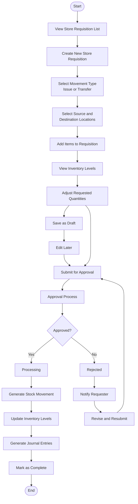
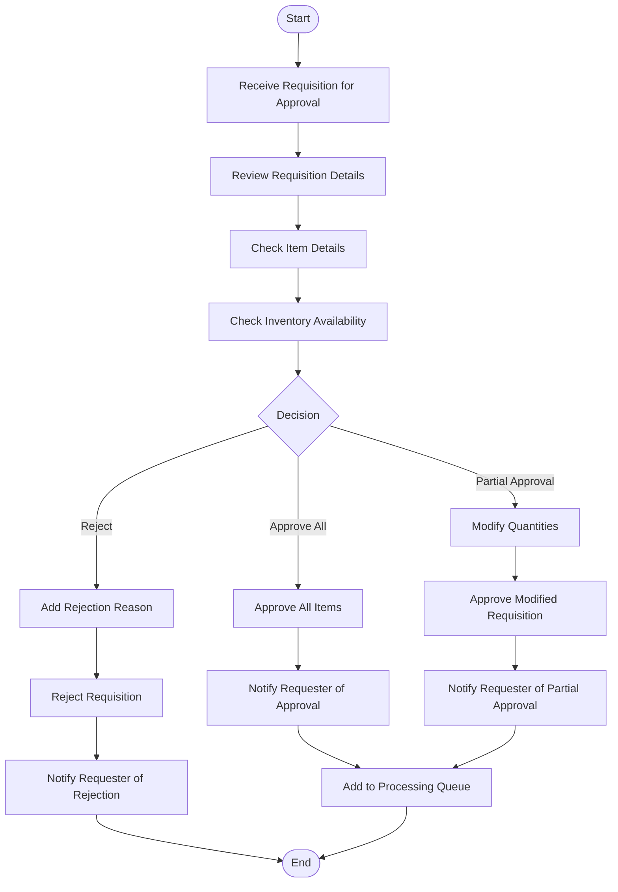
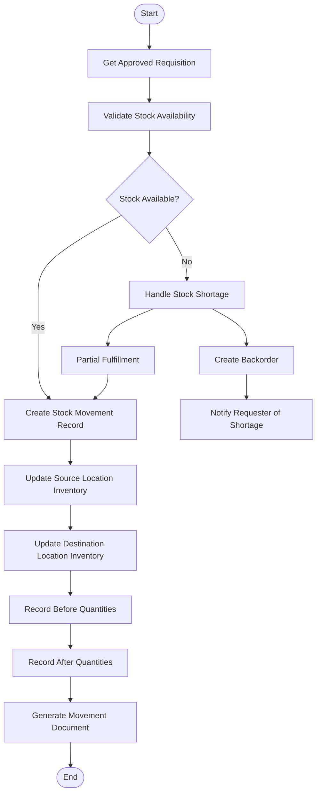
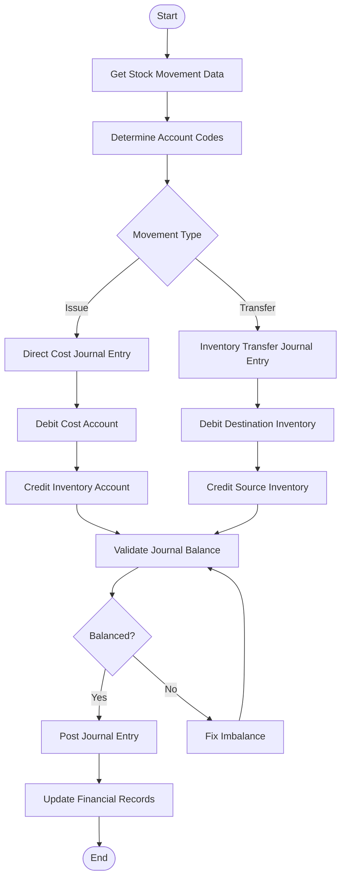
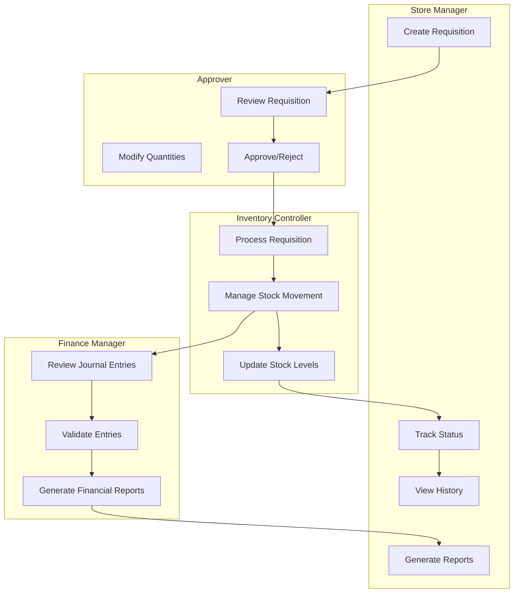
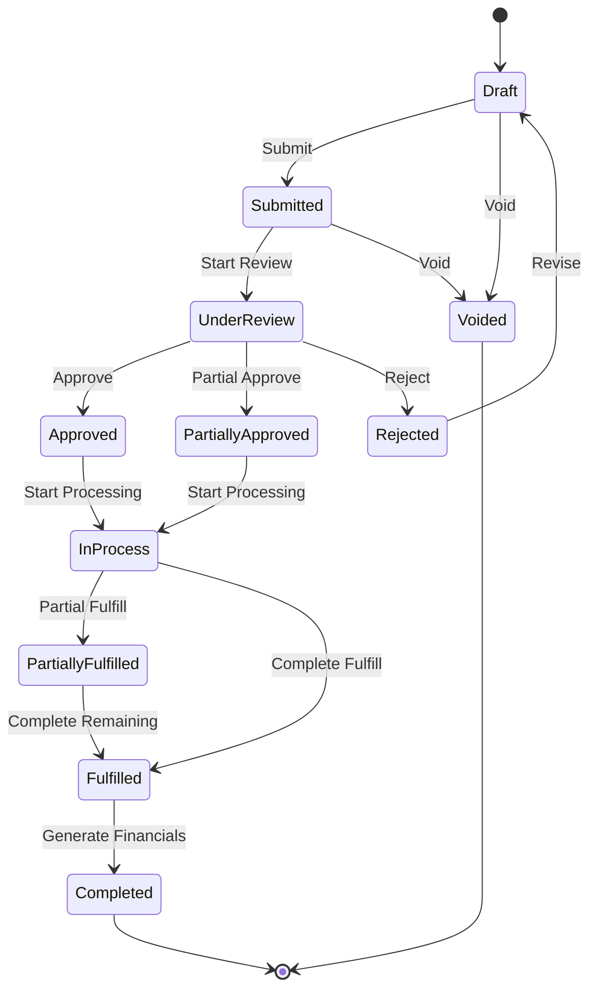

# Store Requisition Module - User Flow Diagrams

> **IMPORTANT**: This content has been migrated to [SR-User-Experience.md](./SR-User-Experience.md). Please refer to that document for the most up-to-date information.

This document provides visual representations of the user flows within the Store Requisition module of the Carmen F&B Management System.

## 1. Main Store Requisition Process Flow

## 2. Approval Workflow

## 3. Stock Movement Processing

## 4. Financial Processing

## 5. User Role Interactions

## 6. Complete Store Requisition Lifecycle

These diagrams illustrate the key user flows and processes within the Store Requisition module, from initial creation through approval, fulfillment, and financial processing. They provide a visual representation of how different users interact with the system and how data flows through the various stages of the requisition lifecycle. 