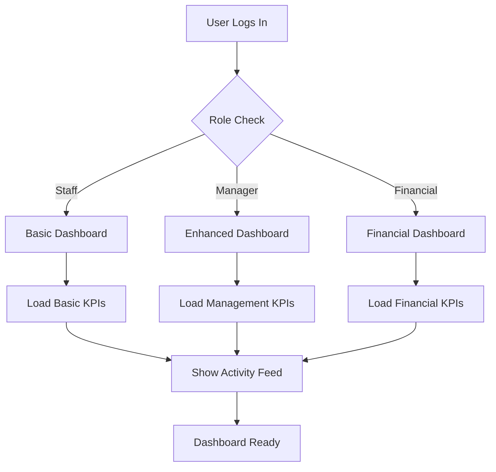
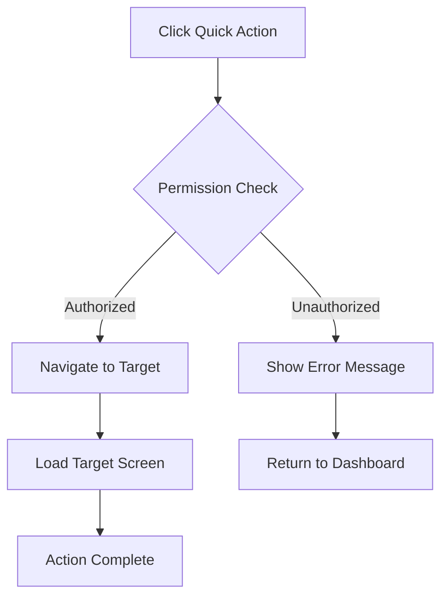
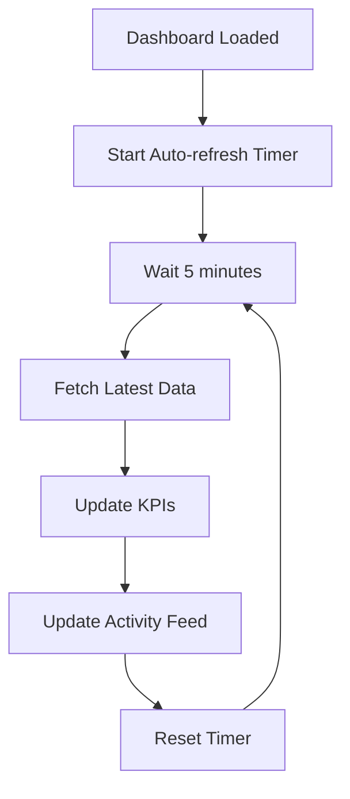

# Dashboard Screen - Detailed Specification

**Screen**: Dashboard Overview  
**Route**: `/dashboard`  
**User Roles**: All (with role-based content variations)  
**Last Updated**: August 22, 2025  

## Document History

| Version | Date | Author | Changes |
|---------|------|--------|---------|
| 1.0.0 | 2025-11-19 | Documentation Team | Initial version |
---

## 📸 Visual Reference

### Main Dashboard Interface


### Role-Based Variations

*Staff Role Dashboard View*


*Department Manager Dashboard View*


*Financial Manager Dashboard View*

---

## 🎯 Screen Objective

**Primary Purpose**: Provide role-specific overview of key business metrics, recent activities, and quick access to frequently used functions.

**User Goals**:
- Monitor business performance at a glance
- Access recent activities and pending tasks
- Navigate quickly to key business functions
- View role-appropriate KPIs and metrics

---

## 🏗️ Layout Structure

### Header Section
```
┌─────────────────────────────────────────────────────┐
│ [☰] Carmen ERP    [🔍 Search...]     [👤 Profile] │
├─────────────────────────────────────────────────────┤
│ Dashboard > Overview                                │
└─────────────────────────────────────────────────────┘
```

### Main Content Grid
```
┌─────────────────┬─────────────────┬─────────────────┐
│ KPI Card 1      │ KPI Card 2      │ KPI Card 3      │
│ Total Orders    │ Revenue Today   │ Pending Items   │
├─────────────────┼─────────────────┼─────────────────┤
│ KPI Card 4      │ Quick Actions   │ Recent Activity │
│ Inventory Value │ Panel          │ Feed           │
├─────────────────┴─────────────────┼─────────────────┤
│ Performance Charts                │ Alerts &        │
│ (Revenue/Orders Trend)            │ Notifications   │
└───────────────────────────────────┴─────────────────┘
```

---

## 🏷️ UI Components & Labels

### Navigation Elements
| Component | Label | Type | Action |
|-----------|-------|------|---------|
| **Hamburger Menu** | ☰ | Icon Button | Toggle sidebar navigation |
| **Application Title** | "Carmen ERP" | Text | Navigate to dashboard |
| **Search Bar** | "Search..." | Input Field | Global search functionality |
| **Profile Menu** | 👤 | Dropdown | User profile and settings |
| **Breadcrumb** | "Dashboard > Overview" | Navigation | Show current location |

### KPI Cards
#### Card 1: Total Orders
| Element | Label | Value Format | Role Visibility |
|---------|-------|--------------|-----------------|
| **Title** | "Total Orders" | Text | All Roles |
| **Value** | "1,247" | Number | All Roles |
| **Trend** | "+12% from last week" | Percentage | Manager+ |
| **Icon** | 📋 | Icon | All Roles |

#### Card 2: Revenue Today  
| Element | Label | Value Format | Role Visibility |
|---------|-------|--------------|-----------------|
| **Title** | "Revenue Today" | Text | Financial+ |
| **Value** | "$45,320" | Currency | Financial+ |
| **Trend** | "+8% from yesterday" | Percentage | Financial+ |
| **Icon** | 💰 | Icon | Financial+ |

#### Card 3: Pending Items
| Element | Label | Value Format | Role Visibility |
|---------|-------|--------------|-----------------|
| **Title** | "Pending Approvals" | Text | All Roles |
| **Value** | "23" | Number | All Roles |
| **Action** | "View All" | Link | All Roles |
| **Icon** | ⏳ | Icon | All Roles |

#### Card 4: Inventory Value
| Element | Label | Value Format | Role Visibility |
|---------|-------|--------------|-----------------|
| **Title** | "Total Inventory Value" | Text | Manager+ |
| **Value** | "$234,567" | Currency | Manager+ |
| **Trend** | "-2% from last month" | Percentage | Manager+ |
| **Icon** | 📦 | Icon | Manager+ |

### Quick Actions Panel
| Action Button | Label | Icon | Target Route | Role Access |
|---------------|-------|------|--------------|-------------|
| **New Purchase Request** | "New PR" | ➕ | `/procurement/purchase-requests/new-pr` | All |
| **Stock Check** | "Stock Check" | 📊 | `/inventory-management/stock-overview` | All |
| **Vendor Management** | "Vendors" | 🏢 | `/vendor-management/vendors` | Manager+ |
| **Reports** | "Reports" | 📈 | `/reporting-analytics` | Manager+ |

### Recent Activity Feed
| Element | Format | Content Type | Role Filter |
|---------|--------|--------------|-------------|
| **Activity Item** | "User performed Action on Item at Time" | Text | Department-based |
| **Timestamp** | "2 hours ago" | Relative Time | All |
| **Action Link** | "View Details" | Link | Permission-based |
| **User Avatar** | 👤 | Image/Icon | All |

---

## 📊 Data Fields & Sources

### KPI Data Sources
```typescript
interface DashboardKPIs {
  totalOrders: {
    value: number;
    trend: {
      percentage: number;
      period: 'day' | 'week' | 'month';
      direction: 'up' | 'down';
    };
    source: 'procurement.orders.count';
  };
  
  revenueToday: {
    value: Money;
    trend: {
      percentage: number;
      period: 'day';
      direction: 'up' | 'down';
    };
    source: 'finance.revenue.daily';
    visibility: ['financial-manager', 'department-manager'];
  };
  
  pendingApprovals: {
    value: number;
    breakdown: {
      purchaseRequests: number;
      inventoryAdjustments: number;
      vendorApprovals: number;
    };
    source: 'workflow.pending.user';
  };
  
  inventoryValue: {
    value: Money;
    trend: {
      percentage: number;
      period: 'month';
      direction: 'up' | 'down';
    };
    source: 'inventory.valuation.total';
    visibility: ['financial-manager', 'department-manager', 'purchasing-staff'];
  };
}
```

### Activity Feed Data
```typescript
interface ActivityItem {
  id: string;
  user: {
    name: string;
    avatar?: string;
    role: UserRole;
  };
  action: string;
  target: {
    type: 'purchase-request' | 'inventory-adjustment' | 'vendor' | 'order';
    id: string;
    name: string;
  };
  timestamp: string;
  department: string;
  visibility: UserRole[];
}
```

---

## ⚡ Interactive Actions

### Primary Actions
| Action | Trigger | Behavior | Validation |
|--------|---------|----------|------------|
| **Create New PR** | Click "New PR" button | Navigate to PR creation form | User has PR creation permission |
| **View Pending Approvals** | Click pending count | Show approval dashboard | User has approval permissions |
| **Quick Stock Check** | Click "Stock Check" | Navigate to inventory overview | User has inventory access |
| **Search** | Enter search term | Global search across modules | Auto-complete suggestions |

### Secondary Actions
| Action | Trigger | Behavior | Validation |
|--------|---------|----------|------------|
| **Refresh Data** | Pull-to-refresh / Auto-refresh | Update KPIs and activity feed | Every 5 minutes |
| **Filter Activity** | Dropdown selection | Filter by activity type/user | Department-based filtering |
| **Export Data** | Click export icon | Download dashboard data | Manager+ role required |
| **Customize View** | Settings menu | Personalize dashboard layout | Save user preferences |

---

## 🔄 User Flow Diagrams

### Dashboard Entry Flow


### Quick Action Flow


### Data Refresh Flow


---

## 📱 Responsive Behavior

### Desktop (1920px+)
- Full 4-column KPI layout
- Side-by-side quick actions and activity feed
- Expanded chart visualizations
- Full navigation sidebar visible

### Tablet (768px - 1919px)
- 2-column KPI layout
- Stacked quick actions and activity feed
- Condensed chart views
- Collapsible sidebar navigation

### Mobile (< 768px)
- Single column KPI layout
- Tabbed interface for quick actions/activity
- Minimal chart views
- Hidden sidebar with hamburger menu

---

## 🎨 Visual Design Specifications

### Color Scheme
- **Primary Background**: `#ffffff` (white)
- **Card Background**: `#f8f9fa` (light gray)
- **KPI Values**: `#1a1a1a` (dark gray)
- **Trend Positive**: `#22c55e` (green)
- **Trend Negative**: `#ef4444` (red)
- **Action Buttons**: `#3b82f6` (blue)

### Typography
- **KPI Values**: `text-3xl font-bold` (30px, bold)
- **KPI Labels**: `text-sm font-medium` (14px, medium)
- **Trends**: `text-xs` (12px)
- **Activity Text**: `text-sm` (14px)

### Spacing
- **Card Padding**: `p-6` (24px)
- **Grid Gap**: `gap-4` (16px)
- **Section Margins**: `mb-6` (24px)

---

## 🔧 Implementation Notes

### State Management
```typescript
interface DashboardState {
  kpis: DashboardKPIs;
  activities: ActivityItem[];
  loading: boolean;
  error: string | null;
  lastRefresh: string;
  userPreferences: {
    layout: 'compact' | 'expanded';
    refreshInterval: number;
    visibleKPIs: string[];
  };
}
```

### API Endpoints
- `GET /api/dashboard/kpis` - Fetch KPI data
- `GET /api/dashboard/activities` - Fetch activity feed
- `GET /api/dashboard/quick-actions` - Get available actions for user
- `POST /api/dashboard/preferences` - Save user preferences

### Performance Considerations
- Implement caching for KPI data (5-minute cache)
- Lazy load activity feed with pagination
- Use skeleton loading states during data fetch
- Implement error boundaries for failed data loads

---

## ✅ Acceptance Criteria

### Functional Requirements
- [ ] Dashboard loads within 2 seconds
- [ ] KPIs display accurate, real-time data
- [ ] Role-based content filtering works correctly
- [ ] Quick actions navigate to correct screens
- [ ] Activity feed updates automatically
- [ ] Search functionality works across modules
- [ ] Responsive design works on all screen sizes

### Visual Requirements
- [ ] Matches provided screenshots exactly
- [ ] Consistent spacing and typography
- [ ] Proper color scheme implementation
- [ ] Icons and graphics display correctly
- [ ] Loading states provide good UX
- [ ] Error states are user-friendly

### Performance Requirements
- [ ] Initial load time < 2 seconds
- [ ] Data refresh time < 1 second
- [ ] Smooth animations and transitions
- [ ] No memory leaks during auto-refresh
- [ ] Accessible via keyboard navigation
- [ ] Screen reader compatible

---

**Implementation Priority**: High (Core Application Entry Point)  
**Complexity**: Medium  
**Dependencies**: Authentication, Role Management, All Business Modules  

*This specification provides complete implementation guidance for the Carmen ERP Dashboard interface with pixel-perfect accuracy and comprehensive functionality.*