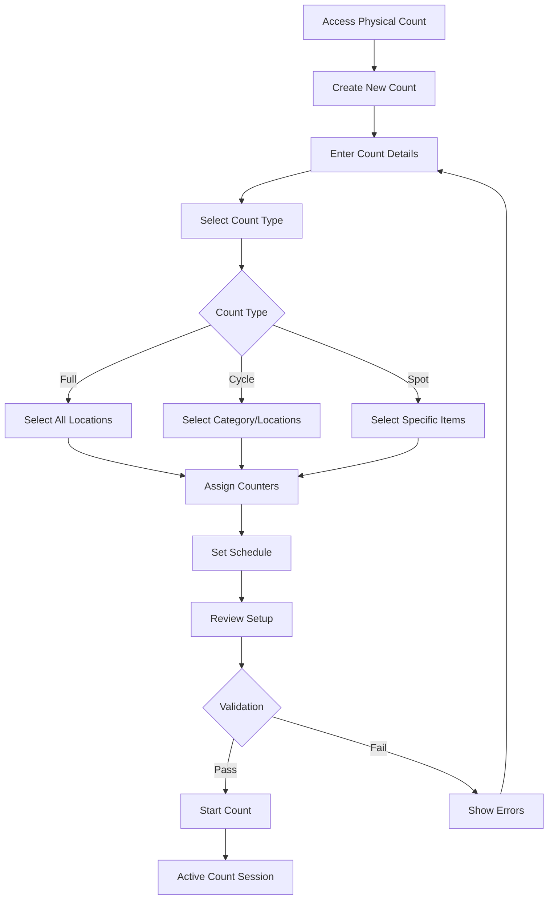
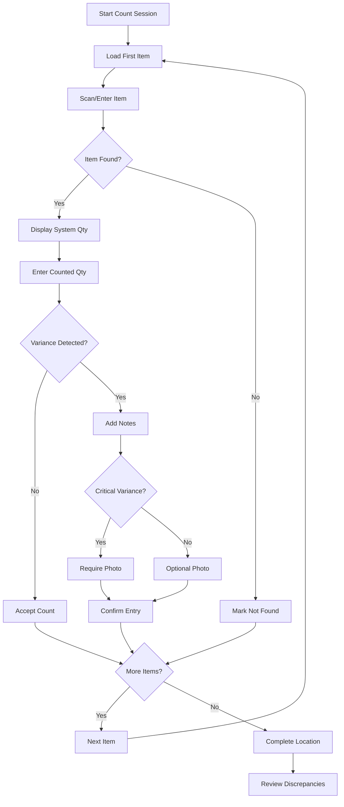
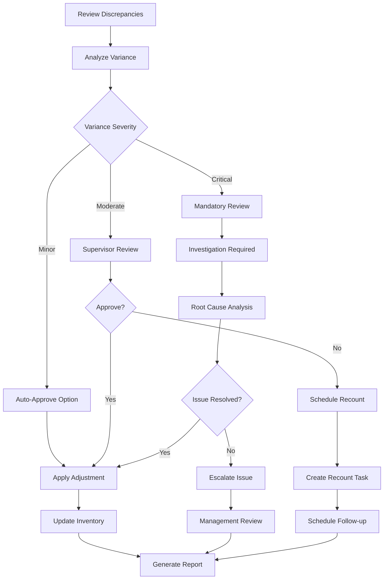

# Physical Count Process - Detailed Specification

**Screen**: Physical Inventory Count Workflow  
**Route**: `/inventory-management/physical-count`  
**User Roles**: Staff, Department Manager, Purchasing Staff  
**Last Updated**: August 22, 2025  

---

## 📸 Visual Reference

### Physical Count Setup


### Active Count Interface


### Item Review and Verification

*Item Review with Discrepancy Detection*

### Final Count Review


### Role-Based Variations

*Staff Role View - Limited to Assigned Locations*


*Department Manager View - Full Location Access*

---

## 🎯 Screen Objective

**Primary Purpose**: Systematic physical inventory counting process with real-time variance detection, multi-location support, and integrated approval workflows.

**User Goals**:
- Conduct accurate physical inventory counts
- Identify and resolve inventory discrepancies
- Track counting progress across multiple locations
- Generate variance reports and adjustments
- Maintain inventory accuracy and compliance

---

## 🏗️ Layout Structure

### Setup Phase Layout
```
┌─────────────────────────────────────────────────────────────────┐
│ [☰] Carmen ERP    Inventory > Physical Count         [👤]      │
├─────────────────────────────────────────────────────────────────┤
│ Physical Count Setup                           [📋 New Count]   │
├─────────────────────────────────────────────────────────────────┤
│ Count Information                                               │
│ ┌─────────────────────────────────────────────────────────────┐ │
│ │ Count Name: [Monthly Count - January 2025        ]         │ │
│ │ Count Type: [🔘 Full Count  ⭕ Cycle Count  ⭕ Spot Check] │ │
│ │ Scheduled:  [📅 2025-01-15] at [🕐 09:00 AM]             │ │
│ └─────────────────────────────────────────────────────────────┘ │
│                                                                 │
│ Location Selection                                              │
│ ┌─────────────────────────────────────────────────────────────┐ │
│ │ ☑ Main Kitchen       ☑ Dry Storage       ☑ Cold Storage    │ │
│ │ ☑ Bar Area          ☐ Cleaning Closet   ☐ Office Storage   │ │
│ │ ☐ Receiving Area    ☐ Guest Supplies    ☐ Equipment Room   │ │
│ └─────────────────────────────────────────────────────────────┘ │
│                                                                 │
│ Count Team Assignment                                           │
│ ┌─────────────────────────────────────────────────────────────┐ │
│ │ Counter 1: [John Smith ▼] → Main Kitchen, Dry Storage      │ │
│ │ Counter 2: [Mary Jones ▼] → Cold Storage, Bar Area         │ │
│ │ Supervisor: [Mike Wilson ▼] → Review & Approval            │ │
│ └─────────────────────────────────────────────────────────────┘ │
│                                                                 │
│ [Cancel] [Save Draft] [▶ Start Count]                          │
└─────────────────────────────────────────────────────────────────┘
```

### Active Count Layout
```
┌─────────────────────────────────────────────────────────────────┐
│ Physical Count: Monthly Count - January 2025    [⏸ Pause] [✅]  │
├─────────────────────────────────────────────────────────────────┤
│ Progress: Main Kitchen (12/45) • Cold Storage (8/23) • Bar (3/15)│
├─────────────────────────────────────────────────────────────────┤
│ Location: [Main Kitchen ▼]     Counter: John Smith             │
├─────────────────────────────────────────────────────────────────┤
│ Current Item: Olive Oil - Extra Virgin (500ml)                 │
│ ┌─────────────────────────────────────────────────────────────┐ │
│ │ 📱 Barcode: [Scan or Enter]    SKU: OLIV-EV-500           │ │
│ │ 📍 Location: Main Kitchen - Shelf A3                       │ │
│ │ 📊 System Qty: 24 units       Unit: bottles               │ │
│ │ 🔢 Counted Qty: [_____] units                             │ │
│ │ 📝 Notes: [Any discrepancies or conditions...]            │ │
│ └─────────────────────────────────────────────────────────────┘ │
│                                                                 │
│ [⬅ Previous] [📸 Photo] [❌ Not Found] [➡ Next] [✅ Confirm]   │
│                                                                 │
│ Discrepancies Found: 3 items need review                       │
│ ┌─────────────────────────────────────────────────────────────┐ │
│ │ • Flour (All-Purpose): Expected 50, Counted 47 (-3)       │ │
│ │ • Tomato Sauce: Expected 36, Counted 40 (+4)              │ │
│ │ • Rice (Basmati): Expected 25, Counted 22 (-3)            │ │
│ └─────────────────────────────────────────────────────────────┘ │
└─────────────────────────────────────────────────────────────────┘
```

### Review Phase Layout
```
┌─────────────────────────────────────────────────────────────────┐
│ Physical Count Review: Monthly Count - January 2025             │
├─────────────────────────────────────────────────────────────────┤
│ Summary: 156 items counted • 12 discrepancies • $2,340 variance │
├─────────────────────────────────────────────────────────────────┤
│ Discrepancy Report                                              │
│ ┌─────────────────────────────────────────────────────────────┐ │
│ │ Item              │System│Count│Variance│Value Impact│Action │ │
│ ├─────────────────────────────────────────────────────────────┤ │
│ │ Flour (All-Purpose)│  50  │ 47  │  -3   │  -$12.00  │[📝]  │ │
│ │ Tomato Sauce      │  36  │ 40  │  +4   │  +$16.80  │[📝]  │ │
│ │ Rice (Basmati)    │  25  │ 22  │  -3   │  -$18.75  │[📝]  │ │
│ │ Olive Oil Premium │  12  │ 14  │  +2   │  +$45.00  │[📝]  │ │
│ └─────────────────────────────────────────────────────────────┘ │
│                                                                 │
│ Adjustment Actions                                              │
│ ☑ Create inventory adjustments  ☑ Update system quantities     │
│ ☑ Generate variance report      ☐ Schedule recount             │
│                                                                 │
│ [🔄 Recount Selected] [📊 Export] [❌ Cancel] [✅ Approve]      │
└─────────────────────────────────────────────────────────────────┘
```

---

## 🏷️ UI Components & Labels

### Setup Phase Components
| Component | Label | Type | Action | Validation |
|-----------|-------|------|---------|------------|
| **Count Name** | "Count Name" | Text Input | Name the count session | Required, unique |
| **Count Type** | "Count Type" | Radio Buttons | Select count scope | Required selection |
| **Schedule Date** | "Scheduled Date" | Date Picker | Set count date | Must be future date |
| **Schedule Time** | "Scheduled Time" | Time Picker | Set count time | Business hours only |
| **Location Selector** | "Select Locations" | Checkbox Grid | Choose count areas | At least one required |
| **Counter Assignment** | "Assign Counters" | Dropdown + Assignment | Assign staff to locations | Valid staff required |
| **Start Button** | "▶ Start Count" | Primary Button | Begin count process | All fields validated |

### Active Count Components
| Component | Label | Type | Content | Data Source |
|-----------|-------|------|---------|-------------|
| **Progress Bar** | Location progress | Progress indicator | "12/45 items" | count.progress |
| **Location Selector** | "Location" | Dropdown | Current count location | count.locations |
| **Counter Display** | "Counter" | Text | Current user name | session.user |
| **Barcode Scanner** | "Barcode" | Input + Scanner | Product identification | scanner.input |
| **System Quantity** | "System Qty" | Display | Expected quantity | inventory.systemQty |
| **Count Input** | "Counted Qty" | Number Input | Actual counted amount | user.input |
| **Notes Field** | "Notes" | Text Area | Discrepancy notes | user.notes |
| **Item Navigation** | Navigation | Button Group | Previous/Next item | count.sequence |

### Count Type Definitions
| Type | Label | Scope | Frequency | Description |
|------|-------|-------|-----------|-------------|
| **Full Count** | "Full Count" | All inventory | Annual/Semi-annual | Complete inventory verification |
| **Cycle Count** | "Cycle Count" | Category/Location | Monthly/Quarterly | Rotating systematic counts |
| **Spot Check** | "Spot Check" | High-risk items | Weekly/As needed | Targeted verification |

### Discrepancy Indicators
| Variance | Color | Icon | Action Required | Threshold |
|----------|-------|------|----------------|-----------|
| **Critical** | Red | 🚨 | Immediate review | >20% or >$100 |
| **Moderate** | Orange | ⚠️ | Review required | 10-20% or $25-100 |
| **Minor** | Yellow | ⚡ | Note and adjust | 5-10% or $5-25 |
| **Acceptable** | Green | ✅ | Auto-approve | <5% and <$5 |

---

## 📊 Data Fields & Sources

### Physical Count Session
```typescript
interface PhysicalCountSession {
  id: string;
  name: string;
  type: 'full' | 'cycle' | 'spot';
  status: 'draft' | 'active' | 'paused' | 'completed' | 'cancelled';
  scheduledDate: string;
  startedAt?: string;
  completedAt?: string;
  locations: {
    locationId: string;
    locationName: string;
    assignedCounter: string;
    status: 'pending' | 'in_progress' | 'completed';
    progress: {
      totalItems: number;
      countedItems: number;
      percentage: number;
    };
  }[];
  counters: {
    userId: string;
    name: string;
    assignedLocations: string[];
    role: CounterRole;
  }[];
  supervisor: {
    userId: string;
    name: string;
  };
  settings: {
    allowNegativeVariance: boolean;
    requirePhotosForDiscrepancies: boolean;
    varianceThreshold: number;
    autoApproveMinorVariances: boolean;
  };
  summary: {
    totalItems: number;
    countedItems: number;
    discrepancies: number;
    totalVarianceValue: Money;
    completionPercentage: number;
  };
  createdBy: string;
  createdAt: string;
  updatedAt: string;
}
```

### Count Item Entry
```typescript
interface CountEntry {
  id: string;
  sessionId: string;
  inventoryItemId: string;
  item: {
    name: string;
    sku: string;
    barcode?: string;
    category: string;
    unit: string;
    currentLocation: string;
  };
  systemQuantity: number;
  countedQuantity?: number;
  variance: {
    quantity: number;
    percentage: number;
    valueImpact: Money;
    severity: 'critical' | 'moderate' | 'minor' | 'acceptable';
  };
  countDetails: {
    countedBy: string;
    countedAt?: string;
    notes?: string;
    photos?: string[];
    conditions?: string[];
    requiresRecount: boolean;
  };
  adjustmentAction: {
    approved: boolean;
    approvedBy?: string;
    approvedAt?: string;
    adjustmentReason?: string;
    newSystemQuantity?: number;
  };
  status: 'pending' | 'counted' | 'discrepancy' | 'approved' | 'requires_recount';
}
```

### Discrepancy Analysis
```typescript
interface DiscrepancyReport {
  sessionId: string;
  summary: {
    totalDiscrepancies: number;
    criticalCount: number;
    totalVarianceValue: Money;
    topVarianceCategories: {
      category: string;
      count: number;
      valueImpact: Money;
    }[];
  };
  items: {
    item: InventoryItem;
    variance: VarianceDetails;
    suggestedAction: 'approve' | 'recount' | 'investigate';
    historicalPattern?: {
      previousVariances: number[];
      averageVariance: number;
      isRecurring: boolean;
    };
  }[];
  recommendations: {
    processImprovements: string[];
    trainingNeeds: string[];
    systemUpdates: string[];
  };
}
```

---

## ⚡ Interactive Actions

### Setup Phase Actions
| Action | Trigger | Behavior | Validation |
|--------|---------|----------|-------------|
| **Select Count Type** | Radio button selection | Update UI for count scope | Required selection |
| **Choose Locations** | Checkbox selection | Update counter assignments | At least one location |
| **Assign Counters** | Dropdown selection | Map staff to locations | Valid active staff |
| **Schedule Count** | Date/time picker | Set count timing | Future date/time |
| **Start Count** | Click "Start Count" | Initialize count session | All validations pass |

### Active Count Actions
| Action | Trigger | Behavior | Validation |
|--------|---------|----------|-------------|
| **Scan Barcode** | Barcode scan/entry | Auto-populate item details | Valid barcode/SKU |
| **Enter Count** | Number input | Record counted quantity | Positive number |
| **Add Notes** | Text area input | Record discrepancy notes | Required for variances |
| **Take Photo** | Camera button | Capture evidence photo | Required for critical variances |
| **Mark Not Found** | "Not Found" button | Record zero count | Confirmation required |
| **Navigate Items** | Previous/Next buttons | Move through item sequence | Sequential order |

### Review Phase Actions
| Action | Trigger | Behavior | Validation |
|--------|---------|----------|-------------|
| **Review Discrepancy** | Click variance item | Show detailed analysis | Show variance details |
| **Approve Adjustment** | Click approve button | Accept variance and adjust | Authorization check |
| **Schedule Recount** | Click recount button | Create recount task | Select items and schedule |
| **Export Report** | Click export button | Generate variance report | Include selected data |
| **Complete Count** | Click complete button | Finalize count session | All items processed |

---

## 🔄 User Flow Diagrams

### Physical Count Setup Flow


### Count Execution Flow


### Discrepancy Resolution Flow


---

## 📱 Responsive Behavior

### Desktop (1200px+)
- Full multi-column layout with side-by-side progress
- Large input fields for barcode scanning
- Detailed discrepancy analysis tables
- Advanced filtering and sorting options

### Tablet (768px - 1199px)
- Stacked layout with collapsible sections
- Touch-optimized barcode scanner
- Simplified discrepancy review
- Essential actions only

### Mobile (< 768px)
- Single column layout with card-based design
- Mobile camera integration for barcode scanning
- Swipe navigation between items
- Essential information and actions only

---

## 🎨 Visual Design Specifications

### Count Progress Indicators
```css
.count-progress {
  display: flex;
  gap: 16px;
  padding: 16px;
  background: #f8f9fa;
  border-radius: 8px;
  margin-bottom: 20px;
}

.location-progress {
  flex: 1;
  text-align: center;
}

.progress-bar {
  height: 8px;
  background: #e5e7eb;
  border-radius: 4px;
  overflow: hidden;
}

.progress-fill {
  height: 100%;
  background: linear-gradient(90deg, #3b82f6 0%, #1d4ed8 100%);
  transition: width 0.3s ease;
}

.progress-text {
  font-size: 12px;
  color: #6b7280;
  margin-top: 4px;
}
```

### Variance Severity Styling
```css
.variance-critical {
  background: #fee2e2;
  border-left: 4px solid #dc2626;
  color: #991b1b;
}

.variance-moderate {
  background: #fed7aa;
  border-left: 4px solid #ea580c;
  color: #c2410c;
}

.variance-minor {
  background: #fef3c7;
  border-left: 4px solid #f59e0b;
  color: #92400e;
}

.variance-acceptable {
  background: #dcfce7;
  border-left: 4px solid #16a34a;
  color: #166534;
}
```

### Count Item Card
```css
.count-item-card {
  background: white;
  border: 2px solid #e5e7eb;
  border-radius: 12px;
  padding: 24px;
  margin-bottom: 16px;
  transition: border-color 0.2s ease;
}

.count-item-card.has-variance {
  border-color: #f59e0b;
  box-shadow: 0 4px 6px -1px rgba(245, 158, 11, 0.1);
}

.count-item-card.critical-variance {
  border-color: #dc2626;
  box-shadow: 0 4px 6px -1px rgba(220, 38, 38, 0.1);
}

.item-header {
  display: flex;
  justify-content: between;
  align-items: center;
  margin-bottom: 16px;
}

.item-name {
  font-size: 18px;
  font-weight: 600;
  color: #111827;
}

.item-sku {
  font-size: 14px;
  color: #6b7280;
  font-family: monospace;
}
```

---

## 🔧 Implementation Notes

### State Management
```typescript
interface PhysicalCountState {
  session: PhysicalCountSession | null;
  currentItem: CountEntry | null;
  items: CountEntry[];
  completedItems: CountEntry[];
  discrepancies: CountEntry[];
  progress: {
    currentIndex: number;
    totalItems: number;
    percentage: number;
  };
  scanner: {
    isActive: boolean;
    lastScan?: string;
    error?: string;
  };
  loading: boolean;
  error: string | null;
  autoSave: {
    enabled: boolean;
    lastSave?: string;
    pending: boolean;
  };
}
```

### Real-time Updates
```typescript
// WebSocket integration for multi-counter coordination
useEffect(() => {
  const socket = new WebSocket(`/ws/physical-count/${sessionId}`);
  
  socket.onmessage = (event) => {
    const update = JSON.parse(event.data);
    
    switch (update.type) {
      case 'ITEM_COUNTED':
        updateProgress(update.locationId, update.progress);
        break;
      case 'DISCREPANCY_FOUND':
        addDiscrepancy(update.countEntry);
        break;
      case 'SESSION_COMPLETED':
        navigateToReview();
        break;
    }
  };
  
  return () => socket.close();
}, [sessionId]);
```

### Barcode Integration
```typescript
const useBarcodeScanner = () => {
  const [isScanning, setIsScanning] = useState(false);
  
  const startScan = async () => {
    try {
      const stream = await navigator.mediaDevices.getUserMedia({ 
        video: { facingMode: 'environment' } 
      });
      setIsScanning(true);
      // Initialize QuaggaJS or similar library
    } catch (error) {
      console.error('Camera access denied:', error);
    }
  };
  
  const processScan = (barcode: string) => {
    // Validate and process barcode
    const item = findItemByBarcode(barcode);
    if (item) {
      setCurrentItem(item);
      setIsScanning(false);
    }
  };
  
  return { isScanning, startScan, processScan };
};
```

### Auto-save Functionality
```typescript
const useAutoSave = (countEntry: CountEntry, interval = 30000) => {
  useEffect(() => {
    const autoSaveTimer = setInterval(() => {
      if (countEntry.countedQuantity !== undefined) {
        saveCountEntry(countEntry);
      }
    }, interval);
    
    return () => clearInterval(autoSaveTimer);
  }, [countEntry, interval]);
};
```

---

## ✅ Acceptance Criteria

### Functional Requirements
- [ ] Count session setup completes within 30 seconds
- [ ] Barcode scanning works with 95%+ accuracy
- [ ] Real-time progress updates across all counters
- [ ] Automatic variance calculation and categorization
- [ ] Auto-save functionality every 30 seconds
- [ ] Photo capture for critical discrepancies
- [ ] Offline capability for count entry
- [ ] Proper error handling for scanner failures

### Data Integrity Requirements
- [ ] All count entries are saved and recoverable
- [ ] Variance calculations are mathematically accurate
- [ ] No data loss during session interruption
- [ ] Proper audit trail for all adjustments
- [ ] System quantities remain unchanged during count
- [ ] Concurrent counting sessions don't conflict

### User Experience Requirements
- [ ] Intuitive navigation between items
- [ ] Clear variance indicators and explanations
- [ ] Responsive design on mobile devices
- [ ] Accessibility for keyboard navigation
- [ ] Loading states for all async operations
- [ ] Clear error messages and recovery options

### Business Requirements
- [ ] Role-based access to count functions
- [ ] Supervisor approval for significant variances
- [ ] Integration with inventory adjustment workflows
- [ ] Comprehensive reporting capabilities
- [ ] Compliance with audit requirements
- [ ] Historical count data retention

---

**Implementation Priority**: High (Critical Inventory Process)  
**Complexity**: High (Real-time Coordination + Hardware Integration)  
**Dependencies**: Inventory Management, User Management, Barcode System  

*This specification provides complete implementation guidance for the Physical Count process with real-time coordination, mobile optimization, and comprehensive variance management.*