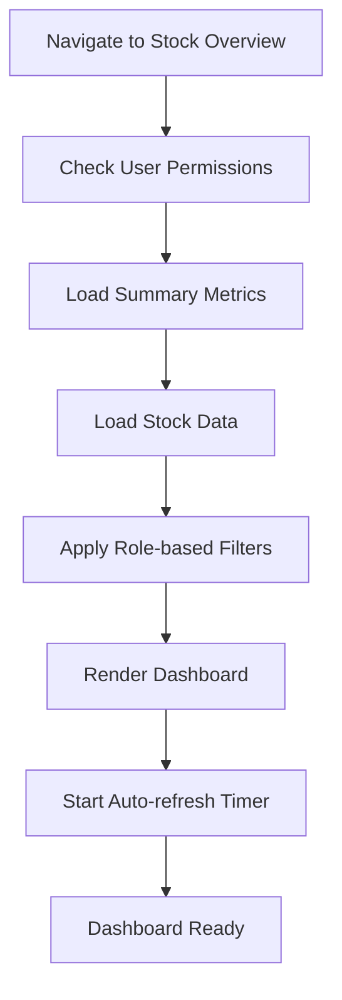
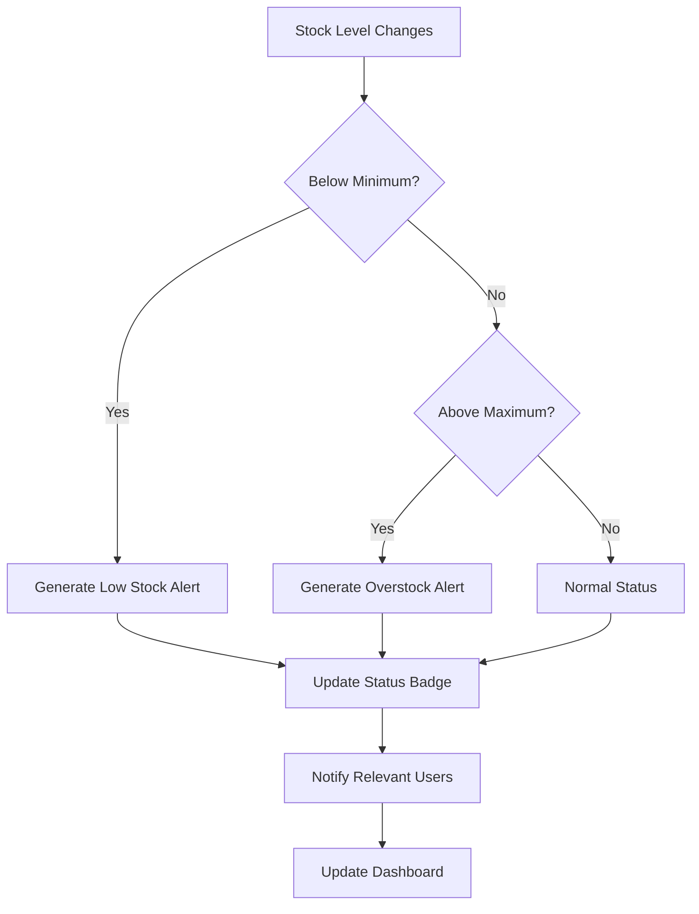
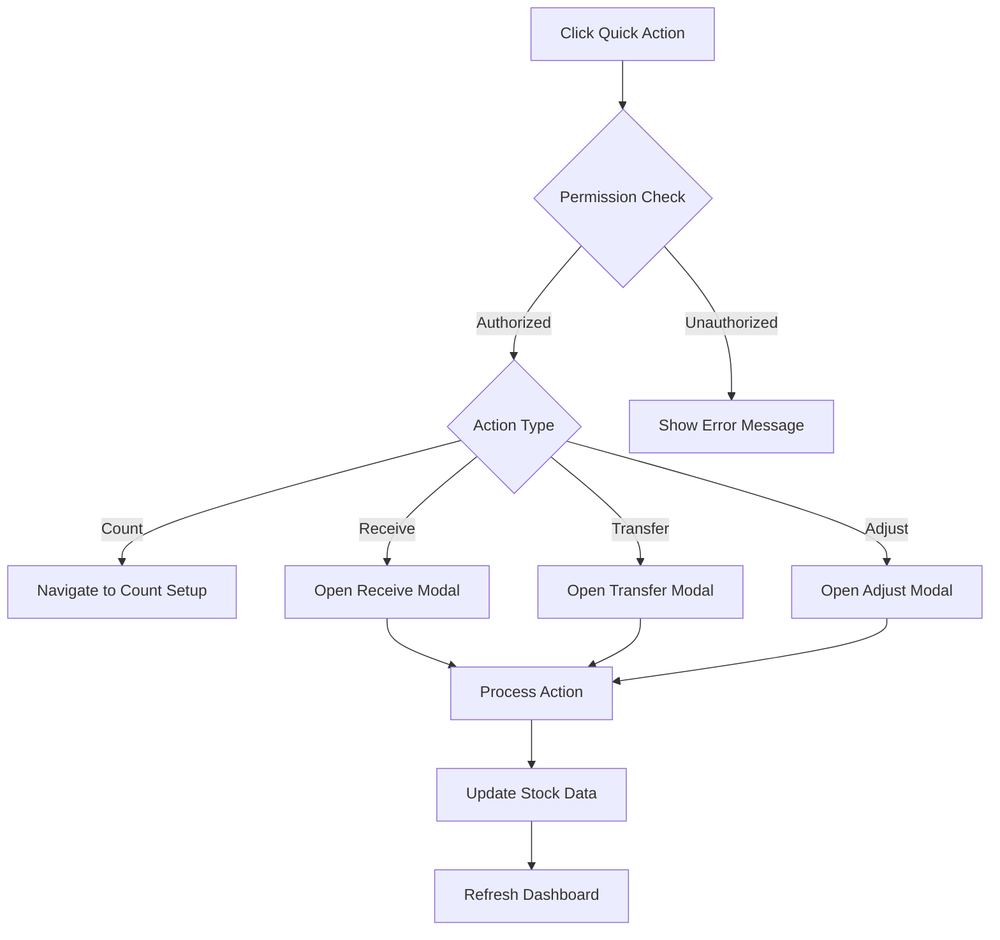

# Inventory Stock Overview - Detailed Specification

**Screen**: Inventory Stock Overview Dashboard  
**Route**: `/inventory-management/stock-overview`  
**User Roles**: All (with inventory access)  
**Last Updated**: August 22, 2025  

## Document History

| Version | Date | Author | Changes |
|---------|------|--------|---------|
| 1.0.0 | 2025-11-19 | Documentation Team | Initial version |
---

## 📸 Visual Reference

### Main Stock Overview Interface


### Interactive States

*Filter and Action Dropdown Expanded*

### Sub-Module Views

*Detailed Inventory Balance View*


*Individual Stock Card Management*


*Slow Moving Inventory Analysis*

### Role-Based Variations

*Staff Role - Basic Stock Information*


*Manager Role - Enhanced Analytics*

---

## 🎯 Screen Objective

**Primary Purpose**: Comprehensive inventory monitoring dashboard providing real-time stock levels, movement tracking, and inventory health analytics.

**User Goals**:
- Monitor current stock levels across all items
- Identify low stock and reorder requirements
- Track inventory movement and trends
- Analyze slow-moving and aging inventory
- Manage stock locations and transfers
- Generate inventory reports and alerts

---

## 🏗️ Layout Structure

### Header Section
```
┌─────────────────────────────────────────────────────────────────┐
│ [☰] Carmen ERP  Inventory Management > Stock Overview     [👤] │
├─────────────────────────────────────────────────────────────────┤
│ Stock Overview                    [🔄 Refresh] [📊 Reports ▼]  │
└─────────────────────────────────────────────────────────────────┘
```

### Summary Cards Row
```
┌─────────────────┬─────────────────┬─────────────────┬─────────────────┐
│ Total Items     │ Total Value     │ Low Stock Items │ Out of Stock    │
│ 1,247          │ $234,567        │ 23             │ 5               │
│ +12 this week  │ +$2,340 today   │ ⚠️ Alert       │ 🚨 Critical     │
└─────────────────┴─────────────────┴─────────────────┴─────────────────┘
```

### Main Dashboard Grid
```
┌─────────────────────────────────┬───────────────────────────────────┐
│ STOCK LEVEL OVERVIEW            │ INVENTORY ANALYTICS               │
│                                 │                                   │
│ [Location Filter ▼]            │ [📈 Movement Trends Chart]        │
│ [Category Filter ▼]            │                                   │
│ [Search Items...]              │ Top Moving Items:                 │
│                                 │ • Item A (↑ 45%)                 │
│ ┌─────────────────────────────┐ │ • Item B (↑ 32%)                 │
│ │ Item List Table             │ │ • Item C (↑ 28%)                 │
│ │ [Name][Location][Qty][Min]  │ │                                   │
│ │ [Status][Last Updated][⋮]   │ │ Slow Moving Items:                │
│ │                             │ │ • Item X (90 days)               │
│ │ [Pagination Controls]       │ │ • Item Y (120 days)              │
│ └─────────────────────────────┘ │ • Item Z (180 days)              │
└─────────────────────────────────┴───────────────────────────────────┘
```

### Quick Actions Bar
```
┌─────────────────────────────────────────────────────────────────┐
│ [📝 Stock Count] [📦 Receive Items] [📤 Transfer] [⚙️ Adjust] ▼  │
└─────────────────────────────────────────────────────────────────┘
```

---

## 🏷️ UI Components & Labels

### Summary Cards
| Card | Label | Primary Metric | Secondary Info | Alert Level | Role Access |
|------|-------|----------------|----------------|-------------|-------------|
| **Total Items** | "Total Items" | Count of active items | Weekly change trend | None | All |
| **Total Value** | "Total Inventory Value" | Currency sum | Daily change | None | Manager+ |
| **Low Stock** | "Low Stock Items" | Count below minimum | Alert indicator | Warning | All |
| **Out of Stock** | "Out of Stock" | Count at zero | Critical indicator | Critical | All |

### Filter Controls
| Filter | Label | Type | Options | Default | Behavior |
|--------|-------|------|---------|---------|----------|
| **Location** | "Location" | Dropdown | All active locations | "All Locations" | Multi-select |
| **Category** | "Category" | Dropdown | Item categories | "All Categories" | Multi-select |
| **Status** | "Stock Status" | Dropdown | In Stock, Low, Out | "All Status" | Multi-select |
| **Search** | "Search items..." | Text Input | Item name/code | Empty | Real-time filter |

### Stock Status Options
| Status | Label | Condition | Color | Icon | Priority |
|--------|-------|-----------|-------|------|----------|
| **In Stock** | "In Stock" | qty > min_level | Green | ✅ | Normal |
| **Low Stock** | "Low Stock" | qty ≤ min_level && qty > 0 | Yellow | ⚠️ | Warning |
| **Out of Stock** | "Out of Stock" | qty = 0 | Red | ❌ | Critical |
| **Overstock** | "Overstock" | qty > max_level | Blue | 📈 | Info |
| **Unknown** | "Unknown" | No recent count | Gray | ❓ | Review |

### Main Data Table
| Column | Header | Width | Sort | Content Format | Role Visibility |
|--------|--------|-------|------|----------------|-----------------|
| **Item Code** | "Code" | 10% | Yes | "ABC-123" | All |
| **Item Name** | "Item Name" | 25% | Yes | Full item name | All |
| **Location** | "Location" | 10% | Yes | Location code | All |
| **Current Qty** | "Current" | 10% | Yes | Number + UOM | All |
| **Min Level** | "Min" | 8% | Yes | Number + UOM | All |
| **Max Level** | "Max" | 8% | Yes | Number + UOM | Manager+ |
| **Value** | "Value" | 10% | Yes | Currency format | Manager+ |
| **Status** | "Status" | 10% | Yes | Status badge | All |
| **Last Updated** | "Updated" | 9% | Yes | Relative time | All |
| **Actions** | "⋮" | 5% | No | Dropdown menu | All |

### Action Buttons
| Action | Label | Icon | Target | Permission | Behavior |
|--------|-------|------|--------|------------|----------|
| **Stock Count** | "Stock Count" | 📝 | Physical count page | Inventory staff | Navigate to count setup |
| **Receive Items** | "Receive Items" | 📦 | GRN entry | Receiving staff | Quick receive modal |
| **Transfer Stock** | "Transfer" | 📤 | Transfer form | Authorized users | Inter-location transfer |
| **Adjust Stock** | "Adjust" | ⚙️ | Adjustment form | Manager+ | Stock level adjustment |
| **Export Data** | "Export" | 📊 | Export options | All | CSV/Excel download |

---

## 📊 Data Fields & Sources

### Stock Overview Data
```typescript
interface StockOverviewItem {
  id: string;
  itemCode: string;
  itemName: string;
  description: string;
  category: {
    id: string;
    name: string;
  };
  location: {
    id: string;
    name: string;
    code: string;
  };
  currentQuantity: {
    value: number;
    unitOfMeasure: string;
  };
  levels: {
    minimum: number;
    maximum: number;
    reorderPoint: number;
  };
  value: Money;
  unitCost: Money;
  status: StockStatus;
  lastMovement: {
    date: string;
    type: 'in' | 'out' | 'transfer' | 'adjustment';
    quantity: number;
    reference: string;
  };
  lastCount: {
    date: string;
    countedBy: string;
    variance?: number;
  };
  aging: {
    days: number;
    category: 'fresh' | 'aging' | 'slow' | 'dead';
  };
  supplier: {
    id: string;
    name: string;
    leadTime: number;
  };
  permissions: {
    canAdjust: boolean;
    canTransfer: boolean;
    canCount: boolean;
    canViewCost: boolean;
  };
}
```

### Summary Metrics
```typescript
interface InventorySummary {
  totalItems: {
    count: number;
    trend: {
      value: number;
      period: 'week' | 'month';
      direction: 'up' | 'down';
    };
  };
  totalValue: {
    amount: Money;
    trend: {
      value: Money;
      period: 'day' | 'week';
      direction: 'up' | 'down';
    };
  };
  stockAlerts: {
    lowStock: number;
    outOfStock: number;
    overstock: number;
  };
  movements: {
    todayIn: number;
    todayOut: number;
    weeklyTrend: number;
  };
}
```

### Filter State
```typescript
interface StockOverviewFilters {
  locations: string[];
  categories: string[];
  statuses: StockStatus[];
  search: string;
  valueRange: {
    min?: number;
    max?: number;
  };
  lastMovementDays?: number;
  sortBy: keyof StockOverviewItem;
  sortDirection: 'asc' | 'desc';
}
```

---

## ⚡ Interactive Actions

### Primary Actions
| Action | Trigger | Behavior | Validation |
|--------|---------|----------|------------|
| **Search Items** | Type in search | Real-time filter results | Debounced 300ms |
| **Apply Filters** | Select filter options | Update table results | Combine all active filters |
| **Sort Columns** | Click column header | Sort by column, toggle direction | Visual indicator |
| **Refresh Data** | Click refresh button | Reload current view | Show loading state |
| **Export Data** | Click export button | Download filtered results | Format selection |

### Row Actions
| Action | Trigger | Behavior | Permission Required |
|--------|---------|----------|-------------------|
| **View Details** | Click row | Navigate to item detail | View permission |
| **Quick Adjust** | Click adjust action | Open adjustment modal | Adjust permission |
| **Transfer Stock** | Click transfer action | Open transfer modal | Transfer permission |
| **View History** | Click history action | Show movement history | View permission |
| **Print Label** | Click label action | Generate item label | Print permission |

### Bulk Actions
| Action | Label | Behavior | Validation |
|--------|-------|----------|------------|
| **Bulk Count** | "Schedule Count" | Add selected items to count | Count permission |
| **Bulk Export** | "Export Selected" | Export selected items | Export permission |
| **Bulk Transfer** | "Transfer Selected" | Transfer multiple items | Transfer permission |
| **Bulk Adjust** | "Adjust Selected" | Adjust multiple items | Adjust permission |

---

## 🔄 User Flow Diagrams

### Dashboard Loading Flow


### Stock Alert Flow


### Quick Action Flow


---

## 📱 Responsive Behavior

### Desktop (1200px+)
- Full 4-card summary row
- Side-by-side table and analytics
- All columns visible in table
- Hover effects and tooltips

### Tablet (768px - 1199px)
- 2x2 summary card grid
- Stacked table and analytics
- Priority columns only
- Touch-friendly controls

### Mobile (< 768px)
- Single column card layout
- Card-based item display
- Minimal column set
- Swipe actions for quick operations

---

## 🎨 Visual Design Specifications

### Summary Card Styling
```css
.summary-card {
  background: white;
  border-radius: 8px;
  border: 1px solid #e5e7eb;
  padding: 20px;
  box-shadow: 0 1px 3px rgba(0, 0, 0, 0.1);
  transition: all 0.15s ease;
}

.summary-card:hover {
  box-shadow: 0 4px 6px rgba(0, 0, 0, 0.1);
}

.summary-card-value {
  font-size: 32px;
  font-weight: 700;
  color: #1f2937;
  line-height: 1;
}

.summary-card-label {
  font-size: 14px;
  font-weight: 500;
  color: #6b7280;
  margin-bottom: 8px;
}

.summary-card-trend {
  font-size: 12px;
  display: flex;
  align-items: center;
  gap: 4px;
  margin-top: 8px;
}

.trend-up {
  color: #059669;
}

.trend-down {
  color: #dc2626;
}
```

### Status Badge Styling
```css
.stock-status-badge {
  display: inline-flex;
  align-items: center;
  gap: 4px;
  padding: 4px 8px;
  border-radius: 12px;
  font-size: 12px;
  font-weight: 500;
  border: 1px solid;
}

.status-in-stock {
  background: #d1fae5;
  color: #065f46;
  border-color: #10b981;
}

.status-low-stock {
  background: #fef3c7;
  color: #92400e;
  border-color: #fbbf24;
  animation: pulse 2s infinite;
}

.status-out-of-stock {
  background: #fee2e2;
  color: #991b1b;
  border-color: #f87171;
  animation: pulse 1s infinite;
}

.status-overstock {
  background: #dbeafe;
  color: #1e40af;
  border-color: #3b82f6;
}
```

### Table Row Styling
```css
.stock-table-row {
  transition: all 0.15s ease;
  border-bottom: 1px solid #f3f4f6;
}

.stock-table-row:hover {
  background: #f9fafb;
}

.stock-table-row.low-stock {
  border-left: 3px solid #fbbf24;
}

.stock-table-row.out-of-stock {
  border-left: 3px solid #f87171;
  background: #fef2f2;
}

.stock-table-row.critical {
  animation: highlight 2s ease-in-out infinite;
}

@keyframes highlight {
  0%, 100% { background: white; }
  50% { background: #fef2f2; }
}
```

---

## 🔧 Implementation Notes

### State Management
```typescript
interface StockOverviewState {
  summary: InventorySummary;
  items: StockOverviewItem[];
  filteredItems: StockOverviewItem[];
  filters: StockOverviewFilters;
  selectedItems: Set<string>;
  loading: boolean;
  error: string | null;
  autoRefreshEnabled: boolean;
  lastRefresh: Date;
}
```

### Real-time Updates
```typescript
// WebSocket subscription for real-time stock updates
useEffect(() => {
  const subscription = subscribeToStockUpdates({
    locations: userLocations,
    onStockChange: (item: StockOverviewItem) => {
      updateItemInList(item);
      checkAlertConditions(item);
    },
    onMovement: (movement: StockMovement) => {
      updateMovementHistory(movement);
      refreshSummary();
    }
  });

  return () => subscription.unsubscribe();
}, [userLocations]);
```

### API Endpoints
- `GET /api/inventory/stock-overview` - Fetch stock overview data
- `GET /api/inventory/summary` - Fetch summary metrics
- `POST /api/inventory/adjust` - Quick stock adjustment
- `POST /api/inventory/transfer` - Quick stock transfer
- `GET /api/inventory/movements/:itemId` - Item movement history
- `POST /api/inventory/export` - Export stock data

### Performance Optimizations
- Virtual scrolling for large item lists (1000+ items)
- Debounced search and filtering
- Memoized calculations for summary metrics
- Lazy loading of movement history
- Efficient WebSocket event handling

---

## ✅ Acceptance Criteria

### Functional Requirements
- [ ] Dashboard loads within 3 seconds for 5000+ items
- [ ] Real-time updates reflect immediately
- [ ] All filters work correctly and combine properly
- [ ] Search provides instant results
- [ ] Stock alerts display correctly
- [ ] Role-based permissions enforced
- [ ] Export functionality works for all formats

### Visual Requirements
- [ ] Matches provided screenshots exactly
- [ ] Status badges display correct colors/icons
- [ ] Summary cards show accurate metrics
- [ ] Loading states during data fetch
- [ ] Responsive design works on all devices
- [ ] Animations and transitions smooth

### Performance Requirements
- [ ] Initial load time < 3 seconds
- [ ] Search response time < 300ms
- [ ] Filter application < 500ms
- [ ] Auto-refresh without performance impact
- [ ] Smooth scrolling for large datasets
- [ ] Memory efficient for long sessions

---

**Implementation Priority**: High (Core Inventory Functionality)  
**Complexity**: High (Real-time Data + Complex Filtering)  
**Dependencies**: Authentication, Inventory API, WebSocket Service  

*This specification provides complete implementation guidance for the Inventory Stock Overview dashboard with real-time monitoring, comprehensive filtering, and role-based access control.*