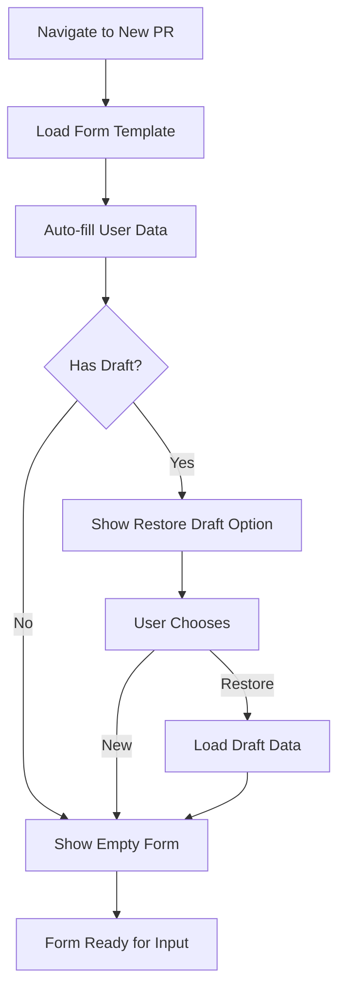
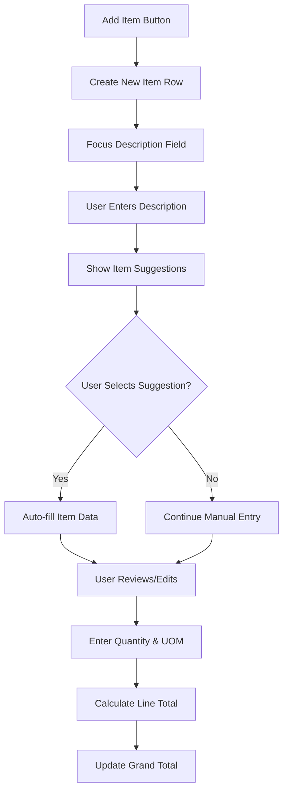
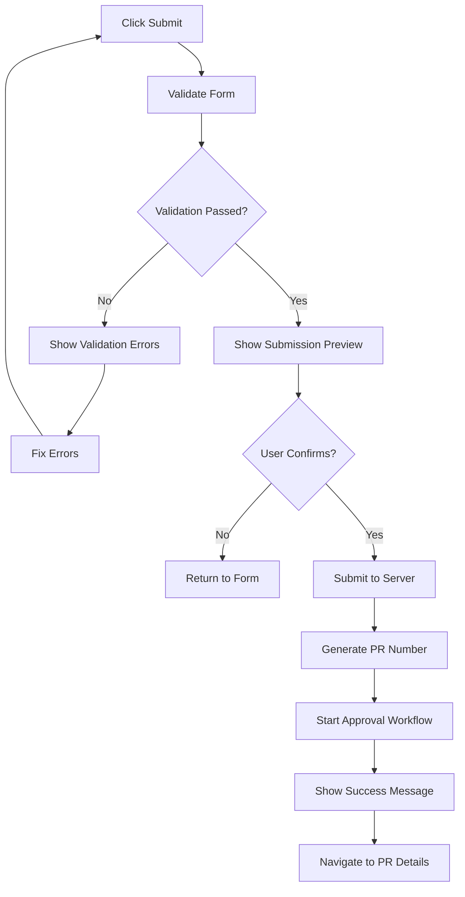
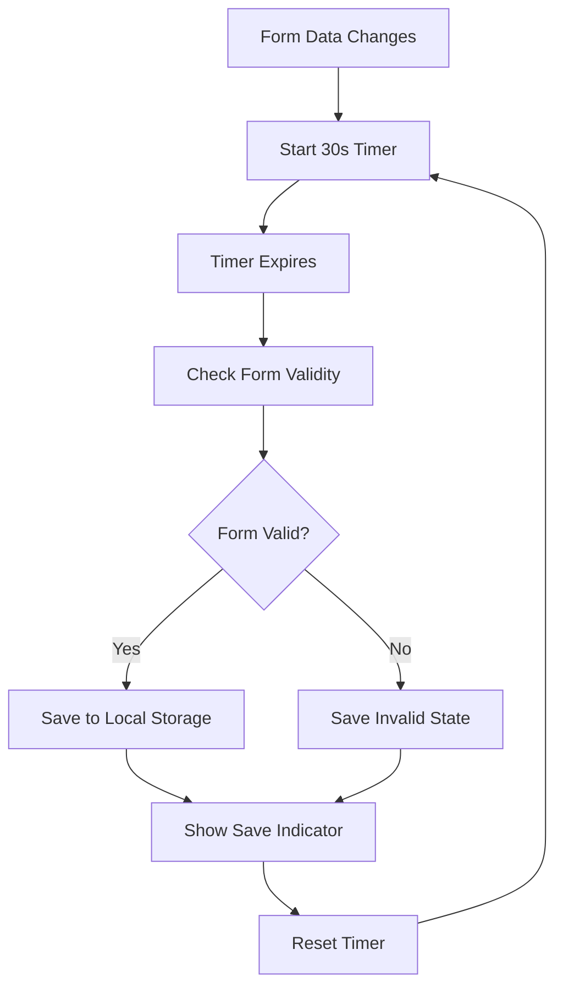

# Purchase Request Creation - Detailed Specification

**Screen**: New Purchase Request Form  
**Route**: `/procurement/purchase-requests/new-pr`  
**User Roles**: All (with create permission)  
**Last Updated**: August 22, 2025  

---

## 📸 Visual Reference

### Main PR Creation Interface


### Form States

*Form with Sample Data Filled*


*Department/Priority Dropdown Expanded*

### Role-Based Variations

*Staff Role - Basic Creation Form*


*Manager Role - Enhanced Options*

---

## 🎯 Screen Objective

**Primary Purpose**: Comprehensive form for creating new purchase requests with dynamic item management, approval routing, and validation.

**User Goals**:
- Create detailed purchase requests with multiple line items
- Specify delivery requirements and priorities
- Select appropriate approval workflow
- Attach supporting documents
- Submit for approval with validation

---

## 🏗️ Layout Structure

### Header Section
```
┌─────────────────────────────────────────────────────────────────┐
│ [☰] Carmen ERP  Procurement > Purchase Requests > New Request  │
├─────────────────────────────────────────────────────────────────┤
│ ← Back to Purchase Requests         New Purchase Request       │
└─────────────────────────────────────────────────────────────────┘
```

### Form Layout
```
┌─────────────────────────────────────────────────────────────────┐
│ SECTION 1: REQUEST INFORMATION                                 │
├─────────────────────────────────────────────────────────────────┤
│ [Description Field]                    [Department Dropdown]   │
│ [Priority Dropdown]                    [Required Date Picker]  │
│ [Requestor Info - Auto-filled]         [Cost Center Field]     │
└─────────────────────────────────────────────────────────────────┘

┌─────────────────────────────────────────────────────────────────┐
│ SECTION 2: ITEMS                                [+ Add Item]   │
├─────────────────────────────────────────────────────────────────┤
│ Item 1: [Description] [Qty] [UOM] [Est. Price] [Total] [×]     │
│ Item 2: [Description] [Qty] [UOM] [Est. Price] [Total] [×]     │
│ Item 3: [Description] [Qty] [UOM] [Est. Price] [Total] [×]     │
├─────────────────────────────────────────────────────────────────┤
│                                      Total Estimate: $0.00     │
└─────────────────────────────────────────────────────────────────┘

┌─────────────────────────────────────────────────────────────────┐
│ SECTION 3: VENDOR PREFERENCES (Optional)                       │
├─────────────────────────────────────────────────────────────────┤
│ [Preferred Vendor 1] [Preferred Vendor 2] [Preferred Vendor 3] │
│ [Add Vendor +]                                                 │
└─────────────────────────────────────────────────────────────────┘

┌─────────────────────────────────────────────────────────────────┐
│ SECTION 4: ADDITIONAL INFORMATION                              │
├─────────────────────────────────────────────────────────────────┤
│ [Notes/Comments Textarea]                                      │
│ [Attachment Upload Area]                                       │
└─────────────────────────────────────────────────────────────────┘

┌─────────────────────────────────────────────────────────────────┐
│ ACTIONS                                                         │
├─────────────────────────────────────────────────────────────────┤
│ [Save as Draft]  [Preview]  [Cancel]  [Submit for Approval]    │
└─────────────────────────────────────────────────────────────────┘
```

---

## 🏷️ UI Components & Labels

### Section 1: Request Information

| Field | Label | Type | Validation | Default Value |
|-------|-------|------|------------|---------------|
| **Description** | "Request Description *" | Textarea | Required, 10-500 chars | Empty |
| **Department** | "Department *" | Dropdown | Required | User's department |
| **Priority** | "Priority Level *" | Dropdown | Required | "Normal" |
| **Required Date** | "Required By *" | Date Picker | Required, future date | +14 days |
| **Requestor** | "Requestor" | Display Field | Read-only | Current user |
| **Cost Center** | "Cost Center" | Dropdown | Optional | Department default |

#### Priority Options
| Value | Label | Color | Icon | Description |
|-------|-------|-------|------|-------------|
| **Low** | "Low Priority" | Gray | 🔽 | Flexible timeline |
| **Normal** | "Normal Priority" | Blue | ➡️ | Standard processing |
| **High** | "High Priority" | Orange | ⬆️ | Expedited processing |
| **Urgent** | "Urgent" | Red | 🚨 | Immediate attention |

### Section 2: Items Management

#### Item Row Fields
| Field | Label | Type | Width | Validation | Placeholder |
|-------|-------|------|-------|------------|-------------|
| **Description** | "Item Description *" | Text Input | 40% | Required, 5-100 chars | "Enter item description..." |
| **Quantity** | "Qty *" | Number Input | 10% | Required, > 0 | "1" |
| **Unit of Measure** | "UOM *" | Dropdown | 15% | Required | "Select UOM..." |
| **Est. Unit Price** | "Est. Price" | Currency Input | 15% | Optional, ≥ 0 | "$0.00" |
| **Line Total** | "Total" | Display Field | 15% | Auto-calculated | "$0.00" |
| **Actions** | "" | Icon Button | 5% | Delete item | 🗑️ |

#### Unit of Measure Options
| Category | Options | Default |
|----------|---------|---------|
| **Weight** | kg, lb, g, oz, ton | kg |
| **Volume** | L, ml, gal, qt, pt | L |
| **Count** | pcs, each, box, case, doz | pcs |
| **Length** | m, cm, ft, in, yd | m |
| **Area** | m², ft², sq | m² |

#### Item Actions
| Action | Label | Icon | Behavior | Validation |
|--------|-------|------|----------|------------|
| **Add Item** | "+ Add Item" | ➕ | Add new item row | Max 50 items |
| **Remove Item** | "Remove" | 🗑️ | Delete item row | Min 1 item |
| **Duplicate Item** | "Duplicate" | 📋 | Copy item to new row | Available on hover |
| **Reorder Items** | "⋮⋮" | Drag Handle | Drag to reorder | Available when >1 item |

### Section 3: Vendor Preferences

| Field | Label | Type | Behavior | Validation |
|-------|-------|------|----------|------------|
| **Vendor Search** | "Search Vendors..." | Autocomplete | Search active vendors | Optional |
| **Vendor Card** | Vendor info display | Card Component | Show vendor details | Up to 5 vendors |
| **Add Vendor** | "+ Add Vendor" | Button | Open vendor search | Only if <5 selected |
| **Remove Vendor** | "×" | Icon Button | Remove from selection | On vendor card |

#### Vendor Card Display
```
┌─────────────────────────────────────────┐
│ ACME Supplies Inc.              [×]     │
│ Rating: ⭐⭐⭐⭐⭐ (4.5)                    │
│ Last Order: 2 weeks ago                 │
│ Contact: John Doe (555-0123)           │
└─────────────────────────────────────────┘
```

### Section 4: Additional Information

| Field | Label | Type | Validation | Features |
|-------|-------|------|------------|----------|
| **Notes** | "Additional Notes" | Textarea | Optional, max 1000 chars | Rich text editor |
| **Attachments** | "Supporting Documents" | File Upload | Max 10 files, 25MB total | Drag & drop |

#### File Upload Features
- **Supported Types**: PDF, DOC, DOCX, XLS, XLSX, JPG, PNG
- **Max File Size**: 5MB per file
- **Max Total Size**: 25MB
- **Preview**: Thumbnails for images, icons for documents
- **Progress**: Upload progress bar
- **Validation**: File type and size checking

---

## 📊 Data Fields & Sources

### Form Data Structure
```typescript
interface CreatePurchaseRequestForm {
  // Section 1: Request Information
  description: string;
  department: string;
  priority: PriorityLevel;
  requiredDate: string;           // ISO date string
  costCenter?: string;
  
  // Section 2: Items
  items: PurchaseRequestItemForm[];
  
  // Section 3: Vendor Preferences
  preferredVendors: string[];     // Vendor IDs
  
  // Section 4: Additional Information
  notes?: string;
  attachments: File[];
  
  // System fields
  requestorId: string;            // Auto-filled
  estimatedTotal: Money;          // Auto-calculated
}

interface PurchaseRequestItemForm {
  id: string;                     // Temporary ID for form
  description: string;
  quantity: number;
  unitOfMeasure: string;
  estimatedUnitPrice?: Money;
  lineTotal: Money;               // Auto-calculated
  category?: string;              // Auto-suggested
  specifications?: string;
  preferredVendorId?: string;
}
```

### Validation Schema
```typescript
const createPRSchema = z.object({
  description: z.string()
    .min(10, "Description must be at least 10 characters")
    .max(500, "Description cannot exceed 500 characters"),
  
  department: z.string()
    .min(1, "Department is required"),
  
  priority: z.enum(['low', 'normal', 'high', 'urgent']),
  
  requiredDate: z.string()
    .refine(date => new Date(date) > new Date(), {
      message: "Required date must be in the future"
    }),
  
  items: z.array(z.object({
    description: z.string()
      .min(5, "Item description must be at least 5 characters")
      .max(100, "Item description cannot exceed 100 characters"),
    
    quantity: z.number()
      .min(0.01, "Quantity must be greater than 0")
      .max(999999, "Quantity is too large"),
    
    unitOfMeasure: z.string()
      .min(1, "Unit of measure is required"),
    
    estimatedUnitPrice: z.object({
      amount: z.number().min(0, "Price cannot be negative"),
      currency: z.string()
    }).optional()
  })).min(1, "At least one item is required")
    .max(50, "Cannot exceed 50 items"),
  
  notes: z.string()
    .max(1000, "Notes cannot exceed 1000 characters")
    .optional(),
  
  attachments: z.array(z.instanceof(File))
    .max(10, "Cannot exceed 10 attachments")
    .refine(files => {
      const totalSize = files.reduce((sum, file) => sum + file.size, 0);
      return totalSize <= 25 * 1024 * 1024; // 25MB
    }, "Total file size cannot exceed 25MB")
});
```

---

## ⚡ Interactive Actions

### Form Actions
| Action | Trigger | Behavior | Validation |
|--------|---------|----------|------------|
| **Auto-save Draft** | Form changes | Save form data locally | Every 30 seconds |
| **Save as Draft** | Click "Save as Draft" | Save to server as draft | Basic validation only |
| **Preview** | Click "Preview" | Show formatted preview | Full validation |
| **Submit for Approval** | Click "Submit for Approval" | Submit to approval workflow | Full validation + business rules |
| **Cancel** | Click "Cancel" | Navigate back with confirmation | Warn if unsaved changes |

### Dynamic Calculations
| Trigger | Calculation | Display | Format |
|---------|-------------|---------|---------|
| **Quantity Change** | quantity × unitPrice | Line Total | Currency |
| **Price Change** | quantity × unitPrice | Line Total | Currency |
| **Item Add/Remove** | sum(all line totals) | Grand Total | Currency |
| **Currency Change** | Convert to base currency | All prices | Multi-currency |

### Smart Features
| Feature | Trigger | Behavior | Data Source |
|---------|---------|----------|-------------|
| **Item Suggestions** | Type in description | Show similar items | Purchase history |
| **Price Estimation** | Select item + vendor | Auto-fill estimated price | Price history |
| **Vendor Suggestions** | Add item | Suggest relevant vendors | Vendor-item mapping |
| **Cost Center Auto-fill** | Select department | Set default cost center | Department settings |

---

## 🔄 User Flow Diagrams

### Form Creation Flow


### Item Management Flow


### Submission Flow


### Auto-save Flow


---

## 📱 Responsive Behavior

### Desktop (1200px+)
- 2-column layout for form sections
- Inline item management
- Side-by-side vendor selection
- Full preview modal

### Tablet (768px - 1199px)
- Single column layout
- Collapsible sections
- Simplified item rows
- Drawer-style vendor selection

### Mobile (< 768px)
- Stacked form sections
- One item per row
- Fullscreen modals
- Touch-optimized inputs

---

## 🎨 Visual Design Specifications

### Form Section Styling
```css
.form-section {
  background: white;
  border-radius: 8px;
  border: 1px solid #e5e7eb;
  margin-bottom: 24px;
  overflow: hidden;
}

.form-section-header {
  background: #f9fafb;
  padding: 16px 24px;
  border-bottom: 1px solid #e5e7eb;
  font-weight: 600;
  font-size: 16px;
  color: #1f2937;
}

.form-section-content {
  padding: 24px;
}
```

### Input Field Styling
```css
.form-field {
  margin-bottom: 16px;
}

.form-label {
  display: block;
  font-size: 14px;
  font-weight: 500;
  color: #374151;
  margin-bottom: 6px;
}

.form-label.required::after {
  content: " *";
  color: #ef4444;
}

.form-input {
  width: 100%;
  padding: 8px 12px;
  border: 1px solid #d1d5db;
  border-radius: 6px;
  font-size: 14px;
  transition: border-color 0.15s ease;
}

.form-input:focus {
  outline: none;
  border-color: #3b82f6;
  box-shadow: 0 0 0 3px rgba(59, 130, 246, 0.1);
}

.form-input.error {
  border-color: #ef4444;
}

.form-error {
  color: #ef4444;
  font-size: 12px;
  margin-top: 4px;
}
```

### Item Row Styling
```css
.item-row {
  display: grid;
  grid-template-columns: 2fr 0.5fr 1fr 1fr 1fr auto;
  gap: 12px;
  align-items: end;
  padding: 12px;
  border: 1px solid #e5e7eb;
  border-radius: 6px;
  margin-bottom: 8px;
  background: white;
  transition: all 0.15s ease;
}

.item-row:hover {
  border-color: #3b82f6;
  box-shadow: 0 2px 4px rgba(0, 0, 0, 0.05);
}

.item-row.dragging {
  opacity: 0.5;
  transform: rotate(2deg);
}
```

---

## 🔧 Implementation Notes

### State Management
```typescript
interface CreatePRState {
  formData: CreatePurchaseRequestForm;
  validation: {
    errors: Record<string, string>;
    touched: Record<string, boolean>;
    isValid: boolean;
  };
  ui: {
    saving: boolean;
    submitting: boolean;
    autoSaveEnabled: boolean;
    lastSaved?: Date;
    previewMode: boolean;
  };
  suggestions: {
    items: ItemSuggestion[];
    vendors: VendorSuggestion[];
    costCenters: CostCenter[];
  };
}
```

### Auto-save Implementation
```typescript
// Auto-save hook
const useAutoSave = (formData: CreatePurchaseRequestForm, enabled: boolean) => {
  const [lastSaved, setLastSaved] = useState<Date>();
  const debouncedSave = useDebouncedCallback(
    async (data: CreatePurchaseRequestForm) => {
      if (enabled) {
        await saveFormDraft(data);
        setLastSaved(new Date());
      }
    },
    30000 // 30 seconds
  );

  useEffect(() => {
    if (enabled && formData) {
      debouncedSave(formData);
    }
  }, [formData, enabled, debouncedSave]);

  return { lastSaved };
};
```

### API Endpoints
- `POST /api/procurement/purchase-requests/draft` - Save draft
- `POST /api/procurement/purchase-requests` - Create PR
- `GET /api/procurement/suggestions/items` - Get item suggestions
- `GET /api/procurement/suggestions/vendors` - Get vendor suggestions
- `GET /api/procurement/cost-centers` - Get available cost centers
- `POST /api/procurement/attachments` - Upload files

---

## ✅ Acceptance Criteria

### Functional Requirements
- [ ] Form saves drafts automatically every 30 seconds
- [ ] All validation rules work correctly
- [ ] Item calculations update in real-time
- [ ] File uploads work with progress indication
- [ ] Form submission creates PR and starts workflow
- [ ] Navigation warns about unsaved changes
- [ ] Suggestions appear for items and vendors

### Visual Requirements
- [ ] Matches provided screenshots exactly
- [ ] Form sections are clearly organized
- [ ] Validation errors display appropriately
- [ ] Loading states during save/submit
- [ ] Responsive design works on all devices
- [ ] Accessibility standards met

### Business Requirements
- [ ] Only authorized users can create PRs
- [ ] Department filtering works correctly
- [ ] Cost center defaults to department setting
- [ ] Priority levels affect approval routing
- [ ] Required date validation prevents past dates
- [ ] Maximum item and file limits enforced

---

**Implementation Priority**: High (Core Procurement Functionality)  
**Complexity**: High (Complex Form with Dynamic Features)  
**Dependencies**: Authentication, Procurement API, File Upload Service  

*This specification provides complete implementation guidance for the Purchase Request creation form with comprehensive validation, dynamic features, and user experience optimization.*