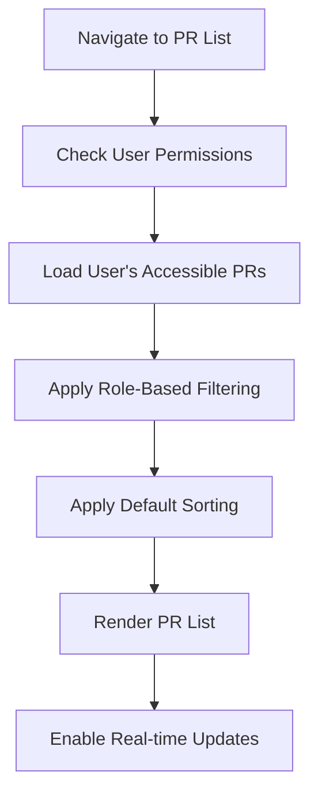
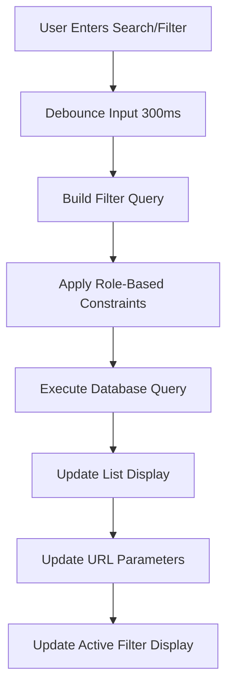
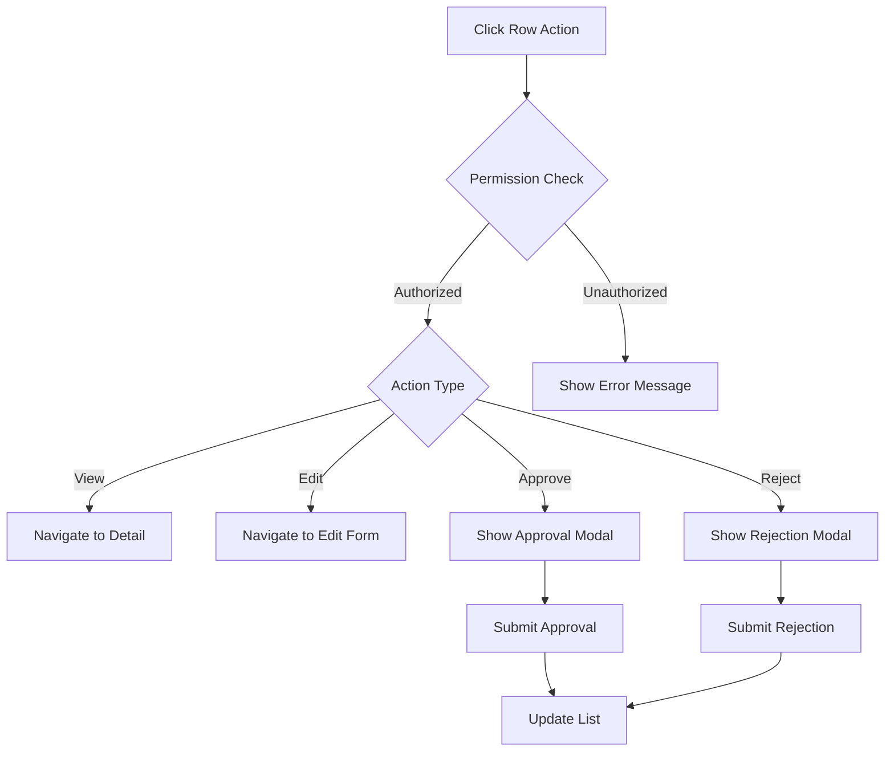
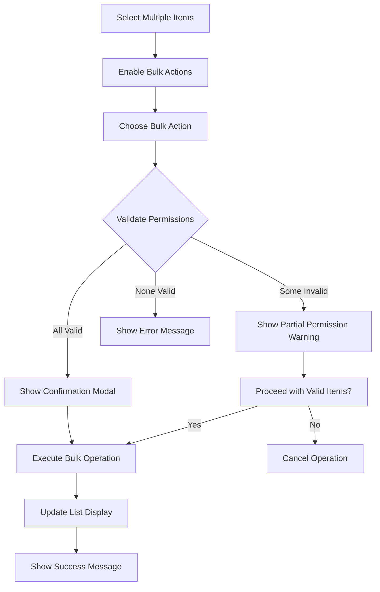

# Purchase Requests List - Detailed Specification

**Screen**: Purchase Requests Management  
**Route**: `/procurement/purchase-requests`  
**User Roles**: All (with role-based filtering)  
**Last Updated**: August 22, 2025  

## Document History

| Version | Date | Author | Changes |
|---------|------|--------|---------|
| 1.0.0 | 2025-11-19 | Documentation Team | Initial version |
---

## 📸 Visual Reference

### Main Purchase Requests Interface


### Interactive States

*Filter Dropdown Expanded*

### Role-Based Variations

*Staff Role View - Limited Visibility*


*Department Manager View - Department Filtering*


*Financial Manager View - Full Access*

---

## 🎯 Screen Objective

**Primary Purpose**: Centralized management interface for all purchase requests with role-based access control, filtering, and batch operations.

**User Goals**:
- View and manage purchase requests based on role permissions
- Filter and search through purchase requests efficiently
- Track approval status and workflow progress
- Perform bulk operations on multiple requests
- Navigate to detailed views and related documents

---

## 🏗️ Layout Structure

### Header Section
```
┌─────────────────────────────────────────────────────────────────┐
│ [☰] Carmen ERP    Procurement > Purchase Requests     [👤]      │
├─────────────────────────────────────────────────────────────────┤
│ Purchase Requests                              [+ New Request]  │
├─────────────────────────────────────────────────────────────────┤
│ [🔍 Search...]  [📅 Date Filter ▼] [🏷️ Status ▼] [⚙️ More ▼]    │
└─────────────────────────────────────────────────────────────────┘
```

### Filters Bar
```
┌─────────────────────────────────────────────────────────────────┐
│ Active Filters: Status: Pending (×) | Date: Last 30 days (×)   │
│ [Clear All Filters]                                             │
└─────────────────────────────────────────────────────────────────┘
```

### Data Table
```
┌─────────────────────────────────────────────────────────────────┐
│ [☑] │ PR # │ Description │ Requestor │ Status │ Amount │ Date │ ⋮ │
├─────┼──────┼─────────────┼───────────┼────────┼────────┼──────┼───┤
│ [☑] │ PR001│ Office...   │ J. Smith  │ 🟡 Pend│ $1,250 │ 8/20 │ ⋮ │
│ [☑] │ PR002│ Kitchen...  │ M. Jones  │ 🟢 Appr│ $3,450 │ 8/19 │ ⋮ │
│ [☑] │ PR003│ Cleaning... │ S. Davis  │ 🔴 Rej │   $890 │ 8/18 │ ⋮ │
└─────┴──────┴─────────────┴───────────┴────────┴────────┴──────┴───┘
```

### Bottom Actions
```
┌─────────────────────────────────────────────────────────────────┐
│ [Bulk Actions ▼] | Selected: 3 items     [◀ Previous] [Next ▶] │
│ Showing 1-25 of 157 purchase requests                          │
└─────────────────────────────────────────────────────────────────┘
```

---

## 🏷️ UI Components & Labels

### Header Controls
| Component | Label | Type | Action | Role Access |
|-----------|-------|------|---------|-------------|
| **New Request Button** | "+ New Request" | Primary Button | Navigate to PR creation | All (create permission) |
| **Search Input** | "Search requests..." | Text Input | Filter by PR#, description, requestor | All |
| **Date Filter** | "Date Range" | Dropdown | Filter by creation/modified date | All |
| **Status Filter** | "Status" | Multi-select | Filter by approval status | All |
| **More Actions** | "More" | Dropdown Menu | Export, settings, help | Role-based |

### Filter Options

#### Date Filter Dropdown
| Option | Label | Value | Behavior |
|--------|-------|-------|----------|
| **Last 7 Days** | "Last 7 days" | Date range | Show PRs from last week |
| **Last 30 Days** | "Last 30 days" | Date range | Show PRs from last month |
| **Last Quarter** | "Last 3 months" | Date range | Show PRs from last quarter |
| **Custom Range** | "Custom range..." | Date picker | Allow user-selected range |
| **All Time** | "All time" | No filter | Show all accessible PRs |

#### Status Filter Options
| Status | Label | Color | Icon | Description |
|--------|-------|-------|------|-------------|
| **Draft** | "Draft" | Gray | 📝 | Incomplete, not submitted |
| **Pending** | "Pending Approval" | Yellow | ⏳ | Awaiting approval |
| **Approved** | "Approved" | Green | ✅ | Approved for procurement |
| **Rejected** | "Rejected" | Red | ❌ | Rejected with comments |
| **In Progress** | "In Progress" | Blue | 🔄 | Being processed |
| **Completed** | "Completed" | Green | 🎉 | Fully processed |
| **Cancelled** | "Cancelled" | Gray | 🚫 | Cancelled by requestor |

### Table Columns

#### Column Definitions
| Column | Header | Width | Sort | Filter | Content Format |
|--------|--------|-------|------|--------|----------------|
| **Select** | ☑ | 40px | No | No | Checkbox for bulk selection |
| **PR Number** | "PR #" | 100px | Yes | Yes | "PR" + 6-digit number |
| **Description** | "Description" | 200px | Yes | Yes | Truncated at 50 chars + "..." |
| **Requestor** | "Requestor" | 120px | Yes | Yes | "First Last" format |
| **Department** | "Department" | 100px | Yes | Yes | Department abbreviation |
| **Status** | "Status" | 120px | Yes | Yes | Status badge with icon |
| **Total Amount** | "Amount" | 100px | Yes | Yes | Currency format |
| **Created Date** | "Date" | 80px | Yes | Yes | MM/DD format |
| **Actions** | ⋮ | 40px | No | No | Dropdown menu |

#### Status Badge Styling
```css
.status-draft { 
  background: #f3f4f6; 
  color: #374151; 
  border: 1px solid #d1d5db; 
}

.status-pending { 
  background: #fef3c7; 
  color: #92400e; 
  border: 1px solid #fbbf24; 
}

.status-approved { 
  background: #d1fae5; 
  color: #065f46; 
  border: 1px solid #10b981; 
}

.status-rejected { 
  background: #fee2e2; 
  color: #991b1b; 
  border: 1px solid #f87171; 
}
```

### Row Actions Menu
| Action | Label | Icon | Behavior | Role Access |
|--------|-------|------|----------|-------------|
| **View Details** | "View" | 👁 | Navigate to PR detail page | All |
| **Edit** | "Edit" | ✏️ | Navigate to PR edit form | Owner + Manager+ |
| **Duplicate** | "Duplicate" | 📋 | Create copy of PR | All (if can create) |
| **Print** | "Print" | 🖨 | Generate PDF | All |
| **Approve** | "Approve" | ✅ | Quick approval action | Approvers only |
| **Reject** | "Reject" | ❌ | Rejection with comment | Approvers only |
| **Cancel** | "Cancel" | 🚫 | Cancel PR | Owner + Manager |

---

## 📊 Data Fields & Sources

### Purchase Request List Data
```typescript
interface PurchaseRequestListItem {
  id: string;
  number: string;              // "PR" + zero-padded ID
  description: string;         // First 50 characters
  requestor: {
    id: string;
    name: string;             // "FirstName LastName"
    department: string;
    avatar?: string;
  };
  department: {
    id: string;
    name: string;
    abbreviation: string;     // For display
  };
  status: {
    value: DocumentStatus;
    label: string;
    color: string;
    icon: string;
  };
  totalAmount: Money;
  priority: PriorityLevel;
  createdAt: string;
  updatedAt: string;
  approvalProgress: {
    currentStep: number;
    totalSteps: number;
    currentApprover?: string;
  };
  itemCount: number;
  hasAttachments: boolean;
  permissions: {
    canEdit: boolean;
    canApprove: boolean;
    canReject: boolean;
    canCancel: boolean;
    canView: boolean;
  };
}
```

### Filter State
```typescript
interface FilterState {
  search: string;
  dateRange: {
    start?: Date;
    end?: Date;
    preset?: 'last7' | 'last30' | 'lastQuarter' | 'all';
  };
  statuses: DocumentStatus[];
  departments: string[];
  requestors: string[];
  amountRange: {
    min?: number;
    max?: number;
  };
  priority: PriorityLevel[];
  sortBy: keyof PurchaseRequestListItem;
  sortDirection: 'asc' | 'desc';
}
```

---

## ⚡ Interactive Actions

### Primary Actions
| Action | Trigger | Behavior | Validation |
|--------|---------|----------|------------|
| **Create New PR** | Click "+ New Request" | Navigate to PR creation form | User has create permission |
| **Search** | Type in search box | Filter list in real-time | Debounced search (300ms) |
| **Apply Filter** | Select filter option | Update list with filtered results | Combine with existing filters |
| **Sort Column** | Click column header | Sort by column, toggle direction | Visual sort indicator |
| **Select All** | Click header checkbox | Select/deselect all visible items | Updates bulk action counter |

### Row Actions
| Action | Trigger | Behavior | Validation |
|--------|---------|----------|------------|
| **View PR** | Click row or "View" | Navigate to PR detail page | User has view permission |
| **Quick Edit** | Click "Edit" action | Navigate to edit form | User can edit this PR |
| **Quick Approve** | Click "Approve" action | Show approval modal | User is valid approver |
| **Quick Reject** | Click "Reject" action | Show rejection modal with comment | User is valid approver |
| **Duplicate** | Click "Duplicate" action | Create new PR with copied data | User has create permission |

### Bulk Actions
| Action | Label | Behavior | Validation |
|--------|-------|----------|------------|
| **Bulk Approve** | "Approve Selected" | Approve multiple PRs | User can approve all selected |
| **Bulk Export** | "Export Selected" | Download selected PRs as Excel/CSV | User has export permission |
| **Bulk Print** | "Print Selected" | Generate PDF of selected PRs | User has print permission |
| **Bulk Assign** | "Assign Approver" | Assign approver to selected PRs | User has assignment permission |

---

## 🔄 User Flow Diagrams

### PR List Loading Flow


### Search & Filter Flow


### Quick Action Flow


### Bulk Operation Flow


---

## 📱 Responsive Behavior

### Desktop (1200px+)
- Full table with all columns visible
- Sidebar filters panel
- Hover effects on rows
- Context menu for quick actions

### Tablet (768px - 1199px)
- Condensed table with priority columns
- Collapsible filter panel
- Touch-friendly row selection
- Swipe actions for quick operations

### Mobile (< 768px)
- Card-based layout instead of table
- Slide-out filter drawer
- Touch gestures for actions
- Simplified search interface

---

## 🎨 Visual Design Specifications

### Table Styling
```css
.pr-table {
  background: white;
  border-radius: 8px;
  box-shadow: 0 1px 3px rgba(0, 0, 0, 0.1);
  overflow: hidden;
}

.pr-table-header {
  background: #f8f9fa;
  font-weight: 600;
  font-size: 14px;
  color: #374151;
  padding: 12px 16px;
  border-bottom: 1px solid #e5e7eb;
}

.pr-table-row {
  padding: 12px 16px;
  border-bottom: 1px solid #f3f4f6;
  transition: background-color 0.15s ease;
}

.pr-table-row:hover {
  background: #f9fafb;
}

.pr-table-row.selected {
  background: #eff6ff;
  border-left: 3px solid #3b82f6;
}
```

### Status Badge Styles
```css
.status-badge {
  display: inline-flex;
  align-items: center;
  gap: 4px;
  padding: 4px 8px;
  border-radius: 12px;
  font-size: 12px;
  font-weight: 500;
  border: 1px solid;
}

.priority-high {
  border-left: 3px solid #ef4444;
}

.priority-urgent {
  border-left: 3px solid #dc2626;
  animation: pulse 2s infinite;
}
```

---

## 🔧 Implementation Notes

### State Management
```typescript
interface PRListState {
  items: PurchaseRequestListItem[];
  filteredItems: PurchaseRequestListItem[];
  selectedItems: Set<string>;
  filters: FilterState;
  pagination: {
    page: number;
    limit: number;
    total: number;
  };
  loading: boolean;
  error: string | null;
  bulkOperationInProgress: boolean;
}
```

### API Endpoints
- `GET /api/procurement/purchase-requests` - Fetch PR list with filters
- `GET /api/procurement/purchase-requests/filters` - Get available filter options
- `POST /api/procurement/purchase-requests/bulk-approve` - Bulk approve PRs
- `POST /api/procurement/purchase-requests/bulk-export` - Export selected PRs
- `PUT /api/procurement/purchase-requests/:id/status` - Update PR status

### Performance Optimizations
- Virtual scrolling for large datasets (500+ items)
- Debounced search and filtering
- Optimistic updates for quick actions
- Lazy loading of additional data
- Memoized filter and sort functions

### Real-time Updates
```typescript
// WebSocket subscription for real-time PR updates
useEffect(() => {
  const subscription = subscribeToPRUpdates({
    departments: userDepartments,
    onUpdate: (updatedPR) => {
      updatePRInList(updatedPR);
    },
    onDelete: (prId) => {
      removePRFromList(prId);
    },
    onCreate: (newPR) => {
      if (shouldShowPR(newPR, currentFilters)) {
        addPRToList(newPR);
      }
    }
  });

  return () => subscription.unsubscribe();
}, [userDepartments, currentFilters]);
```

---

## ✅ Acceptance Criteria

### Functional Requirements
- [ ] List loads within 2 seconds for 500+ PRs
- [ ] Role-based filtering works correctly
- [ ] Search provides real-time results
- [ ] All filters combine correctly
- [ ] Bulk operations work for selected items
- [ ] Sorting works on all sortable columns
- [ ] Pagination handles large datasets
- [ ] Real-time updates reflect immediately

### Visual Requirements
- [ ] Matches provided screenshots exactly
- [ ] Status badges display correct colors/icons
- [ ] Responsive design works on all devices
- [ ] Hover states provide visual feedback
- [ ] Loading states during data fetch
- [ ] Empty states when no results

### Permission Requirements
- [ ] Users only see PRs they have permission to view
- [ ] Actions are filtered based on user permissions
- [ ] Department filtering works correctly
- [ ] Role-based column visibility implemented
- [ ] Bulk actions respect individual item permissions

---

**Implementation Priority**: High (Core Procurement Functionality)  
**Complexity**: High (Complex Filtering + Role-based Access)  
**Dependencies**: Authentication, Role Management, Procurement API  

*This specification provides complete implementation guidance for the Purchase Requests list interface with comprehensive filtering, role-based access, and bulk operations.*