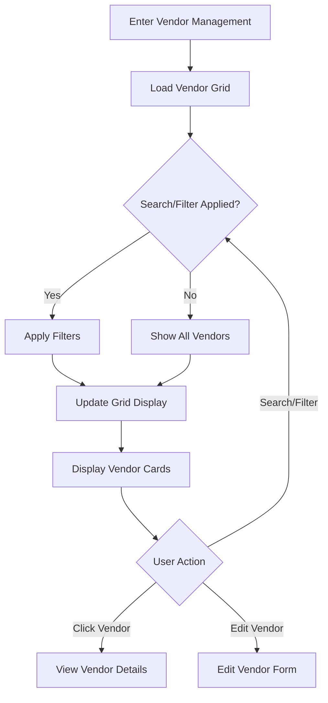
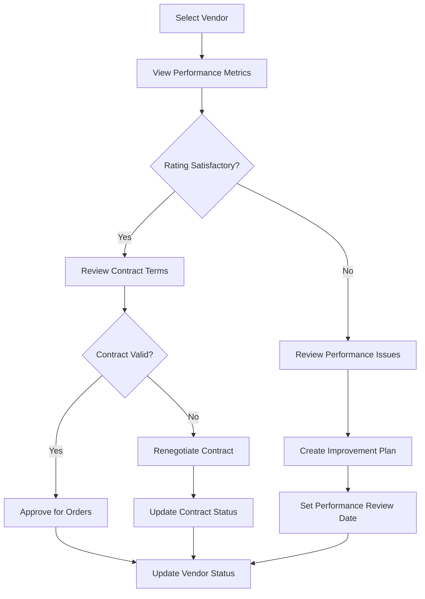
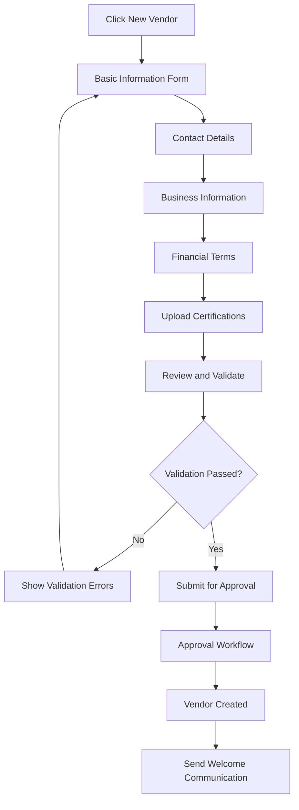

# Vendor Management - Detailed Specification

**Screen**: Vendor Management Interface  
**Route**: `/vendor-management/vendors`  
**User Roles**: Purchasing Staff, Department Manager, Financial Manager  
**Last Updated**: August 22, 2025  

## Document History

| Version | Date | Author | Changes |
|---------|------|--------|---------|
| 1.0.0 | 2025-11-19 | Documentation Team | Initial version |
---

## 📸 Visual Reference

### Main Vendor Management Interface


### Interactive States

*Filter Dropdown Expanded*

### Role-Based Variations

*Staff Role View - Limited Edit Access*


*Department Manager View - Full Management Access*


*Financial Manager View - Payment and Contract Focus*

---

## 🎯 Screen Objective

**Primary Purpose**: Centralized vendor relationship management with comprehensive vendor profiles, performance tracking, and contract management.

**User Goals**:
- Manage vendor profiles and contact information
- Track vendor performance and certifications
- Monitor contract status and payment terms
- Evaluate vendor reliability and quality metrics
- Handle vendor onboarding and approval workflows

---

## 🏗️ Layout Structure

### Header Section
```
┌─────────────────────────────────────────────────────────────────┐
│ [☰] Carmen ERP    Vendor Management > Vendors        [👤]      │
├─────────────────────────────────────────────────────────────────┤
│ Vendor Management                              [+ New Vendor]   │
├─────────────────────────────────────────────────────────────────┤
│ [🔍 Search...]  [🏢 Type ▼] [⭐ Rating ▼] [📊 Status ▼] [⚙️ More] │
└─────────────────────────────────────────────────────────────────┘
```

### Vendor Grid Layout
```
┌─────────────────────────────────────────────────────────────────┐
│ ┌─────────────────┐  ┌─────────────────┐  ┌─────────────────┐  │
│ │ [🏢] VendorCorp │  │ [🏪] FreshSupply│  │ [🏭] TechEquip  │  │
│ │ ⭐⭐⭐⭐⭐ (4.8)  │  │ ⭐⭐⭐⭐☆ (4.2)  │  │ ⭐⭐⭐☆☆ (3.7)  │  │
│ │ 🟢 Active       │  │ 🟡 Under Review │  │ 🔴 Suspended   │  │
│ │ Food & Beverage │  │ Fresh Produce   │  │ Equipment      │  │
│ │ $1.2M Annual    │  │ $850K Annual    │  │ $2.1M Annual   │  │
│ │ [View] [Edit]   │  │ [View] [Edit]   │  │ [View] [Edit]   │  │
│ └─────────────────┘  └─────────────────┘  └─────────────────┘  │
│                                                                 │
│ ┌─────────────────┐  ┌─────────────────┐  ┌─────────────────┐  │
│ │ [🏢] CleanCorp  │  │ [🚚] QuickShip  │  │ [🏪] LocalMart  │  │
│ │ ⭐⭐⭐⭐☆ (4.1)  │  │ ⭐⭐⭐⭐⭐ (4.9)  │  │ ⭐⭐⭐☆☆ (3.2)  │  │
│ │ 🟢 Active       │  │ 🟢 Active       │  │ ⚠️ Probation   │  │
│ │ Cleaning Supp.  │  │ Logistics       │  │ General        │  │
│ │ $320K Annual    │  │ $1.8M Annual    │  │ $145K Annual   │  │
│ │ [View] [Edit]   │  │ [View] [Edit]   │  │ [View] [Edit]   │  │
│ └─────────────────┘  └─────────────────┘  └─────────────────┘  │
└─────────────────────────────────────────────────────────────────┘
```

### Quick Stats Bar
```
┌─────────────────────────────────────────────────────────────────┐
│ 📊 Total: 147 | 🟢 Active: 132 | ⚠️ Review: 12 | 🔴 Inactive: 3 │
│ 💰 Total Volume: $12.4M | ⭐ Avg Rating: 4.2 | 📈 Growth: +8.3% │
└─────────────────────────────────────────────────────────────────┘
```

---

## 🏷️ UI Components & Labels

### Header Controls
| Component | Label | Type | Action | Role Access |
|-----------|-------|------|---------|----------------|
| **New Vendor Button** | "+ New Vendor" | Primary Button | Navigate to vendor creation | Purchasing Staff+ |
| **Search Input** | "Search vendors..." | Text Input | Filter by name, company, category | All |
| **Type Filter** | "Vendor Type" | Dropdown | Filter by business type | All |
| **Rating Filter** | "Rating" | Range Slider | Filter by star rating | All |
| **Status Filter** | "Status" | Multi-select | Filter by vendor status | All |
| **More Actions** | "More" | Dropdown Menu | Bulk operations, export | Role-based |

### Vendor Card Components
| Component | Format | Content | Data Source |
|-----------|--------|---------|-------------|
| **Company Logo** | Image/Icon | Company branding or default icon | vendor.logo \|\| default |
| **Company Name** | Text | "VendorCorp Inc." | vendor.companyName |
| **Star Rating** | Stars + Number | "⭐⭐⭐⭐⭐ (4.8)" | vendor.averageRating |
| **Status Badge** | Colored Badge | "🟢 Active" | vendor.status |
| **Category** | Text | "Food & Beverage" | vendor.category |
| **Annual Volume** | Currency | "$1.2M Annual" | vendor.annualVolume |
| **Action Buttons** | Button Group | "[View] [Edit]" | Permission-based |

### Status Definitions
| Status | Label | Color | Icon | Description |
|--------|-------|-------|------|-------------|
| **Active** | "Active" | Green | 🟢 | Good standing, approved for orders |
| **Under Review** | "Under Review" | Yellow | 🟡 | Pending approval or assessment |
| **Probation** | "Probation" | Orange | ⚠️ | Performance issues, limited orders |
| **Suspended** | "Suspended" | Red | 🔴 | Temporarily blocked from orders |
| **Inactive** | "Inactive" | Gray | ⚪ | No longer doing business |

### Vendor Categories
| Category | Icon | Description | Typical Services |
|----------|------|-------------|------------------|
| **Food & Beverage** | 🍽️ | Food and drink suppliers | Ingredients, beverages, catering |
| **Fresh Produce** | 🥬 | Fresh fruits and vegetables | Local farms, produce distributors |
| **Equipment** | 🏭 | Kitchen and restaurant equipment | Appliances, furniture, tools |
| **Cleaning Supplies** | 🧽 | Sanitation and cleaning | Chemicals, paper goods, uniforms |
| **Logistics** | 🚚 | Transportation and delivery | Shipping, courier, warehousing |
| **General** | 🏪 | General supplies and services | Office, maintenance, utilities |

---

## 📊 Data Fields & Sources

### Vendor Profile Data
```typescript
interface Vendor {
  id: string;
  companyName: string;
  contactPerson: {
    firstName: string;
    lastName: string;
    title: string;
    email: string;
    phone: string;
  };
  businessInfo: {
    registrationNumber: string;
    taxId: string;
    website?: string;
    category: VendorCategory;
    businessType: 'Corporation' | 'LLC' | 'Partnership' | 'Sole Proprietorship';
  };
  address: {
    street: string;
    city: string;
    state: string;
    zipCode: string;
    country: string;
  };
  financial: {
    paymentTerms: PaymentTerms;
    creditLimit: Money;
    currency: Currency;
    bankingInfo?: BankingDetails;
  };
  performance: {
    averageRating: number;
    totalOrders: number;
    onTimeDeliveryRate: number;
    qualityScore: number;
    annualVolume: Money;
    lastOrderDate?: string;
  };
  certification: {
    foodSafety?: CertificationDetails;
    organic?: CertificationDetails;
    quality?: CertificationDetails[];
  };
  contract: {
    status: ContractStatus;
    startDate: string;
    endDate?: string;
    terms?: string;
  };
  status: VendorStatus;
  tags: string[];
  notes?: string;
  createdAt: string;
  updatedAt: string;
  createdBy: string;
  permissions: {
    canEdit: boolean;
    canSuspend: boolean;
    canDelete: boolean;
    canViewFinancials: boolean;
  };
}
```

### Filter and Search State
```typescript
interface VendorFilterState {
  search: string;
  categories: VendorCategory[];
  statuses: VendorStatus[];
  ratingRange: {
    min: number;
    max: number;
  };
  volumeRange: {
    min?: number;
    max?: number;
  };
  contractStatus: ContractStatus[];
  certifications: string[];
  sortBy: keyof Vendor | 'performance.averageRating' | 'financial.annualVolume';
  sortDirection: 'asc' | 'desc';
  viewMode: 'grid' | 'list' | 'table';
}
```

---

## ⚡ Interactive Actions

### Primary Actions
| Action | Trigger | Behavior | Validation |
|--------|---------|----------|-------------|
| **Create New Vendor** | Click "+ New Vendor" | Navigate to vendor creation form | User has create permission |
| **Search Vendors** | Type in search box | Filter vendors in real-time | Debounced search (300ms) |
| **Filter by Category** | Select category filter | Update grid with category filter | Combine with existing filters |
| **Sort by Rating** | Click rating filter | Sort vendors by average rating | Visual sort indicator |
| **Switch View Mode** | Click view toggle | Switch between grid/list/table | Save user preference |

### Vendor Card Actions
| Action | Trigger | Behavior | Validation |
|--------|---------|----------|-------------|
| **View Vendor Details** | Click vendor card or "View" | Navigate to vendor detail page | User has view permission |
| **Edit Vendor** | Click "Edit" button | Navigate to vendor edit form | User can edit this vendor |
| **Quick Status Change** | Click status badge | Show status change modal | User has status change permission |
| **Performance Metrics** | Hover over rating | Show detailed performance tooltip | Performance data available |
| **Contact Vendor** | Click contact info | Open email/phone application | Contact information available |

### Bulk Operations
| Action | Label | Behavior | Validation |
|--------|-------|----------|-------------|
| **Bulk Status Update** | "Update Status" | Change status for multiple vendors | User can modify all selected |
| **Bulk Export** | "Export Selected" | Download vendor data as Excel/CSV | User has export permission |
| **Bulk Email** | "Send Email" | Compose email to multiple vendors | User has communication permission |
| **Performance Report** | "Generate Report" | Create performance analysis | User has reporting permission |

---

## 🔄 User Flow Diagrams

### Vendor Discovery Flow


### Vendor Evaluation Flow


### New Vendor Onboarding Flow


---

## 📱 Responsive Behavior

### Desktop (1200px+)
- 3-column vendor card grid
- Full sidebar with detailed filters
- Hover effects and tooltips
- Advanced sorting and view options

### Tablet (768px - 1199px)
- 2-column vendor card grid
- Collapsible filter panel
- Touch-friendly card interactions
- Simplified quick actions

### Mobile (< 768px)
- Single column vendor list
- Slide-out filter drawer
- Swipe actions for quick operations
- Essential information only

---

## 🎨 Visual Design Specifications

### Vendor Card Styling
```css
.vendor-card {
  background: white;
  border-radius: 12px;
  padding: 20px;
  box-shadow: 0 2px 8px rgba(0, 0, 0, 0.1);
  border: 1px solid #e5e7eb;
  transition: transform 0.2s ease, box-shadow 0.2s ease;
}

.vendor-card:hover {
  transform: translateY(-2px);
  box-shadow: 0 4px 16px rgba(0, 0, 0, 0.15);
  border-color: #3b82f6;
}

.vendor-logo {
  width: 48px;
  height: 48px;
  border-radius: 8px;
  object-fit: cover;
  background: #f3f4f6;
  display: flex;
  align-items: center;
  justify-content: center;
}

.vendor-status-badge {
  padding: 4px 12px;
  border-radius: 16px;
  font-size: 12px;
  font-weight: 500;
  display: inline-flex;
  align-items: center;
  gap: 4px;
}

.status-active {
  background: #dcfce7;
  color: #166534;
}

.status-review {
  background: #fef3c7;
  color: #92400e;
}

.status-probation {
  background: #fed7aa;
  color: #c2410c;
}

.status-suspended {
  background: #fee2e2;
  color: #991b1b;
}
```

### Rating Display
```css
.rating-display {
  display: flex;
  align-items: center;
  gap: 8px;
  margin: 8px 0;
}

.star-rating {
  display: flex;
  gap: 2px;
}

.star {
  color: #fbbf24;
  font-size: 16px;
}

.star.empty {
  color: #d1d5db;
}

.rating-number {
  font-weight: 600;
  color: #374151;
  font-size: 14px;
}
```

---

## 🔧 Implementation Notes

### State Management
```typescript
interface VendorManagementState {
  vendors: Vendor[];
  filteredVendors: Vendor[];
  selectedVendors: Set<string>;
  filters: VendorFilterState;
  viewMode: 'grid' | 'list' | 'table';
  loading: boolean;
  error: string | null;
  pagination: {
    page: number;
    limit: number;
    total: number;
  };
  sortConfig: {
    field: string;
    direction: 'asc' | 'desc';
  };
  quickActions: {
    bulkOperationInProgress: boolean;
    selectedAction?: string;
  };
}
```

### API Endpoints
- `GET /api/vendor-management/vendors` - Fetch vendor list with filters
- `GET /api/vendor-management/vendors/:id` - Get vendor details
- `POST /api/vendor-management/vendors` - Create new vendor
- `PUT /api/vendor-management/vendors/:id` - Update vendor
- `DELETE /api/vendor-management/vendors/:id` - Delete vendor
- `POST /api/vendor-management/vendors/bulk-update` - Bulk operations
- `GET /api/vendor-management/categories` - Get vendor categories
- `GET /api/vendor-management/performance-metrics` - Get performance data

### Performance Optimizations
- Virtual scrolling for large vendor lists (200+ vendors)
- Lazy loading of vendor images and detailed metrics
- Debounced search and filter operations
- Cached vendor performance calculations
- Optimistic updates for status changes

### Search and Filter Logic
```typescript
const filterVendors = useMemo(() => {
  return vendors.filter(vendor => {
    // Text search
    const searchMatch = !filters.search || 
      vendor.companyName.toLowerCase().includes(filters.search.toLowerCase()) ||
      vendor.contactPerson.firstName.toLowerCase().includes(filters.search.toLowerCase()) ||
      vendor.contactPerson.lastName.toLowerCase().includes(filters.search.toLowerCase());
    
    // Category filter
    const categoryMatch = filters.categories.length === 0 || 
      filters.categories.includes(vendor.businessInfo.category);
    
    // Status filter
    const statusMatch = filters.statuses.length === 0 || 
      filters.statuses.includes(vendor.status);
    
    // Rating range
    const ratingMatch = vendor.performance.averageRating >= filters.ratingRange.min &&
      vendor.performance.averageRating <= filters.ratingRange.max;
    
    return searchMatch && categoryMatch && statusMatch && ratingMatch;
  }).sort((a, b) => {
    // Apply sorting logic
    const field = filters.sortBy;
    const direction = filters.sortDirection === 'asc' ? 1 : -1;
    
    if (field === 'performance.averageRating') {
      return (a.performance.averageRating - b.performance.averageRating) * direction;
    }
    // Additional sorting logic...
  });
}, [vendors, filters]);
```

---

## ✅ Acceptance Criteria

### Functional Requirements
- [ ] Vendor grid loads within 2 seconds for 200+ vendors
- [ ] Search provides real-time results with <300ms delay
- [ ] All filters combine correctly and update grid
- [ ] Status changes reflect immediately with optimistic updates
- [ ] Bulk operations work for selected vendors
- [ ] Performance metrics display accurately
- [ ] Role-based permissions enforced correctly

### Visual Requirements
- [ ] Matches provided screenshots exactly
- [ ] Vendor cards display all required information clearly
- [ ] Status badges use correct colors and icons
- [ ] Rating displays use star system consistently
- [ ] Responsive design works on all screen sizes
- [ ] Loading states during data operations
- [ ] Empty states when no vendors match filters

### Performance Requirements
- [ ] Initial load time < 2 seconds
- [ ] Search response time < 300ms
- [ ] Filter operations < 500ms
- [ ] Smooth animations and transitions
- [ ] Optimistic updates for quick actions
- [ ] Proper error handling and recovery

### Business Requirements
- [ ] Users only see vendors they have permission to view
- [ ] Edit and delete actions restricted by permissions
- [ ] Financial information hidden from unauthorized users
- [ ] Vendor categories align with business taxonomy
- [ ] Performance metrics accurately calculated
- [ ] Contract status tracking functional

---

**Implementation Priority**: High (Core Vendor Management)  
**Complexity**: High (Complex Performance Tracking + Role-based Access)  
**Dependencies**: Authentication, User Management, Financial System  

*This specification provides complete implementation guidance for the Vendor Management interface with comprehensive vendor relationship management, performance tracking, and role-based access control.*