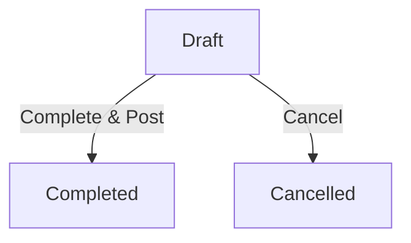
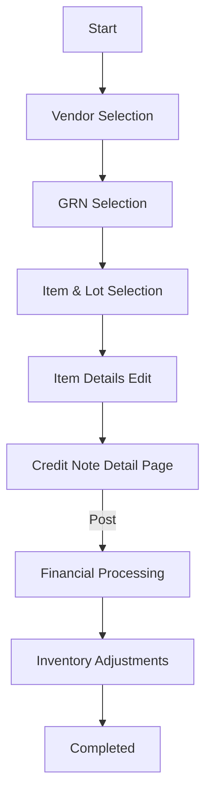
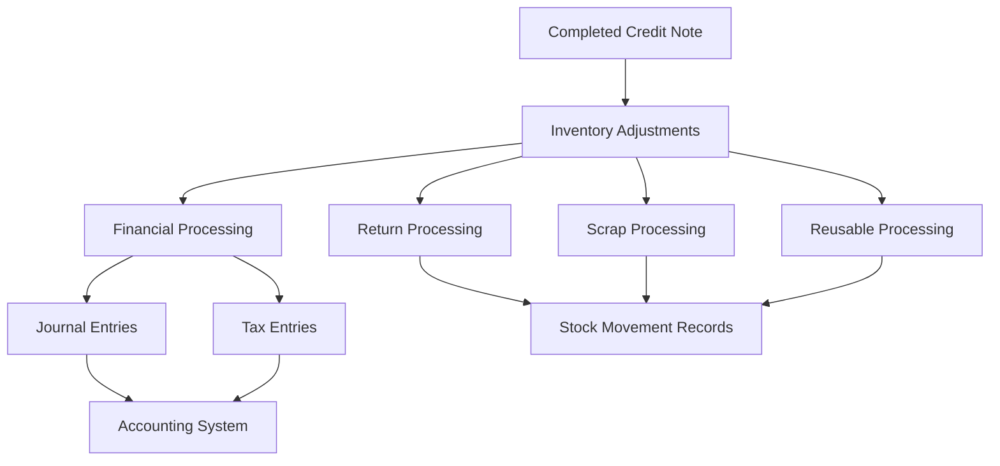
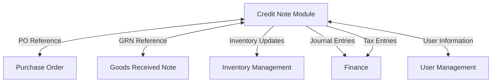
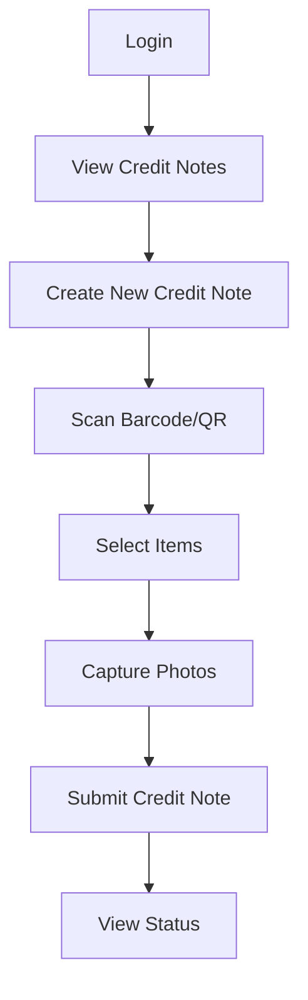

# Credit Note User Flow Diagram

**Document Status:** Draft  
**Last Updated:** March 27, 2024

## Table of Contents
- [Introduction](#introduction)
- [Credit Note Lifecycle Flow](#credit-note-lifecycle-flow)
- [Credit Note Creation Flow](#credit-note-creation-flow)
- [Credit Note Processing Flow](#credit-note-processing-flow)
- [Integration Points](#integration-points)
- [Mobile User Flow](#mobile-user-flow)
- [Related Documentation](#related-documentation)

## Introduction

This document provides visual representations of the user flows within the Credit Note module. These diagrams illustrate the lifecycle of a credit note, the creation process, processing steps, integration points with other modules, and mobile user interactions.

## Credit Note Lifecycle Flow

The following diagram illustrates the lifecycle of a Credit Note:

## Credit Note Creation Flow

The following diagram illustrates the step-by-step process for creating a Credit Note:

## Credit Note Processing Flow

The following diagram illustrates the processing flow for a Credit Note:

## Integration Points

The following diagram illustrates the integration points between the Credit Note module and other modules:

## Mobile User Flow

The following diagram illustrates the mobile user flow for the Credit Note module:

## Related Documentation

- [Credit Note API Overview](./CN-API-Endpoints-Overview.md)
- [Credit Note API - Core Operations](./CN-API-Endpoints-Core.md)
- [Credit Note API - Financial Operations](./CN-API-Endpoints-Financial.md)
- [Credit Note API - Item Operations](./CN-API-Endpoints-Items.md)
- [Credit Note API - Attachment Operations](./CN-API-Endpoints-Attachments.md)
- [Credit Note API - Comment Operations](./CN-API-Endpoints-Comments.md)
- [Credit Note API - Inventory Operations](./CN-API-Endpoints-Inventory.md)
- [Credit Note Page Flow](./credit-note-page-flow.md)
- [Credit Note User Experience](./credit-note-prd.md) 