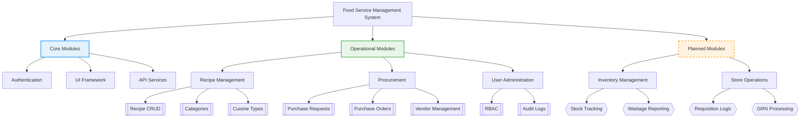
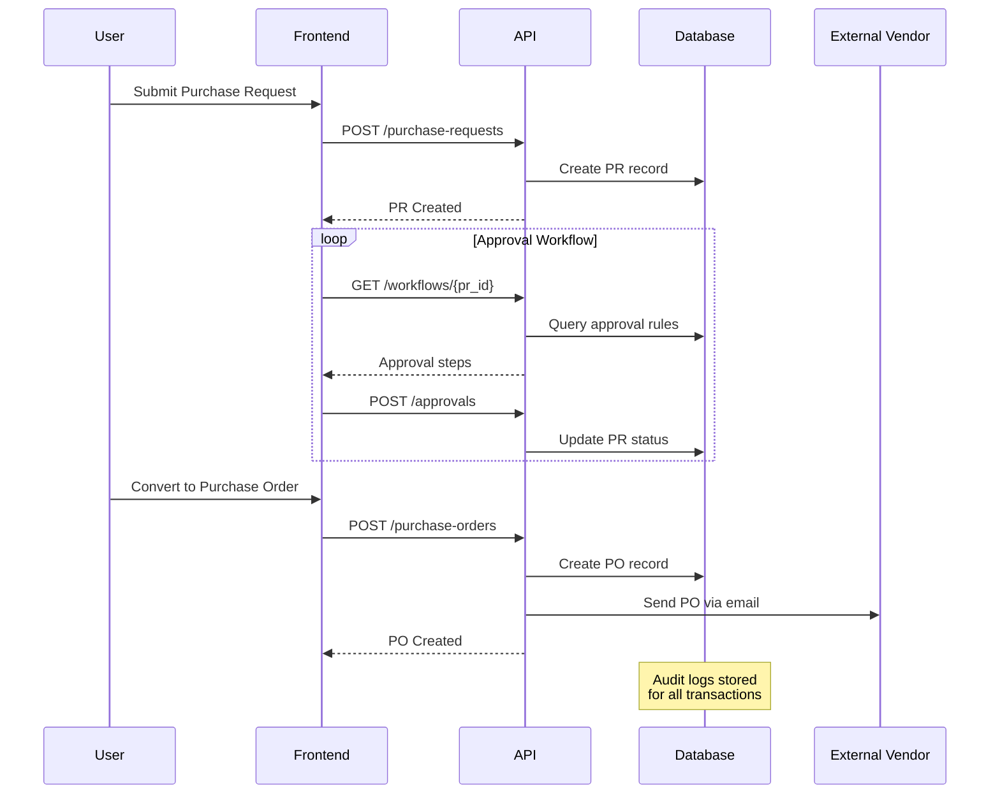

# System Architecture Overview

## Document History

| Version | Date | Author | Changes |
|---------|------|--------|---------|
| 1.0.0 | 2025-11-19 | Documentation Team | Initial version |

## Diagram Legend
- **Solid Borders**: Implemented modules
- **Dashed Borders**: Planned/Partially implemented
- Colors:
  - Blue: Core infrastructure
  - Green: Operational features
  - Orange: Future development

## Implementation Details
1. **Recipe Management**  
   - Full CRUD operations implemented  
   - Category/Cuisine type management in `/app/(main)/operational-planning`
   
2. **Procurement Module Components**  
   **a. Purchase Requests (PR)**  
   - PR creation with multi-level approval workflows  
   - Template system (/docs/purchase-request-template-ba.md)  
   - Integration with inventory needs analysis  
   - Status: Complete (v1.4+)  

   **b. Purchase Orders (PO)**  
   - Automated PO generation from approved PRs  
   - Vendor communication interface  
   - PO tracking with delivery milestones  
   - Status: Complete (v1.6+)  

   **c. Vendor Management**  
   - Vendor database with performance metrics  
   - Contract management framework  
   - Integration with external rating systems  
   - Status: Partial implementation (v1.8-beta)  

   **Key Flows Documented In:**  
   - /docs/procurement-ba.md  
   - /docs/purchase-request-api-sp.md  
   - /docs/purchase-order-api-sp.md

3. **Inventory & Store Ops**  
   - Documented in `/docs/inventory-*.md`  
   - Placeholder components exist  
   - Core logic pending implementation

## Operational Workflow Diagram

