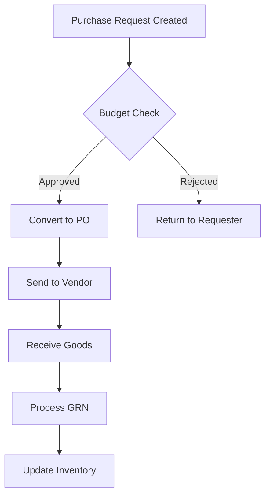
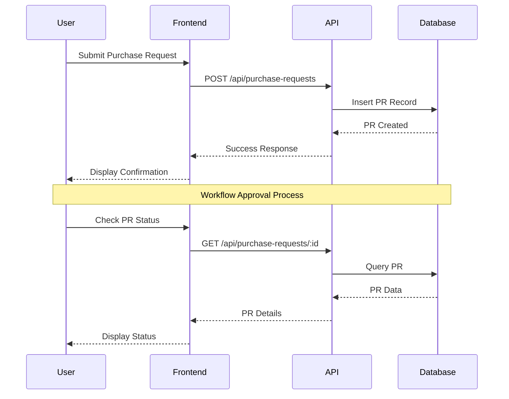
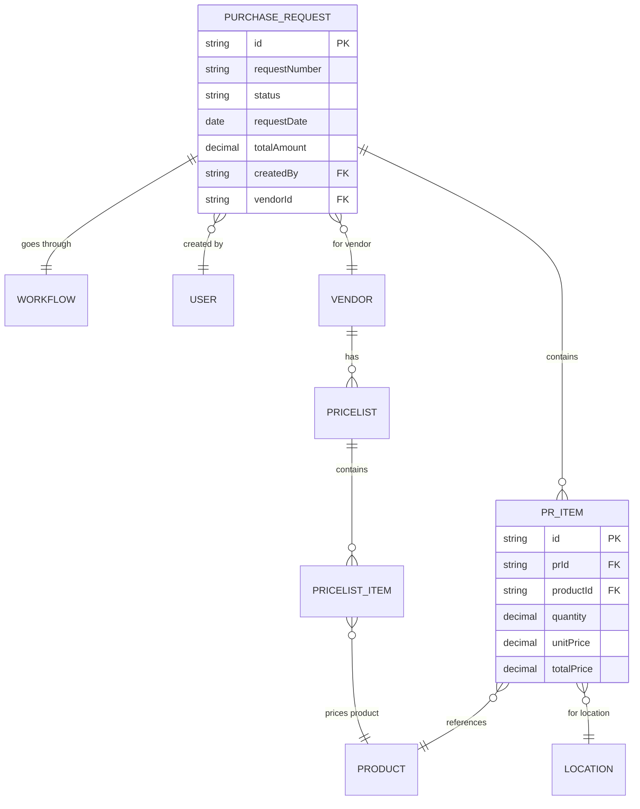
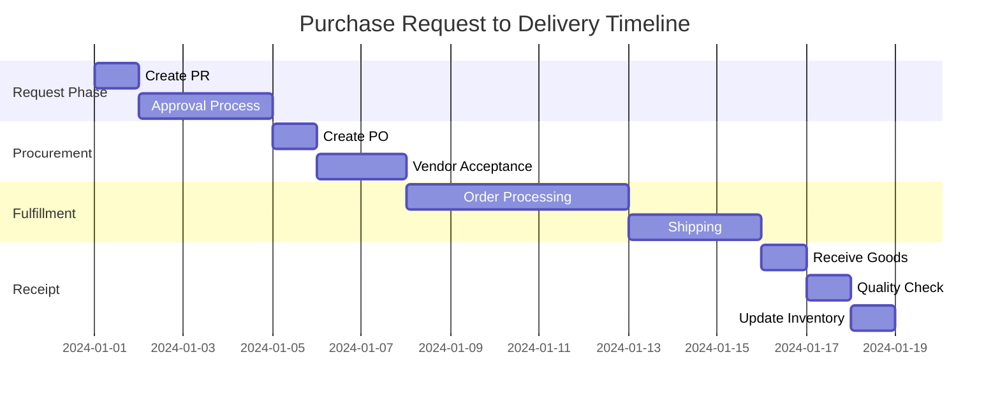
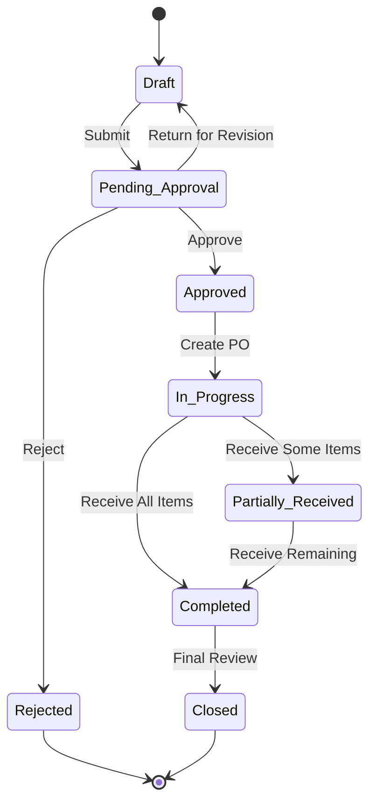
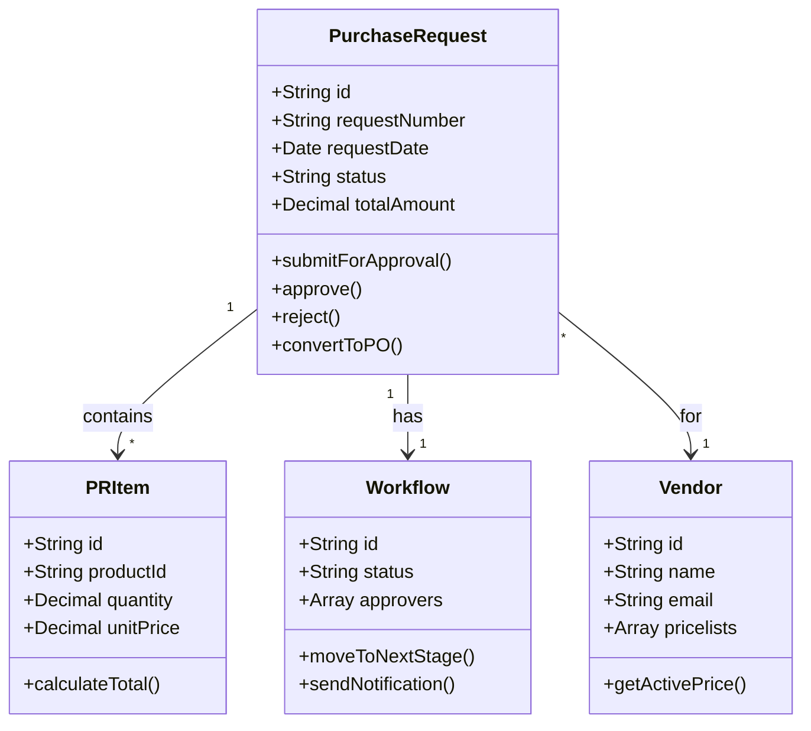
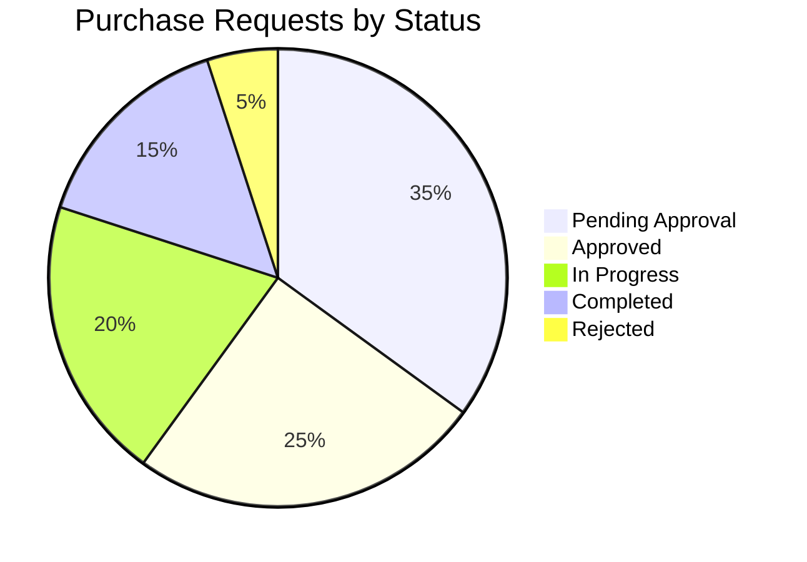

# Mermaid Diagram Test Page

## Document History

| Version | Date | Author | Changes |
|---------|------|--------|---------|
| 1.0.0 | 2025-11-19 | Documentation Team | Initial version |
This page demonstrates the various types of Mermaid diagrams supported in the Carmen ERP documentation system.

## Flowchart Example



## Sequence Diagram Example



## Entity Relationship Diagram



## Gantt Chart Example



## State Diagram Example



## Class Diagram Example



## Pie Chart Example



## User Journey Example

```mermaid
journey
    title Purchase Request User Journey
    section Create Request
      Open PR Form: 5: User
      Add Items: 4: User
      Select Vendor: 4: User
      Submit Request: 5: User
    section Approval
      Review Request: 3: Manager
      Check Budget: 2: Manager
      Approve Request: 5: Manager
    section Processing
      Convert to PO: 5: Purchasing
      Send to Vendor: 5: Purchasing
    section Delivery
      Receive Goods: 4: Warehouse
      Quality Check: 4: Warehouse
      Update Inventory: 5: System
