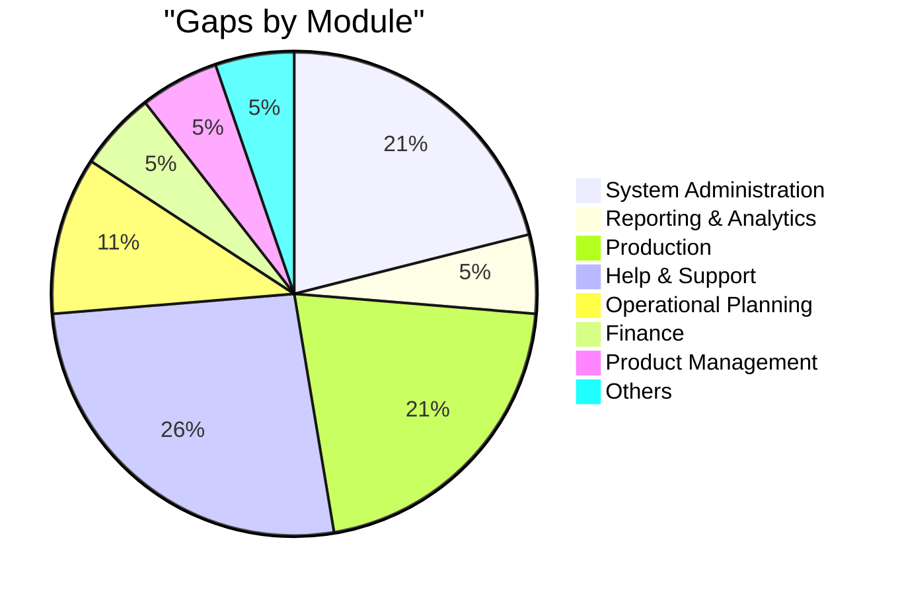
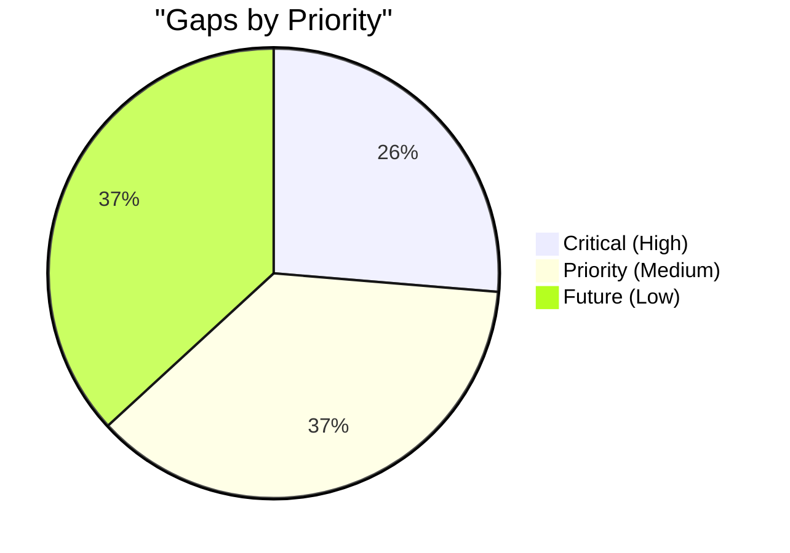
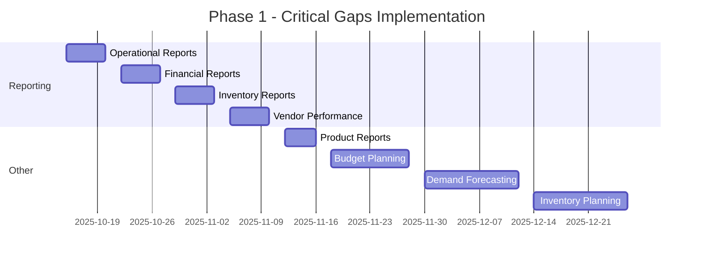

# Carmen ERP - System Gaps and Implementation Roadmap

> **Document Type:** Gap Analysis & Project Roadmap
> **Last Updated:** October 9, 2025
> **Version:** 1.0
> **Status:** Active Planning

## Document History

| Version | Date | Author | Changes |
|---------|------|--------|---------|
| 1.0.0 | 2025-11-19 | Documentation Team | Initial version |
---

## 📚 Related Documentation

- **[System Documentation Index](./SYSTEM-DOCUMENTATION-INDEX.md)** - Main navigation hub
- **[System Architecture](./architecture/SYSTEM-ARCHITECTURE.md)** - Technical architecture details
- **[Business Value & ROI](./stakeholders/BUSINESS-VALUE.md)** - Business case and ROI analysis
- **[Documentation Catalog](./DOCUMENTATION-CATALOG.md)** - Complete asset inventory
- **[Documentation Summary](./DOCUMENTATION-SUMMARY-REPORT.md)** - Executive summary

---

## 📋 Executive Summary

This document outlines the identified gaps between the current implementation and the complete system requirements, along with a prioritized roadmap for closing these gaps.

### Overall Implementation Status

- **Total Features Planned:** 65
- **Features Implemented:** 46
- **Implementation Rate:** 71%
- **Features in Gap:** 19
- **Critical Gaps:** 5
- **Priority Gaps:** 7
- **Future Enhancement Gaps:** 7

---

## 🔴 Critical Gaps (High Priority)

These gaps represent core functionality that should be implemented immediately for system completeness.

### 1. Reporting & Analytics - Core Reports Suite
**Priority:** Critical 🔴
**Module:** Reporting & Analytics
**Impact:** High - Business intelligence and decision making
**Dependencies:** All operational modules

**Description:**
The reporting module is minimally implemented with only consumption analytics. Core business reports are missing.

**Required Reports:**

#### Operational Reports
- Daily transaction summary
- Order fulfillment rates
- Inventory turnover
- Stock availability

#### Financial Reports
- Spend analysis by category
- Budget vs. actual
- Cost variance analysis
- AP/AR aging

#### Inventory Reports
- Stock valuation
- Slow-moving items
- Stockout analysis
- Reorder recommendations

#### Vendor Performance
- On-time delivery rates
- Quality metrics
- Price competitiveness
- Vendor scorecards

**Technical Scope:**
```
Files to Create:
- app/(main)/reporting-analytics/operational-reports/page.tsx
- app/(main)/reporting-analytics/financial-reports/page.tsx
- app/(main)/reporting-analytics/inventory-reports/page.tsx
- app/(main)/reporting-analytics/vendor-performance/page.tsx
- app/(main)/reporting-analytics/cost-analysis/page.tsx
- app/(main)/reporting-analytics/sales-analysis/page.tsx
- components/reports/ReportBuilder.tsx
- components/reports/ReportViewer.tsx
- components/reports/ChartComponents.tsx
```

**Estimated Effort:** 15-20 days
**Target:** Phase 1 - Q4 2025 / Q1 2026

---

### 2. Product Management - Reports
**Priority:** Medium-High 🟡
**Module:** Product Management
**Impact:** Medium - Analytics for product performance
**Dependencies:** Product data, inventory transactions

**Description:**
Product performance reporting is missing.

**Required Reports:**
- Product usage analysis
- Product profitability
- Product lifecycle analysis
- ABC classification

**Technical Scope:**
```
Files to Create:
- app/(main)/product-management/reports/page.tsx
- components/product/ProductReports.tsx
```

**Estimated Effort:** 3-4 days
**Target:** Phase 2 - Q1 2026

---

### 3. Finance - Budget Planning and Control
**Priority:** Medium-High 🟡
**Module:** Finance
**Impact:** Medium - Financial planning and control
**Dependencies:** Department management, cost centers

**Description:**
Budget planning functionality is required for financial management.

**Required Features:**
- Budget creation by department/cost center
- Budget allocation and distribution
- Budget tracking and monitoring
- Variance analysis
- Budget revision workflows

**Technical Scope:**
```
Files to Create:
- app/(main)/finance/budget-planning-and-control/page.tsx
- app/(main)/finance/budget-planning-and-control/[id]/page.tsx
- app/(main)/finance/budget-planning-and-control/new/page.tsx
- components/finance/BudgetForm.tsx
- components/finance/BudgetTracker.tsx
```

**Estimated Effort:** 8-10 days
**Target:** Phase 2 - Q1 2026

---

### 4. Operational Planning - Demand Forecasting
**Priority:** Medium 🟡
**Module:** Operational Planning
**Impact:** Medium - Inventory optimization
**Dependencies:** Recipe data, historical sales, POS integration

**Description:**
Demand forecasting for intelligent inventory planning.

**Required Features:**
- Historical demand analysis
- Trend identification
- Seasonal adjustment
- Forecast generation
- Forecast accuracy tracking

**Technical Scope:**
```
Files to Create:
- app/(main)/operational-planning/demand-forecasting/page.tsx
- components/operational-planning/ForecastDashboard.tsx
- lib/algorithms/demand-forecasting.ts
```

**Estimated Effort:** 10-12 days
**Target:** Phase 2 - Q1 2026

---

### 5. Operational Planning - Inventory Planning
**Priority:** Medium 🟡
**Module:** Operational Planning
**Impact:** Medium - Automated replenishment
**Dependencies:** Demand forecasting, supplier lead times

**Description:**
Intelligent inventory planning based on demand forecasts.

**Required Features:**
- Reorder point calculation
- Safety stock calculation
- Order quantity optimization
- Supplier selection
- Automated PR generation

**Technical Scope:**
```
Files to Create:
- app/(main)/operational-planning/inventory-planning/page.tsx
- components/operational-planning/InventoryPlanner.tsx
- lib/algorithms/inventory-optimization.ts
```

**Estimated Effort:** 10-12 days
**Target:** Phase 2 - Q1 2026

---

## 🟡 Priority Gaps (Medium Priority)

These gaps represent important functionality that should be implemented in Phase 2.

### 6-9. System Administration Gaps

#### 6. General Settings
**Impact:** Medium
**Description:** System-wide configuration settings
**Effort:** 3-4 days
**Target:** Phase 2

#### 7. Notification Preferences
**Impact:** Medium
**Description:** User notification configuration
**Effort:** 4-5 days
**Target:** Phase 2

#### 8. License Management
**Impact:** Medium
**Description:** User license and subscription management
**Effort:** 5-6 days
**Target:** Phase 2

#### 9. Data Backup and Recovery
**Impact:** High (but operational, not feature)
**Description:** Backup configuration and restore capabilities
**Effort:** 7-10 days
**Target:** Phase 2

---

## 🟢 Future Enhancement Gaps (Low Priority)

These gaps represent nice-to-have features for future phases.

### 10-13. Production Module (Entire Module)

**Priority:** Low - Future Phase 🟢
**Module:** Production
**Impact:** Low - Not core to initial rollout
**Status:** Planned for Phase 3

The entire Production module is currently not implemented:

#### Features to Implement:
1. **Recipe Execution**
   - Production order creation
   - Ingredient allocation
   - Production tracking
   - Yield recording

2. **Batch Production**
   - Batch planning
   - Multi-recipe batches
   - Batch tracking
   - Cost allocation

3. **Wastage Tracking**
   - Production wastage recording
   - Wastage categorization
   - Cost impact analysis

4. **Quality Control**
   - Quality checks
   - QC documentation
   - Non-conformance tracking
   - Corrective actions

**Total Estimated Effort:** 25-30 days
**Target:** Phase 3 - Q2 2026

---

### 14-18. Help & Support Module (Entire Module)

**Priority:** Low - Post-Launch 🟢
**Module:** Help & Support
**Impact:** Low - Can be handled externally initially
**Status:** Planned for Phase 3

Features to Implement:
1. User Manuals
2. Video Tutorials
3. FAQs
4. Support Ticket System
5. System Updates and Release Notes

**Total Estimated Effort:** 15-20 days
**Target:** Phase 3 - Post-Launch

---

## 📊 Gap Analysis Summary

### Gaps by Module



### Gaps by Priority



### Implementation Effort Estimate

| Priority | Total Gaps | Est. Days | Est. Weeks |
|----------|------------|-----------|------------|
| Critical | 5 | 46-58 | 9-12 |
| Priority | 7 | 19-25 | 4-5 |
| Future | 7 | 40-50 | 8-10 |
| **TOTAL** | **19** | **105-133** | **21-27** |

---

## 🗺️ Implementation Roadmap

### Phase 1: Critical Gaps (Q4 2025)
**Duration:** 9-12 weeks
**Focus:** Core system completeness



#### Deliverables:
- ✅ Core Reporting Suite (Operational, Financial, Inventory, Vendor Performance)
- ✅ Product Reports
- ✅ Budget Planning
- ✅ Demand Forecasting
- ✅ Inventory Planning

---

### Phase 2: Priority Gaps (Q1 2026)
**Duration:** 4-5 weeks
**Focus:** System Administration enhancements

#### Deliverables:
- ✅ General Settings
- ✅ Notification Preferences
- ✅ License Management
- ✅ Data Backup/Recovery

---

### Phase 3: Future Enhancements (Q2 2026)
**Duration:** 8-10 weeks
**Focus:** Complete feature set

#### Deliverables:
- ✅ Production Module (Complete)
- ✅ Help & Support Module (Complete)
- ✅ Advanced Analytics
- ✅ Mobile Optimization

---

## 🎯 Gap Closure Strategy

### Prioritization Criteria

Gaps are prioritized based on:
1. **Business Impact** (40%)
2. **User Demand** (25%)
3. **Technical Dependencies** (20%)
4. **Implementation Complexity** (15%)

### Resource Allocation

| Phase | Team Size | Duration | Focus Areas |
|-------|-----------|----------|-------------|
| Phase 1 | 3-4 developers | 14-17 weeks | System Admin, Reporting |
| Phase 2 | 2-3 developers | 9-12 weeks | Planning, Configuration |
| Phase 3 | 2-3 developers | 8-10 weeks | Production, Support |

---

## 📈 Success Metrics

### Phase 1 Success Criteria
- ✅ All critical gaps closed
- ✅ Core reporting suite available (Operational, Financial, Inventory, Vendor)
- ✅ Advanced planning features operational (Demand Forecasting, Inventory Planning)
- ✅ Budget planning and control implemented
- ✅ 92%+ system implementation rate

### Phase 2 Success Criteria
- ✅ All priority gaps closed
- ✅ System administration enhancements complete
- ✅ System configuration complete
- ✅ 98%+ system implementation rate

### Phase 3 Success Criteria
- ✅ All planned features implemented
- ✅ Production module operational
- ✅ Help system available
- ✅ 100% system implementation rate

---

## 🔄 Gap Tracking Process

### Monthly Reviews
- Gap status assessment
- Priority re-evaluation
- Resource allocation review
- Timeline adjustments

### Stakeholder Communication
- Monthly progress reports
- Quarterly roadmap updates
- Ad-hoc critical gap notifications

---

## 📝 Additional Implemented Features

The following features were implemented but are not in the main menu structure:

### Inventory Management Extras
- **Fractional Inventory:** `/inventory-management/fractional-inventory`
- **Physical Count:** `/inventory-management/physical-count`
- **Stock-In:** `/inventory-management/stock-in`
- **Stock Card (Single):** `/inventory-management/stock-overview/stock-card`

### Procurement Extras
- **Vendor Comparison:** `/procurement/vendor-comparison`

### Reporting Extras
- **Consumption Analytics:** `/reporting-analytics/consumption-analytics`

### System Administration Extras
- **Account Code Mapping:** `/system-administration/account-code-mapping`

### Vendor Management Extras
- **Vendors (Alternate):** `/vendor-management/vendors`

**Recommendation:** These features should be integrated into the main navigation menu structure.

---

## 📧 Gap Reporting

To report new gaps or update existing gap status:
1. Submit via project management system
2. Include business justification
3. Estimate business impact
4. Suggest priority level

**Contact:** project-management@carmen-erp.com

---

## 📚 Related Documents

- [System Documentation Index](./SYSTEM-DOCUMENTATION-INDEX.md)
- [System Architecture](./architecture/SYSTEM-ARCHITECTURE.md)
- [Module Specifications](./modules/README.md)
- [Business Requirements](./carmen-erp-system-requirements-documentation.md)

---

## 📜 Version History

| Version | Date | Changes | Author |
|---------|------|---------|--------|
| 1.0 | 2025-10-09 | Initial gap analysis and roadmap | Documentation Team |

---

**Last Updated:** October 9, 2025
**Next Review:** November 1, 2025
**Review Frequency:** Monthly
