# Carmen ERP - System Architecture Documentation

> **Document Type:** Technical Architecture
> **Audience:** Senior Developers, System Architects, Technical Leads
> **Last Updated:** October 9, 2025
> **Version:** 1.0

---

## 📋 Table of Contents

1. [System Overview](#system-overview)
2. [Technology Stack](#technology-stack)
3. [Architecture Layers](#architecture-layers)
4. [Module Architecture](#module-architecture)
5. [Data Architecture](#data-architecture)
6. [Component Architecture](#component-architecture)
7. [State Management](#state-management)
8. [Security Architecture](#security-architecture)
9. [Integration Architecture](#integration-architecture)
10. [Deployment Architecture](#deployment-architecture)

---

## 🎯 System Overview

Carmen ERP is a modern, cloud-ready hospitality management system built on Next.js 14 with TypeScript, implementing a server-side rendering strategy with client-side hydration for optimal performance.

### Architecture Principles

1. **Component-Based Architecture:** Modular, reusable React components
2. **Type Safety:** Strict TypeScript throughout
3. **Server-First:** Leverage Next.js App Router and Server Components
4. **Centralized Data:** Unified type system and mock data layer
5. **Role-Based Security:** Comprehensive RBAC implementation
6. **Responsive Design:** Mobile-first, accessible UI

---

## 🏗️ Technology Stack

### Frontend Layer

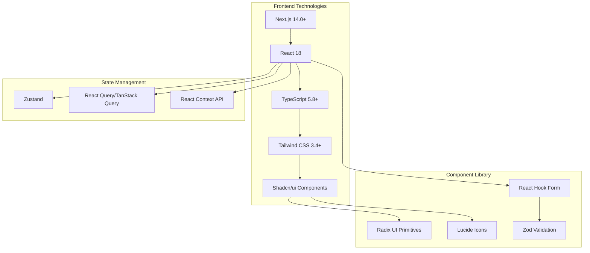

### Technology Stack Details

| Layer | Technology | Version | Purpose |
|-------|------------|---------|----------|
| **Framework** | Next.js | 14.0+ | Full-stack React framework |
| **Language** | TypeScript | 5.8+ | Type-safe development |
| **UI Library** | React | 18 | Component-based UI |
| **Styling** | Tailwind CSS | 3.4+ | Utility-first CSS |
| **Components** | Shadcn/ui | Latest | Pre-built accessible components |
| **Primitives** | Radix UI | Latest | Headless UI components |
| **Icons** | Lucide React | Latest | Icon library |
| **Forms** | React Hook Form | Latest | Form state management |
| **Validation** | Zod | Latest | Schema validation |
| **State (Global)** | Zustand | Latest | Global state management |
| **State (Server)** | React Query | Latest | Server state & caching |
| **Date Utils** | date-fns | Latest | Date manipulation |
| **Testing** | Vitest | Latest | Unit testing |

---

## 🏛️ Architecture Layers

### High-Level System Architecture

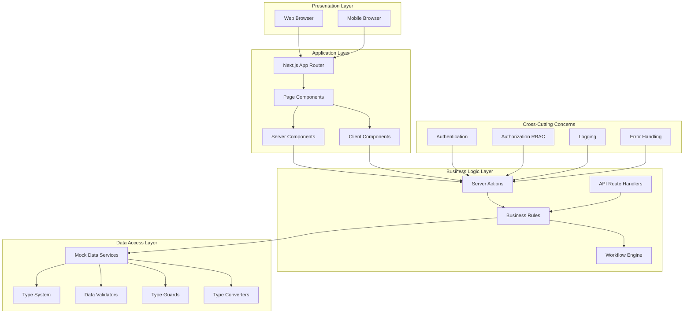

### Layer Responsibilities

#### 1. Presentation Layer
- **Responsibility:** User interface rendering
- **Technologies:** HTML, CSS (Tailwind), React Components
- **Pattern:** Component-based, responsive design

#### 2. Application Layer
- **Responsibility:** Application routing and component orchestration
- **Technologies:** Next.js App Router, React Server Components
- **Pattern:** File-system based routing, server-first rendering

#### 3. Business Logic Layer
- **Responsibility:** Business rules, validations, workflows
- **Technologies:** TypeScript, Server Actions, Zod
- **Pattern:** Domain-driven design, service-oriented

#### 4. Data Access Layer
- **Responsibility:** Data management, type safety, validation
- **Technologies:** TypeScript interfaces, Mock data, Validators
- **Pattern:** Repository pattern, type-safe data access

#### 5. Cross-Cutting Concerns
- **Responsibility:** Security, logging, error handling
- **Technologies:** User Context, RBAC, Error boundaries
- **Pattern:** Aspect-oriented programming

---

## 📦 Module Architecture

### Module Structure

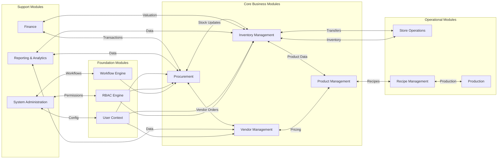

### Module Dependencies

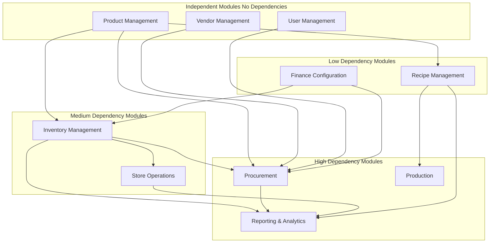

---

## 💾 Data Architecture

### Centralized Type System

All types are centralized in `/lib/types/`:

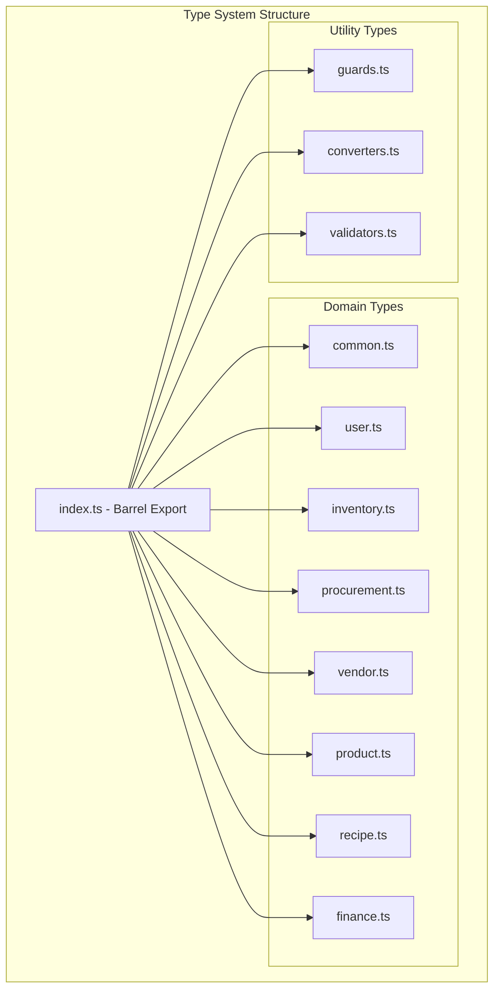

### Data Flow Architecture

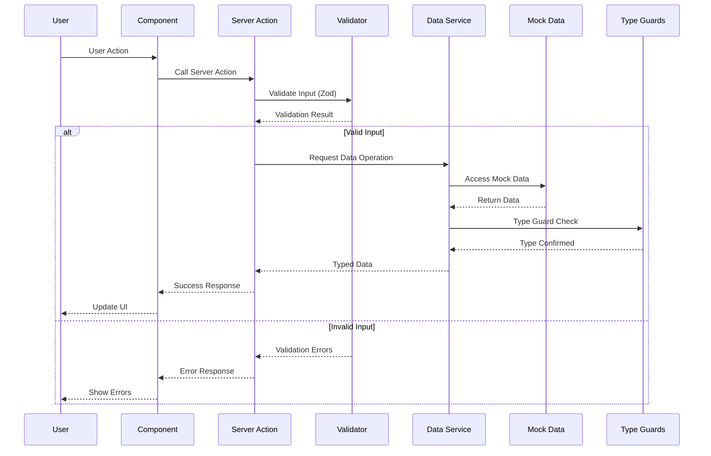

### Mock Data Architecture

Centralized mock data in `/lib/mock-data/`:

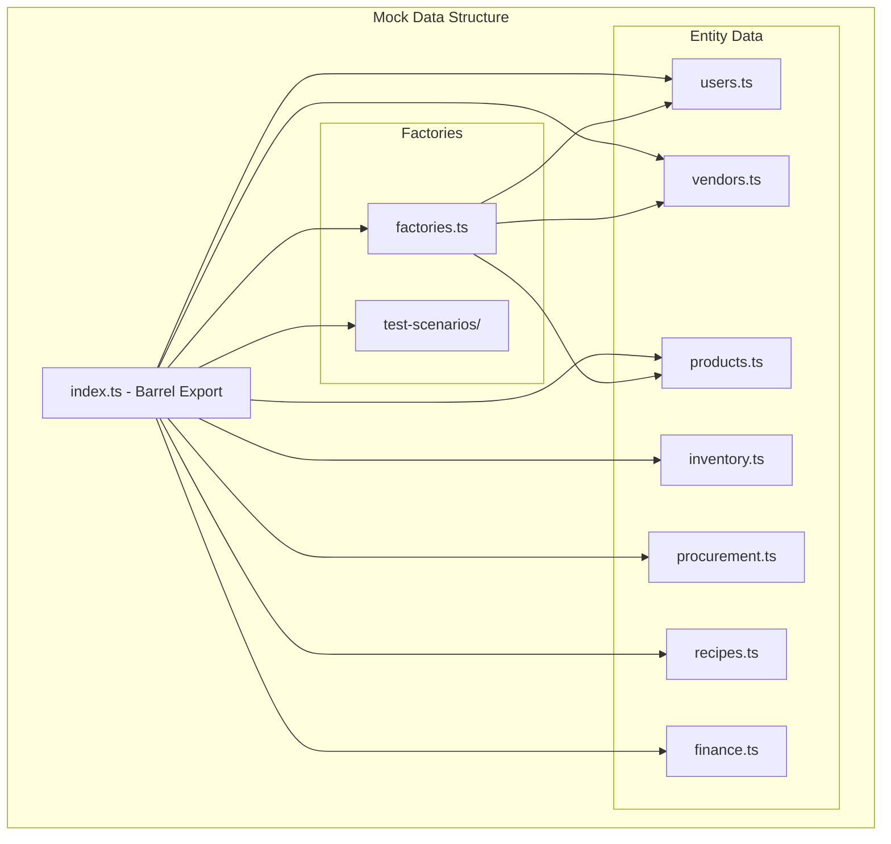

---

## 🧩 Component Architecture

### Component Hierarchy

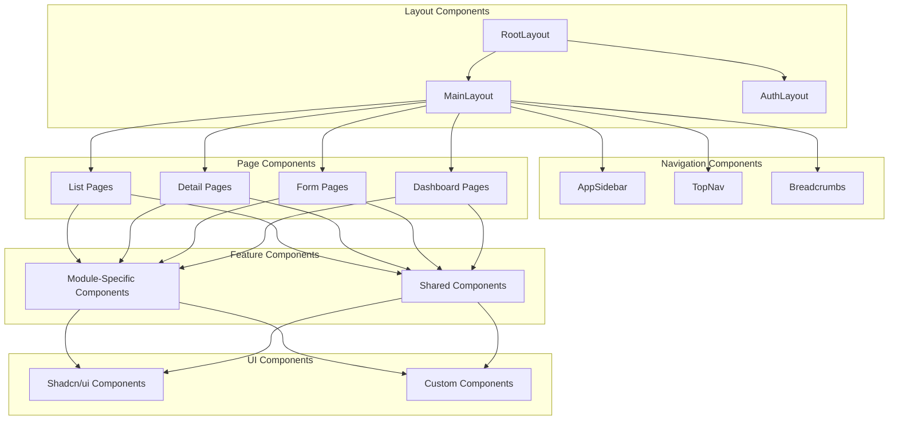

### Component Patterns

#### 1. Server Component Pattern (Default)

```typescript
// app/(main)/procurement/purchase-requests/page.tsx
import { getPurchaseRequests } from '@/lib/data/procurement'

export default async function PurchaseRequestsPage() {
  const requests = await getPurchaseRequests()

  return (
    <div>
      <PurchaseRequestList requests={requests} />
    </div>
  )
}
```

#### 2. Client Component Pattern

```typescript
'use client'

// components/procurement/PurchaseRequestList.tsx
import { useState, useMemo } from 'react'

export function PurchaseRequestList({ requests }) {
  const [filter, setFilter] = useState('')

  const filtered = useMemo(() =>
    requests.filter(r => r.title.includes(filter)),
    [requests, filter]
  )

  return (
    // Component JSX
  )
}
```

#### 3. Form Component Pattern

```typescript
'use client'

import { useForm } from 'react-hook-form'
import { zodResolver } from '@hookform/resolvers/zod'
import * as z from 'zod'

const schema = z.object({
  title: z.string().min(1),
  // ... other fields
})

export function PurchaseRequestForm() {
  const form = useForm<z.infer<typeof schema>>({
    resolver: zodResolver(schema),
  })

  async function onSubmit(data) {
    // Server action call
  }

  return (
    // Form JSX
  )
}
```

---

## 🔄 State Management

### State Management Architecture

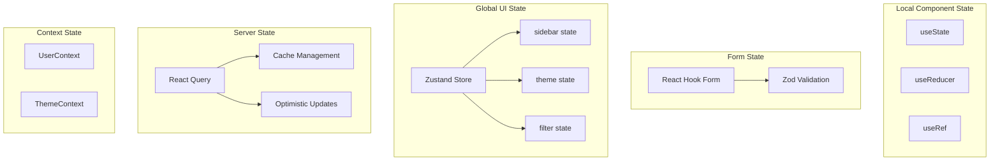

### User Context Architecture

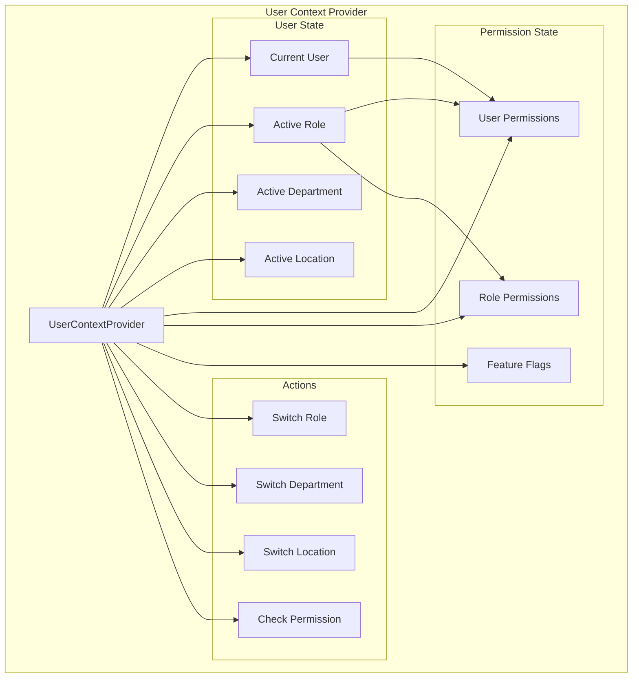

---

## 🔐 Security Architecture

### Role-Based Access Control (RBAC)

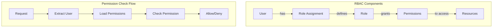

### User Roles & Permissions

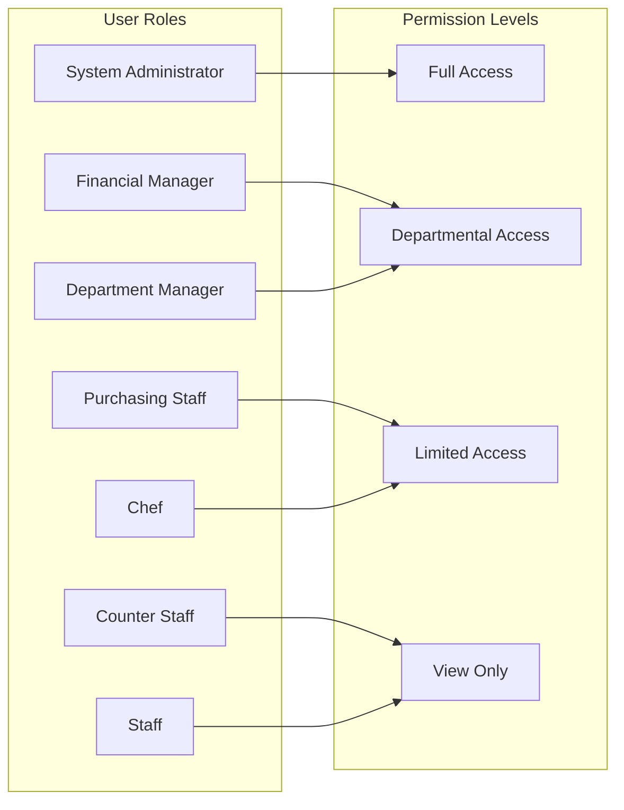

### Authentication Flow

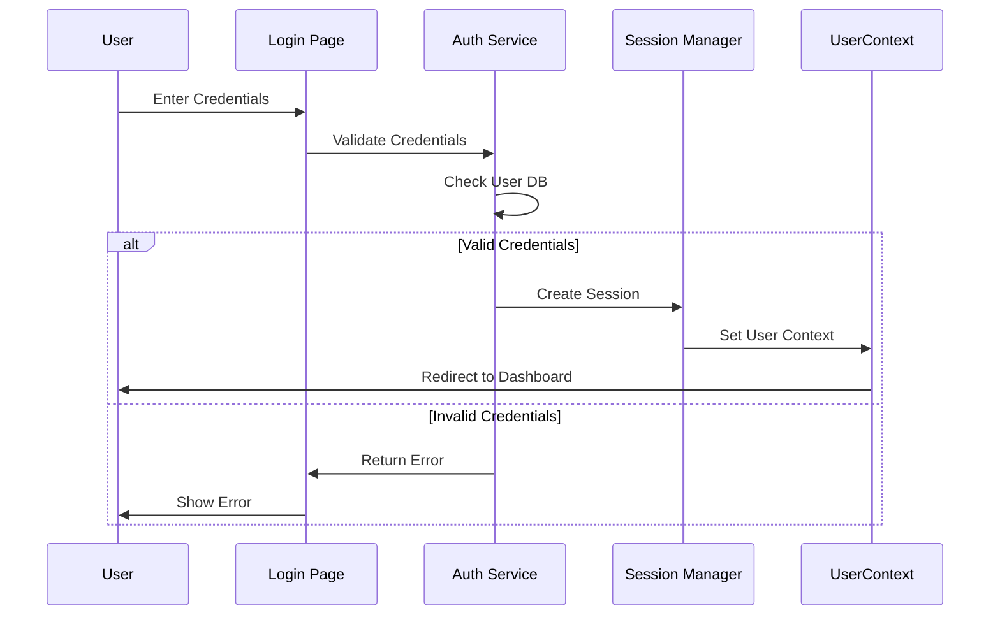

---

## 🔌 Integration Architecture

### Module Integration Points

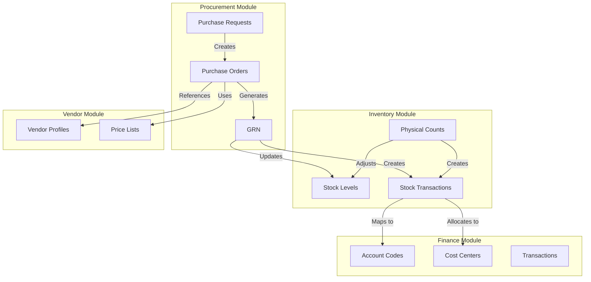

### External Integration Architecture

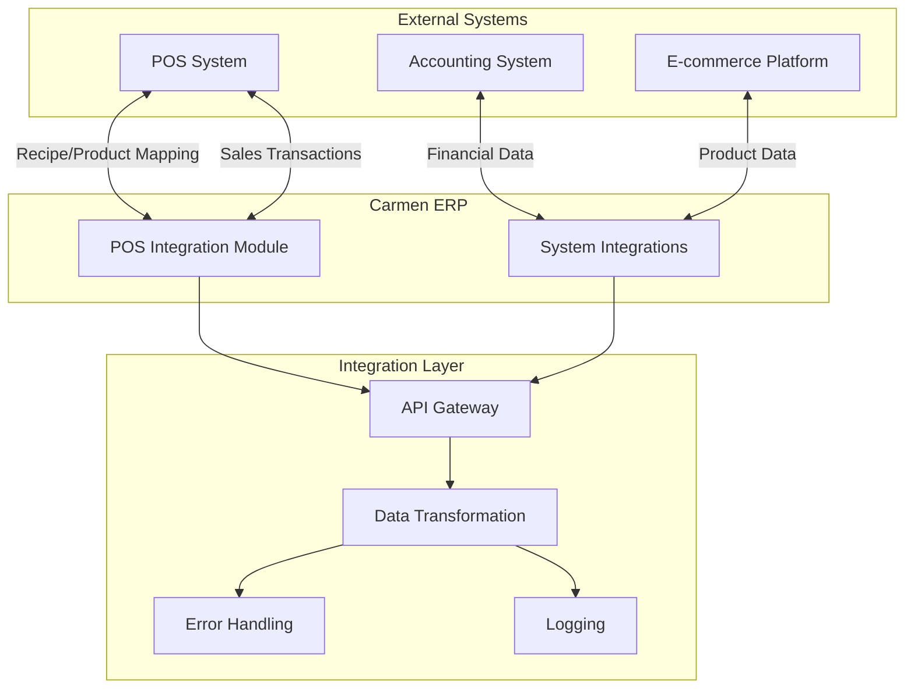

---

## 🚀 Deployment Architecture

### Deployment Model

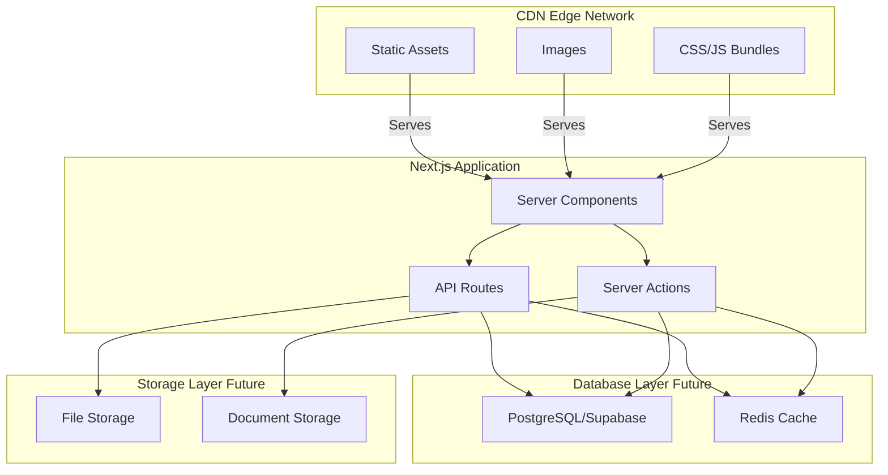

### File System Architecture

```
carmen/
├── app/                          # Next.js App Router
│   ├── (auth)/                   # Authentication routes
│   ├── (main)/                   # Main application routes
│   │   ├── dashboard/
│   │   ├── procurement/
│   │   ├── inventory-management/
│   │   ├── vendor-management/
│   │   ├── product-management/
│   │   ├── store-operations/
│   │   ├── operational-planning/
│   │   ├── production/
│   │   ├── reporting-analytics/
│   │   ├── finance/
│   │   └── system-administration/
│   ├── layout.tsx                # Root layout
│   └── page.tsx                  # Home page
│
├── components/                   # React components
│   ├── ui/                       # Shadcn/ui components
│   ├── procurement/              # Procurement components
│   ├── inventory/                # Inventory components
│   ├── vendor/                   # Vendor components
│   └── ...                       # Other module components
│
├── lib/                          # Utility libraries
│   ├── types/                    # Centralized type system
│   │   ├── index.ts              # Barrel export
│   │   ├── common.ts             # Common types
│   │   ├── user.ts               # User types
│   │   ├── inventory.ts          # Inventory types
│   │   ├── procurement.ts        # Procurement types
│   │   ├── guards.ts             # Type guards
│   │   ├── converters.ts         # Type converters
│   │   └── validators.ts         # Validators
│   │
│   ├── mock-data/                # Centralized mock data
│   │   ├── index.ts              # Barrel export
│   │   ├── users.ts
│   │   ├── vendors.ts
│   │   ├── products.ts
│   │   ├── factories.ts
│   │   └── test-scenarios/
│   │
│   ├── context/                  # React contexts
│   │   └── user-context.tsx     # User context & RBAC
│   │
│   └── utils/                    # Utility functions
│       ├── formatters.ts
│       └── validators.ts
│
├── public/                       # Static assets
└── docs/                         # Documentation
    └── documents/                # System documentation
```

---

## 📊 Performance Architecture

### Rendering Strategy

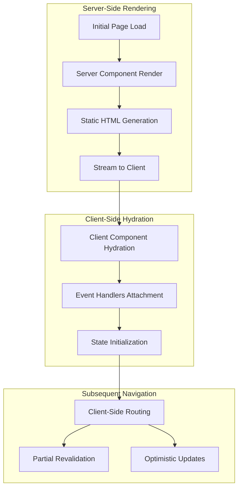

### Caching Strategy

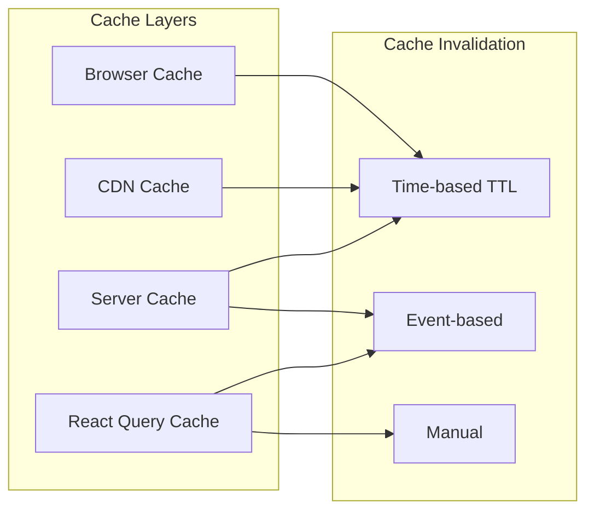

---

## 📚 Related Documents

- [Technical Architecture Details](./TECHNICAL-ARCHITECTURE.md)
- [Data Flow Diagrams](./DATA-FLOW-DIAGRAMS.md)
- [Integration Architecture](./INTEGRATION-ARCHITECTURE.md)
- [API Documentation](../api/API-DOCUMENTATION.md)
- [Development Guide](../development/DEVELOPMENT-GUIDE.md)

---

## 📧 Architecture Review

For architecture-related questions or proposals:
- **Email:** architecture-team@carmen-erp.com
- **Review Schedule:** Bi-weekly
- **RFC Process:** Submit via project management system

---

## 📜 Version History

| Version | Date | Changes | Architect |
|---------|------|---------|-----------|
| 1.0 | 2025-10-09 | Initial architecture documentation | System Architecture Team |

---

**Last Updated:** October 9, 2025
**Next Review:** November 1, 2025
**Architecture Version:** 1.0
