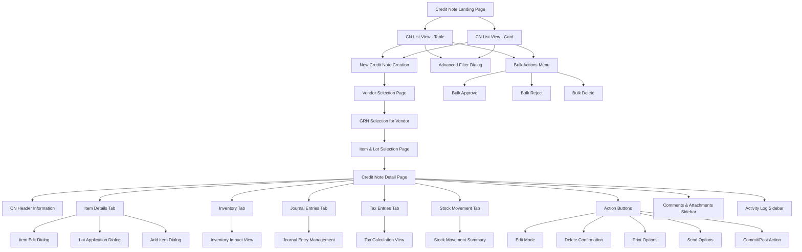
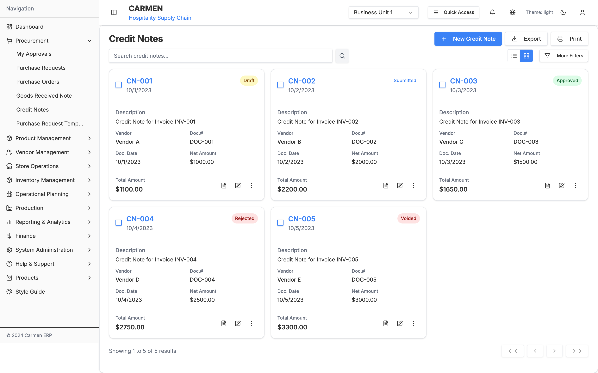
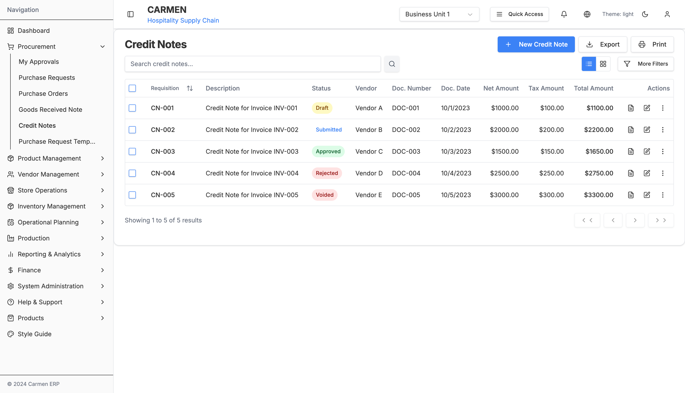
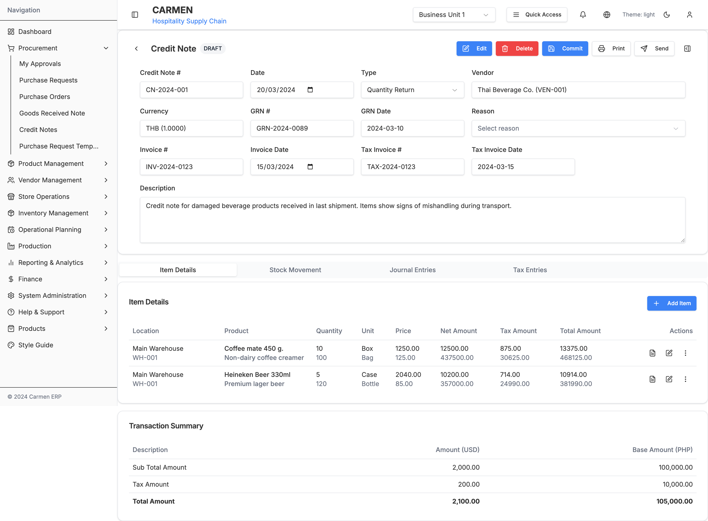
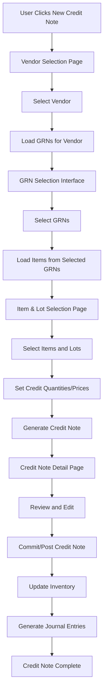
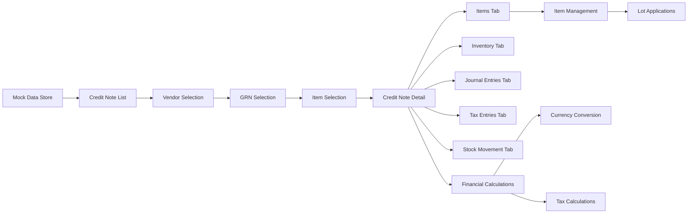
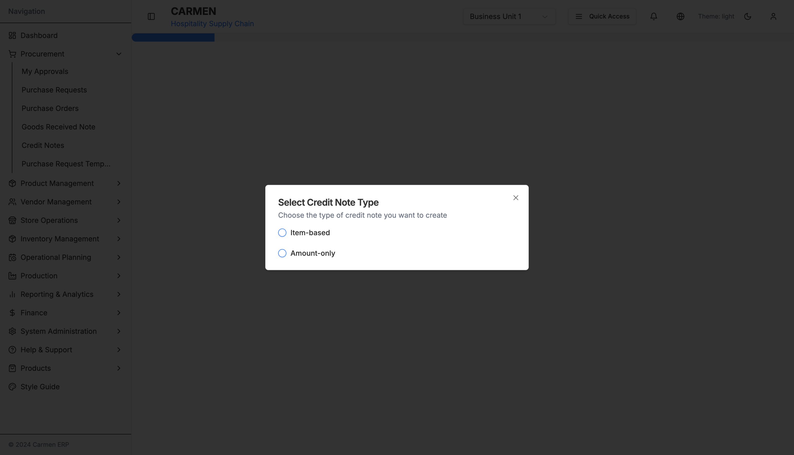
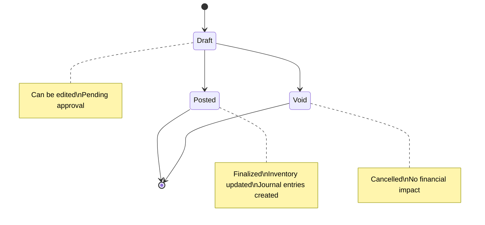

# Credit Note Module - Complete Technical Specification

## Table of Contents
1. [Module Overview](#module-overview)
2. [Complete Site Map](#complete-site-map)
3. [Page Documentation](#page-documentation)
4. [Component Architecture](#component-architecture)
5. [Data Flow](#data-flow)
6. [User Interactions](#user-interactions)
7. [Technical Architecture](#technical-architecture)
8. [API Integration](#api-integration)
9. [Database Schema](#database-schema)
10. [Status Workflow](#status-workflow)

## Module Overview

The Credit Note (CN) module is a comprehensive component of the Carmen Hospitality ERP system that manages vendor credit notes for returned goods, pricing adjustments, and discounts. It provides complete lifecycle management from creation through posting, with robust inventory and financial integration.

### Key Features

#### Core Credit Note Management
- **Multi-type Credit Notes**: Quantity return and amount discount credit notes
- **GRN Integration**: Create credit notes from Goods Received Notes
- **Vendor Management**: Complete vendor selection and credit note tracking
- **Item-level Processing**: Detailed line-item management with lot tracking

#### Advanced Functionality
- **Lot Application**: Advanced lot number tracking and application
- **Stock Movement Integration**: Automatic inventory adjustments upon credit note processing
- **Financial Integration**: Journal entries and tax calculations
- **Multi-currency Support**: Handle credit notes in different currencies with exchange rates

#### User Experience
- **Dual View Interface**: Table and card views for credit note listing
- **Multi-step Workflow**: Vendor selection → GRN selection → Item selection → Credit note creation
- **Comprehensive Detail Interface**: Tabbed interface with inventory, journal entries, and tax details
- **Bulk Operations**: Multi-select credit notes for batch processing

## Complete Site Map



## Page Documentation

### 1. Credit Note Landing Page (`/procurement/credit-note/page.tsx`)

**Purpose**: Main entry point for Credit Note module with list management and creation options

**Key Features**:
- **View Toggle**: Switch between table and card layouts for optimal viewing
- **New Credit Note Button**: Single-click creation with workflow initiation
- **Advanced Filtering**: Status, vendor, date range, and amount filters
- **Search Functionality**: Global search across credit note fields, vendor names, and descriptions




- **Bulk Operations**: Multi-select actions for approve, reject, and delete operations
- **Export Options**: PDF, Excel, CSV exports with customizable parameters

**State Management**:
```typescript
const [creditNotes, setCreditNotes] = useState<CreditNote[]>(mockCreditNotes)
const [filterStatus, setFilterStatus] = useState('All')
const [currentPage, setCurrentPage] = useState(1)
const [searchTerm, setSearchTerm] = useState('')
const [selectedNotes, setSelectedNotes] = useState<number[]>([])
const [viewMode, setViewMode] = useState<'table' | 'card'>('card')
const [sortConfig, setSortConfig] = useState<{key: keyof CreditNote | null, direction: 'asc' | 'desc'}>()
```

**Creation Workflow**:
- Click "New Credit Note" button initiates vendor selection workflow
- System navigates to `/procurement/credit-note/new` (vendor selection page)
- Multi-step process guides user through credit note creation

### 2. Vendor Selection Page (`/new/page.tsx` + `vendor-selection.tsx`)

**Purpose**: Select vendor for credit note creation with GRN filtering

**Key Features**:
- **Vendor Search**: Filter by company name, business registration, or tax ID
- **Vendor Listing**: Table view with comprehensive vendor information
- **Selection Validation**: Only active vendors with valid GRNs selectable
- **Credit Note Type Selection**: Choose between quantity return or amount discount

**Workflow Integration**:
```typescript
type CreditNoteType = 'item-based' | 'amount-only' | null
type SelectedItem = GoodsReceiveNoteItem & {
  creditQuantity: number
  creditPrice: number
  lotNumber: string
  creditLotNumber: string
}
```

### 3. GRN Selection for Vendor

**Purpose**: Select specific Goods Received Notes for credit note processing

**Key Features**:
- **Filtered GRN Display**: Shows only GRNs from selected vendor
- **GRN Status Validation**: Only posted/received GRNs available for credit
- **Multi-selection Support**: Choose multiple GRNs for consolidated credit note
- **GRN Details Preview**: Show items, quantities, and amounts for each GRN

### 4. Item & Lot Selection Page

**Purpose**: Select specific items and lot numbers for credit note processing

**Key Features**:
- **Item Filtering**: Filter by product name, description, or lot number
- **Lot Number Management**: Select specific lots for return or credit
- **Quantity Input**: Enter credit quantities with validation against available quantities
- **Price Adjustment**: Modify unit prices for amount-based credit notes
- **Real-time Calculations**: Auto-calculate credit amounts and totals

### 5. Credit Note Detail Page (`/[id]/page.tsx` + `credit-note-detail.tsx`)

**Purpose**: Comprehensive credit note management interface supporting multiple operational modes

#### Operational Modes
- **View Mode**: Read-only display of existing credit note
- **Edit Mode**: Modify credit note data before posting
- **Draft Mode**: Create and manage draft credit notes

**Key Features**:
- **Header Information**: Credit note number, dates, vendor details, references




- **Tabbed Interface**: Items, Inventory, Journal Entries, Tax Entries, Stock Movement
- **Mode-Aware UI**: Dynamic form states based on current mode
- **Financial Summary**: Real-time calculation with tax and currency conversion
- **Action Buttons**: Context-specific action menus (Edit, Delete, Commit, Print, Send)

**State Management**:
```typescript
const [creditNoteData, setCreditNoteData] = useState<CreditNote>(initialData)
const [currentMode, setCurrentMode] = useState<'view' | 'edit' | 'draft'>('view')
const [selectedItems, setSelectedItems] = useState<string[]>([])
const [showSidePanel, setShowSidePanel] = useState(false)
```

## Component Architecture

### Core Components

#### 1. CreditNoteManagement (Main Container)
**File**: `components/credit-note-management.tsx`

**Purpose**: Primary component managing all credit note list operations and navigation

**Key Responsibilities**:
- List view management (table/card modes)
- Search and filtering functionality
- Pagination and sorting
- Bulk operations coordination
- Navigation to detail views

#### 2. CreditNoteDetail (Detail Container)
**File**: `components/credit-note-detail.tsx` + `credit-note.tsx`

**Purpose**: Comprehensive credit note detail interface

**Key Responsibilities**:
- Mode management (view/edit/draft)
- Tab coordination and data flow
- Action handling (save, delete, commit, print, send)
- Financial calculations and currency conversion

#### 3. Tab Components

**ItemDetailsTab** (`item-details-edit.tsx`)
- Item line management and editing
- Quantity and pricing modifications
- Lot number applications
- Bulk selection and actions

**InventoryTab** (`inventory.tsx`)
- Inventory impact visualization
- Stock level updates
- Location-based inventory tracking

**JournalEntriesTab** (`journal-entries.tsx`)
- Accounting journal entry management
- Debit/credit account assignments
- Financial posting coordination

**TaxEntriesTab** (`tax-entries.tsx`)
- Tax calculation and management
- Tax rate applications
- Tax reporting integration

**StockMovementTab** (`StockMovementTab.tsx` + `stock-movement.tsx`)
- Inventory movement tracking
- Stock location management
- Movement history and audit trail

#### 4. Workflow Components

**VendorSelection** (`vendor-selection.tsx`)
- Vendor search and selection
- GRN filtering by vendor
- Credit note type selection

**GRNSelection** (`grn-selection.tsx`)
- GRN listing and selection
- Item preview and validation
- Multi-GRN consolidation

**ItemAndLotSelection** (`item-and-lot-selection.tsx`)
- Item selection from GRNs
- Lot number management
- Quantity and pricing input

**LotSelection** (`lot-selection.tsx`)
- Advanced lot number selection
- Lot application management
- FIFO/LIFO lot processing

#### 5. Specialized Components

**CnLotApplication** (`cn-lot-application.tsx`)
- Advanced lot application interface
- Lot tracking and traceability
- Batch processing coordination

**AdvancedFilter** (`advanced-filter.tsx`)
- Complex filtering interface
- Date range and amount filters
- Multi-criteria search

## Data Flow

### Credit Note Creation Flow



### Data State Management



## User Interactions

### 1. Credit Note List Management

**Search and Filter Operations**:
- **Global Search**: Search across reference numbers, descriptions, vendor names
- **Status Filtering**: Filter by Draft, Posted, Void status
- **Advanced Filters**: Date range, vendor, amount range filters
- **Sorting**: Multi-column sorting with direction indicators

**View Mode Toggle**:
- **Table View**: Detailed tabular display with sorting and selection
- **Card View**: Visual card-based layout with key information highlights
- **Responsive Design**: Adaptive layout based on screen size

### 2. Credit Note Creation Workflow

**Type Selection Dialog**:
The credit note creation process begins with a type selection dialog that allows users to choose between Item-based and Amount-only credit notes.



**Bulk Operations**:
- **Selection**: Individual and bulk selection with master checkbox
- **Actions**: Approve, reject, delete operations on selected credit notes
- **Confirmation**: User confirmation for destructive operations

### 2. Creation Workflows

**Vendor-Based Creation**:
1. Click "New Credit Note" button
2. Search and select vendor from comprehensive list
3. Choose applicable GRNs from vendor
4. Select specific items and lot numbers
5. Set credit quantities and pricing adjustments
6. Review auto-populated credit note data
7. Commit and post credit note

### 3. Detail Page Interactions

**Tab Navigation**:
- **Items Tab**: Comprehensive item management with editing capabilities
- **Inventory Tab**: Inventory impact visualization and stock level tracking
- **Journal Entries Tab**: Accounting entries with debit/credit management
- **Tax Entries Tab**: Tax calculations and reporting integration
- **Stock Movement Tab**: Inventory movement tracking and audit trail

**Action Management**:
- **Edit Mode**: Switch to editable mode for modifications
- **Delete**: Soft delete with confirmation and audit trail
- **Commit**: Post credit note to accounting system
- **Print**: Generate formatted credit note documents
- **Send**: Email credit note to vendor with attachments

### 4. Advanced Features

**Lot Management**:
- **Lot Selection**: Choose specific lot numbers for return processing
- **Lot Application**: Apply credit notes to specific lot batches
- **FIFO/LIFO Processing**: Automated lot processing based on business rules

**Financial Integration**:
- **Multi-currency Support**: Handle different currencies with exchange rates
- **Tax Calculations**: Automated tax calculations based on jurisdiction
- **Journal Entries**: Automated accounting entries with customizable accounts

## Technical Architecture

### Framework and Libraries
- **Next.js 14**: App Router with server-side rendering
- **TypeScript**: Strict mode with comprehensive type safety
- **Tailwind CSS + Shadcn/ui**: Consistent design system
- **React Hook Form**: Form management with validation
- **Zod**: Runtime type validation

### State Management
- **React useState**: Local component state management
- **URL Parameters**: Navigation and mode state
- **Props Drilling**: Component communication for complex workflows
- **Local Storage**: Temporary workflow data persistence

### Component Patterns
- **Functional Components**: All components use function declarations
- **TypeScript Interfaces**: Strict typing for all props and state
- **Compound Components**: Complex components broken into manageable parts
- **Custom Hooks**: Reusable logic extraction

### Data Types

#### Core Interfaces

```typescript
interface CreditNote {
  id: number
  refNumber: string
  description: string
  vendorId: number
  vendorName: string
  createdDate: Date
  docNumber: string
  docDate: Date
  netAmount: number
  taxAmount: number
  totalAmount: number
  currency: string
  status: string
  notes: string
  createdBy: string
  updatedDate: Date
  updatedBy: string
  items: CreditNoteItem[]
  attachments: CreditNoteAttachment[]
}

interface CreditNoteItem {
  id: number
  description: string
  quantity: number
  unitPrice: number
  discountPercentage: number
  taxPercentage: number
}

interface EditedItem {
  id: string
  productName: string
  productDescription: string
  location: string
  lotNo: string
  orderUnit: string
  inventoryUnit: string
  rcvQty: number
  cnQty: number
  unitPrice: number
  cnAmt: number
  costVariance: number
  discountAmount: number
  totalReceivedQty: number
  grnNumber: string
  grnDate: Date
  taxRate: number
  tax: number
  total: number
  appliedLots?: Array<{
    lotNumber: string
    receiveDate: Date
    grnNumber: string
    invoiceNumber: string
  }>
}
```

#### Type Definitions

```typescript
type CreditNoteType = "QUANTITY_RETURN" | "AMOUNT_DISCOUNT"
type CreditNoteStatus = "DRAFT" | "POSTED" | "VOID"
type CreditNoteReason =
  | "PRICING_ERROR"
  | "DAMAGED_GOODS"
  | "RETURN"
  | "DISCOUNT_AGREEMENT"
  | "OTHER"
```

## API Integration

### RESTful Endpoints

```typescript
// Credit Note Management
GET    /api/credit-notes              // List credit notes with filtering
POST   /api/credit-notes              // Create new credit note
GET    /api/credit-notes/:id          // Get specific credit note
PUT    /api/credit-notes/:id          // Update credit note
DELETE /api/credit-notes/:id          // Delete credit note

// Workflow Endpoints
GET    /api/credit-notes/vendors      // Get vendors for selection
GET    /api/credit-notes/grns/:vendorId // Get GRNs for vendor
POST   /api/credit-notes/generate     // Generate credit note from GRN items

// Processing Endpoints
POST   /api/credit-notes/:id/commit   // Commit/post credit note
POST   /api/credit-notes/:id/void     // Void credit note
GET    /api/credit-notes/:id/lots     // Get lot information
POST   /api/credit-notes/:id/lots/apply // Apply lots to credit note

// Financial Integration
GET    /api/credit-notes/:id/journal-entries // Get journal entries
POST   /api/credit-notes/:id/journal-entries // Create journal entries
GET    /api/credit-notes/:id/tax-entries     // Get tax calculations
POST   /api/credit-notes/:id/stock-movements // Process stock movements
```

### Data Models

#### Request/Response Patterns

```typescript
// Credit Note Creation Request
interface CreateCreditNoteRequest {
  vendorId: number
  grnIds: number[]
  type: CreditNoteType
  reason: CreditNoteReason
  description: string
  items: {
    grnItemId: number
    creditQuantity: number
    creditPrice?: number
    lotNumbers?: string[]
  }[]
}

// Credit Note Response
interface CreditNoteResponse {
  creditNote: CreditNote
  items: EditedItem[]
  journalEntries: JournalEntry[]
  taxEntries: TaxEntry[]
  stockMovements: StockMovement[]
}
```

## Database Schema

### Main Tables

#### credit_notes
```sql
CREATE TABLE credit_notes (
  id SERIAL PRIMARY KEY,
  ref_number VARCHAR(50) UNIQUE NOT NULL,
  description TEXT,
  vendor_id INTEGER REFERENCES vendors(id),
  type VARCHAR(20) NOT NULL, -- QUANTITY_RETURN, AMOUNT_DISCOUNT
  status VARCHAR(20) DEFAULT 'DRAFT', -- DRAFT, POSTED, VOID
  reason VARCHAR(50), -- PRICING_ERROR, DAMAGED_GOODS, etc.
  doc_number VARCHAR(50),
  doc_date DATE,
  net_amount DECIMAL(15,2) DEFAULT 0,
  tax_amount DECIMAL(15,2) DEFAULT 0,
  total_amount DECIMAL(15,2) DEFAULT 0,
  currency VARCHAR(3) DEFAULT 'USD',
  exchange_rate DECIMAL(10,4) DEFAULT 1,
  notes TEXT,
  created_by INTEGER REFERENCES users(id),
  created_at TIMESTAMP DEFAULT CURRENT_TIMESTAMP,
  updated_by INTEGER REFERENCES users(id),
  updated_at TIMESTAMP DEFAULT CURRENT_TIMESTAMP,
  posted_at TIMESTAMP,
  posted_by INTEGER REFERENCES users(id)
);
```

#### credit_note_items
```sql
CREATE TABLE credit_note_items (
  id SERIAL PRIMARY KEY,
  credit_note_id INTEGER REFERENCES credit_notes(id),
  grn_item_id INTEGER REFERENCES grn_items(id),
  product_id INTEGER REFERENCES products(id),
  description TEXT,
  location_id INTEGER REFERENCES locations(id),
  lot_number VARCHAR(50),
  credit_quantity DECIMAL(15,4),
  unit_price DECIMAL(15,4),
  discount_percentage DECIMAL(5,2) DEFAULT 0,
  discount_amount DECIMAL(15,2) DEFAULT 0,
  tax_rate DECIMAL(5,2) DEFAULT 0,
  tax_amount DECIMAL(15,2) DEFAULT 0,
  total_amount DECIMAL(15,2),
  created_at TIMESTAMP DEFAULT CURRENT_TIMESTAMP,
  updated_at TIMESTAMP DEFAULT CURRENT_TIMESTAMP
);
```

#### credit_note_lot_applications
```sql
CREATE TABLE credit_note_lot_applications (
  id SERIAL PRIMARY KEY,
  credit_note_item_id INTEGER REFERENCES credit_note_items(id),
  lot_number VARCHAR(50),
  grn_number VARCHAR(50),
  grn_date DATE,
  invoice_number VARCHAR(50),
  applied_quantity DECIMAL(15,4),
  unit_cost DECIMAL(15,4),
  total_cost DECIMAL(15,2),
  created_at TIMESTAMP DEFAULT CURRENT_TIMESTAMP
);
```

#### credit_note_journal_entries
```sql
CREATE TABLE credit_note_journal_entries (
  id SERIAL PRIMARY KEY,
  credit_note_id INTEGER REFERENCES credit_notes(id),
  account_id INTEGER REFERENCES chart_of_accounts(id),
  description TEXT,
  debit_amount DECIMAL(15,2) DEFAULT 0,
  credit_amount DECIMAL(15,2) DEFAULT 0,
  currency VARCHAR(3) DEFAULT 'USD',
  exchange_rate DECIMAL(10,4) DEFAULT 1,
  created_at TIMESTAMP DEFAULT CURRENT_TIMESTAMP
);
```

#### credit_note_stock_movements
```sql
CREATE TABLE credit_note_stock_movements (
  id SERIAL PRIMARY KEY,
  credit_note_id INTEGER REFERENCES credit_notes(id),
  credit_note_item_id INTEGER REFERENCES credit_note_items(id),
  product_id INTEGER REFERENCES products(id),
  location_id INTEGER REFERENCES locations(id),
  lot_number VARCHAR(50),
  movement_type VARCHAR(20), -- RETURN, ADJUSTMENT
  quantity DECIMAL(15,4),
  unit_cost DECIMAL(15,4),
  total_cost DECIMAL(15,2),
  movement_date TIMESTAMP DEFAULT CURRENT_TIMESTAMP,
  created_by INTEGER REFERENCES users(id)
);
```

### Relationships
- **Credit Note → Items**: One-to-Many (Credit note can have multiple items)
- **Credit Note → Journal Entries**: One-to-Many (Multiple accounting entries)
- **Credit Note → Stock Movements**: One-to-Many (Multiple inventory movements)
- **Credit Note Item → Lot Applications**: One-to-Many (Item can apply to multiple lots)
- **Credit Note → Vendor**: Many-to-One (Multiple credit notes per vendor)
- **Credit Note Item → GRN Item**: Many-to-One (Can reference original GRN item)

### Indexes and Constraints

```sql
-- Performance indexes
CREATE INDEX idx_cn_vendor_date ON credit_notes(vendor_id, created_at DESC);
CREATE INDEX idx_cn_status_created ON credit_notes(status, created_at DESC);
CREATE INDEX idx_cn_ref ON credit_notes(ref_number);
CREATE INDEX idx_cn_doc_number ON credit_notes(doc_number) WHERE doc_number IS NOT NULL;

-- Foreign key indexes
CREATE INDEX idx_cn_items_credit_note ON credit_note_items(credit_note_id);
CREATE INDEX idx_cn_items_grn_item ON credit_note_items(grn_item_id);
CREATE INDEX idx_cn_lot_apps_item ON credit_note_lot_applications(credit_note_item_id);

-- Business constraints
ALTER TABLE credit_notes ADD CONSTRAINT chk_cn_total_positive CHECK (total_amount >= 0);
ALTER TABLE credit_note_items ADD CONSTRAINT chk_cn_item_qty_positive CHECK (credit_quantity > 0);
```

## Status Workflow



### Status Descriptions

- **Draft**: Credit note created but not yet committed. Can be edited and modified.
- **Posted**: Credit note committed and posted to accounting system. Inventory and financial impacts are applied.
- **Void**: Credit note cancelled. No financial or inventory impact.

### Workflow Rules

1. **Draft → Posted**: Requires validation of all items, calculations, and approvals
2. **Draft → Void**: Can be voided at any time before posting
3. **Posted → Void**: Not allowed - posted credit notes cannot be voided
4. **Inventory Impact**: Only occurs when transitioning to Posted status
5. **Journal Entries**: Generated automatically when credit note is posted

## Document History

| Version | Date | Author | Changes |
|---------|------|--------|---------|
| 1.0.0 | 2025-11-19 | Documentation Team | Initial version |
---

*Generated on: 2025-09-23*
*Credit Note Module Version: 1.0*
*Carmen ERP - Hospitality Supply Chain Management*