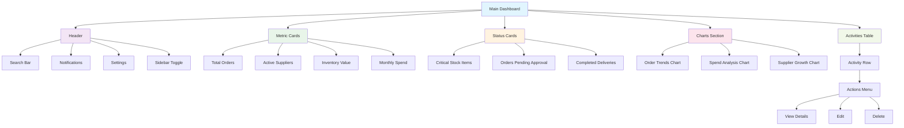
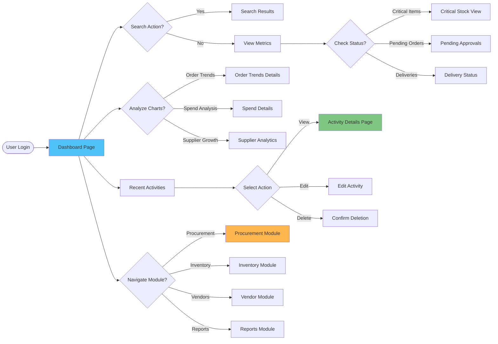
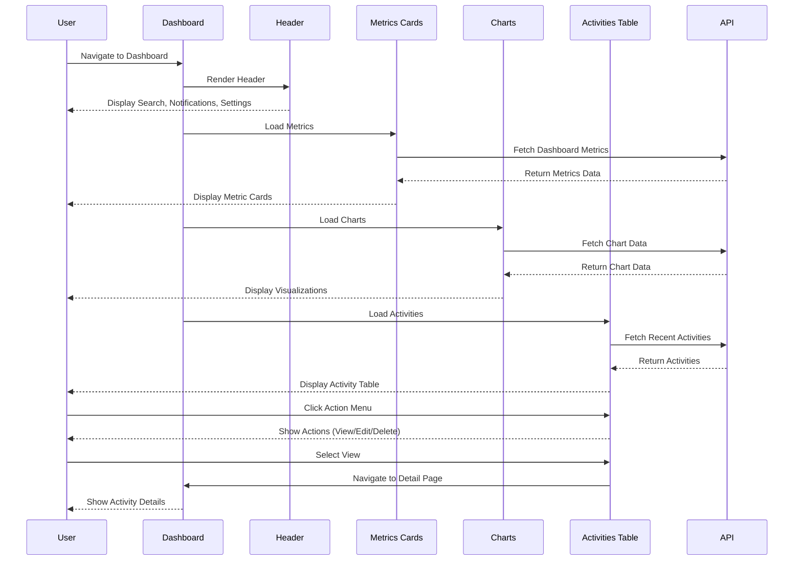
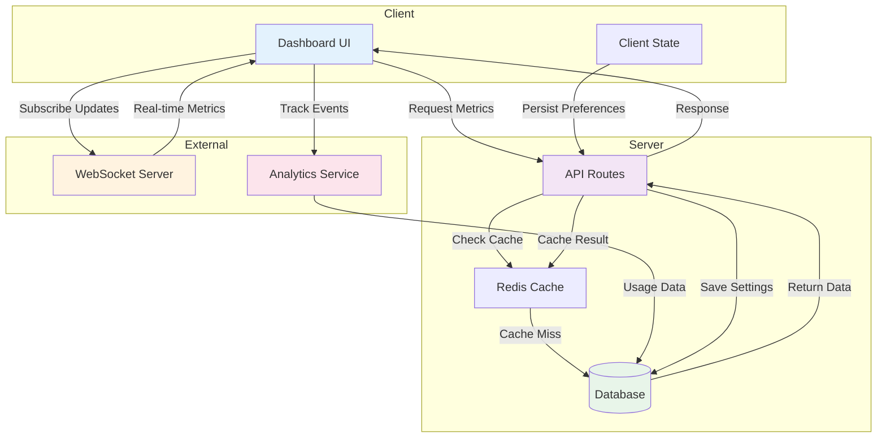
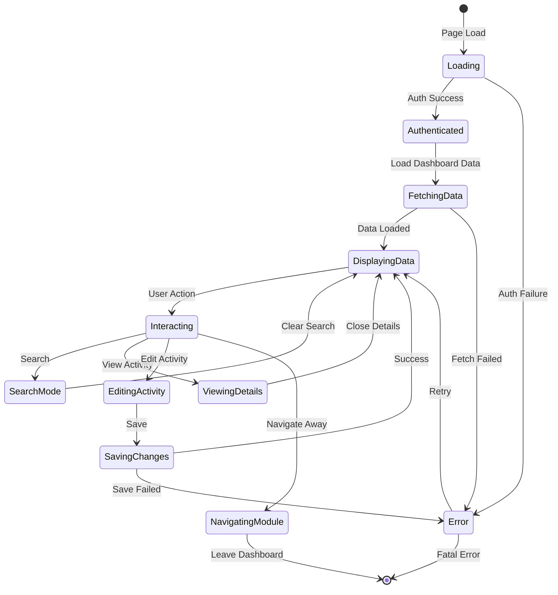
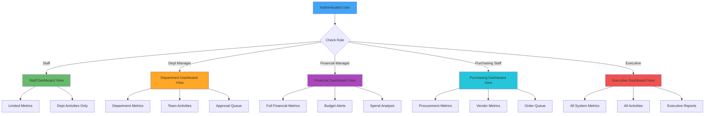
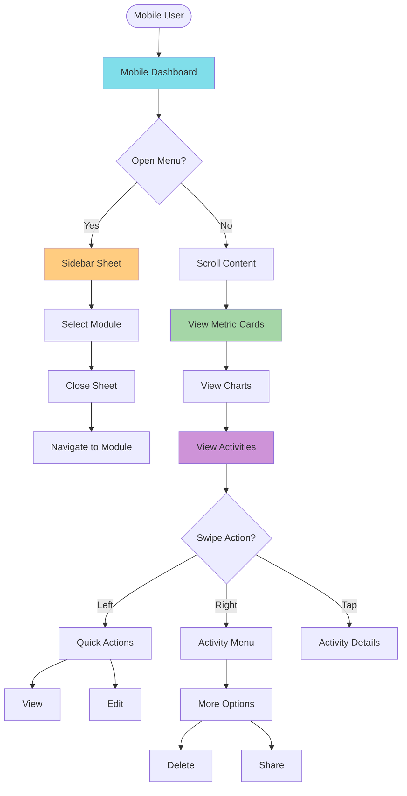

# Dashboard Module Sitemap

## Document History

| Version | Date | Author | Changes |
|---------|------|--------|---------|
| 1.0.0 | 2025-11-19 | Documentation Team | Initial version |
## Navigation Hierarchy



## User Flow Diagram



## Route Structure

```mermaid
graph LR
    Root[/] --> Dashboard[/dashboard]

    Dashboard --> Components[Components]
    Components --> Header[dashboard-header.tsx]
    Components --> Cards[dashboard-cards.tsx]
    Components --> Charts[dashboard-chart.tsx]
    Components --> Table[dashboard-data-table.tsx]

    Dashboard --> Actions[User Actions]
    Actions --> View[View Activity Details]
    Actions --> Edit[Edit Activity]
    Actions --> Delete[Delete Activity]
    Actions --> Nav[Navigate to Module]

    View --> PR[/procurement/purchase-requests/:id]
    View --> PO[/procurement/purchase-orders/:id]
    View --> GRN[/procurement/goods-received-note/:id]
    View --> Inv[/inventory-management/*]

    Nav --> ProcModule[/procurement/*]
    Nav --> InvModule[/inventory-management/*]
    Nav --> VendorModule[/vendor-management/*]
    Nav --> ReportModule[/reporting-analytics/*]

    style Dashboard fill:#90caf9
    style Components fill:#a5d6a7
    style Actions fill:#ffcc80
```

## Component Interaction Flow



## Data Flow Architecture



## Integration Map

```mermaid
graph TD
    Dashboard[Dashboard Module]

    Dashboard --> Procurement[Procurement Module]
    Dashboard --> Inventory[Inventory Module]
    Dashboard --> Vendor[Vendor Module]
    Dashboard --> Finance[Finance Module]
    Dashboard --> Reports[Reports & Analytics]
    Dashboard --> System[System Administration]

    Procurement --> PR[Purchase Requests]
    Procurement --> PO[Purchase Orders]
    Procurement --> GRN[Goods Received Notes]

    Inventory --> Stock[Stock Overview]
    Inventory --> Count[Physical Count]
    Inventory --> Spot[Spot Check]
    Inventory --> Adj[Adjustments]

    Vendor --> VList[Vendor List]
    Vendor --> VProfile[Vendor Profiles]
    Vendor --> VPrice[Price Lists]

    Finance --> Invoices[Invoices]
    Finance --> Payments[Payments]
    Finance --> Budget[Budget Tracking]

    Reports --> Consumption[Consumption Analytics]
    Reports --> Performance[Performance Metrics]
    Reports --> Executive[Executive Summary]

    System --> Users[User Management]
    System --> Workflow[Workflow Config]
    System --> Permissions[Permissions]

    style Dashboard fill:#64b5f6
    style Procurement fill:#81c784
    style Inventory fill:#ffb74d
    style Vendor fill:#ba68c8
    style Finance fill:#4dd0e1
    style Reports fill:#ff8a65
    style System fill:#a1887f
```



## State Management Flow



## Permission-Based Navigation



## Mobile Navigation Flow


