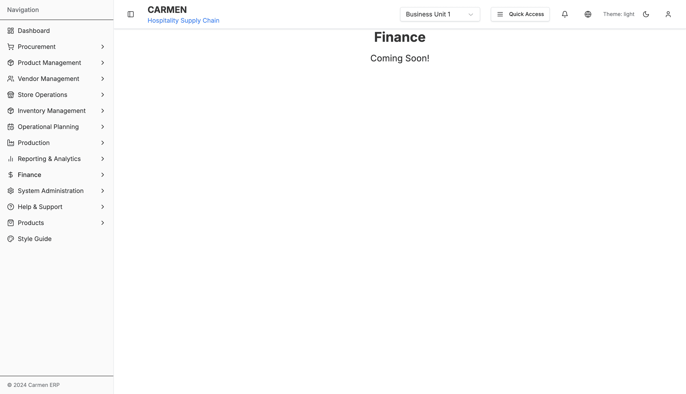

# Finance Module

> **Module:** Finance
> **Total Pages:** 7
> **Status:** ✅ Production Ready

## Document History

| Version | Date | Author | Changes |
|---------|------|--------|---------|
| 1.0.0 | 2025-11-19 | Documentation Team | Initial version |
---

## Overview

The Finance module provides essential financial management capabilities for Carmen ERP, including account code mapping for GL integration, multi-currency management, exchange rate tracking, and department/cost center organization. This module ensures accurate financial reporting and seamless integration with external accounting systems.

### Key Features

1. **Account Code Mapping** - Map inventory categories to General Ledger accounts
2. **Currency Management** - Multi-currency support with activation controls
3. **Exchange Rate Management** - Real-time and manual exchange rate tracking
4. **Department Management** - Cost center and department organization
5. **GL Integration** - Posting configurations for external accounting systems

---

## 📸 System Screenshots

### Finance Dashboard (Planned Feature)

*The Finance module dashboard is currently in planning stages. This "Coming Soon!" placeholder indicates that comprehensive financial management features including account code mapping, currency management, exchange rate tracking, and department cost center organization are scheduled for future implementation. The Finance module will provide seamless GL integration and multi-currency transaction support when released.*

---

## Module Structure

### Features Documentation

- [Account Code Mapping](./features/account-code-mapping/README.md) - Category to GL mapping
- [Currency Management](./features/currency-management/README.md) - Currency configuration
- [Exchange Rates](./features/exchange-rates/README.md) - Exchange rate tracking
- [Departments & Cost Centers](./features/departments/README.md) - Organizational structure

---

## Quick Start

### Accessing the Module

Navigate to: `/finance`

### Main Features

**Account Code Mapping**
- Map stores/locations to GL accounts
- Category and subcategory mapping
- Item group assignments
- Department code linkage
- Bulk import/export

**Currency Management**
- Configure active currencies
- Manage currency descriptions
- Enable/disable currencies
- Multi-currency transaction support

**Exchange Rates**
- View and manage exchange rates
- Manual rate entry
- Automatic rate updates (API integration)
- Historical rate tracking
- CSV import for bulk rates

**Department Management**
- Create and manage departments
- Assign cost centers
- Department hierarchy
- Budget tracking integration

---

## Key Metrics

**Financial Operations**:
- Active currencies count
- Exchange rate update frequency
- Account mappings count
- Department count
- GL integration status

---

## User Roles & Permissions

| Feature | Finance Manager | Accountant | Department Manager | Staff |
|---------|----------------|------------|-------------------|-------|
| Account Mapping | ✅ | ✅ | ❌ | ❌ |
| Currency Management | ✅ | ⚠️ | ❌ | ❌ |
| Exchange Rates | ✅ | ✅ | ❌ | ❌ |
| Department Setup | ✅ | ⚠️ | ⚠️ | ❌ |
| GL Integration | ✅ | ✅ | ❌ | ❌ |

Legend: ✅ Full Access | ⚠️ Read Only | ❌ No Access

---

## Integration Points

### System Integrations
- **General Ledger Systems** - Account code posting and reconciliation
- **Inventory Management** - Category to GL account mapping
- **Procurement** - Purchase transaction posting
- **Store Operations** - Department-wise expense tracking
- **Reporting** - Financial analytics and reports

### Data Flow
```
Inventory Categories → Account Mapping → GL Posting
Transactions (Multi-Currency) → Exchange Rates → Base Currency Conversion
Department Assignments → Cost Centers → Budget Tracking
Purchase Orders → Account Codes → GL Integration
```

---

## Technical Architecture

### Tech Stack
- **Framework**: Next.js 14 with App Router
- **UI Components**: Shadcn/ui
- **State Management**: React state (local)
- **Data Tables**: Tanstack Table components

### Data Models
See individual feature documentation for detailed TypeScript interfaces and data models.

---

## Related Documentation

- [System Administration](../sa/README.md)
- [Inventory Management](../inventory/README.md)
- [Procurement](../procurement/README.md)
- [Reporting & Analytics](../reporting/README.md)

---

**Last Updated:** 2025-01-17
**Version:** 1.0.0
