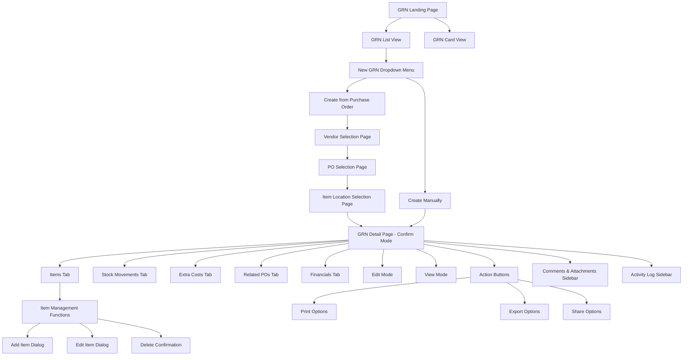
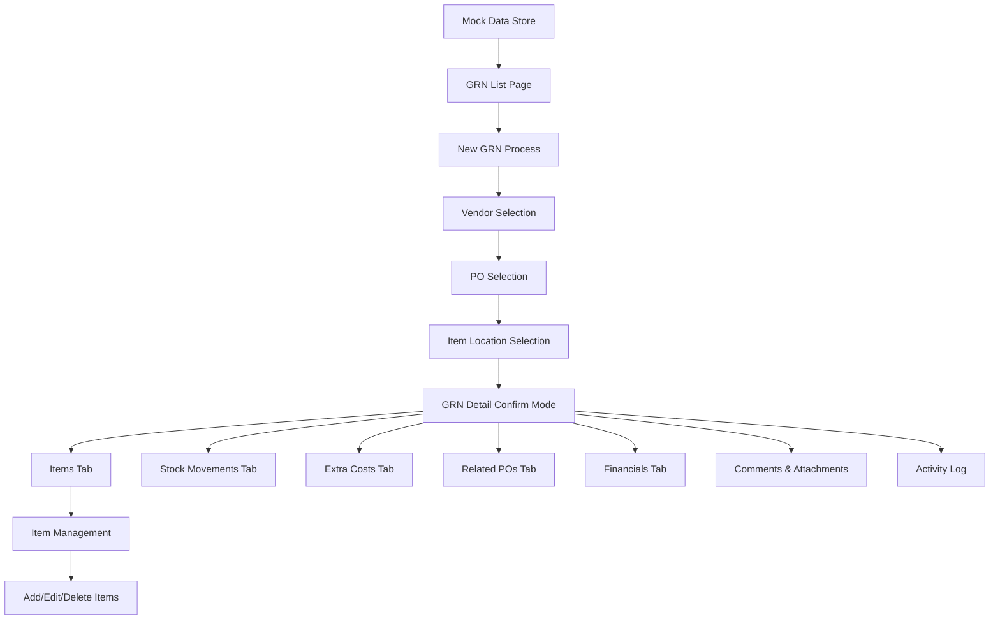
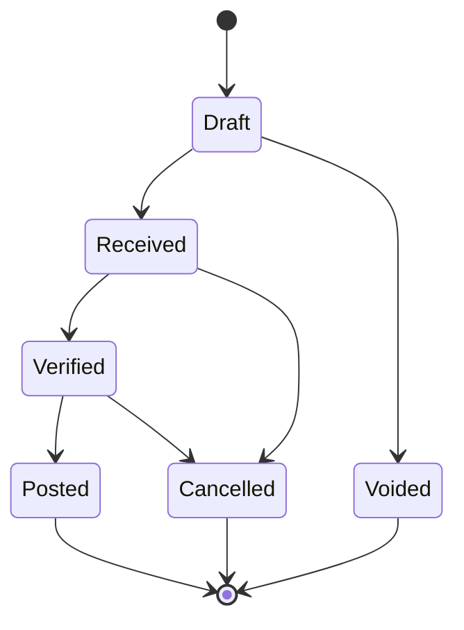

# Goods Received Note Module Documentation

Welcome to the comprehensive documentation for the Carmen ERP Goods Received Note (GRN) module. This documentation provides complete technical specifications, user guides, and implementation details.

## 📚 Documentation Structure

### 1. [Complete Technical Specification](./goods-received-note-complete-specification.md)
**Comprehensive overview of the entire GRN module**
- Module overview and key features
- Complete site map with Mermaid diagrams
- Page and component documentation
- Data flow and user interactions
- Technical architecture details
- API endpoints and database schema

### 2. [Detailed Component Documentation](./components-detailed-documentation.md)
**In-depth analysis of all components and their interactions**
- Page components (List, Detail, Create)
- Form components and validation
- Dialog components and workflows
- Tab components and functionality
- Utility and data components
- Component interaction patterns

### 3. [User Interaction Guide](./user-interaction-guide.md)
**Complete guide for user workflows and interactions**
- Navigation and entry points
- Primary user workflows
- Dialog and form interactions
- Data management features
- Advanced functionality

### 4. [API Specification](./api-specification.md)
**Technical API documentation for developers**
- Authentication and authorization
- Core endpoints and operations
- Data models and schemas
- Error handling and responses
- Rate limiting and webhooks

## 🖼️ Screenshots & Visual Documentation

All screenshots are stored in the [`screenshots/`](./screenshots/) directory:

- **grn-list-page.png** - Main GRN listing interface
- **grn-new-dropdown-menu.png** - New GRN creation dropdown menu
- **grn-vendor-selection-page.png** - Vendor selection interface
- **grn-po-selection-page.png** - Purchase Order selection interface
- **grn-item-location-selection-page.png** - Item and location selection interface
- **grn-detail-confirm-mode.png** - GRN detail page in confirm mode with Items tab
- **grn-stock-movements-tab.png** - GRN detail page showing Stock Movements tab

## 🗺️ Module Site Map



## 🚀 Key Features

### Goods Received Note Management
- Complete GRN lifecycle management (Draft → Received → Verified → Posted)
- Multi-currency support with real-time exchange rates
- Integration with Purchase Orders for seamless procurement flow
- Comprehensive item management with inventory tracking
- Three-way matching (PO-GRN-Invoice) capabilities

### User Interface
- Responsive design with table and card views
- Advanced filtering and search capabilities
- Multi-step creation workflow
- Export and print functionality
- Real-time status updates

### Document Management
- Attachment handling for GRN documents
- Integration with purchase orders and invoices
- Activity logging and complete audit trail
- Email notifications and vendor communication
- Comments and collaboration features

### Technical Architecture
- Next.js 14 with App Router
- TypeScript with strict mode
- Tailwind CSS + Shadcn/ui components
- Zustand state management
- React Hook Form + Zod validation

## 📁 File Structure

```
docs/documents/grn/
├── README.md                                   # This file
├── goods-received-note-complete-specification.md # Complete technical spec
├── components-detailed-documentation.md       # Component documentation
├── user-interaction-guide.md                  # User workflows
├── api-specification.md                       # API documentation
└── screenshots/                               # Visual documentation
    ├── grn-list-page.png
    ├── grn-new-dropdown-menu.png
    ├── grn-vendor-selection-page.png
    ├── grn-po-selection-page.png
    ├── grn-item-location-selection-page.png
    ├── grn-detail-confirm-mode.png
    └── grn-stock-movements-tab.png
```

## 🔗 Source Code Structure

```
app/(main)/procurement/goods-received-note/
├── page.tsx                                   # Main listing page
├── [id]/page.tsx                             # Detail page route
├── new/vendor-selection/page.tsx             # Vendor selection page
├── new/po-selection/page.tsx                 # PO selection page
├── new/item-location-selection/page.tsx      # Item location selection page
└── components/                               # Component library
    ├── GoodsReceiveNoteDetail.tsx           # Main detail component
    ├── GoodsReceiveNoteList.tsx             # List component
    ├── NewGRNProcessSelector.tsx            # Process selection dialog
    ├── VendorSelectionPage.tsx              # Vendor selection
    ├── POSelectionPage.tsx                  # PO selection
    ├── ItemLocationSelectionPage.tsx        # Item location selection
    ├── GoodsReceiveNoteItems.tsx            # Items management
    ├── TransactionSummary.tsx               # Financial summary
    └── tabs/                                # Tab components
        ├── StockMovementsTab.tsx            # Stock movements
        ├── ExtraCostsTab.tsx                # Extra costs
        ├── RelatedPOsTab.tsx                # Related POs
        └── FinancialsTab.tsx                # Financial details
```

## 🎯 Primary User Workflows

### 1. Create GRN from Purchase Order
1. Navigate to GRN List → Click "New GRN" → "Create from Purchase Order"
2. Select vendor from searchable list
3. Choose one or multiple purchase orders
4. Select items and quantities to receive
5. Review and confirm GRN details
6. Save as draft or finalize

### 2. Create GRN Manually
1. Click "New GRN" → "Create Manually"
2. Fill vendor and header information manually
3. Add items with pricing and quantities
4. Configure extra costs if needed
5. Review financial summary
6. Save as draft or finalize

### 3. Process Goods Receipt
1. Open GRN Detail → Items tab
2. Review ordered vs received quantities
3. Process stock movements (automatic)
4. Handle partial deliveries
5. Complete item receipts

## 🛠️ Technical Implementation

### Component Architecture
- **GoodsReceiveNoteDetail**: Main detail interface with multi-mode support
- **GoodsReceiveNoteItems**: Comprehensive item management
- **TransactionSummary**: Real-time financial calculations
- **Multi-step workflow**: Vendor → PO → Items → Confirmation

### State Management
- Zustand for global GRN state management
- URL parameters for routing context
- LocalStorage for temporary workflow data
- Mock data integration with future API readiness

### Data Flow


## 📊 Database Schema Overview

### Main Tables
- **goods_received_notes** - Core GRN information
- **grn_items** - Line items and quantities
- **grn_stock_movements** - Inventory movements
- **grn_extra_costs** - Additional costs (freight, etc.)
- **grn_activity_log** - Complete audit trail

### Key Relationships
- GRN → Items (One-to-Many)
- GRN → Stock Movements (One-to-Many)
- GRN → Extra Costs (One-to-Many)
- GRN → Activity Log (One-to-Many)
- Items → Purchase Orders (Many-to-One, optional)

## 🔄 Status Workflow



## 📧 Support & Contributions

For questions, issues, or contributions to this documentation:

1. **Technical Issues**: Review the component documentation and API specification
2. **User Workflow Questions**: Consult the user interaction guide
3. **Feature Requests**: Reference the complete technical specification
4. **Bug Reports**: Include relevant screenshots and component details

## Document History

| Version | Date | Author | Changes |
|---------|------|--------|---------|
| 1.0.0 | 2025-11-19 | Documentation Team | Initial version |
---

*Documentation generated on: 2025-09-23*
*Module Version: 1.0*
*Carmen ERP - Hospitality Supply Chain Management*