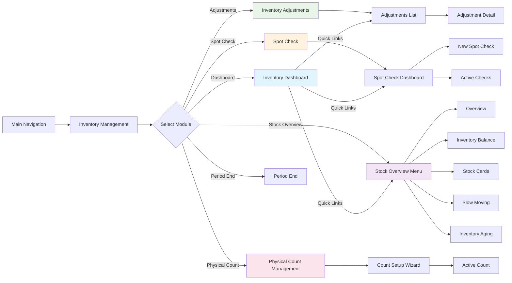
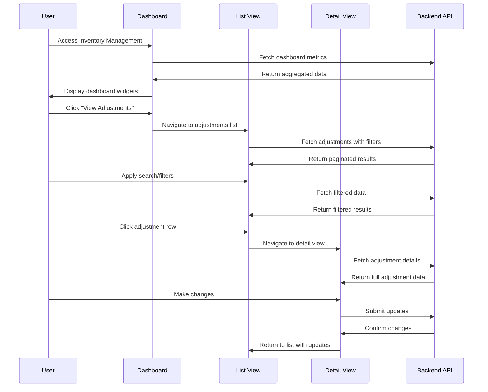
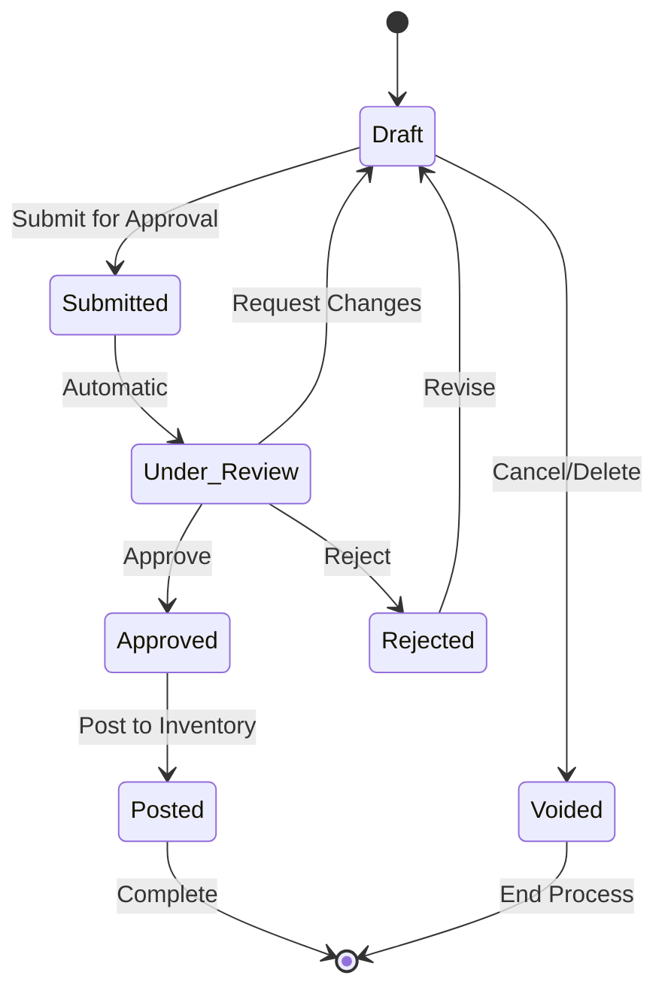
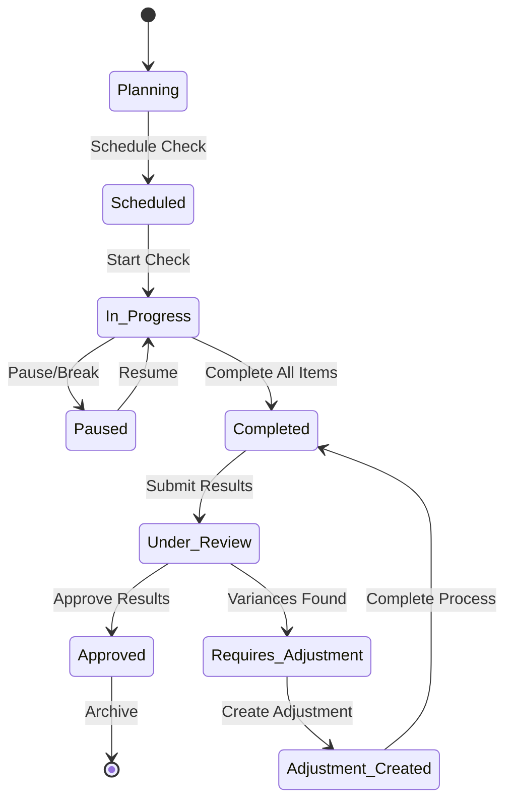
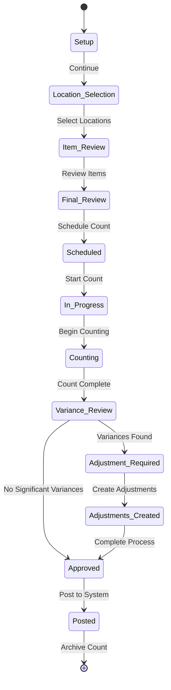

# Inventory Management Module - Sitemap

## Document History

| Version | Date | Author | Changes |
|---------|------|--------|---------|
| 1.0.0 | 2025-11-19 | Documentation Team | Initial version |

```mermaid
graph TD
    IM[Inventory Management] --> IMD[Inventory Dashboard]
    IM --> SO[Stock Overview]
    IM --> IA[Inventory Adjustments]
    IM --> SC[Spot Check]
    IM --> PC[Physical Count]
    IM --> PE[Period End]
    IM --> FI[Fractional Inventory]
    IM --> SI[Stock In]

    %% Inventory Dashboard Components
    IMD --> IMD_WIDGETS[Draggable Widgets]
    IMD_WIDGETS --> IMD_W1[Inventory Levels Chart]
    IMD_WIDGETS --> IMD_W2[Inventory Value Trend]
    IMD_WIDGETS --> IMD_W3[Inventory Turnover]
    IMD_WIDGETS --> IMD_W4[Low Stock Alerts]
    IMD_WIDGETS --> IMD_W5[Upcoming Stock Takes]
    IMD_WIDGETS --> IMD_W6[Recent Transfers]

    %% Stock Overview Module
    SO --> SO_OVERVIEW[Overview Dashboard]
    SO --> IB[Inventory Balance]
    SO --> STOCK_CARDS[Stock Cards]
    SO --> SM[Slow Moving Items]
    SO --> IA_AGING[Inventory Aging]

    %% Inventory Balance Components
    IB --> IB_REPORT[Balance Report Tab]
    IB --> IB_MOVEMENT[Movement History Tab]
    IB --> IB_FILTERS[Advanced Filters]
    IB --> IB_EXPORT[Export Functions]
    IB --> IB_PRINT[Print Functions]
    IB --> IB_LOTS[Lot Tracking Toggle]

    %% Stock Cards Components
    STOCK_CARDS --> SC_LIST[Stock Card List]
    STOCK_CARDS --> SC_DETAIL[Individual Stock Card]
    STOCK_CARDS --> SC_FILTERS[Filtering Options]
    STOCK_CARDS --> SC_SEARCH[Search Functionality]

    %% Inventory Adjustments Module
    IA --> IA_LIST[Adjustments List]
    IA --> IA_DETAIL[Adjustment Detail]
    IA --> IA_NEW[New Adjustment]

    %% Inventory Adjustments List Components
    IA_LIST --> IA_L_SEARCH[Search Adjustments]
    IA_LIST --> IA_L_FILTER[Filter & Sort Options]
    IA_L_FILTER --> IA_L_F_STATUS[Status Filter]
    IA_L_FILTER --> IA_L_F_TYPE[Type Filter]
    IA_L_FILTER --> IA_L_F_LOCATION[Location Filter]
    IA_L_FILTER --> IA_L_F_DATE[Date Range Filter]
    IA_LIST --> IA_L_TABLE[Adjustments Data Table]
    IA_LIST --> IA_L_ACTIONS[Row Actions Menu]

    %% Inventory Adjustment Detail Components
    IA_DETAIL --> IA_D_HEADER[Adjustment Header Info]
    IA_DETAIL --> IA_D_ITEMS[Items Being Adjusted]
    IA_DETAIL --> IA_D_NOTES[Notes and Comments]
    IA_DETAIL --> IA_D_APPROVAL[Approval Workflow]
    IA_DETAIL --> IA_D_HISTORY[Change History]

    %% Spot Check Module
    SC --> SC_DASH[Spot Check Dashboard]
    SC --> SC_NEW[New Spot Check]
    SC --> SC_ACTIVE[Active Spot Checks]
    SC --> SC_COMPLETED[Completed Spot Checks]

    %% Spot Check Dashboard Components
    SC_DASH --> SC_D_SEARCH[Search Spot Checks]
    SC_DASH --> SC_D_FILTERS[Status and Department Filters]
    SC_DASH --> SC_D_CARDS[Spot Check Cards]
    SC_D_CARDS --> SC_D_C_INFO[Location and Status Info]
    SC_D_CARDS --> SC_D_C_PROGRESS[Progress Tracking]
    SC_D_CARDS --> SC_D_C_ACTIONS[Check Actions]

    %% New Spot Check Workflow
    SC_NEW --> SC_N_SETUP[Setup Form]
    SC_N_SETUP --> SC_N_LOCATION[Location Selection]
    SC_N_SETUP --> SC_N_ITEMS[Item Selection]
    SC_N_SETUP --> SC_N_SCHEDULE[Schedule Settings]

    %% Active Spot Check Components
    SC_ACTIVE --> SC_A_LIST[Active Checks List]
    SC_ACTIVE --> SC_A_DETAIL[Check Detail View]
    SC_A_DETAIL --> SC_A_D_ITEMS[Item Counting Interface]
    SC_A_DETAIL --> SC_A_D_VARIANCE[Variance Detection]
    SC_A_DETAIL --> SC_A_D_NOTES[Count Notes]

    %% Physical Count Module
    PC --> PC_MGMT[Physical Count Management]
    PC --> PC_SETUP[Count Setup Wizard]
    PC --> PC_ACTIVE[Active Counts]
    PC --> PC_DASHBOARD[Count Dashboard]

    %% Physical Count Setup Wizard
    PC_SETUP --> PC_S_BASIC[Basic Information]
    PC_SETUP --> PC_S_LOCATION[Location Selection]
    PC_SETUP --> PC_S_ITEMS[Items Review]
    PC_SETUP --> PC_S_REVIEW[Final Review]

    %% Physical Count Basic Info
    PC_S_BASIC --> PC_S_B_COUNTER[Counter Assignment]
    PC_S_BASIC --> PC_S_B_DEPT[Department Selection]
    PC_S_BASIC --> PC_S_B_DATE[Date & Time Setup]
    PC_S_BASIC --> PC_S_B_NOTES[Additional Notes]

    %% Period End Module
    PE --> PE_LIST[Period End List]
    PE --> PE_DETAIL[Period End Detail]
    PE --> PE_PROCESS[End Processing]

    %% Fractional Inventory Module
    FI --> FI_DASH[Fractional Dashboard]
    FI --> FI_ITEMS[Fractional Items]
    FI --> FI_CONVERSION[Unit Conversions]

    %% Stock In Module
    SI --> SI_RECEIPT[Stock Receipt]
    SI --> SI_VALIDATION[Quality Validation]
    SI --> SI_POSTING[Inventory Posting]

    %% Shared Components
    IM --> SHARED[Shared Components]
    SHARED --> STATUS_BADGES[Status Badge System]
    SHARED --> SEARCH_FILTERS[Search & Filter Components]
    SHARED --> DATE_PICKERS[Date Range Pickers]
    SHARED --> EXPORT_TOOLS[Export Utilities]
    SHARED --> PRINT_TOOLS[Print Utilities]
    SHARED --> PROGRESS_BARS[Progress Indicators]
    SHARED --> ACTION_MENUS[Action Dropdown Menus]

    %% Status Badge Types
    STATUS_BADGES --> SB_DRAFT[Draft Status]
    STATUS_BADGES --> SB_POSTED[Posted Status]
    STATUS_BADGES --> SB_VOIDED[Voided Status]
    STATUS_BADGES --> SB_PENDING[Pending Status]
    STATUS_BADGES --> SB_IN_PROGRESS[In Progress Status]
    STATUS_BADGES --> SB_COMPLETED[Completed Status]
    STATUS_BADGES --> SB_IN_OUT[IN/OUT Type Badges]

    %% Navigation Relationships
    IA_LIST -.->|View Details| IA_DETAIL
    SC_DASH -.->|Start Check| SC_ACTIVE
    SC_DASH -.->|New Check| SC_NEW
    PC_SETUP -.->|Complete Setup| PC_ACTIVE
    IMD -.->|Quick Access| IA_LIST
    IMD -.->|Quick Access| SC_DASH
    IMD -.->|Quick Access| SO

    %% Style Classes
    classDef dashboardNode fill:#e1f5fe,stroke:#01579b,stroke-width:2px
    classDef moduleNode fill:#f3e5f5,stroke:#4a148c,stroke-width:2px
    classDef listNode fill:#e8f5e8,stroke:#1b5e20,stroke-width:2px
    classDef detailNode fill:#fff3e0,stroke:#e65100,stroke-width:2px
    classDef processNode fill:#fce4ec,stroke:#880e4f,stroke-width:2px
    classDef sharedNode fill:#f1f8e9,stroke:#33691e,stroke-width:2px

    class IMD,IMD_WIDGETS,IMD_W1,IMD_W2,IMD_W3,IMD_W4,IMD_W5,IMD_W6 dashboardNode
    class SO,IA,SC,PC,PE,FI,SI moduleNode
    class IA_LIST,SC_DASH,PC_MGMT,IB_REPORT,SC_A_LIST,PE_LIST listNode
    class IA_DETAIL,SC_A_DETAIL,PC_S_BASIC,IB_MOVEMENT,FI_DASH detailNode
    class PC_SETUP,SC_NEW,PE_PROCESS,SC_N_SETUP processNode
    class SHARED,STATUS_BADGES,SEARCH_FILTERS,DATE_PICKERS,EXPORT_TOOLS,PRINT_TOOLS,PROGRESS_BARS,ACTION_MENUS sharedNode
```

## Module Navigation Flow

## Data Flow Patterns

## Workflow State Diagrams

### Inventory Adjustment Workflow

### Spot Check Workflow

### Physical Count Workflow
