# Inventory Management Module - Sitemap

```mermaid
graph TD
    A[Inventory Management] --> B[Dashboard]
    A --> C[Stock Overview]
    A --> D[Stock In]
    A --> E[Inventory Adjustments]
    A --> F[Physical Count]
    A --> G[Spot Check]
    A --> H[Fractional Inventory]
    A --> I[Period End]
    A --> J[Physical Count Management]

    C --> C1[Inventory Balance]
    C --> C2[Stock Cards]
    C --> C3[Stock Card Detail]
    C --> C4[Slow Moving]
    C --> C5[Inventory Aging]

    D --> D1[Stock In List]
    D --> D2[Stock In Detail]

    E --> E1[Adjustments List]
    E --> E2[Adjustment Detail]

    F --> F1[Setup]
    F --> F2[Location Selection]
    F --> F3[Item Review]
    F --> F4[Final Review]
    F --> F5[Active Count]
    F --> F6[Physical Count Dashboard]

    G --> G1[Spot Check Main]
    G --> G2[New Spot Check]
    G --> G3[Active Spot Checks]
    G --> G4[Completed Spot Checks]
    G --> G5[Spot Check Dashboard]

    H --> H1[Inventory Dashboard Tab]
    H --> H2[Conversion Tracking Tab]

    I --> I1[Period End List]
    I --> I2[Period End Detail]

    J --> J1[Count Management List]
    J --> J2[Count Detail Form]

    style A fill:#e1f5ff
    style C fill:#fff4e1
    style F fill:#ffe1e1
    style G fill:#e1ffe1
    style H fill:#f0e1ff
```



## Navigation Hierarchy

### Level 1: Main Module
- **Inventory Management** - `/inventory-management`

### Level 2: Main Features

1. **Dashboard** - `/inventory-management`
   - Draggable dashboard widgets
   - Inventory levels chart
   - Inventory value trend
   - Inventory turnover chart
   - Key metrics display

2. **Stock Overview** - `/inventory-management/stock-overview`
   - Multi-location stock visibility
   - Aggregate metrics
   - Performance comparison
   - Transfer suggestions

3. **Stock In** - `/inventory-management/stock-in`
   - Stock receipts listing
   - Receipt details

4. **Inventory Adjustments** - `/inventory-management/inventory-adjustments`
   - Adjustments list
   - Adjustment creation/editing

5. **Physical Count** - `/inventory-management/physical-count`
   - Multi-step count wizard
   - Active count tracking
   - Count dashboard

6. **Spot Check** - `/inventory-management/spot-check`
   - Spot check listing
   - Quick count creation
   - Active/completed tracking

7. **Fractional Inventory** - `/inventory-management/fractional-inventory`
   - Portion-based tracking
   - Conversion operations
   - Quality monitoring

8. **Period End** - `/inventory-management/period-end`
   - Period closing management
   - Historical records

9. **Physical Count Management** - `/inventory-management/physical-count-management`
   - Count scheduling
   - Progress tracking

### Level 3: Sub-pages

#### Stock Overview Sub-pages
- **Inventory Balance** - `/stock-overview/inventory-balance`
- **Stock Cards** - `/stock-overview/stock-cards`
- **Stock Card Detail** - `/stock-overview/stock-card`
- **Slow Moving** - `/stock-overview/slow-moving`
- **Inventory Aging** - `/stock-overview/inventory-aging`

#### Physical Count Sub-pages
- **Active Count** - `/physical-count/active/[id]`
- **Dashboard** - `/physical-count/dashboard`

#### Spot Check Sub-pages
- **New Spot Check** - `/spot-check/new`
- **Active Spot Checks** - `/spot-check/active`
- **Active Count Detail** - `/spot-check/active/[id]`
- **Completed Spot Checks** - `/spot-check/completed`
- **Completed Detail** - `/spot-check/completed/[id]`
- **Dashboard** - `/spot-check/dashboard`

## Route Structure

```
/inventory-management
├── / (Dashboard)
├── /stock-overview
│   ├── / (Overview Dashboard)
│   ├── /inventory-balance
│   ├── /stock-cards
│   ├── /stock-card
│   ├── /slow-moving
│   └── /inventory-aging
├── /stock-in
├── /inventory-adjustments
│   └── /[id]
├── /physical-count
│   ├── / (Wizard)
│   ├── /dashboard
│   └── /active/[id]
├── /spot-check
│   ├── / (Main listing)
│   ├── /new
│   ├── /dashboard
│   ├── /active
│   │   └── /[id]
│   └── /completed
│       └── /[id]
├── /fractional-inventory
├── /period-end
│   └── /[id]
└── /physical-count-management
```

## User Flow Patterns

### Stock Receipt Flow
1. Navigate to Stock In
2. View list of receipts
3. Click receipt → View details
4. Post/process receipt

### Physical Count Flow
1. Navigate to Physical Count
2. Setup → Location Selection → Item Review → Final Review
3. Save draft or submit
4. Track active counts
5. Complete count → View dashboard

### Spot Check Flow
1. Navigate to Spot Check
2. Click "New Spot Check"
3. Select location and items
4. Perform count
5. Submit → Move to completed

### Adjustment Flow
1. Navigate to Inventory Adjustments
2. Create new adjustment
3. Enter details (location, items, reason)
4. Submit → Generate journal entry
