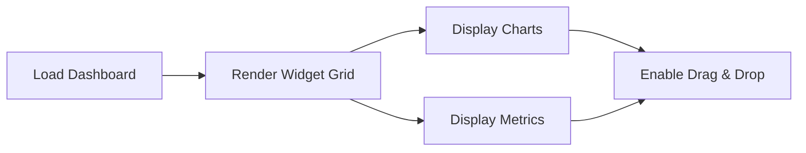
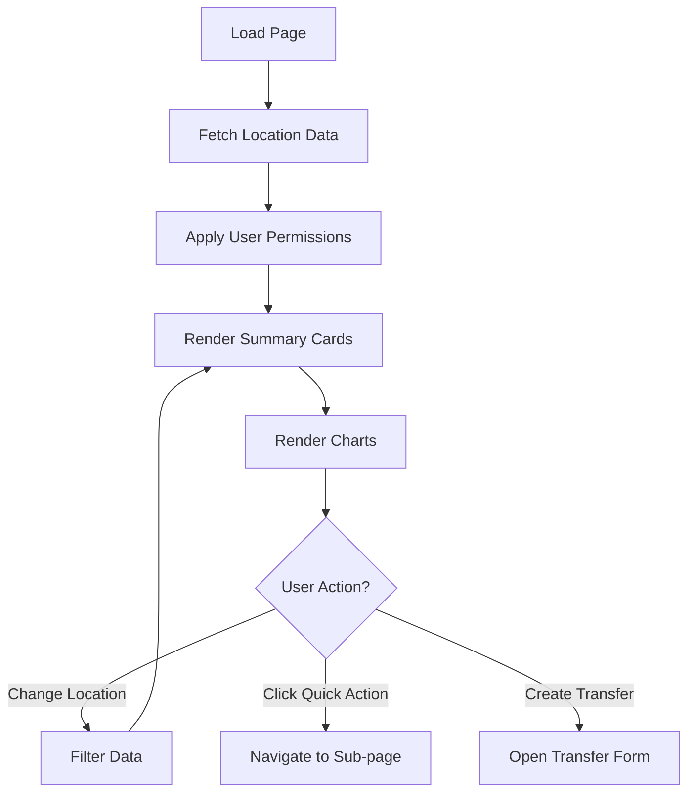
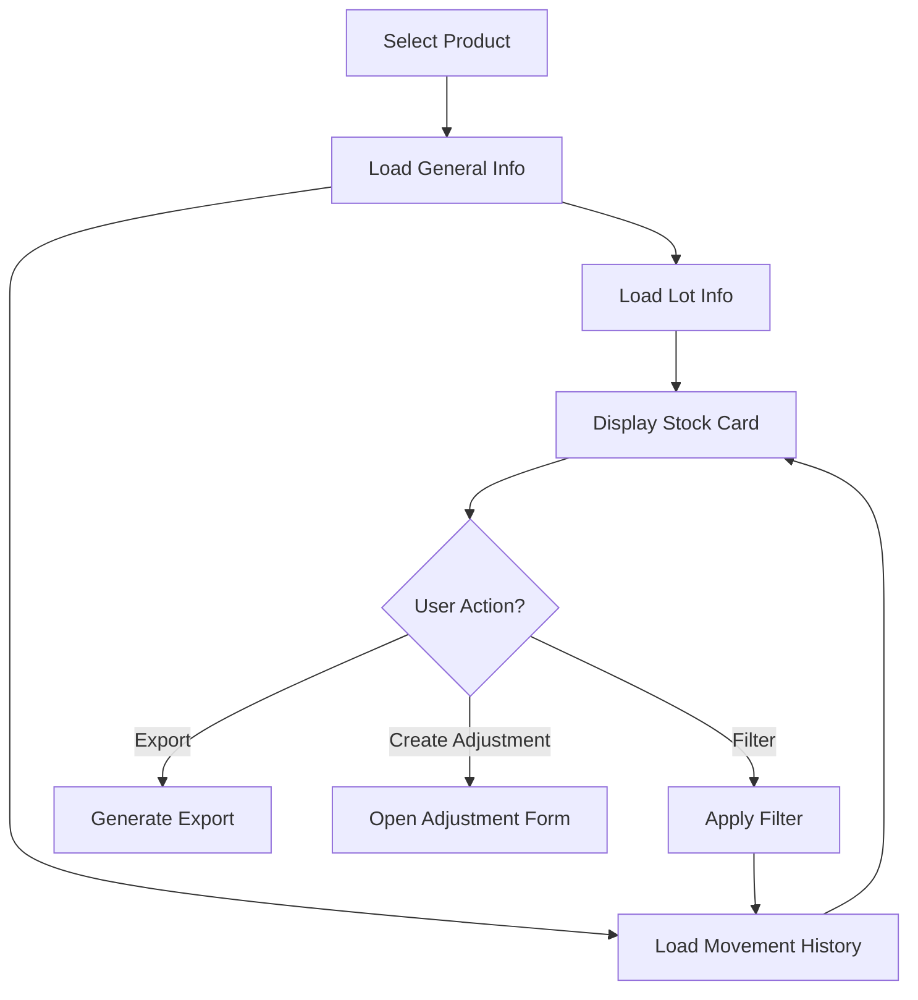
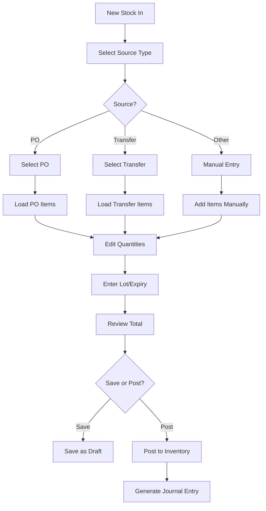
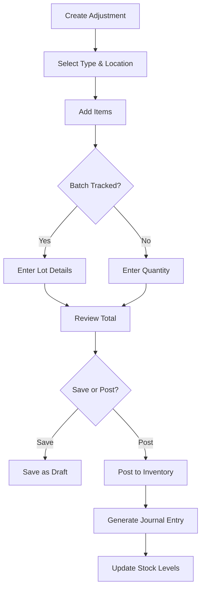
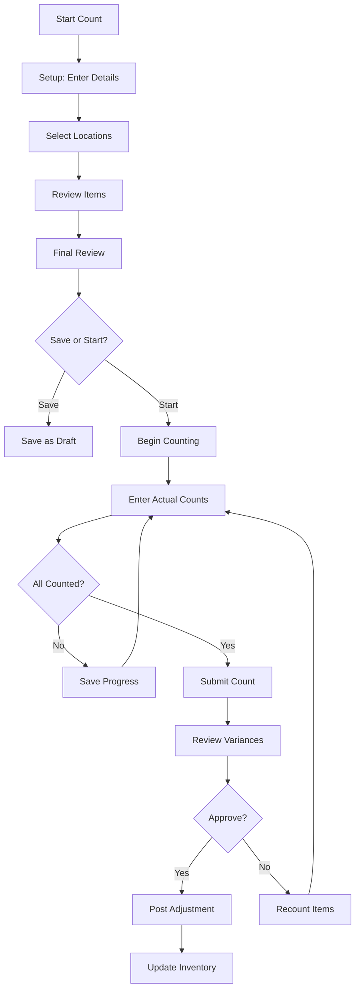
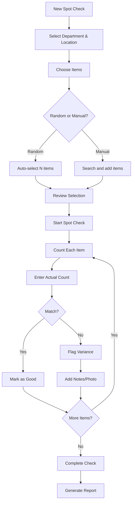
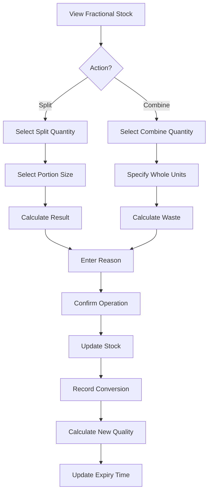
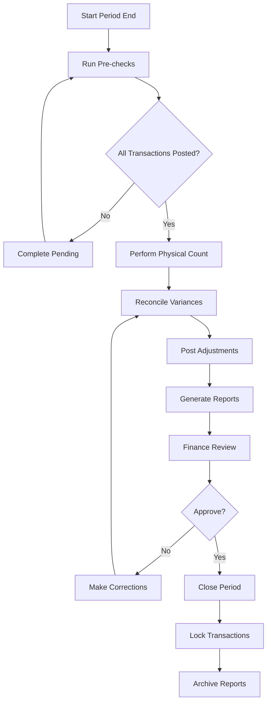

# Inventory Management - Pages and Components Specification

## Table of Contents
1. [Dashboard](#1-dashboard)
2. [Stock Overview](#2-stock-overview)
3. [Stock In](#3-stock-in)
4. [Inventory Adjustments](#4-inventory-adjustments)
5. [Physical Count](#5-physical-count)
6. [Spot Check](#6-spot-check)
7. [Fractional Inventory](#7-fractional-inventory)
8. [Period End](#8-period-end)
9. [Physical Count Management](#9-physical-count-management)
10. [Common Components](#10-common-components)

---

## 1. Dashboard

**Route:** `/inventory-management`

### Purpose
Main dashboard providing overview of inventory management with customizable widgets.

### Components

#### Main Layout
- **Header Section**
  - Page title: "Inventory Management Dashboard"
  - Actions: None

#### Dashboard Grid
- **Layout**: Drag-and-drop enabled grid (3 columns on desktop, 2 on tablet, 1 on mobile)
- **Widget System**: React Beautiful DnD for reordering

### Widgets

#### 1.1 Inventory Levels Widget
**Type:** Bar Chart
**Data Source:** `inventoryLevelsData`
**Fields:**
- Category (X-axis)
- Current Level (Blue bar)
- Reorder Point (Green bar)

**Categories:**
- Food
- Beverages
- Cleaning
- Linen
- Amenities

#### 1.2 Inventory Value Trend Widget
**Type:** Line Chart
**Data Source:** `inventoryValueData`
**Fields:**
- Month (X-axis)
- Value (Y-axis)
- Time Range: 6 months

#### 1.3 Inventory Turnover Widget
**Type:** Pie Chart
**Data Source:** `inventoryTurnoverData`
**Fields:**
- Category Name
- Turnover Rate

#### 1.4 Low Stock Alerts Widget
**Type:** Text Card
**Display:**
- Number of items below reorder point
- Icon: AlertTriangle
- Color: Red accent

#### 1.5 Upcoming Stock Takes Widget
**Type:** Text Card
**Display:**
- Count of scheduled stock takes
- Time frame: Next week
- Icon: Calendar

#### 1.6 Recent Transfers Widget
**Type:** Text Card
**Display:**
- Number of inter-location transfers
- Time frame: Last 24 hours
- Icon: ArrowRightLeft

### Actions
- **Drag and Drop:** Reorder widgets
- **Widget Interaction:** Click widgets to drill down (future enhancement)

### Page Flow


---

## 2. Stock Overview

**Route:** `/inventory-management/stock-overview`

### Purpose
Comprehensive view of stock levels across all locations with performance analytics and transfer suggestions.

### Layout Sections

#### 2.1 Header Section
**Components:**
- Page title: "Stock Overview"
- Subtitle: "Monitor inventory levels across all locations"
- **Location Selector Dropdown**
  - Options: "All Locations" + individual locations
  - Icon: MapPin
  - Updates all metrics when changed

#### 2.2 Summary Cards (4 Cards)

**Card 1: Total Items**
- Icon: Package
- Value: Total item count (formatted number)
- Subtitle: "Across X locations"
- Updates based on location filter

**Card 2: Total Value**
- Icon: TrendingUp
- Value: Currency formatted total value
- Subtitle: "Current inventory value"

**Card 3: Low Stock**
- Icon: AlertTriangle
- Value: Count (red text)
- Subtitle: "Items below reorder point"

**Card 4: Expiring Soon**
- Icon: Clock
- Value: Count (orange text)
- Subtitle: "Items expiring this week"

#### 2.3 Tabbed Content

**Tab 1: Overview**

**Stock Distribution Chart**
- Type: Bar Chart
- X-axis: Category name
- Y-axis: Quantity
- Tooltip: Shows quantity and value
- Responsive container (300px height)

**Value Distribution Chart**
- Type: Pie Chart
- Shows: Category value percentages
- Labels: Category name + percentage
- Colors: Cycling color array (6 colors)

**Quick Actions Grid**
- 4 buttons in grid (2x2 on mobile, 4x1 on desktop)
- Buttons:
  1. Inventory Balance (BarChart3 icon)
  2. Stock Cards (Package icon)
  3. Slow Moving (Clock icon)
  4. Inventory Aging (AlertTriangle icon)

**Tab 2: Performance**

**Location Performance Chart**
- Type: Bar Chart (Grouped)
- Metrics:
  - Stock Efficiency %
  - Turnover Rate
  - Fill Rate %
- Height: 400px

**Performance Details Table**
- Columns:
  - Location name
  - Performance badge (excellent/good/average/poor)
  - Efficiency %
  - Turnover rate
  - Fill rate %
- Card layout with icons

**Tab 3: Transfer Suggestions**

**Suggestion Cards**
- Display:
  - Item name
  - From location → To location
  - Suggested quantity
  - Reason (low_stock/expiring/balancing)
  - Priority badge (high/medium/low)
  - Potential savings (currency)
  - "Create Transfer" button

### Dropdowns and Filters

**Location Dropdown**
- Type: Select component
- Options: All Locations + filtered by user permissions
- Width: 48 (Tailwind unit)

### Actions
- Change location filter
- Navigate to sub-pages (Quick Actions)
- Create transfer from suggestion

### Data Types

```typescript
interface LocationStockData {
  locationId: string
  locationName: string
  categories: CategoryStock[]
  metrics: LocationMetrics
}

interface LocationMetrics {
  totalItems: number
  totalValue: { amount: number, currency: string }
  lowStockCount: number
  expiringCount: number
}

interface TransferSuggestion {
  itemName: string
  fromLocation: string
  toLocation: string
  suggestedQuantity: number
  reason: 'low_stock' | 'expiring' | 'balancing'
  priority: 'high' | 'medium' | 'low'
  potentialSavings: { amount: number, currency: string }
}
```

### Page Flow


---

## 2.1 Inventory Balance

**Route:** `/inventory-management/stock-overview/inventory-balance`

### Purpose
Detailed inventory balance report with lot tracking and movement history.

### Components

#### Header Section
- **Report Title:** "Inventory Balance Report"
- **Filters Panel (Collapsible)**
  - As of Date picker
  - Location range (From/To dropdowns)
  - Category range (From/To dropdowns)
  - Product range (From/To dropdowns)
  - View Type radio buttons: Category / Product / Lot
  - Show Lots checkbox

#### Balance Table
**Type:** Hierarchical grouped table

**Structure:**
```
Location
  └─ Category
      └─ Product
          └─ Lot (if enabled)
```

**Columns:**
- Code
- Description
- Unit
- Quantity
- Average Cost
- Total Value
- Min/Max Thresholds (product level)
- Expiry Date (lot level)

**Features:**
- Expandable/collapsible rows
- Subtotals at each level
- Grand total row
- Sort by any column
- Export to Excel/PDF

#### Movement History Panel
**Trigger:** Click on product row
**Display:** Right-side panel or modal

**Columns:**
- Date
- Transaction Type
- Reference
- Quantity In
- Quantity Out
- Balance
- Notes

### Data Types

```typescript
interface BalanceReportParams {
  asOfDate: string // YYYY-MM-DD
  locationRange: { from: string; to: string }
  categoryRange: { from: string; to: string }
  productRange: { from: string; to: string }
  viewType: 'CATEGORY' | 'PRODUCT' | 'LOT'
  showLots: boolean
}

interface ProductBalance {
  id: string
  code: string
  name: string
  unit: string
  tracking: { batch: boolean }
  thresholds: { minimum: number; maximum: number }
  totals: { quantity: number; averageCost: number; value: number }
  lots: LotBalance[]
}

interface LotBalance {
  lotNumber: string
  expiryDate?: string
  quantity: number
  unitCost: number
  value: number
}
```

### Actions
- Apply filters
- Change view type
- Toggle lot visibility
- View movement history
- Export report
- Print report

---

## 2.2 Stock Cards

**Route:** `/inventory-management/stock-overview/stock-cards`

### Purpose
Browse all stock cards with filtering and quick access.

### Components

#### Header
- Title: "Stock Cards"
- Search box
- Filter button

#### Filter Panel (Collapsible)
- Location dropdown
- Category dropdown
- Product type checkboxes
- Stock status filter (In Stock / Low Stock / Out of Stock)

#### Cards Grid
**Layout:** 3 columns on desktop, 2 on tablet, 1 on mobile

**Card Content:**
- Product image/icon
- Product code
- Product name
- Current quantity + unit
- Status badge
- "View Details" button

### Actions
- Search products
- Filter by criteria
- Click card → Navigate to Stock Card Detail

---

## 2.3 Stock Card Detail

**Route:** `/inventory-management/stock-overview/stock-card`

### Purpose
Detailed view of individual stock card with full movement history and lot information.

### Sections

#### 2.3.1 General Information Panel
**Fields:**
- Product Code
- Product Name
- Category
- Unit of Measure
- Current Stock Level
- Reorder Level
- Maximum Level
- Lead Time (days)
- Last Purchase Date
- Last Purchase Price
- Average Cost

#### 2.3.2 Lot Information Panel (if batch tracked)
**Table Columns:**
- Lot Number
- Receipt Date
- Expiry Date
- Quantity
- Unit Cost
- Total Value
- Status (Good/Damaged/Expired)

#### 2.3.3 Movement History Table
**Columns:**
- Date/Time
- Transaction Type (Receipt/Issue/Adjustment/Transfer In/Transfer Out)
- Reference Number
- Lot Number (if applicable)
- Quantity In
- Quantity Out
- Balance
- Unit Cost
- Value
- Location (for transfers)
- User
- Notes

**Pagination:** 25 items per page

#### 2.3.4 Valuation Panel
**Displays:**
- Valuation Method (FIFO/LIFO/Average)
- Current Total Value
- Average Unit Cost
- Last Purchase Cost
- Cost Variance

### Quick Filters
**Buttons:**
- All Transactions
- Receipts Only
- Issues Only
- Adjustments Only
- Transfers Only
- Date range picker

### Actions
- Filter movements by type
- Filter by date range
- Export to Excel
- Print stock card
- View lot details
- Create adjustment

### Page Flow


---

## 2.4 Slow Moving Items

**Route:** `/inventory-management/stock-overview/slow-moving`

### Purpose
Identify slow-moving inventory for action.

### Components

#### Filter Section
- Time period dropdown (30/60/90/180 days)
- Category filter
- Location filter
- Minimum value filter

#### Slow Moving Table
**Columns:**
- Product Code
- Product Name
- Category
- Location
- Current Quantity
- Last Movement Date
- Days Since Movement
- Current Value
- Turnover Rate
- Recommended Action

**Actions Column:**
- Mark for clearance
- Create transfer
- Adjust reorder level

### Features
- Sort by days since movement
- Color coding (yellow > 60 days, red > 90 days)
- Export to Excel

---

## 2.5 Inventory Aging

**Route:** `/inventory-management/stock-overview/inventory-aging`

### Purpose
Track inventory age and identify expiring items.

### Components

#### Aging Buckets Table
**Columns:**
- Product Code/Name
- Location
- Total Quantity
- 0-30 days qty
- 31-60 days qty
- 61-90 days qty
- 90+ days qty
- Expiring Soon (< 7 days)
- Total Value

#### Aging Summary Cards
- Total Expiring in 7 days (red)
- Total Expiring in 30 days (orange)
- Average Age (days)
- Total Aged Stock Value

### Actions
- Filter by location
- Filter by aging bucket
- Export report
- Create disposal request

---

## 3. Stock In

**Route:** `/inventory-management/stock-in`

### Purpose
Manage stock receipts from purchase orders and other sources.

### Components

#### 3.1 Stock In List
**Type:** Data table with filters

**Filter Bar:**
- Date range picker
- Status filter (All/Pending/Completed)
- Location filter
- Search by reference

**Table Columns:**
- Receipt Number
- Receipt Date
- Source (PO/Transfer/Production)
- Source Reference
- Location
- Total Items
- Total Quantity
- Total Value
- Status
- Actions (View/Edit/Post)

**Status Badge Colors:**
- Pending: Yellow
- Completed: Green
- Posted: Blue

#### 3.2 Stock In Detail

**Sections:**

**Header Information**
- Receipt Number (auto-generated)
- Receipt Date
- Location dropdown
- Source type selector (Purchase Order/Transfer/Production/Other)
- Source reference field
- Supplier (if from PO)
- Notes textarea

**Items Table**
- Columns:
  - Item Code/Name
  - Description
  - Ordered Qty (from source)
  - Received Qty (editable)
  - Unit
  - Unit Cost
  - Total Cost
  - Lot Number (if batch tracked)
  - Expiry Date (if applicable)
  - Actions (Remove)

**Actions:**
- Add item button
- Item lookup modal

**Footer:**
- Total items count
- Total quantity
- Total value
- Save draft button
- Post receipt button (final)

### Stock In Journal Entry
**Auto-generated when posted:**
```
Debit: Inventory Account
Credit: GRN Clearing Account (if from PO)
       or Source Location (if transfer)
```

### Actions
- Create new stock in
- Edit draft receipt
- Post receipt → Update inventory
- View posted receipt
- Print receipt
- Cancel receipt

### Page Flow


---

## 4. Inventory Adjustments

**Route:** `/inventory-management/inventory-adjustments`

### Purpose
Record inventory adjustments with reasons and automatic journal entry generation.

### Components

#### 4.1 Adjustments List

**Filter Bar:**
- Date range picker
- Status filter (Draft/Posted)
- Adjustment type filter (Positive/Negative/Transfer)
- Location filter
- Department filter

**Table Columns:**
- Adjustment ID
- Date
- Type badge (In/Out)
- Status
- Location
- Department
- Reason
- Items count
- Total value
- Actions (View/Edit/Post/Delete)

#### 4.2 Adjustment Detail Page

**Route:** `/inventory-management/inventory-adjustments/[id]`

**Header Section:**
- Adjustment ID (auto-generated)
- Status badge
- Action buttons (Edit/Post/Delete)

**Information Panel:**
- Date picker
- Adjustment type dropdown:
  - Positive Adjustment (Stock In)
  - Negative Adjustment (Stock Out)
  - Transfer
  - Write-off
  - Found Stock
  - Damage
  - Theft
  - Expiry
- Location dropdown
- Department dropdown
- Reason dropdown (predefined + custom)
- Description textarea
- Reference field

**Stock Movement Table**
- Columns:
  - Product Code/Name
  - SKU
  - Location
  - Lot Numbers (expandable)
  - Quantity
  - UOM
  - Unit Cost
  - Total Cost
  - Actions (Remove)

**Lot Details (per item if batch tracked):**
- Lot Number
- Quantity
- Unit

**Summary Panel:**
- Total In Quantity
- Total Out Quantity
- Total Cost (currency formatted)

#### 4.3 Right Panel

**Tabs:**

**Tab 1: Journal Entries**

**Journal Header:**
- Status
- Journal Number
- Posting Date
- Posting Period
- Description
- Reference
- Created by/at
- Posted by/at

**Journal Table:**
- Account Code
- Account Name
- Debit amount
- Credit amount
- Department
- Reference

**Tab 2: Stock Movement Details**
- Same as main table but read-only
- Shows complete transaction details

### Actions
- Create new adjustment
- Add items to adjustment
- Edit quantities/lots
- Save as draft
- Post adjustment
- View journal entry
- Print adjustment voucher
- Delete draft adjustment

### Adjustment Flow


### Journal Entry Auto-Generation

**Positive Adjustment:**
```
Debit: Inventory Account (Location/Category)
Credit: Inventory Adjustment Income
```

**Negative Adjustment:**
```
Debit: Cost of Goods Sold / Adjustment Expense
Credit: Inventory Account (Location/Category)
```

---

## 5. Physical Count

**Route:** `/inventory-management/physical-count`

### Purpose
Comprehensive physical count process with multi-step wizard for full location counts.

### 5.1 Physical Count Wizard

**Multi-step Process:**

#### Step 1: Setup
**Component:** `PhysicalCountSetup`

**Fields:**
- Counter Name (auto-filled from user)
- Department dropdown
- Date & Time picker
- Count Type (Full/Partial)
- Notes textarea

**Validation:**
- Department required
- Date cannot be future

#### Step 2: Location Selection
**Component:** `LocationSelection`

**Display:**
- Checkbox tree of all locations
- Location hierarchy:
  - Building → Floor → Room → Sub-location
- Select all/none buttons
- Search locations

**Features:**
- Parent selection selects all children
- Show item count per location
- Disable locations with active counts

#### Step 3: Item Review
**Component:** `ItemReview`

**Display:**
- Items table based on selected locations
- Columns:
  - Item Code
  - Item Name
  - Category
  - Location
  - Expected Quantity
  - Unit
  - Last Count Date
  - Checkbox (to exclude)

**Features:**
- Auto-populated from inventory
- Exclude items checkbox
- Filter by category
- Sort by any column
- Total items count

#### Step 4: Final Review
**Component:** `FinalReview`

**Display:**
- Summary of selections:
  - Counter name
  - Department
  - Date/Time
  - Locations count
  - Items count
  - Estimated duration
- Full list review
- Edit buttons to go back to any step

**Actions:**
- Back to edit
- Save as draft
- Start count

### 5.2 Active Count

**Route:** `/inventory-management/physical-count/active/[id]`

**Display:**
- Count reference at top
- Progress indicator (X/Y items counted)
- Filter by location
- Search items

**Item Entry Table:**
- Item Code/Name
- Expected Quantity
- Actual Count (input field)
- Variance (auto-calculated)
- Variance %
- Status indicator (good/variance)
- Notes field
- Checkbox "Counted"

**Features:**
- Save progress frequently (auto-save)
- Mark items as counted
- Flag discrepancies
- Add notes per item
- Barcode scanning support (future)

**Actions:**
- Save progress
- Submit count (when all items counted)
- Cancel count

### 5.3 Physical Count Dashboard

**Route:** `/inventory-management/physical-count/dashboard`

**Displays:**

**Summary Cards:**
- Active Counts
- Completed Today
- Pending Review
- Average Variance %

**Counts Table:**
- Count ID
- Date
- Location(s)
- Items Count
- Completed Items
- Progress %
- Status
- Variance %
- Actions (Resume/Review/Export)

**Charts:**
- Count completion trend (line chart)
- Variance by location (bar chart)
- Variance by category (pie chart)

### Physical Count Flow


---

## 6. Spot Check

**Route:** `/inventory-management/spot-check`

### Purpose
Quick random spot checks of specific items for accuracy verification.

### 6.1 Spot Check Main Page

**Views:** List or Grid toggle

**Filter Bar:**
- Search box
- Status dropdown (All/Pending/In Progress/Completed)
- Department dropdown
- Location filter button (toggles panel)

**Location Filter Panel (Collapsible):**
- Location dropdown
- Active filter tag with X to clear

#### List View
**Component:** `CountListItem`

**Displays per item:**
- Store Name
- Department badge
- Counter name
- Date
- Status badge
- Item count (e.g., "10 items")
- Last count date
- Variance % (if completed)
- Progress (e.g., "5/10 completed")
- Notes preview
- Actions: Start Count / Delete

#### Grid View
**Component:** `CountDetailCard`

**Card displays:**
- Count ID
- Counter name
- Department
- Store
- Date
- Selected items count
- Action buttons: Start Count / Delete

### 6.2 New Spot Check

**Route:** `/inventory-management/spot-check/new`

**Multi-step form:**

#### Step 1: Setup
**Component:** `Setup`

**Fields:**
- Department dropdown
- Store/Location dropdown
- Date/Time picker
- Notes

#### Step 2: Item Selection
**Component:** `ItemSelection`

**Features:**
- Random item picker (click to auto-select X items)
- Manual item search and add
- Selected items list
- Remove items

**Selected Items Table:**
- Item Code
- Item Name
- Expected Qty
- Unit
- Remove button

#### Step 3: Review
**Component:** `Review`

**Display:**
- Summary of setup
- List of selected items
- Total items count

**Actions:**
- Back to edit
- Save as draft
- Start spot check

### 6.3 Active Spot Check

**Route:** `/inventory-management/spot-check/active/[id]`

**Component:** `CountItems`

**Display:**
- Spot check reference
- Progress (X/Y items)
- Item entry form:
  - Item name/code
  - Expected quantity
  - Actual count input
  - Variance (auto-calculated)
  - Status dropdown (Good/Damaged/Missing/Expired)
  - Notes
  - Checkbox "Submit item"

**Features:**
- One item at a time or table view
- Submit per item
- Flag issues immediately
- Photo upload for discrepancies

**Actions:**
- Submit item count
- Complete spot check
- Cancel

### 6.4 Completed Spot Checks

**Route:** `/inventory-management/spot-check/completed`

**Display:** Similar to main page but filtered to completed status

**Additional columns:**
- Variance %
- Completion date
- Actions: View Details / Export

### 6.5 Spot Check Dashboard

**Route:** `/inventory-management/spot-check/dashboard`

**Summary Cards:**
- Total Spot Checks This Week
- Average Accuracy %
- Items Flagged
- Pending Actions

**Charts:**
- Accuracy trend (line)
- Variance by location (bar)
- Issue types distribution (pie)

**Recent Spot Checks Table:**
- Date
- Location
- Items
- Accuracy %
- Issues found
- Status

### Spot Check Flow


---

## 7. Fractional Inventory

**Route:** `/inventory-management/fractional-inventory`

### Purpose
Manage portion-based inventory for items that can be split or combined (e.g., pizzas into slices).

### Layout

**Tabs:**
1. Inventory Dashboard
2. Conversion Tracking

### 7.1 Inventory Dashboard Tab
**Component:** `FractionalInventoryDashboard`

**Summary Cards:**
- Total Fractional Items
- Active Portions
- Pending Conversions
- Waste Generated Today

**Fractional Stock Table:**
- Item Code/Name
- Current State (WHOLE/PARTIAL/PREPARED)
- Whole Units Available
- Partial Quantity Available
- Total Portions Available
- Reserved Portions
- Quality Grade (EXCELLENT/GOOD/FAIR/POOR)
- Expires At (countdown)
- Actions:
  - Split (convert whole to portions)
  - Combine (combine portions to whole)
  - View Details

**Filters:**
- Location
- State (Whole/Partial/Prepared)
- Quality Grade
- Expiring Soon (< 4 hours)

### 7.2 Conversion Operations Modal
**Component:** `ConversionOperationsModal`

**Triggered by:** Click Split or Combine action

**Split Operation Form:**
- Stock ID (read-only)
- Item Name (read-only)
- Available Whole Units (read-only)
- Split Quantity (input)
- Target Portion Size (dropdown):
  - e.g., "Slice (8 per whole)"
  - "Half (2 per whole)"
- Resulting Portions (calculated)
- Conversion Cost (calculated)
- Reason (dropdown: Sales Preparation / Buffet Service / Portion Control / Other)
- Notes

**Combine Operation Form:**
- Stock ID (read-only)
- Item Name (read-only)
- Available Portions (read-only)
- Combine Quantity (input - in portions)
- Target: Whole Unit
- Waste % (calculated)
- Reason (dropdown: Consolidation / Quality Control / Inventory Optimization / Other)
- Notes

**Actions:**
- Cancel
- Confirm Conversion

### 7.3 Conversion Tracking Tab
**Component:** `ConversionTrackingPanel`

**Displays:**

**Recent Conversions Table:**
- Date/Time
- Item Name
- Operation Type (Split/Combine)
- From State → To State
- Quantity Converted
- Resulting Units/Portions
- Waste Generated
- Performed By
- Reason
- Notes

**Filters:**
- Date range
- Operation type
- Item
- Performed by

**Charts:**
- Conversions over time (line)
- Waste by item (bar)
- Operation type distribution (pie)

### Data Types

```typescript
interface FractionalItem {
  id: string
  itemCode: string
  itemName: string
  category: string
  baseUnit: string // "Whole Pizza"
  supportsFractional: boolean
  allowPartialSales: boolean
  trackPortions: boolean
  availablePortions: PortionSize[]
  defaultPortionId: string
  shelfLifeHours: number
  maxQualityHours: number
  allowAutoConversion: boolean
  wastePercentage: number
  baseCostPerUnit: number
  conversionCostPerUnit: number
}

interface PortionSize {
  id: string
  name: string // "Slice"
  portionsPerWhole: number // 8
  isActive: boolean
}

interface FractionalStock {
  id: string
  itemId: string
  locationId: string
  currentState: 'WHOLE' | 'PARTIAL' | 'PREPARED'
  stateTransitionDate: string
  qualityGrade: 'EXCELLENT' | 'GOOD' | 'FAIR' | 'POOR'
  wholeUnitsAvailable: number
  partialQuantityAvailable: number
  totalPortionsAvailable: number
  reservedPortions: number
  originalWholeUnits: number
  originalTotalPortions: number
  conversionsApplied: ConversionRecord[]
  totalWasteGenerated: number
  preparedAt: string
  expiresAt: string
}

interface ConversionRecord {
  id: string
  timestamp: string
  operationType: 'SPLIT' | 'COMBINE'
  fromState: string
  toState: string
  quantityBefore: number
  quantityAfter: number
  portionsCreated?: number
  wasteGenerated: number
  performedBy: string
  reason: string
  notes: string
}
```

### Fractional Inventory Flow


---

## 8. Period End

**Route:** `/inventory-management/period-end`

### Purpose
Manage month-end inventory closing procedures.

### Components

#### Header Section
- Title: "Period End"
- Subtitle: "Manage your inventory period end closings"
- Date picker (to select period)
- "Start New Period" button

#### Period End Records Table

**Columns:**
- Period ID (e.g., "PE-2024-01")
- Period (e.g., "January 2024")
- Start Date
- End Date
- Status badge (Open/In Progress/Closed)
- Completed By
- Completed At
- Notes

**Row Actions:**
- Click row → Navigate to period detail

**Status Badges:**
- Open: Blue
- In Progress: Yellow
- Closed: Green

### 8.1 Period End Detail

**Route:** `/inventory-management/period-end/[id]`

**Sections:**

**Header:**
- Period ID
- Status badge
- Close Period button (if in progress)

**Summary Panel:**
- Period range
- Opening stock value
- Closing stock value
- Variance
- Physical count status
- Adjustment count
- Status

**Checklist:**
- [ ] All stock receipts posted
- [ ] All stock issues posted
- [ ] Physical count completed
- [ ] Variances reconciled
- [ ] Adjustments posted
- [ ] Reports generated
- [ ] Finance reviewed

**Reports Section:**
- Inventory valuation report
- Movement summary
- Variance analysis
- Period-end snapshot

### Period End Flow


---

## 9. Physical Count Management

**Route:** `/inventory-management/physical-count-management`

### Purpose
Schedule and manage physical counts across multiple locations.

### Components

**Header:**
- Title: "Physical Count Management"
- "New Count" button

#### Scheduled Counts List

**Filter Bar:**
- Status filter
- Location filter
- Date range

**Cards/List Items:**
**Component:** `CountListItem`

**Display:**
- Store Name
- Department
- Counter assigned
- Scheduled Date
- Status (Scheduled/In Progress/Completed)
- Item count
- Completed count (progress)
- Variance %
- Actions: Start / Edit / Delete

#### Count Detail Form
**Component:** `CountDetailForm`

**For creating/editing counts:**

**Fields:**
- Location dropdown
- Counter assignment
- Scheduled date/time
- Count type (Full/Partial/Spot)
- Items selection (if partial)
- Notes
- Recurrence (One-time / Weekly / Monthly)

**Actions:**
- Save
- Schedule
- Cancel

### Count Progress Tracking
**Component:** `CountProgress`

**Display:**
- Overall progress %
- Items counted / Total items
- Variance summary
- Issues flagged
- Estimated completion time

---

## 10. Common Components

### 10.1 Grouped Table
**Component:** `GroupedTable`
**Location:** `components/inventory/GroupedTable.tsx`

**Purpose:** Hierarchical data display with expand/collapse

**Features:**
- Multiple grouping levels
- Subtotals per group
- Expand all / Collapse all
- Custom row rendering
- Sort within groups

**Props:**
```typescript
interface GroupedTableProps {
  data: any[]
  groupBy: string[]
  columns: ColumnDef[]
  renderSubtotal?: (group: any) => ReactNode
  expandAll?: boolean
}
```

### 10.2 Export Button
**Component:** `ExportButton`
**Location:** `components/inventory/ExportButton.tsx`

**Purpose:** Export data to various formats

**Formats:**
- Excel (.xlsx)
- PDF
- CSV

**Props:**
```typescript
interface ExportButtonProps {
  data: any[]
  filename: string
  format: 'excel' | 'pdf' | 'csv'
  columns?: string[]
}
```

### 10.3 Step Indicator
**Component:** `StepIndicator`
**Location:** `components/ui/step-indicator.tsx`

**Purpose:** Show progress in multi-step wizards

**Display:**
- Step number circles
- Step titles
- Step descriptions
- Progress line
- Current step highlight

**Props:**
```typescript
interface StepIndicatorProps {
  steps: Array<{
    title: string
    description: string
  }>
  currentStep: number
}
```

### 10.4 Count Detail Form
**Component:** `CountDetailForm`
**Used in:** Spot Check, Physical Count Management

**Purpose:** Reusable form for entering count details

**Fields:**
- Items table with actual count inputs
- Location name (display)
- User name (display)
- Date (display)
- Reference (display)
- Item entry fields:
  - Expected quantity
  - Actual count
  - Variance (calculated)
  - Status
  - Notes

**Actions:**
- Close modal
- Submit counts

### 10.5 Count List Item
**Component:** `CountListItem`
**Used in:** Spot Check, Physical Count Management

**Purpose:** Display count summary in list view

**Shows:**
- Location/Store name
- Department
- User
- Date
- Status badge
- Item count
- Progress
- Variance
- Notes preview

**Actions:**
- Start count
- Delete

### 10.6 Count Detail Card
**Component:** `CountDetailCard`
**Used in:** Spot Check grid view

**Purpose:** Card display of count

**Shows:**
- Count ID
- Counter
- Department
- Store
- Date
- Selected items count

**Actions:**
- Start count
- Delete

### 10.7 Stock In Journal Entry
**Component:** `stock-in-jv-entry.tsx`

**Purpose:** Display auto-generated journal entries for stock receipts

**Shows:**
- Journal header
- Entry lines (debit/credit)
- Account codes
- Amounts
- Department allocation

---

## Modal Components

### Location Selection Modal
**Used in:** Physical Count, Spot Check

**Features:**
- Hierarchical location tree
- Multi-select checkboxes
- Search locations
- Filter by type

### Item Lookup Modal
**Used in:** Stock In, Adjustments, Counts

**Features:**
- Search items
- Filter by category
- Show stock levels
- Multi-select
- Add to document

### Lot Entry Modal
**Used in:** Stock In, Adjustments

**For batch-tracked items:**
- Lot number input
- Expiry date picker
- Quantity allocation
- Multiple lots per item

---

## Common Dropdown Fields

### Department Dropdown
**Options:** From centralized mock data
**Used in:** Most forms

### Location Dropdown
**Options:** Filtered by user permissions
**Hierarchy:** Building > Floor > Room > Storage
**Used in:** All inventory transactions

### Reason Dropdown (Adjustments)
**Options:**
- Physical count variance
- Damage
- Theft
- Expiry
- Found stock
- Transfer
- Production
- Quality control
- System correction
- Other (with notes field)

### Status Filters
**Common statuses across modules:**
- Draft
- Pending
- In Progress
- Completed
- Posted
- Cancelled

---

## Common Actions

### Save as Draft
- Saves form data
- Does not update inventory
- Can be edited later
- No journal entry created

### Post / Submit
- Finalizes transaction
- Updates inventory levels
- Generates journal entry
- Locks transaction
- Sends notifications

### Cancel
- Discards changes
- Confirms with user
- Returns to list view

### Export
- Generates file in selected format
- Downloads to user device
- Options: Excel, PDF, CSV

### Print
- Opens print dialog
- Formatted for paper
- Includes company header/footer

---

## Validation Rules

### Common Validations
- Required fields marked with *
- Date validations (no future dates for receipts)
- Quantity > 0
- Cost >= 0
- Location permissions check
- Batch/lot required if item is batch-tracked
- Expiry date required for perishables

### Permissions
- View: Can see data
- Create: Can create new records
- Edit: Can modify drafts
- Post: Can finalize transactions
- Delete: Can remove drafts
- Void: Can cancel posted transactions

---

## Screen Responsiveness

### Breakpoints
- Mobile: < 640px
- Tablet: 640px - 1024px
- Desktop: > 1024px

### Mobile Adaptations
- Tables convert to cards
- Multi-column grids become single column
- Filters collapse to dropdown
- Actions move to slide-out menu
- Charts resize responsively

### Tablet Adaptations
- 2-column grids
- Horizontal scrolling tables
- Bottom sheet for filters
- Collapsible sidebars

---

## Error States

### Common Error Patterns
- Empty state with illustration
- Error message with retry button
- Validation errors inline
- Toast notifications for actions
- Modal confirmations for destructive actions

### Empty States
- "No records found"
- "Start by creating your first..."
- Helpful tips/documentation links
- Create new button prominent

---

This comprehensive specification covers all major pages, components, modals, flows, and features of the Inventory Management module. Each section can be used as a reference for development, testing, or documentation purposes.
