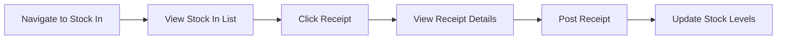
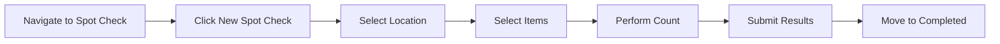
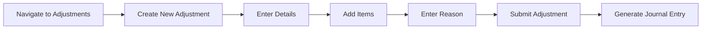
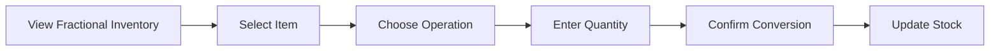

# Inventory Management Module - Sitemap

## Visual Sitemap

```mermaid
graph TD
    A[Inventory Management] --> B[Dashboard]
    A --> C[Stock Overview]
    A --> D[Stock In]
    A --> E[Inventory Adjustments]
    A --> F[Physical Count]
    A --> G[Spot Check]
    A --> H[Fractional Inventory]
    A --> I[Period End]
    A --> J[Physical Count Management]

    C --> C1[Inventory Balance]
    C --> C2[Stock Cards]
    C --> C3[Stock Card Detail]
    C --> C4[Slow Moving]
    C --> C5[Inventory Aging]

    D --> D1[Stock In List]
    D --> D2[Stock In Detail]

    E --> E1[Adjustments List]
    E --> E2[Adjustment Detail]

    F --> F1[Setup]
    F --> F2[Location Selection]
    F --> F3[Item Review]
    F --> F4[Final Review]
    F --> F5[Active Count]
    F --> F6[Physical Count Dashboard]

    G --> G1[Spot Check Main]
    G --> G2[New Spot Check]
    G --> G3[Active Spot Checks]
    G --> G4[Completed Spot Checks]
    G --> G5[Spot Check Dashboard]

    H --> H1[Inventory Dashboard Tab]
    H --> H2[Conversion Tracking Tab]

    I --> I1[Period End List]
    I --> I2[Period End Detail]

    J --> J1[Count Management List]
    J --> J2[Count Detail Form]

    style A fill:#e1f5ff
    style C fill:#fff4e1
    style F fill:#ffe1e1
    style G fill:#e1ffe1
    style H fill:#f0e1ff
```



## Navigation Hierarchy

### Level 1: Main Module
- **Inventory Management** - Root entry point for all inventory operations

### Level 2: Main Features

1. **Dashboard**
   - Path: `/inventory-management`
   - Draggable dashboard widgets
   - Inventory levels chart
   - Inventory value trend
   - Inventory turnover chart
   - Key metrics display

2. **Stock Overview**
   - Path: `/inventory-management/stock-overview`
   - Multi-location stock visibility
   - Aggregate metrics
   - Performance comparison
   - Transfer suggestions

3. **Stock In**
   - Path: `/inventory-management/stock-in`
   - Stock receipts listing
   - Receipt details

4. **Inventory Adjustments**
   - Path: `/inventory-management/inventory-adjustments`
   - Adjustments list
   - Adjustment creation/editing

5. **Physical Count**
   - Path: `/inventory-management/physical-count`
   - Multi-step count wizard
   - Active count tracking
   - Count dashboard

6. **Spot Check**
   - Path: `/inventory-management/spot-check`
   - Spot check listing
   - Quick count creation
   - Active/completed tracking

7. **Fractional Inventory**
   - Path: `/inventory-management/fractional-inventory`
   - Portion-based tracking
   - Conversion operations
   - Quality monitoring

8. **Period End**
   - Path: `/inventory-management/period-end`
   - Period closing management
   - Historical records

9. **Physical Count Management**
   - Path: `/inventory-management/physical-count-management`
   - Count scheduling
   - Progress tracking

### Level 3: Sub-pages

#### Stock Overview Sub-pages
- **Inventory Balance** - `/stock-overview/inventory-balance`
  - Comprehensive stock balance report
  - Multiple view modes: Product, Category, Lot
  - Advanced filtering and sorting
  - Export and print functionality

- **Stock Cards** - `/stock-overview/stock-cards`
  - Individual product stock cards
  - Movement history
  - Valuation details

- **Stock Card Detail** - `/stock-overview/stock-card`
  - Detailed stock card for single item
  - Transaction history
  - Location breakdown

- **Slow Moving** - `/stock-overview/slow-moving`
  - Slow moving inventory analysis
  - Turnover rate metrics
  - Age-based categorization

- **Inventory Aging** - `/stock-overview/inventory-aging`
  - Age-based inventory analysis
  - Expiry tracking
  - Freshness metrics

#### Physical Count Sub-pages
- **Active Count** - `/physical-count/active/ID`
  - Live count interface
  - Item-by-item counting
  - Real-time variance detection

- **Dashboard** - `/physical-count/dashboard`
  - Count progress overview
  - Team performance metrics
  - Variance summary

#### Spot Check Sub-pages
- **New Spot Check** - `/spot-check/new`
  - Quick spot check creation
  - Item selection
  - Location assignment

- **Active Spot Checks** - `/spot-check/active`
  - List of ongoing spot checks
  - Progress tracking

- **Active Count Detail** - `/spot-check/active/ID`
  - Individual active spot check
  - Real-time counting interface

- **Completed Spot Checks** - `/spot-check/completed`
  - Historical spot check records
  - Variance reports

- **Completed Detail** - `/spot-check/completed/ID`
  - Completed spot check details
  - Final variance analysis

- **Dashboard** - `/spot-check/dashboard`
  - Spot check analytics
  - Performance metrics
  - Variance trends

## Route Structure

```
/inventory-management
├── / (Dashboard)
├── /stock-overview
│   ├── / (Overview Dashboard)
│   ├── /inventory-balance
│   ├── /stock-cards
│   ├── /stock-card
│   ├── /slow-moving
│   └── /inventory-aging
├── /stock-in
├── /inventory-adjustments
│   └── /ID
├── /physical-count
│   ├── / (Wizard)
│   ├── /dashboard
│   └── /active/ID
├── /spot-check
│   ├── / (Main listing)
│   ├── /new
│   ├── /dashboard
│   ├── /active
│   │   └── /ID
│   └── /completed
│       └── /ID
├── /fractional-inventory
├── /period-end
│   └── /ID
└── /physical-count-management
```

## User Flow Patterns

### Stock Receipt Flow


### Physical Count Flow

```mermaid
flowchart LR
    Start[Navigate to Physical Count] --> Setup[Setup Count]
    Setup --> Location[Select Locations]
    Location --> Items[Review Items]
    Items --> Final[Final Review]
    Final --> Submit[Submit Count]
    Submit --> Active[Track Active Count]
    Active --> Complete[Complete Count]
    Complete --> Dashboard[View Dashboard]
```


### Spot Check Flow


### Adjustment Flow


### Fractional Conversion Flow


## Integration Points

### Procurement Module
- Stock In receives from Purchase Orders
- GRN integration for receipt posting
- Vendor information linked

### Finance Module
- Journal entries for adjustments
- Valuation calculations (FIFO/LIFO/WAC)
- Cost tracking

### Production Module
- Recipe ingredient consumption
- Fractional inventory conversion
- Waste tracking

### Location Management
- Multi-location stock tracking
- Transfer suggestions
- Location-based permissions

## Permission Model

### Stock Clerk
- View stock levels
- Create spot checks
- Perform counts

### Inventory Manager
- All Stock Clerk permissions
- Create adjustments
- Post receipts
- Manage physical counts

### Finance Manager
- View all inventory data
- Approve adjustments
- View journal entries
- Period end operations

### System Administrator
- All permissions
- Configure locations
- Manage count templates
- System settings
