# [Module Name] - Pages and Components Specification

## Table of Contents

1. [Pages Overview](#pages-overview)
2. [Modals and Dialogs](#modals-and-dialogs)
3. [Dropdown Fields Reference](#dropdown-fields-reference)
4. [Actions and Buttons Reference](#actions-and-buttons-reference)
5. [Form Components](#form-components)
6. [Data Display Components](#data-display-components)
7. [Glossary](#glossary)

---

## Pages Overview

### Landing Page
**Path**: `/[module-route]`
**File**: `app/(main)/[module-route]/page.tsx`


*[Module] Landing Page - Main dashboard with module navigation*

**Purpose**: Main entry point for [module name] module

**Components**:
- Module dashboard cards
- Quick navigation tiles
- Statistics overview
- Recent activity feed

**Actions**:
- Navigate to [Primary Section]
- Navigate to [Secondary Section]
- Navigate to [Tertiary Section]

#### Action Flows

**Navigate to [Primary Section]**:
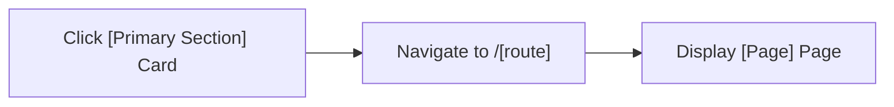

**Navigate to [Secondary Section]**:
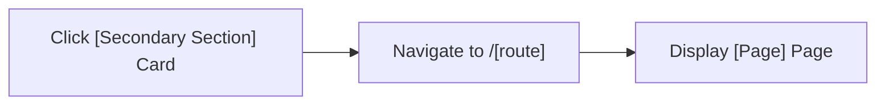

---

### List Page
**Path**: `/[module-route]/[list-route]`
**File**: `app/(main)/[module-route]/[list-route]/page.tsx`


*[Entity] List - List view with search and filtering*

**Status**: 🚧 Prototype / ✅ Production

**Components**:
- Data table with sorting
- Search bar
- Filter panel
- Pagination controls
- Action buttons

**Table Columns**:
- [Column 1 Name]
- [Column 2 Name]
- [Column 3 Name]
- [Column 4 Name]
- Status
- Actions

**Filters**:
- Status dropdown
- [Filter Field 1] (dropdown/text/date range)
- [Filter Field 2] (dropdown/text/date range)
- Date range picker
- Advanced filter

**Sorting**:
- Sort by [Field 1]
- Sort by [Field 2]
- Sort by Date
- Sort by Status

**Actions**:
- Create New [Entity]
- Edit [Entity]
- View Details
- Delete [Entity]
- Export to Excel
- Print List
- Bulk Actions

#### Action Flows

**Create New [Entity]**:
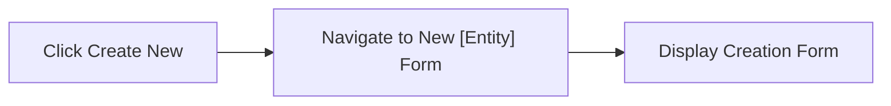

**Edit [Entity]**:
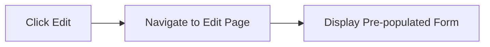

**Delete [Entity]**:
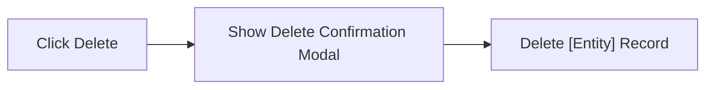

**Search**:
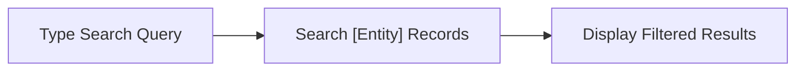

**Apply Filters**:
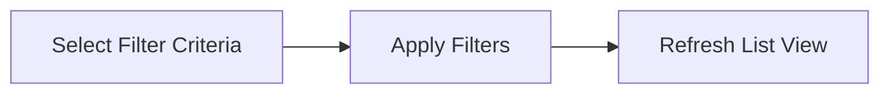

**Export to Excel**:
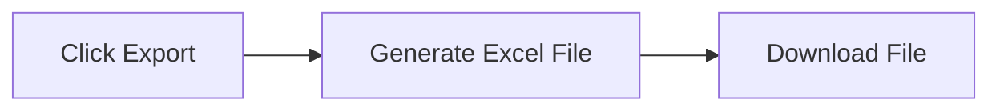

---

### Detail Page
**Path**: `/[module-route]/[list-route]/:id`
**File**: `app/(main)/[module-route]/[list-route]/[id]/page.tsx`


*[Entity] Detail View - Comprehensive information display*

**Tabs**:
- Overview
- [Tab 2 Name]
- [Tab 3 Name]
- [Tab 4 Name]
- Documents
- Activity Log

**Overview Tab**:

**Basic Information**:
- [Field 1]
- [Field 2]
- [Field 3]
- Status
- Created Date
- Last Modified

**[Section 1 Name]**:
- [Field 1]
- [Field 2]
- [Field 3]

**[Section 2 Name]**:
- [Field 1]
- [Field 2]
- [Field 3]

**Actions**:
- Back to List
- Edit [Entity]
- Delete [Entity]
- Print
- Download PDF
- [Custom Action 1]
- [Custom Action 2]

#### Action Flows

**Switch Tabs**:
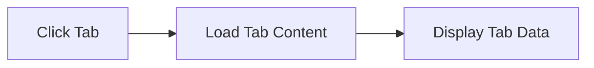

**Back to List**:
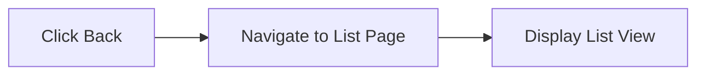

**Edit [Entity]**:
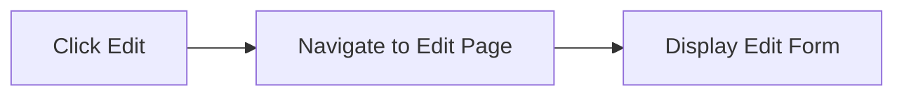

**Delete [Entity]**:
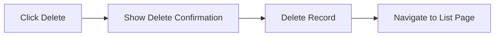

**Print**:
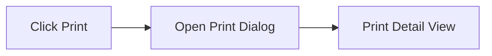

**Download PDF**:
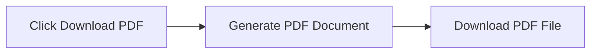

---

### New/Create Form
**Path**: `/[module-route]/[list-route]/new`
**File**: `app/(main)/[module-route]/[list-route]/new/page.tsx`


*New [Entity] Creation Form - Multi-section form with validation*

**Component**: `[EntityName]Form`

**Form Sections**:

1. **Basic Information**
   - [Field 1] (required)
   - [Field 2] (dropdown)
   - [Field 3]
   - [Field 4] (required)
   - [Field 5] (textarea)

2. **[Section 2 Name]**
   - [Field 1] (required)
   - [Field 2] (required, validated)
   - [Field 3] (required, validated)
   - [Field 4]

3. **[Section 3 Name]**
   - [Field 1] (dropdown, required)
   - [Field 2] (required)
   - [Field 3] (required)
   - [Field 4] (required)
   - [Field 5] (dropdown, required)

4. **[Section 4 Name]**
   - [Field 1] (dropdown)
   - [Field 2] (currency input)
   - [Field 3] (dropdown)

**Dropdown Options**:

**[Dropdown 1 Name]**:
- Option 1
- Option 2
- Option 3
- Option 4

**[Dropdown 2 Name]**:
- Option 1
- Option 2
- Option 3

**[Dropdown 3 Name]**:
- Option 1
- Option 2
- Option 3

**Validation Rules**:
- [Field 1]: Required, min 2 characters
- [Field 2]: Valid format validation
- [Field 3]: Required
- [Field 4]: Positive number
- [Field 5]: Date range validation

**Actions**:
- Save [Entity]
- Save and Add Another
- Cancel
- Reset Form

**Modal Dialogs**:
- Unsaved Changes Warning (on cancel)
- Validation Error Summary

#### Action Flows

**Save [Entity]**:
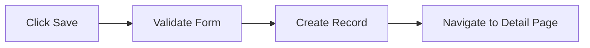

**Save and Add Another**:
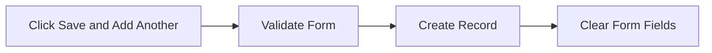

**Cancel**:
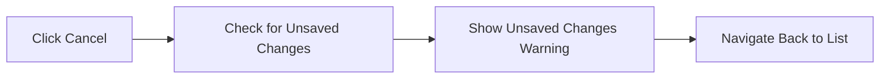

**Reset Form**:
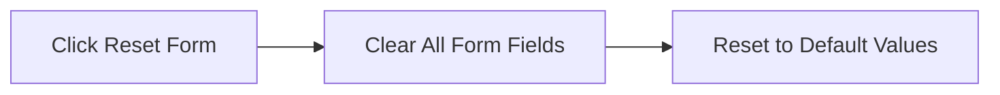

**Field Validation**:
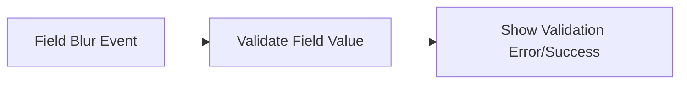

**Dropdown Selection**:
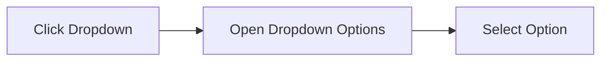

---

### Edit Form
**Path**: `/[module-route]/[list-route]/:id/edit`
**File**: `app/(main)/[module-route]/[list-route]/[id]/edit/page.tsx`

Same form structure as New Form but pre-populated with existing data.

**Additional Actions**:
- Save Changes
- Cancel (revert to detail view)
- Delete [Entity]

#### Action Flows

**Save Changes**:
```mermaid
flowchart LR
    Click["Click Save Changes"] --> Validate["Validate Form"]
    Validate --> Update["Update Record"]
    Update --> Navigate["Navigate to Detail Page"]
```

**Cancel Edit**:
```mermaid
flowchart LR
    Click["Click Cancel"] --> Check["Check for Unsaved Changes"]
    Check --> Navigate["Navigate to Detail Page"]
```

**Delete [Entity]**:
```mermaid
flowchart LR
    Click["Click Delete"] --> Modal["Show Delete Confirmation Modal"]
    Modal --> Delete["Delete Record"]
    Delete --> Navigate["Navigate to List Page"]
```

---

## Modals and Dialogs

### 1. Advanced Filter Dialog
**Trigger**: Click "Advanced Filter" button
**Component**: `advanced-filter.tsx`

**Filter Fields**:
- [Field 1] (text contains)
- [Field 2] (multi-select)
- [Field 3] (dropdown)
- [Field 4] (date range)
- [Field 5] (range)
- [Field 6] (yes/no)

**Actions**:
- Apply Filters
- Clear All
- Save Filter Preset
- Cancel

#### Action Flows

**Apply Filters**:
```mermaid
flowchart LR
    Click["Click Apply Filters"] --> Build["Build Filter Query"]
    Build --> Filter["Apply Filters to List"]
```

**Clear All Filters**:
```mermaid
flowchart LR
    Click["Click Clear All"] --> Reset["Reset All Filter Fields"]
    Reset --> Refresh["Refresh List View"]
```

**Save Filter Preset**:
```mermaid
flowchart LR
    Click["Click Save Preset"] --> Modal["Show Save Preset Dialog"]
    Modal --> Save["Save Filter Configuration"]
```

---

### 2. Delete Confirmation Dialog
**Trigger**: Click delete on [entity]
**Component**: `[Entity]DeletionDialog.tsx`

**Displays**:
- Warning message
- Dependency check results
- Impact summary (related records affected)
- Force delete option (if has dependencies)

**Actions**:
- Confirm Delete
- Cancel
- View Dependencies

#### Action Flows

**Confirm Delete**:
```mermaid
flowchart LR
    Click["Click Confirm Delete"] --> Check["Check for Dependencies"]
    Check --> Delete["Delete Record"]
```

**View Dependencies**:
```mermaid
flowchart LR
    Click["Click View Dependencies"] --> Display["Display Dependency List"]
    Display --> Navigate["Navigate to Related Records"]
```

---

### 3. Add/Edit [Sub-Entity] Dialog
**Trigger**: Add/Edit [sub-entity] buttons

**Fields**:
- [Field 1]
- [Field 2]
- [Field 3]
- [Field 4]
- [Field 5]
- Is Primary (toggle)

**Actions**:
- Save
- Cancel

#### Action Flows

**Save [Sub-Entity]**:
```mermaid
flowchart LR
    Click["Click Save"] --> Validate["Validate Fields"]
    Validate --> Save["Save to Parent Entity"]
```

**Set Primary**:
```mermaid
flowchart LR
    Toggle["Toggle Primary Flag"] --> Update["Update Primary Flag"]
    Update --> Unset["Unset Other Primary Records"]
```

---

### 4. Document Upload Dialog
**Trigger**: Upload document buttons

**Fields**:
- Document Type (dropdown)
- Document Name
- File Upload
- Description
- Effective Date
- Expiry Date

**Actions**:
- Upload
- Cancel

#### Action Flows

**Upload Document**:
```mermaid
flowchart LR
    Click["Click Upload"] --> Validate["Validate File"]
    Validate --> Upload["Upload to Server"]
    Upload --> Attach["Attach to Record"]
```

---

### 5. Selection Dialog
**Trigger**: Select [entity] in forms

**Features**:
- Search bar
- Category/Filter navigation
- List with checkboxes
- Selected items preview
- Bulk select/deselect

**Actions**:
- Add Selected
- Clear Selection
- Cancel

#### Action Flows

**Search Items**:
```mermaid
flowchart LR
    Type["Type Search Query"] --> Search["Search Catalog"]
    Search --> Display["Display Matching Items"]
```

**Select Items**:
```mermaid
flowchart LR
    Check["Check Item Checkbox"] --> Add["Add to Selected Items"]
    Add --> Update["Update Selection Preview"]
```

**Add Selected Items**:
```mermaid
flowchart LR
    Click["Click Add Selected"] --> Validate["Validate Selection"]
    Validate --> Add["Add Items to Form"]
```

---

## Dropdown Fields Reference

### Status Dropdown
**Values**: Active, Inactive, Draft, Pending, Completed
**Used in**: [Entity] filters, forms

### [Category] Dropdown
**Values**:
- Category 1
- Category 2
- Category 3
- Category 4

**Used in**: [Entity] forms, filters

### [Type] Dropdown
**Values**:
- Type 1
- Type 2
- Type 3
- Type 4

**Used in**: [Entity] forms

### Date Range Picker
**Presets**:
- Today
- Last 7 Days
- Last 30 Days
- Last Quarter
- Last Year
- Custom Range

**Used in**: Filters, reports

---

## Actions and Buttons Reference

### Global Actions (appearing across multiple pages):
- **Search** - Real-time search
- **Filter** - Open filter dialog
- **Export** - Export to Excel/PDF
- **Add New** - Create new record
- **Refresh** - Reload data
- **Settings** - Module settings

### List View Actions:
- **View Details** - Navigate to detail page
- **Edit** - Edit mode or edit page
- **Duplicate** - Clone record
- **Delete** - Delete with confirmation
- **Export Single** - Export single record
- **Bulk Select** - Select multiple records
- **Bulk Actions** - Actions on selected records

### Detail View Actions:
- **Back** - Return to list
- **Edit** - Enter edit mode
- **Save** - Save changes
- **Cancel** - Discard changes
- **Delete** - Delete record
- **Print** - Print view
- **Download PDF** - Export to PDF
- **Share** - Share record
- **Clone** - Duplicate record

### Form Actions:
- **Save** - Save and return
- **Save and New** - Save and create another
- **Save as Draft** - Save without validation
- **Submit** - Submit for review/approval
- **Cancel** - Return without saving
- **Reset** - Clear form fields

---

## Form Components

### Input Fields
- Text input
- Number input
- Email input
- Phone input
- URL input
- Password input
- Textarea
- Rich text editor

### Selection Components
- Dropdown select
- Multi-select
- Autocomplete
- Radio button group
- Checkbox group
- Toggle switch
- Date picker
- Date range picker
- Time picker

### File Components
- File upload (single)
- File upload (multiple)
- Image upload with preview
- Document manager

### Specialized Components
- Currency input
- Percentage input
- Color picker
- Rating selector
- Tag input
- [Custom Component 1]
- [Custom Component 2]

---

## Data Display Components

### Tables
- Sortable columns
- Pagination
- Row selection
- Inline actions
- Expandable rows
- Column visibility toggle
- Column reordering
- Export functionality

### Cards
- [Entity] card
- Summary card
- Statistics card
- Quick action card

### Lists
- Simple list
- Detailed list
- Grouped list
- Hierarchical list

### Statistics/Metrics
- KPI cards
- Summary widgets
- Progress indicators
- Status badges
- Charts and graphs
- Trend indicators

### Timeline/History
- Activity feed
- Audit trail
- Change log
- Version history

---

## Glossary

### A

**Active Status**: [Definition of active status in this module context]

**[Term A1]**: [Definition]

**[Term A2]**: [Definition]

### B

**[Term B1]**: [Definition]

**[Term B2]**: [Definition]

### C

**[Term C1]**: [Definition]

**[Term C2]**: [Definition]

### D

**[Term D1]**: [Definition]

**[Term D2]**: [Definition]

### E

**[Term E1]**: [Definition]

**[Term E2]**: [Definition]

### F

**[Term F1]**: [Definition]

**[Term F2]**: [Definition]

### G

**[Term G1]**: [Definition]

**[Term G2]**: [Definition]

### I

**Import**: [Definition in module context]

**[Term I1]**: [Definition]

### L

**[Term L1]**: [Definition]

**[Term L2]**: [Definition]

### M

**[Term M1]**: [Definition]

**[Term M2]**: [Definition]

### P

**[Term P1]**: [Definition]

**[Term P2]**: [Definition]

### R

**[Term R1]**: [Definition]

**[Term R2]**: [Definition]

### S

**Status**: [Definition of status in this module context]

**[Term S1]**: [Definition]

### T

**[Term T1]**: [Definition]

**[Term T2]**: [Definition]

### U

**[Term U1]**: [Definition]

**[Term U2]**: [Definition]

### V

**Validation**: [Definition in module context]

**[Term V1]**: [Definition]

### W

**Workflow**: [Definition in module context]

**[Term W1]**: [Definition]

---

## Usage Instructions

This template provides a comprehensive structure for documenting any module's pages and components. When using this template:

1. **Replace Placeholders**:
   - `[Module Name]` - Replace with actual module name
   - `[module-route]` - Replace with URL route
   - `[Entity]` - Replace with primary entity name
   - `[Field N]` - Replace with actual field names
   - All bracketed placeholders should be replaced with actual content

2. **Add Screenshots**:
   - Capture screenshots for all pages
   - Save to `screenshots/` directory
   - Update image paths in markdown

3. **Document Actions**:
   - Add Mermaid flowcharts for each action (one level deep)
   - Follow the pattern: `Action → Immediate Result`
   - Keep flows simple and clear

4. **Complete Sections**:
   - Fill in all table columns
   - Document all dropdown options
   - List all validation rules
   - Define all modal dialogs

5. **Glossary**:
   - Define all technical terms used in the module
   - Include acronyms and abbreviations
   - Add cross-references between related terms
   - Organize alphabetically

6. **Keep Updated**:
   - Update status when pages change from prototype to production
   - Add new pages as they are developed
   - Keep action flows current with implementation

---

**Last Updated**: [Date]
**Status**: [Template / In Progress / Complete]
**Module**: [Module Name]
**Version**: 1.0
