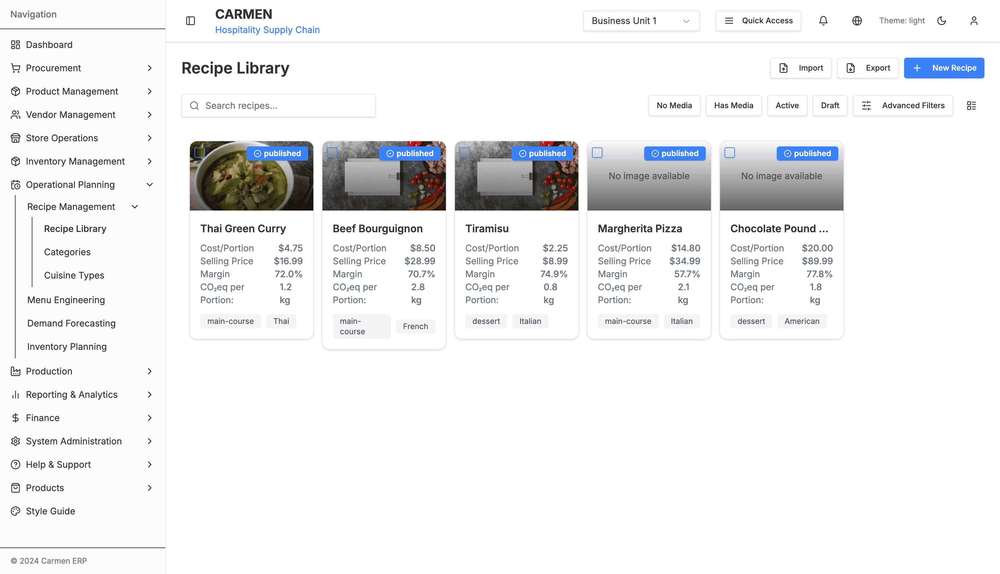
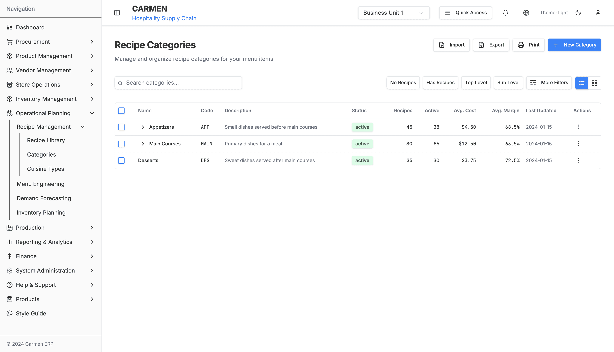
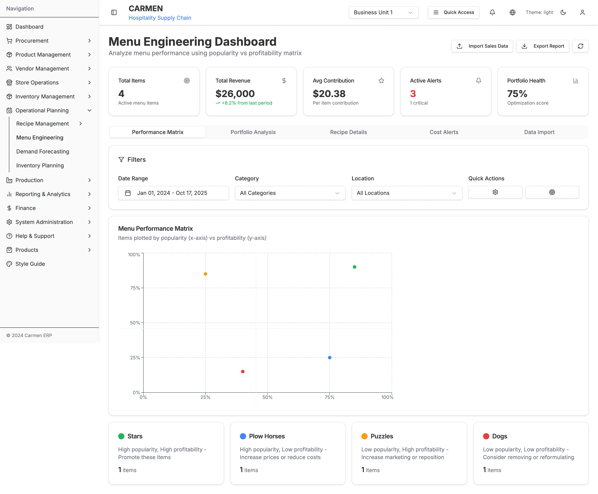
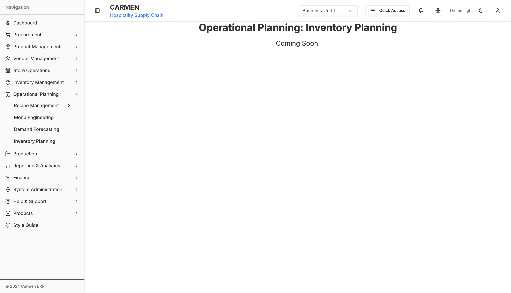

# Operational Planning Module

> **Module:** Operational Planning
> **Total Pages:** 25
> **Status:** ✅ Production Ready

## Document History

| Version | Date | Author | Changes |
|---------|------|--------|---------|
| 1.0.0 | 2025-11-19 | Documentation Team | Initial version |
---

## Overview

The Operational Planning module provides comprehensive tools for hospitality operations management, including recipe management, menu engineering analysis, demand forecasting, and inventory planning. This module enables data-driven decision-making for menu optimization, cost control, and operational efficiency.

### Key Features

1. **Recipe Management** - Complete recipe catalog with ingredients, costing, and variations
2. **Menu Engineering** - Performance analysis using popularity vs profitability matrix
3. **Demand Forecasting** - Predictive analytics for sales planning
4. **Inventory Planning** - Optimal stock level recommendations

---

## 📸 System Screenshots

### Recipe Management

#### Recipe Library

*The Recipe Library displays 5 comprehensive recipe cards with detailed analytics: Thai Green Curry ($4.75 cost, $16.99 selling price, 72.0% margin, 1.2 kg CO₂eq), Beef Bourguignon ($8.50 cost, $28.99 selling, 70.7% margin, 2.8 kg CO₂eq), Tiramisu ($2.25 cost, $8.99 selling, 74.9% margin, 0.8 kg CO₂eq), Margherita Pizza ($14.80 cost, $34.99 selling, 57.7% margin, 2.1 kg CO₂eq), and Chocolate Pound Cake ($20.00 cost, $89.99 selling, 77.8% margin, 1.8 kg CO₂eq). Each recipe card shows cuisine type, course category, and CO₂ environmental impact tracking. The interface includes search functionality, filters (No Media, Has Media, Active, Draft), Advanced Filters, Import/Export capabilities, and a New Recipe button.*

#### Recipe Categories

*The Recipe Categories interface shows a hierarchical table structure with 3 main categories: Appetizers (APP, 45 recipes, 38 active, $4.50 avg cost, 68.5% avg margin), Main Courses (MAIN, 80 recipes, 65 active, $12.50 avg cost, 63.5% avg margin - expandable for subcategories), and Desserts (DES, 35 recipes, 30 active, $3.75 avg cost, 72.5% avg margin). The tree structure features expand/collapse controls, Edit/Delete/Add actions per node, search functionality, filters (No Recipes, Has Recipes, Top Level, Sub Level), and Import/Export/Print buttons for comprehensive recipe organization management.*

#### Cuisine Types

*The Cuisine Types management interface displays 8 global cuisine classifications with regional groupings: Italian (ITA, Europe, 45 recipes, 38 active), Chinese (CHN, Asia, 60 recipes, 52 active), Mexican (MEX, Americas, 35 recipes, 30 active), Indian (IND, Asia, 50 recipes, 45 active), French (FRA, Europe, 40 recipes, 35 active), Japanese (JPN, Asia, 55 recipes, 48 active), Mediterranean (MED, Europe, 30 recipes, 25 active), and Thai (THA, Asia, 45 recipes, 40 active). The interface provides search functionality, filters (No Recipes, Has Recipes, Asian, European), More Filters option, and Import/Export/Print capabilities for cuisine type management.*

### Menu Engineering

#### Menu Engineering Dashboard

*The Menu Engineering Dashboard showcases comprehensive menu optimization using the Boston Consulting Group (BCG) matrix. Key performance indicators include Total Items (4), Total Revenue ($26,000, +8.2%), Avg Contribution ($20.38), Active Alerts (3, including 1 critical), and Portfolio Health (75%). The BCG matrix scatter plot categorizes menu items into four strategic quadrants: Stars (High popularity, High profitability - Promote strategy), Plow Horses (High popularity, Low profitability - Increase prices or reduce costs), Puzzles (Low popularity, High profitability - Increase marketing), and Dogs (Low popularity, Low profitability - Consider removing). Date range filtering (Jan 01, 2024 - Oct 17, 2025), category and location filters, and tabs for Performance Matrix, Portfolio Analysis, Recipe Details, Cost Alerts, and Data Import enable comprehensive menu performance management.*

### Planned Features (Coming Soon)

The following screenshots document features that are planned but not yet implemented:

#### Demand Forecasting

*Planned feature: Predictive analytics for sales planning and demand forecasting based on historical data, seasonality patterns, and market trends. Coming in future release.*

#### Inventory Planning

*Planned feature: Optimal stock level recommendations and automated inventory planning based on recipe requirements and demand forecasts. Coming in future release.*

---

## Module Structure

### Features Documentation

- [Recipe Management](./features/recipe-management/README.md) - Recipe catalog, categories, cuisine types
- [Menu Engineering](./features/menu-engineering/README.md) - Menu performance matrix and optimization
- [Dashboard & Analytics](./features/dashboard/README.md) - Demand forecasting and inventory planning

---

## Quick Start

### Accessing the Module

Navigate to: `/operational-planning`

### Main Features

**Recipe Management**
- Browse and search recipes
- Create and edit recipes
- Manage categories and cuisine types
- Track recipe costs and margins

**Menu Engineering**
- Performance matrix (Stars, Plow Horses, Puzzles, Dogs)
- Sales data import and analysis
- Cost alert management
- Recipe performance metrics

**Dashboard**
- Demand forecast vs actual
- Menu performance trends
- Inventory planning status
- Drag-and-drop customization

---

## Key Metrics

**Menu Engineering**:
- Total menu items
- Total revenue and contribution
- Active cost alerts
- Portfolio health score

**Recipe Management**:
- Total active recipes
- Average recipe cost
- Cost variance tracking
- Recipe utilization

---

## User Roles & Permissions

| Feature | Chef | Kitchen Manager | GM | Staff |
|---------|------|----------------|----|----|-----|
| View Recipes | ✅ | ✅ | ✅ | ✅ |
| Edit Recipes | ✅ | ✅ | ⚠️ | ❌ |
| Menu Engineering | ⚠️ | ✅ | ✅ | ❌ |
| Cost Analysis | ❌ | ✅ | ✅ | ❌ |
| Forecasting | ❌ | ⚠️ | ✅ | ❌ |

Legend: ✅ Full Access | ⚠️ Read Only | ❌ No Access

---

## Integration Points

### System Integrations
- **Inventory Management** - Recipe ingredient tracking and stock deductions
- **POS Systems** - Sales data import for menu engineering
- **Product Management** - Product catalog integration
- **Finance** - Cost tracking and profitability analysis
- **Vendor Management** - Supplier pricing and product sourcing

### Data Flow
```
POS Sales Data → Menu Engineering → Performance Analysis
Recipe Ingredients → Inventory → Stock Planning
Demand Forecast → Inventory Planning → Purchase Orders
Menu Performance → Recipe Optimization → Cost Reduction
```

---

## Technical Architecture

### Tech Stack
- **Framework**: Next.js 14 with App Router
- **UI Components**: Shadcn/ui, Recharts for visualization
- **State Management**: Zustand for recipes, React Query for server state
- **Drag & Drop**: react-beautiful-dnd for dashboard customization

### Data Models
See individual feature documentation for detailed TypeScript interfaces and data models.

---

## Related Documentation

- [System Administration](../sa/README.md)
- [Inventory Management](../inventory/README.md)
- [Procurement](../procurement/README.md)
- [Product Management](../product/README.md)

---

**Last Updated:** 2025-01-17
**Version:** 1.0.0
