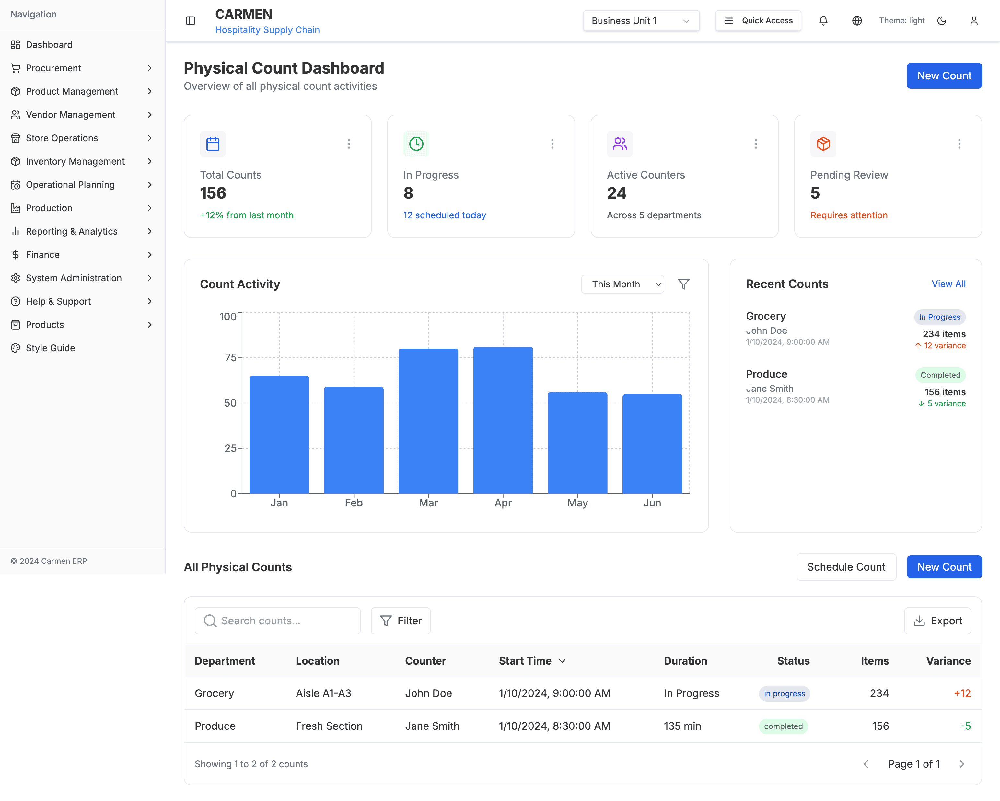
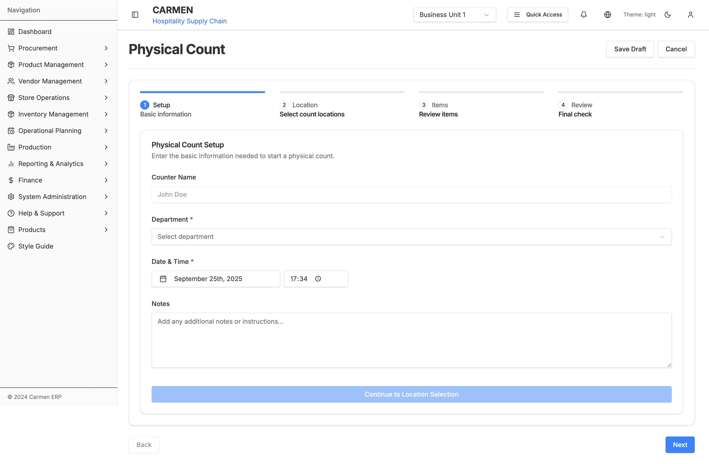
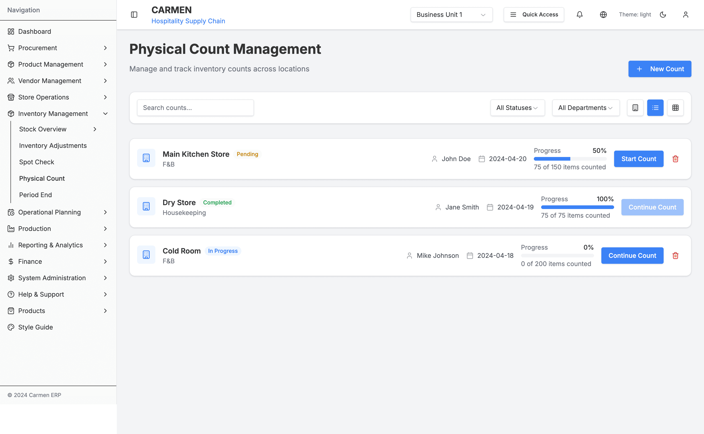

# Physical Count Module Documentation

This directory contains comprehensive documentation for the Physical Count module of the Carmen ERP system.

## 📁 Documentation Structure

### Core Documentation
- [`physical-count-specification.md`](./physical-count-specification.md) - Complete technical specification
- [`physical-count-sitemap.md`](./physical-count-sitemap.md) - Mermaid site maps and flow diagrams
- [`README.md`](./README.md) - This index file

### Screenshots
- [`physical-count-dashboard.png`](./screenshots/physical-count-dashboard.png) - Dashboard overview interface
- [`physical-count-wizard-setup.png`](./screenshots/physical-count-wizard-setup.png) - Count creation wizard setup step
- [`physical-count-management.png`](./screenshots/physical-count-management.png) - Management interface with list view

## 🎯 Module Overview

The Physical Count module provides a comprehensive inventory counting system with:

- **Multi-step creation wizard** for structured count setup
- **Real-time counting interface** with location-based organization
- **Administrative management** with filtering and search capabilities
- **Progress tracking** and variance reporting
- **Integration** with inventory adjustment workflows

## 🗺️ Navigation Structure

```
Physical Count Module
├── Dashboard (/physical-count/dashboard)
│   ├── Statistics Overview
│   ├── Activity Charts
│   ├── Recent Counts
│   └── All Counts Table
├── Creation Wizard (/physical-count)
│   ├── Step 1: Setup
│   ├── Step 2: Location Selection
│   ├── Step 3: Item Review
│   └── Step 4: Final Review
├── Management Interface (/physical-count-management)
│   ├── List/Grid View Toggle
│   ├── Search & Filters
│   ├── Count Operations
│   └── Modal Forms
└── Active Count Interface (/physical-count/active/[id])
    ├── Count Header & Controls
    ├── Location Navigation
    ├── Item Counting Interface
    └── Progress Tracking
```

## 📸 Screenshots Overview

### Physical Count Dashboard


**Key Features Shown:**
- Statistics cards (Total Counts, In Progress, Active Counters, Pending Review)
- Activity chart with time-based filtering
- Recent counts panel with status indicators
- Comprehensive counts table with search and export functionality

### Physical Count Creation Wizard - Setup Step


**Key Features Shown:**
- 4-step progress indicator
- Setup form with auto-populated counter name
- Department selection dropdown
- Date & time picker
- Notes field for additional instructions
- Form validation and navigation controls

### Physical Count Management Interface


**Key Features Shown:**
- List view with detailed count information
- Search functionality and filtering options
- Status indicators (Pending, Completed, In Progress)
- Progress bars and completion statistics
- Action buttons for count operations
- Expanded navigation showing inventory management hierarchy

## 🔧 Technical Implementation

### Framework & Technologies
- **Next.js 14** with App Router
- **TypeScript** for type safety
- **Shadcn/ui** component library
- **Tailwind CSS** for styling
- **Recharts** for data visualization

### Key Components

#### Pages
- `PhysicalCountPage` - Main wizard interface
- `PhysicalCountDashboard` - Analytics and overview
- `PhysicalCountManagement` - Administrative management
- `PhysicalActiveCountPage` - Real-time counting interface

#### Components
- `PhysicalCountSetup` - Wizard setup step
- `LocationSelection` - Location picker
- `ItemReview` - Item configuration
- `FinalReview` - Pre-submission review
- `CountsTable` - Dashboard table
- `NewCountForm` - Creation modal
- `CountDetailForm` - Management modal

### Data Flow
1. **Creation Flow**: Wizard → Validation → Count Session → Active Interface
2. **Management Flow**: Admin Interface → Filtering → CRUD Operations
3. **Counting Flow**: Active Interface → Real-time Updates → Progress Tracking
4. **Completion Flow**: Count Submission → Inventory Adjustments → Reporting

## 🎨 UI/UX Patterns

### Design Principles
- **Progressive Disclosure**: Step-by-step wizard approach
- **Location-Based Organization**: Clear location hierarchy
- **Real-time Feedback**: Immediate progress updates
- **Status Visualization**: Color-coded status indicators
- **Responsive Design**: Mobile-first approach

### User Interactions
- **Multi-step Wizard**: Linear progression with validation
- **Modal Overlays**: Non-intrusive form interactions
- **Toggle Views**: List/Grid view options
- **Filtering System**: Dynamic content filtering
- **Search Functionality**: Real-time search capabilities

## 📊 Data Models

### Core Entities
```typescript
interface CountData {
  storeName: string
  department: string
  userName: string
  date: string
  status: "pending" | "completed" | "in-progress"
  itemCount: number
  lastCountDate: string
  variance: number
  notes: string
  completedCount: number
}
```

### API Integration
- `GET /api/inventory/counts` - Retrieve counts with filtering
- `POST /api/inventory/counts` - Create new count
- `GET /api/inventory/counts/[id]` - Get count details
- `POST /api/inventory/counts/[id]/start` - Start count execution

## 🔗 Integration Points

### System Integrations
- **User Context** - Auto-population and permissions
- **Inventory System** - Stock levels and variance calculation
- **Location Management** - Multi-location support
- **Department System** - Role-based access control
- **Reporting System** - Analytics and trending data

## 📋 Future Enhancements

### Planned Features
- **Barcode Scanning** - Mobile device integration
- **Photo Documentation** - Image capture for discrepancies
- **Batch Operations** - Multiple count scheduling
- **Advanced Analytics** - Trend analysis and forecasting
- **Mobile App** - Dedicated mobile counting interface

### Performance Optimizations
- **Real-time Updates** - WebSocket implementation
- **Offline Capability** - Progressive Web App features
- **Caching Strategy** - Optimistic updates and local storage
- **Batch Processing** - Background count processing

## Document History

| Version | Date | Author | Changes |
|---------|------|--------|---------|
| 1.0.0 | 2025-11-19 | Documentation Team | Initial version |
---

## 📝 Documentation Notes

This documentation was generated through comprehensive codebase analysis and includes:

- **Complete component mapping** of all Physical Count related files
- **Detailed functionality documentation** based on actual implementation
- **Visual site maps** showing navigation flow and relationships
- **Actual screenshots** captured from the running application
- **Technical specifications** for developers and stakeholders

The documentation reflects the current state of the Physical Count module as implemented in the Carmen ERP system codebase.

---

*Generated: September 25, 2025*
*Source: `/app/(main)/inventory-management/physical-count*` and related components*