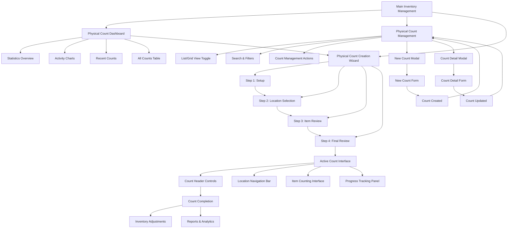
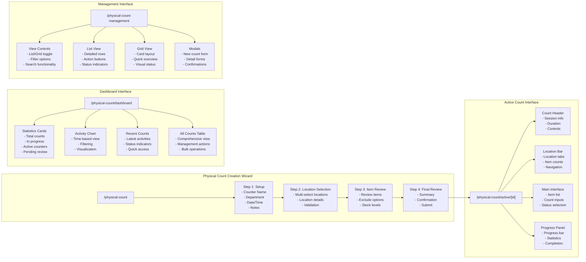
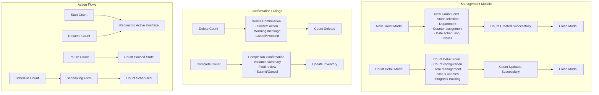
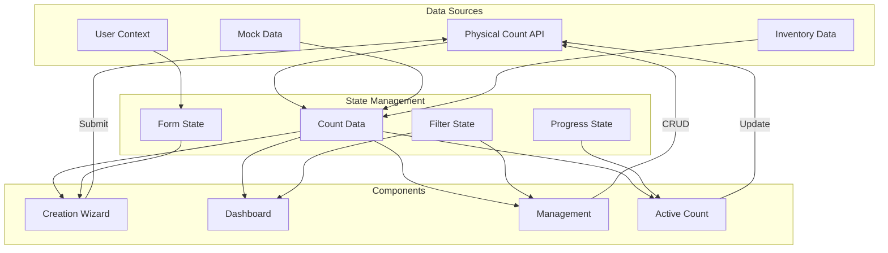
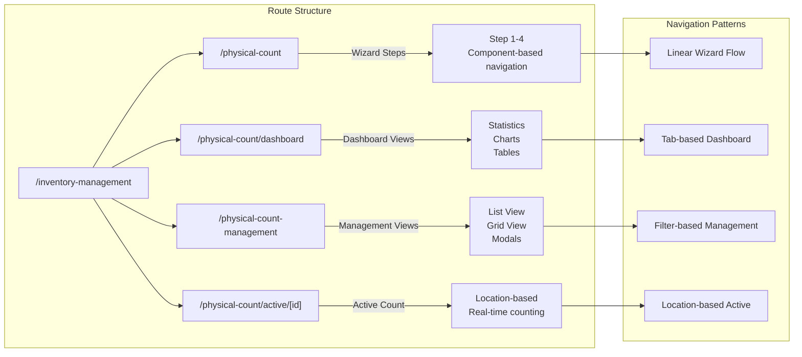

# Physical Count Module - Site Map

## Main Site Map Flow

## Detailed Page Navigation Flow

## Modal and Dialog Flow

## Data Flow and State Management

## URL Structure and Routes

## Component Hierarchy Map

```mermaid
graph TD
    subgraph "Physical Count Module Components"
        PC[PhysicalCountPage] --> PS[PhysicalCountSetup]
        PC --> LS[LocationSelection]
        PC --> IR[ItemReview]
        PC --> FR[FinalReview]

        PCD[PhysicalCountDashboard] --> CT[CountsTable]
        PCD --> CHART[Activity Chart]
        PCD --> STATS[Statistics Cards]

        PCM[PhysicalCountManagement] --> CLI[CountListItem]
        PCM --> CDC[CountDetailCard]
        PCM --> NCF[NewCountForm]
        PCM --> CDF[CountDetailForm]

        PCAI[PhysicalActiveCountInterface] --> CH[CountHeader]
        PCAI --> LB[LocationBar]
        PCAI --> CI[CountInterface]
        PCAI --> PP[ProgressPanel]
    end

    subgraph "Shared UI Components"
        BUTTON[Button]
        CARD[Card]
        INPUT[Input]
        SELECT[Select]
        MODAL[Modal]
        BADGE[Badge]
        TABLE[Table]
    end

    PS --> BUTTON
    PS --> CARD
    PS --> INPUT
    PS --> SELECT

    LS --> BUTTON
    LS --> CARD

    IR --> TABLE
    IR --> BUTTON

    FR --> CARD
    FR --> BUTTON

    CLI --> CARD
    CLI --> BADGE
    CLI --> BUTTON

    CDC --> CARD
    CDC --> BADGE
    CDC --> BUTTON

    NCF --> MODAL
    NCF --> INPUT
    NCF --> SELECT

    CDF --> MODAL
    CDF --> INPUT
```

