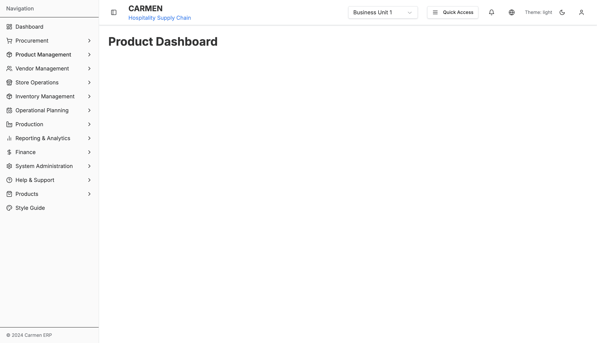
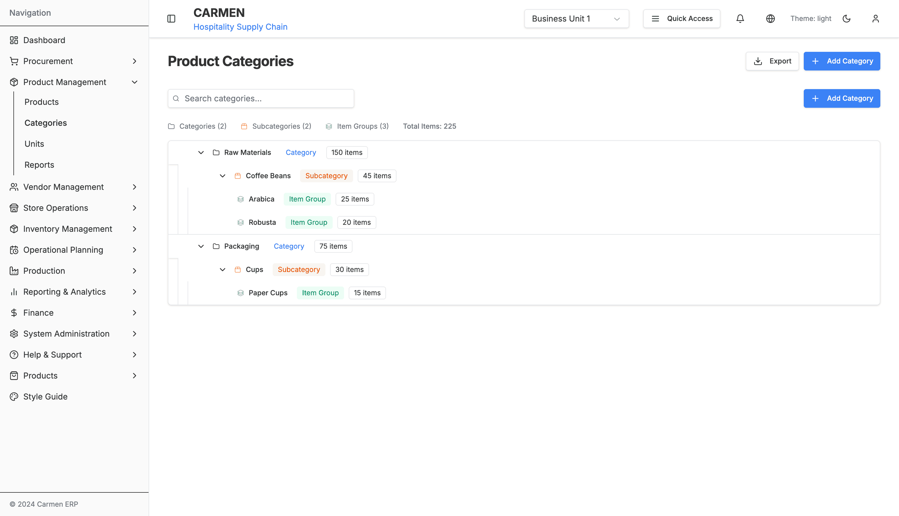

# Product Management Module Documentation

This directory contains comprehensive documentation for the Product Management module of the Carmen ERP system.

## Documentation Structure

### 📊 Sitemap and Architecture
- **[product-management-sitemap.md](./product-management-sitemap.md)** - Complete Mermaid sitemap showing module structure, navigation flow, workflow state diagrams, and user interaction patterns

### 📋 Detailed Specifications
- **[product-management-specification.md](./product-management-specification.md)** - Comprehensive specification document covering all UI elements, workflows, actions, and technical implementation details

### 📸 System Screenshots

All screenshots are captured at full page resolution showing the current application state.

#### Product Dashboard

*The Product Management dashboard provides a simple entry point to the product management system. This placeholder interface is prepared for future enhancement with draggable analytics widgets, product performance metrics, and quick action buttons for common product operations.*

#### Products List

*The Products list interface displays 8 diverse products in a comprehensive table view: Organic Jasmine Rice (PRD-001, 35.5 THB), Palm Sugar (PRD-002, 45 THB), Fish Sauce Premium Grade (PRD-003, 65 THB), Dell UltraSharp Monitor (ELEC-002, 499.99 USD), Standing Desk (OFF-002, 699.99 USD, Inactive), Wireless Mouse (TECH-001, 79.99 USD), Filing Cabinet (STAT-002, 199.99 USD), and Mechanical Keyboard (TECH-002, 149.99 USD, Inactive). Each product shows detailed categorization through Category → Subcategory → Item Group hierarchy, inventory unit, base price, and status. The interface provides search functionality, advanced filters (Saved Filters, Add Filter), Import/Export/Report capabilities, Add Product button, and dual view modes (table/card) for flexible product catalog management.*

#### Categories Tree

*The Product Categories tree interface displays hierarchical category management with a summary showing 2 Categories, 2 Subcategories, 3 Item Groups, and 225 Total Items. The tree structure includes: Raw Materials (Category, 150 items) containing Coffee Beans (Subcategory, 45 items) with Arabica (Item Group, 25 items) and Robusta (Item Group, 20 items) sub-groups, and Packaging (Category, 75 items) containing Cups (Subcategory, 30 items) with Paper Cups (Item Group, 15 items). The interface features search functionality, Add Category buttons at multiple levels, expandable/collapsible tree nodes, and Edit/Delete/Add actions for comprehensive three-level category hierarchy management with drag-and-drop reorganization support.*

#### Units List

*The Unit Management interface displays 12 units across three distinct contexts: INVENTORY units (KG - Kilogram, G - Gram, L - Liter, ML - Milliliter), ORDER units (BOX - Box, CTN - Carton, PLT - Pallet marked Inactive, BG - Bag, CASE - Case), and RECIPE units (TSP - Teaspoon, TBSP - Tablespoon, CUP - Cup). The interface provides search functionality, filters for All Status and All Types, dual view modes (table/card toggle), Export and Add Unit buttons, and detailed columns (Code, Name, Type, Status, Description, Actions) for managing the flexible multi-context unit system used across inventory, ordering, and recipe management.*

#### Legacy Screenshots (Previous Captures)

Additional screenshots showing enhanced interface details:
- **[product-list.png](./product-list.png)** - Products list with dual view modes and comprehensive filtering
- **[advanced-filter.png](./advanced-filter.png)** - Advanced filter builder with saved filters and JSON view
- **[category-tree.png](./category-tree.png)** - Hierarchical category management with drag-and-drop functionality
- **[unit-list.png](./unit-list.png)** - Unit management interface with type-based filtering
- **[product-management-dashboard.png](./product-management-dashboard.png)** - Main dashboard placeholder

## Module Overview

The Product Management module manages:
- **Product Dashboard**: Placeholder for future draggable widget system with analytics
- **Product Catalog**: Comprehensive product listings with advanced search and filtering
- **Category Management**: Hierarchical three-level category tree with drag-and-drop
- **Unit Management**: Flexible unit system for inventory, orders, and recipes
- **Advanced Filtering**: Complex filter builder with saved configurations
- **Bulk Operations**: Multi-product operations and management

## Key Features Documented

### 🎛️ Product Dashboard
- Placeholder implementation ready for future enhancement
- Prepared for React Beautiful DnD integration
- Analytics widgets planned (6 widgets total)
- Quick navigation to major product functions

### 📦 Product Management
- Comprehensive product catalog with 960+ lines of functionality
- Dual view modes: table and card layouts
- Advanced search with real-time filtering
- Mock data for 8 detailed products with full nutritional profiles
- Bulk operations: activate, deactivate, category updates, export
- Status management with visual indicators

### 🔍 Advanced Filter System
- Dynamic filter builder with 539 lines of logic
- Multiple field types: text, numeric, boolean, date, array
- Logical operators (AND/OR) for complex conditions
- Saved filter configurations with LocalStorage persistence
- JSON view for filter inspection and editing
- Filter sharing and import/export capabilities

### 📁 Category Management
- Three-level hierarchy: Category → Subcategory → Item Group
- React DnD integration for drag-and-drop restructuring (802 lines)
- Real-time search with auto-expand and highlighting
- Mobile-optimized with touch gestures and haptic feedback
- Context menus with role-based actions
- Visual tree representation with item counts

### ⚖️ Unit Management
- Flexible unit system for different contexts (inventory/order/recipe)
- Table and card view toggles
- Type-based and status-based filtering
- Usage tracking and conversion management
- Unit relationships and conversion factors

## Technical Architecture

### Component Structure
```
product-management/
├── page.tsx                     # Main dashboard (16 lines, placeholder)
├── products/
│   ├── page.tsx                 # Products wrapper
│   └── components/
│       ├── product-list.tsx     # Core listing (960 lines)
│       └── advanced-filter.tsx  # Filter system (539 lines)
├── categories/
│   └── components/
│       └── category-list.tsx    # Tree management (802 lines)
└── units/
    └── components/
        └── unit-list-improved.tsx # Unit management
```

### Key Technologies
- **Next.js 14** with App Router
- **TypeScript** with strict mode
- **React Beautiful DnD** for drag-and-drop (prepared)
- **React DnD** with HTML5Backend for category tree
- **Recharts** for data visualization (prepared)
- **Tailwind CSS** + **Shadcn/ui** for styling
- **Zod** for validation schemas
- **Mock Data System** for development and testing

## Data Flow Patterns

### Product Lifecycle
Browse → Search/Filter → View Details → Edit → Save → Update List

### Category Management
Load Tree → Search/Navigate → Drag & Drop → Validate → Update Structure

### Filter Workflow
Basic Filters → Advanced Builder → Add Conditions → Apply Logic → Save/Load → Execute

## Navigation Hierarchy

```
Product Management
├── Dashboard (Placeholder for Future Widgets)
├── Products
│   ├── Product List (Table/Card Views)
│   ├── Advanced Filters (Builder Interface)
│   └── Product Detail (Future Implementation)
├── Categories
│   ├── Category Tree (Drag & Drop)
│   ├── Search & Navigation
│   └── Context Actions
└── Units
    ├── Unit List (Type Filtering)
    ├── Unit Detail (Future Implementation)
    └── Conversion Management
```

## File Sizes and Complexity

| Component | File Size | Lines | Screenshot Size | Complexity |
|-----------|-----------|-------|-----------------|------------|
| Dashboard | Small | 16 | 62KB | Low (Placeholder) |
| Product List | **Large** | **960** | 224KB | **Very High** |
| Advanced Filter | **Large** | **539** | 225KB | **Very High** |
| Category Tree | **Large** | **802** | 98KB | **Very High** |
| Unit Management | Medium | ~200 | 156KB | Medium |

## Usage Instructions

1. **For Developers**: Start with the sitemap to understand the overall structure, then review the detailed specification for implementation details
2. **For Product Managers**: Focus on the specification document for feature details, user workflows, and business logic
3. **For UI/UX Designers**: Use the screenshots alongside the specification to understand current implementation and design patterns
4. **For QA Teams**: The specification provides comprehensive test scenarios, expected behaviors, and workflow validations

## Development Status

### Implemented Features
- ✅ Product listing with dual view modes
- ✅ Advanced filter builder with saved configurations
- ✅ Hierarchical category tree with drag-and-drop
- ✅ Unit management with type-based filtering
- ✅ Mock data system for development
- ✅ Responsive design and mobile optimizations

### Planned Features
- 🔄 Dashboard widget system with analytics
- 🔄 Product detail pages with comprehensive forms
- 🔄 Image management and gallery
- 🔄 Bulk import/export functionality
- 🔄 Real-time data integration
- 🔄 Advanced search with Elasticsearch
- 🔄 Approval workflows for product changes

## Last Updated
Generated: September 25, 2024
Source Code Analysis: Complete recursive scan of product management module
Screenshots: Full-page captures of all major interfaces
Documentation Status: ✅ Complete

## Document History

| Version | Date | Author | Changes |
|---------|------|--------|---------|
| 1.0.0 | 2025-11-19 | Documentation Team | Initial version |
---

This documentation provides a complete analysis of the Product Management module based on recursive source code scanning and live application capture. All screenshots and specifications reflect the current state of the application as of the generation date.