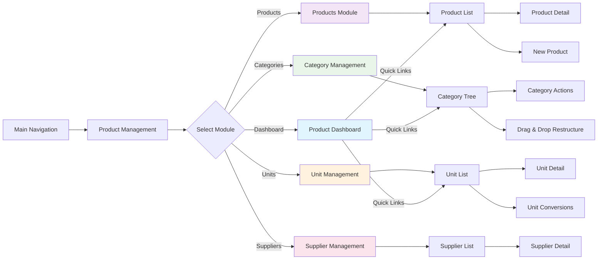
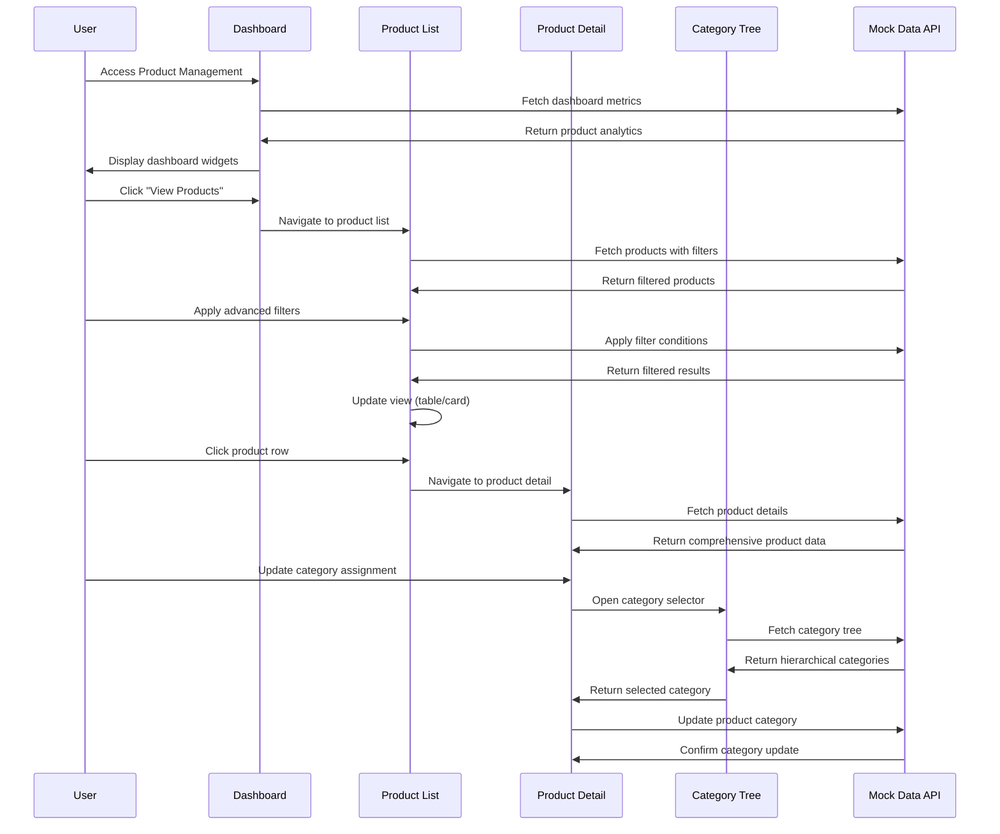
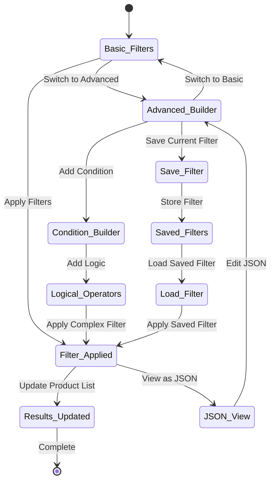
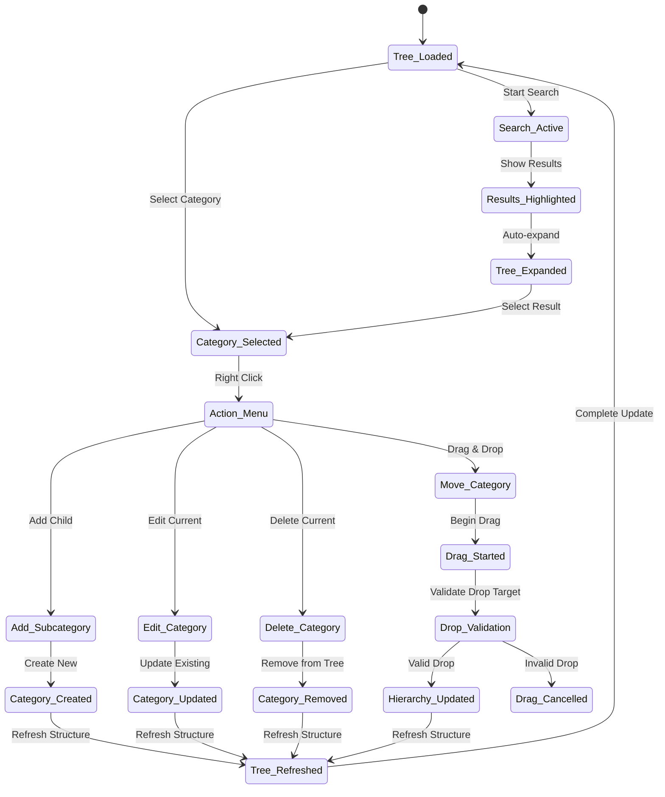

# Product Management Module - Sitemap

## Document History

| Version | Date | Author | Changes |
|---------|------|--------|---------|
| 1.0.0 | 2025-11-19 | Documentation Team | Initial version |

```mermaid
graph TD
    PM[Product Management] --> PMD[Product Dashboard]
    PM --> PROD[Products]
    PM --> CAT[Categories]
    PM --> UNITS[Units]
    PM --> SUP[Suppliers]
    PM --> PRICING[Pricing Management]
    PM --> SPECS[Product Specifications]

    %% Product Dashboard Components
    PMD --> PMD_WIDGETS[Dashboard Widgets]
    PMD_WIDGETS --> PMD_W1[Product Overview Chart]
    PMD_WIDGETS --> PMD_W2[Category Distribution]
    PMD_WIDGETS --> PMD_W3[Inventory Levels]
    PMD_WIDGETS --> PMD_W4[Price Analysis]
    PMD_WIDGETS --> PMD_W5[Recent Products]
    PMD_WIDGETS --> PMD_W6[Product Alerts]

    %% Products Module
    PROD --> PROD_LIST[Product List]
    PROD --> PROD_DETAIL[Product Detail]
    PROD --> PROD_NEW[New Product]

    %% Product List Components
    PROD_LIST --> PROD_L_SEARCH[Search Products]
    PROD_LIST --> PROD_L_FILTER[Advanced Filter System]
    PROD_L_FILTER --> PROD_L_F_BASIC[Basic Filters]
    PROD_L_F_BASIC --> PROD_L_F_STATUS[Status Filter]
    PROD_L_F_BASIC --> PROD_L_F_CATEGORY[Category Filter]
    PROD_L_F_BASIC --> PROD_L_F_SUPPLIER[Supplier Filter]
    PROD_L_F_BASIC --> PROD_L_F_PRICE[Price Range Filter]
    PROD_L_FILTER --> PROD_L_F_ADVANCED[Advanced Filter Builder]
    PROD_L_F_ADVANCED --> PROD_L_F_A_CONDITIONS[Filter Conditions]
    PROD_L_F_ADVANCED --> PROD_L_F_A_LOGIC[Logical Operators]
    PROD_L_F_ADVANCED --> PROD_L_F_A_SAVED[Saved Filters]
    PROD_L_F_ADVANCED --> PROD_L_F_A_JSON[JSON View]
    PROD_LIST --> PROD_L_VIEW[View Toggle]
    PROD_L_VIEW --> PROD_L_V_TABLE[Table View]
    PROD_L_V_TABLE --> PROD_L_V_T_COLUMNS[Column Configuration]
    PROD_L_V_TABLE --> PROD_L_V_T_SORT[Sorting Options]
    PROD_L_V_TABLE --> PROD_L_V_T_ACTIONS[Row Actions]
    PROD_L_VIEW --> PROD_L_V_CARD[Card View]
    PROD_L_V_CARD --> PROD_L_V_C_GRID[Grid Layout]
    PROD_L_V_CARD --> PROD_L_V_C_ACTIONS[Card Actions]
    PROD_LIST --> PROD_L_BULK[Bulk Operations]
    PROD_L_BULK --> PROD_L_B_SELECT[Select All/None]
    PROD_L_BULK --> PROD_L_B_ACTIONS[Bulk Action Menu]
    PROD_L_B_ACTIONS --> PROD_L_B_A_ACTIVATE[Bulk Activate]
    PROD_L_B_ACTIONS --> PROD_L_B_A_DEACTIVATE[Bulk Deactivate]
    PROD_L_B_ACTIONS --> PROD_L_B_A_CATEGORY[Bulk Category Update]
    PROD_L_B_ACTIONS --> PROD_L_B_A_SUPPLIER[Bulk Supplier Update]
    PROD_L_B_ACTIONS --> PROD_L_B_A_EXPORT[Bulk Export]

    %% Product Detail Components
    PROD_DETAIL --> PROD_D_HEADER[Product Header Info]
    PROD_DETAIL --> PROD_D_TABS[Product Detail Tabs]
    PROD_D_TABS --> PROD_D_T_BASIC[Basic Information]
    PROD_D_T_BASIC --> PROD_D_T_B_GENERAL[General Details]
    PROD_D_T_BASIC --> PROD_D_T_B_CATEGORY[Category Assignment]
    PROD_D_T_BASIC --> PROD_D_T_B_SUPPLIER[Supplier Information]
    PROD_D_T_BASIC --> PROD_D_T_B_STATUS[Status Management]
    PROD_D_TABS --> PROD_D_T_PRICING[Pricing Information]
    PROD_D_T_PRICING --> PROD_D_T_P_BASE[Base Price]
    PROD_D_T_PRICING --> PROD_D_T_P_COST[Cost Information]
    PROD_D_T_PRICING --> PROD_D_T_P_MARGIN[Margin Calculation]
    PROD_D_T_PRICING --> PROD_D_T_P_HISTORY[Price History]
    PROD_D_TABS --> PROD_D_T_INVENTORY[Inventory Details]
    PROD_D_T_INVENTORY --> PROD_D_T_I_UNITS[Unit Configuration]
    PROD_D_T_INVENTORY --> PROD_D_T_I_STOCK[Stock Information]
    PROD_D_T_INVENTORY --> PROD_D_T_I_REORDER[Reorder Parameters]
    PROD_D_TABS --> PROD_D_T_SPECS[Specifications]
    PROD_D_T_SPECS --> PROD_D_T_S_ATTRIBUTES[Product Attributes]
    PROD_D_T_SPECS --> PROD_D_T_S_VARIANTS[Product Variants]
    PROD_D_T_SPECS --> PROD_D_T_S_ALLERGENS[Allergen Information]
    PROD_D_TABS --> PROD_D_T_IMAGES[Product Images]
    PROD_D_T_IMAGES --> PROD_D_T_I_GALLERY[Image Gallery]
    PROD_D_T_IMAGES --> PROD_D_T_I_UPLOAD[Image Upload]
    PROD_D_T_IMAGES --> PROD_D_T_I_MANAGEMENT[Image Management]
    PROD_D_TABS --> PROD_D_T_HISTORY[Change History]
    PROD_D_T_HISTORY --> PROD_D_T_H_CHANGES[Change Log]
    PROD_D_T_HISTORY --> PROD_D_T_H_AUDIT[Audit Trail]

    %% Categories Module
    CAT --> CAT_TREE[Category Tree Management]
    CAT --> CAT_LIST[Category List View]
    CAT --> CAT_NEW[New Category]

    %% Category Tree Components
    CAT_TREE --> CAT_T_STRUCTURE[Hierarchical Structure]
    CAT_T_STRUCTURE --> CAT_T_S_CATEGORY[Main Categories]
    CAT_T_S_CATEGORY --> CAT_T_S_C_ACTIONS[Category Actions]
    CAT_T_S_C_ACTIONS --> CAT_T_S_C_A_ADD[Add Subcategory]
    CAT_T_S_C_ACTIONS --> CAT_T_S_C_A_EDIT[Edit Category]
    CAT_T_S_C_ACTIONS --> CAT_T_S_C_A_DELETE[Delete Category]
    CAT_T_S_C_ACTIONS --> CAT_T_S_C_A_MOVE[Move Category]
    CAT_T_STRUCTURE --> CAT_T_S_SUBCATEGORY[Subcategories]
    CAT_T_S_SUBCATEGORY --> CAT_T_S_S_ACTIONS[Subcategory Actions]
    CAT_T_S_S_ACTIONS --> CAT_T_S_S_A_ADD[Add Item Group]
    CAT_T_S_S_ACTIONS --> CAT_T_S_S_A_EDIT[Edit Subcategory]
    CAT_T_S_S_ACTIONS --> CAT_T_S_S_A_DELETE[Delete Subcategory]
    CAT_T_S_S_ACTIONS --> CAT_T_S_S_A_MOVE[Move Subcategory]
    CAT_T_STRUCTURE --> CAT_T_S_ITEMGROUP[Item Groups]
    CAT_T_S_ITEMGROUP --> CAT_T_S_I_ACTIONS[Item Group Actions]
    CAT_T_S_I_ACTIONS --> CAT_T_S_I_A_EDIT[Edit Item Group]
    CAT_T_S_I_ACTIONS --> CAT_T_S_I_A_DELETE[Delete Item Group]
    CAT_T_S_I_ACTIONS --> CAT_T_S_I_A_MOVE[Move Item Group]
    CAT_TREE --> CAT_T_DND[Drag and Drop]
    CAT_T_DND --> CAT_T_D_REORDER[Reorder Categories]
    CAT_T_DND --> CAT_T_D_RESTRUCTURE[Restructure Hierarchy]
    CAT_T_DND --> CAT_T_D_VALIDATION[Move Validation]
    CAT_TREE --> CAT_T_SEARCH[Tree Search]
    CAT_T_SEARCH --> CAT_T_S_FILTER[Search Filter]
    CAT_T_SEARCH --> CAT_T_S_HIGHLIGHT[Search Highlighting]
    CAT_T_SEARCH --> CAT_T_S_EXPAND[Auto-expand Results]
    CAT_TREE --> CAT_T_MOBILE[Mobile Optimizations]
    CAT_T_MOBILE --> CAT_T_M_TOUCH[Touch Gestures]
    CAT_T_MOBILE --> CAT_T_M_HAPTIC[Haptic Feedback]
    CAT_T_MOBILE --> CAT_T_M_RESPONSIVE[Responsive Layout]

    %% Units Module
    UNITS --> UNITS_LIST[Units List]
    UNITS --> UNITS_DETAIL[Unit Detail]
    UNITS --> UNITS_NEW[New Unit]

    %% Units List Components
    UNITS_LIST --> UNITS_L_VIEW[View Toggle]
    UNITS_L_VIEW --> UNITS_L_V_TABLE[Table View]
    UNITS_L_VIEW --> UNITS_L_V_CARD[Card View]
    UNITS_LIST --> UNITS_L_FILTER[Unit Filters]
    UNITS_L_FILTER --> UNITS_L_F_TYPE[Type Filter]
    UNITS_L_F_TYPE --> UNITS_L_F_T_INVENTORY[Inventory Units]
    UNITS_L_F_TYPE --> UNITS_L_F_T_ORDER[Order Units]
    UNITS_L_F_TYPE --> UNITS_L_F_T_RECIPE[Recipe Units]
    UNITS_L_FILTER --> UNITS_L_F_STATUS[Status Filter]
    UNITS_L_F_STATUS --> UNITS_L_F_S_ACTIVE[Active Units]
    UNITS_L_F_STATUS --> UNITS_L_F_S_INACTIVE[Inactive Units]
    UNITS_LIST --> UNITS_L_ACTIONS[Unit Actions]
    UNITS_L_ACTIONS --> UNITS_L_A_EDIT[Edit Unit]
    UNITS_L_ACTIONS --> UNITS_L_A_DELETE[Delete Unit]
    UNITS_L_ACTIONS --> UNITS_L_A_ACTIVATE[Activate/Deactivate]

    %% Unit Detail Components
    UNITS_DETAIL --> UNITS_D_INFO[Unit Information]
    UNITS_D_INFO --> UNITS_D_I_BASIC[Basic Details]
    UNITS_D_I_BASIC --> UNITS_D_I_B_NAME[Unit Name]
    UNITS_D_I_BASIC --> UNITS_D_I_B_SYMBOL[Unit Symbol]
    UNITS_D_I_BASIC --> UNITS_D_I_B_TYPE[Unit Type]
    UNITS_D_I_BASIC --> UNITS_D_I_B_STATUS[Unit Status]
    UNITS_DETAIL --> UNITS_D_CONVERSIONS[Unit Conversions]
    UNITS_D_CONVERSIONS --> UNITS_D_C_BASE[Base Conversions]
    UNITS_D_CONVERSIONS --> UNITS_D_C_CUSTOM[Custom Conversions]
    UNITS_D_CONVERSIONS --> UNITS_D_C_CALCULATOR[Conversion Calculator]
    UNITS_DETAIL --> UNITS_D_USAGE[Usage Information]
    UNITS_D_USAGE --> UNITS_D_U_PRODUCTS[Products Using Unit]
    UNITS_D_USAGE --> UNITS_D_U_RECIPES[Recipes Using Unit]
    UNITS_D_USAGE --> UNITS_D_U_ORDERS[Orders Using Unit]

    %% Suppliers Module (Referenced)
    SUP --> SUP_LIST[Supplier List]
    SUP --> SUP_DETAIL[Supplier Detail]
    SUP --> SUP_NEW[New Supplier]

    %% Pricing Management Module (Future)
    PRICING --> PRICING_RULES[Pricing Rules]
    PRICING --> PRICING_TIERS[Pricing Tiers]
    PRICING --> PRICING_ANALYSIS[Price Analysis]

    %% Product Specifications Module (Future)
    SPECS --> SPECS_TEMPLATES[Specification Templates]
    SPECS --> SPECS_ATTRIBUTES[Attribute Management]
    SPECS --> SPECS_VARIANTS[Variant Management]

    %% Shared Components
    PM --> SHARED[Shared Components]
    SHARED --> STATUS_SYSTEM[Status Badge System]
    SHARED --> SEARCH_COMPONENTS[Search Components]
    SHARED --> FILTER_COMPONENTS[Filter Components]
    SHARED --> VIEW_TOGGLES[View Toggle Components]
    SHARED --> ACTION_MENUS[Action Menu Components]
    SHARED --> BULK_OPERATIONS[Bulk Operation Components]
    SHARED --> FORM_BUILDERS[Dynamic Form Builders]
    SHARED --> DATA_TABLES[Data Table Components]
    SHARED --> TREE_COMPONENTS[Tree Structure Components]

    %% Status Badge Types
    STATUS_SYSTEM --> SB_ACTIVE[Active Status]
    STATUS_SYSTEM --> SB_INACTIVE[Inactive Status]
    STATUS_SYSTEM --> SB_DRAFT[Draft Status]
    STATUS_SYSTEM --> SB_ARCHIVED[Archived Status]
    STATUS_SYSTEM --> SB_CATEGORY[Category Types]
    STATUS_SYSTEM --> SB_UNIT[Unit Types]

    %% Navigation Relationships
    PROD_LIST -.->|View Details| PROD_DETAIL
    PROD_LIST -.->|Create New| PROD_NEW
    CAT_TREE -.->|Assign to Product| PROD_DETAIL
    UNITS_LIST -.->|Configure Units| PROD_DETAIL
    SUP_LIST -.->|Link to Product| PROD_DETAIL
    PMD -.->|Quick Access| PROD_LIST
    PMD -.->|Quick Access| CAT_TREE
    PMD -.->|Quick Access| UNITS_LIST

    %% Data Flow Relationships
    PROD_DETAIL -.->|Update Category| CAT_TREE
    PROD_DETAIL -.->|Update Units| UNITS_LIST
    PROD_DETAIL -.->|Update Supplier| SUP_LIST
    CAT_T_DND -.->|Restructure Impact| PROD_LIST
    UNITS_D_CONVERSIONS -.->|Update Products| PROD_LIST

    %% Style Classes
    classDef dashboardNode fill:#e1f5fe,stroke:#01579b,stroke-width:2px
    classDef moduleNode fill:#f3e5f5,stroke:#4a148c,stroke-width:2px
    classDef listNode fill:#e8f5e8,stroke:#1b5e20,stroke-width:2px
    classDef detailNode fill:#fff3e0,stroke:#e65100,stroke-width:2px
    classDef filterNode fill:#fce4ec,stroke:#880e4f,stroke-width:2px
    classDef actionNode fill:#f1f8e9,stroke:#33691e,stroke-width:2px
    classDef sharedNode fill:#f9fbe7,stroke:#827717,stroke-width:2px
    classDef treeNode fill:#e0f2f1,stroke:#004d40,stroke-width:2px

    class PMD,PMD_WIDGETS,PMD_W1,PMD_W2,PMD_W3,PMD_W4,PMD_W5,PMD_W6 dashboardNode
    class PROD,CAT,UNITS,SUP,PRICING,SPECS moduleNode
    class PROD_LIST,CAT_LIST,UNITS_LIST,SUP_LIST listNode
    class PROD_DETAIL,CAT_NEW,UNITS_DETAIL,SUP_DETAIL detailNode
    class PROD_L_FILTER,PROD_L_F_ADVANCED,CAT_T_SEARCH,UNITS_L_FILTER filterNode
    class PROD_L_BULK,PROD_L_ACTIONS,CAT_T_S_C_ACTIONS,UNITS_L_ACTIONS actionNode
    class SHARED,STATUS_SYSTEM,SEARCH_COMPONENTS,FILTER_COMPONENTS sharedNode
    class CAT_TREE,CAT_T_STRUCTURE,CAT_T_DND,CAT_T_MOBILE treeNode
```

## Module Navigation Flow

## Data Flow Patterns

## Filter System Workflow

## Category Tree Workflow

