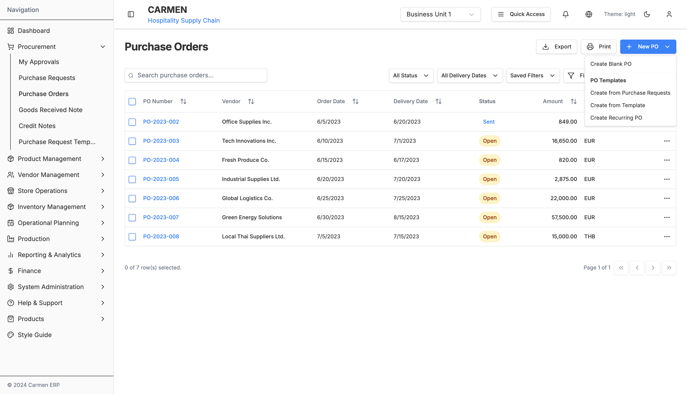
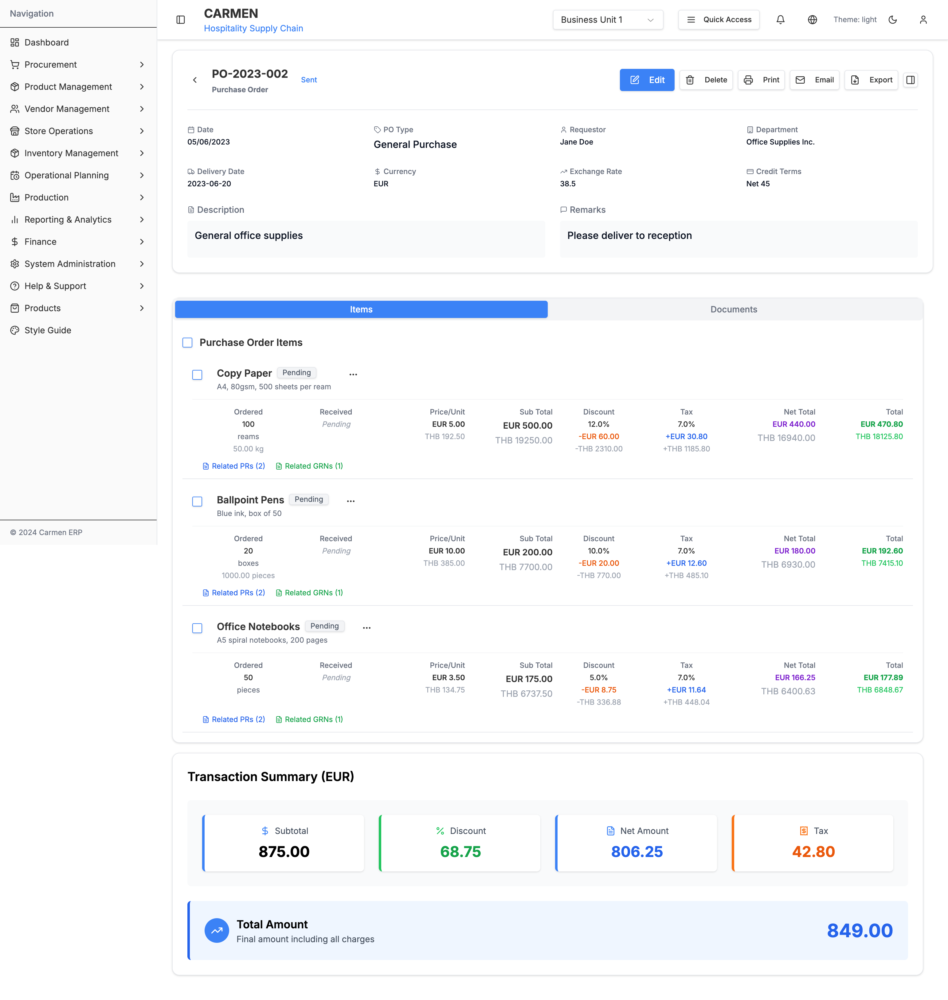
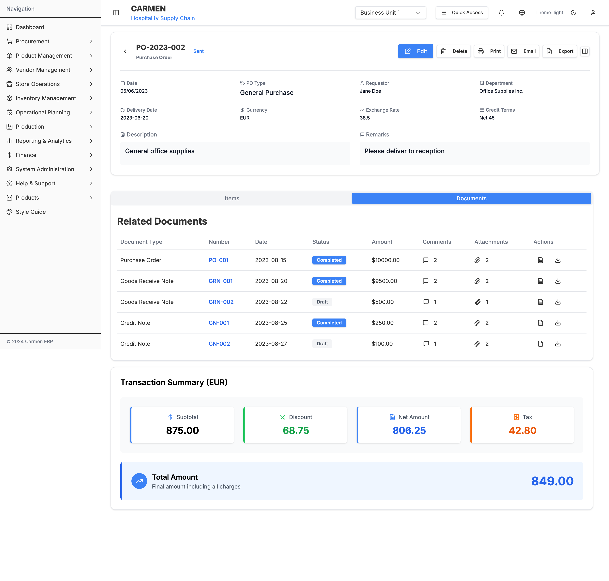

# Purchase Order Module - Complete Technical Specification

## Table of Contents
1. [Module Overview](#module-overview)
2. [Site Map](#site-map)
3. [Pages & Components](#pages--components)
4. [Data Flow](#data-flow)
5. [User Interactions](#user-interactions)
6. [Technical Architecture](#technical-architecture)
7. [API Endpoints](#api-endpoints)
8. [Database Schema](#database-schema)

## Module Overview

The Purchase Order (PO) module is a comprehensive procurement management system within the Carmen Hospitality ERP. It handles the complete lifecycle of purchase orders from creation to fulfillment, including multi-currency support, vendor management, and integration with Purchase Requests (PR) and Goods Received Notes (GRN).

### Key Features
- Purchase Order lifecycle management (Draft → Sent → Received → Closed)
- Multi-currency support with real-time exchange rates
- Integration with Purchase Requests for seamless procurement flow
- Comprehensive item management with inventory tracking
- Document management (attachments, comments, related documents)
- Advanced filtering and search capabilities
- Export and print functionality
- Activity logging and audit trail
- Bulk operations and template support

## Site Map

```mermaid
graph TD
    A[Purchase Orders Landing Page] --> B[PO List View]
    A --> C[PO Card View]

    B --> D[New PO Dropdown Menu]
    D --> E[Create Blank PO]
    D --> F[Create from Purchase Requests]
    D --> G[Create from Template]
    D --> H[Create Recurring PO]

    B --> I[PO Detail Page]
    I --> J[Items Tab]
    I --> K[Documents Tab]
    I --> L[Activity Log Sidebar]

    J --> M[Enhanced Items Table]
    M --> N[Item Details Panel]
    M --> O[Add Item Dialog]
    M --> P[Edit Item Dialog]

    K --> Q[Related Documents Table]
    Q --> R[GRN Links]
    Q --> S[Credit Note Links]
    Q --> T[Invoice Links]

    I --> U[Action Buttons]
    U --> V[Edit Mode]
    U --> W[Delete Dialog]
    U --> X[Print Options]
    U --> Y[Email Dialog]
    U --> Z[Export Dialog]

    F --> AA[PR Selection Dialog]
    AA --> AB[PR Items Table]
    AB --> AC[Grouped PO Creation]

    E --> AD[PO Creation Form]
    AD --> AE[Vendor Selection]
    AD --> AF[Currency Selection]
    AD --> AG[Terms & Conditions]

    I --> AH[Status Change Dialog]
    AH --> AI[Status Confirmation]
    AH --> AJ[Reason Input]

    B --> AK[Advanced Filters]
    AK --> AL[Status Filter]
    AK --> AM[Date Range Filter]
    AK --> AN[Vendor Filter]
    AK --> AO[Amount Range Filter]

    B --> AP[Bulk Actions]
    AP --> AQ[Bulk Export]
    AP --> AR[Bulk Print]
    AP --> AS[Bulk Status Update]
```

## Pages & Components

### 1. Purchase Orders Landing Page (`/procurement/purchase-orders`)

**File:** `app/(main)/procurement/purchase-orders/page.tsx`

**Components Used:**
- `PurchaseOrdersDataTable`
- `PurchaseOrderCardView`
- `CreatePOFromPR` (Dialog)
- `purchaseOrderColumns`

**Features:**
- Responsive data table with sorting and filtering
- Toggle between table and card views
- Search functionality
- New PO dropdown menu with multiple creation options
- Export and print functionality
- Bulk selection and actions

**Screenshots:**
- 
- 

### 2. Purchase Order Detail Page (`/procurement/purchase-orders/[id]`)

**File:** `app/(main)/procurement/purchase-orders/components/PODetailPage.tsx`

**Sub-components:**
- `EnhancedItemsTab` - Items management with advanced features
- `RelatedDocumentsTab` - Related GRN, invoices, credit notes
- `ActivityLogTab` - Complete audit trail
- `TransactionSummary` - Financial calculations
- `StatusBadge` - Dynamic status indicator

**Features:**
- Comprehensive PO header information with editable fields
- Two-tab interface (Items and Documents)
- Collapsible activity log sidebar
- Real-time financial calculations
- Status change workflow with validation
- Multiple action buttons (Edit, Delete, Print, Email, Export)

**Screenshots:**
- 
- 

### 3. Purchase Order Creation Pages

#### 3.1 Create Blank PO (`/procurement/purchase-orders/create`)
**File:** `app/(main)/procurement/purchase-orders/create/page.tsx`
- Redirects to PODetailPage with `id: 'new'`
- Fresh form with empty fields
- Add items manually

#### 3.2 Create from Purchase Requests (`/procurement/purchase-orders/create/from-pr`)
**File:** `app/(main)/procurement/purchase-orders/create/from-pr/page.tsx`
- PR selection interface
- Automatic grouping by vendor and currency
- Item aggregation and validation

#### 3.3 Bulk PO Creation (`/procurement/purchase-orders/create/bulk`)
**File:** `app/(main)/procurement/purchase-orders/create/bulk/page.tsx`
- Multiple PO creation from grouped PRs
- Batch processing interface

## Data Flow

### Purchase Order Lifecycle

```mermaid
stateDiagram-v2
    [*] --> Draft
    Draft --> Sent
    Sent --> PartiallyReceived
    Sent --> FullyReceived
    PartiallyReceived --> FullyReceived
    FullyReceived --> Closed
    Draft --> Voided
    Sent --> Cancelled
    PartiallyReceived --> Cancelled
    Cancelled --> [*]
    Voided --> [*]
    Closed --> [*]
```

### Component Data Flow

```mermaid
flowchart TD
    A[Mock Data Store] --> B[PO List Page]
    B --> C[PO Detail Page]
    C --> D[Items Tab]
    C --> E[Documents Tab]
    C --> F[Activity Log]

    D --> G[Item Management]
    G --> H[Add Item]
    G --> I[Edit Item]
    G --> J[Delete Item]

    H --> K[Item Form Dialog]
    I --> K

    E --> L[Related Documents]
    L --> M[GRN Navigation]
    L --> N[Credit Note Navigation]

    F --> O[Status Changes]
    F --> P[User Actions]
    F --> Q[System Events]

    C --> R[Status Change Dialog]
    R --> S[Confirmation]
    S --> T[Activity Log Update]

    C --> U[Export Dialog]
    U --> V[Format Selection]
    U --> W[Section Selection]
```

## User Interactions

### Primary User Flows

#### 1. Create Purchase Order from Scratch
1. Navigate to PO List page
2. Click "New PO" → "Create Blank PO"
3. Fill vendor and header information
4. Add items manually or from catalog
5. Set pricing, quantities, and terms
6. Save as Draft or Send to vendor

#### 2. Create Purchase Order from Purchase Requests
1. Navigate to PO List page
2. Click "New PO" → "Create from Purchase Requests"
3. Select approved PRs from dialog
4. System groups by vendor and currency
5. Review and modify grouped items
6. Generate one or multiple POs

#### 3. Process Purchase Order Items
1. Open PO Detail page
2. Navigate to Items tab
3. Review ordered vs received quantities
4. Process goods receipt (links to GRN)
5. Handle partial deliveries
6. Close completed line items

#### 4. Document Management
1. Open PO Detail page
2. Navigate to Documents tab
3. View related GRNs, invoices, credit notes
4. Access linked documents
5. Track document status and amounts

### Dialog & Modal Interactions

#### Status Change Dialog
- **Trigger:** Status dropdown change
- **Validation:** Requires reason for cancellation/void
- **Action:** Updates status with audit trail
- **Confirmation:** Prevents accidental status changes

#### Export Dialog
- **Format Options:** PDF, Excel, CSV
- **Section Selection:** Header, Items, Financial Summary, Vendor Info, Comments
- **Preview:** Shows selected sections
- **Download:** Generates and downloads file

#### Create from PR Dialog
- **Search & Filter:** Find relevant PRs
- **Multi-selection:** Choose multiple PRs
- **Grouping Preview:** Shows how POs will be created
- **Validation:** Ensures approved PRs only

## Technical Architecture

### Component Hierarchy

```
PurchaseOrdersPage
├── PurchaseOrdersDataTable
│   ├── DataTable (shadcn/ui)
│   ├── purchaseOrderColumns
│   └── TableToolbar
├── PurchaseOrderCardView
└── CreatePOFromPR (Dialog)

PODetailPage
├── DetailPageTemplate
├── StatusBadge
├── TransactionSummary
├── Tabs
│   ├── EnhancedItemsTab
│   │   ├── ItemDetailsComponent
│   │   ├── EnhancedPOItemRow
│   │   └── AddItemDialog
│   └── RelatedDocumentsTab
└── ActivityLogTab
```

### State Management

**Local State (React useState):**
- `viewMode`: Table vs Card view toggle
- `selectedPOs`: Multi-selection state
- `showCreateFromPRDialog`: Dialog visibility
- `poData`: Current PO being viewed/edited
- `isEditing`: Edit mode toggle
- `showDeleteDialog`: Delete confirmation
- `statusHistory`: Activity log entries

**URL State:**
- `id`: PO identifier
- Query parameters for creation mode (`fromPR`, `grouped`, `bulk`)

**Local Storage:**
- `groupedPurchaseRequests`: Temporary storage for PR → PO conversion
- `selectedPurchaseRequests`: Selected PRs for PO creation

### Data Types

```typescript
interface PurchaseOrder {
  poId: string
  number: string
  vendorId: number
  vendorName: string
  orderDate: Date
  status: PurchaseOrderStatus
  currencyCode: string
  baseCurrencyCode: string
  exchangeRate: number
  items: PurchaseOrderItem[]
  // ... additional fields
}

interface PurchaseOrderItem {
  id: string
  name: string
  description: string
  orderedQuantity: number
  receivedQuantity: number
  unitPrice: number
  taxRate: number
  discountRate: number
  // ... additional fields
}
```

## API Endpoints

### Purchase Orders
- `GET /api/purchase-orders` - List all POs with filtering
- `GET /api/purchase-orders/{id}` - Get specific PO
- `POST /api/purchase-orders` - Create new PO
- `PUT /api/purchase-orders/{id}` - Update PO
- `DELETE /api/purchase-orders/{id}` - Delete PO
- `PATCH /api/purchase-orders/{id}/status` - Update PO status

### Items Management
- `POST /api/purchase-orders/{id}/items` - Add item to PO
- `PUT /api/purchase-orders/{id}/items/{itemId}` - Update item
- `DELETE /api/purchase-orders/{id}/items/{itemId}` - Remove item

### Document Actions
- `GET /api/purchase-orders/{id}/export` - Export PO
- `POST /api/purchase-orders/{id}/email` - Email PO to vendor
- `GET /api/purchase-orders/{id}/related-documents` - Get related docs

### Bulk Operations
- `POST /api/purchase-orders/bulk-create` - Create multiple POs
- `POST /api/purchase-orders/bulk-export` - Export multiple POs
- `PATCH /api/purchase-orders/bulk-status` - Update multiple PO statuses

## Database Schema

### Purchase Orders Table
```sql
CREATE TABLE purchase_orders (
  po_id VARCHAR(20) PRIMARY KEY,
  number VARCHAR(50) UNIQUE NOT NULL,
  vendor_id INTEGER NOT NULL,
  vendor_name VARCHAR(255) NOT NULL,
  order_date DATE NOT NULL,
  delivery_date DATE,
  status VARCHAR(20) NOT NULL,
  currency_code VARCHAR(3) NOT NULL,
  base_currency_code VARCHAR(3) NOT NULL,
  exchange_rate DECIMAL(10,4) DEFAULT 1,
  credit_terms VARCHAR(100),
  description TEXT,
  remarks TEXT,
  sub_total_price DECIMAL(15,2) DEFAULT 0,
  discount_amount DECIMAL(15,2) DEFAULT 0,
  tax_amount DECIMAL(15,2) DEFAULT 0,
  total_amount DECIMAL(15,2) DEFAULT 0,
  created_by INTEGER NOT NULL,
  created_at TIMESTAMP DEFAULT CURRENT_TIMESTAMP,
  updated_at TIMESTAMP DEFAULT CURRENT_TIMESTAMP
);
```

### Purchase Order Items Table
```sql
CREATE TABLE purchase_order_items (
  id VARCHAR(36) PRIMARY KEY,
  po_id VARCHAR(20) NOT NULL,
  name VARCHAR(255) NOT NULL,
  description TEXT,
  ordered_quantity DECIMAL(10,3) NOT NULL,
  received_quantity DECIMAL(10,3) DEFAULT 0,
  order_unit VARCHAR(20) NOT NULL,
  unit_price DECIMAL(15,4) NOT NULL,
  tax_rate DECIMAL(5,2) DEFAULT 0,
  discount_rate DECIMAL(5,2) DEFAULT 0,
  sub_total_price DECIMAL(15,2) NOT NULL,
  discount_amount DECIMAL(15,2) DEFAULT 0,
  tax_amount DECIMAL(15,2) DEFAULT 0,
  total_amount DECIMAL(15,2) NOT NULL,
  status VARCHAR(20) DEFAULT 'Open',
  source_pr_id VARCHAR(20),
  source_pr_number VARCHAR(50),
  FOREIGN KEY (po_id) REFERENCES purchase_orders(po_id)
);
```

### Activity Log Table
```sql
CREATE TABLE po_activity_log (
  id VARCHAR(36) PRIMARY KEY,
  po_id VARCHAR(20) NOT NULL,
  user_id INTEGER NOT NULL,
  user_name VARCHAR(255) NOT NULL,
  action VARCHAR(100) NOT NULL,
  activity_type VARCHAR(50) NOT NULL,
  description TEXT,
  timestamp TIMESTAMP DEFAULT CURRENT_TIMESTAMP,
  FOREIGN KEY (po_id) REFERENCES purchase_orders(po_id)
);
```

---

*Generated on: $(date)*
*Module Version: 1.0*
*Last Updated: Latest*