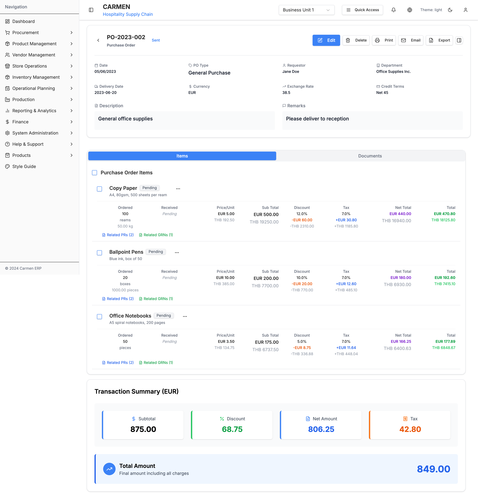

# Purchase Order Module - User Interaction Guide

## Table of Contents
1. [Navigation & Entry Points](#navigation--entry-points)
2. [Primary User Workflows](#primary-user-workflows)
3. [Dialog Interactions](#dialog-interactions)
4. [Form Interactions](#form-interactions)
5. [Data Management](#data-management)
6. [Advanced Features](#advanced-features)

## Navigation & Entry Points

### Main Navigation
- **Primary Access:** Procurement → Purchase Orders (sidebar menu)
- **Breadcrumb:** Dashboard → Procurement → Purchase Orders
- **URL Pattern:** `/procurement/purchase-orders`

### Direct Links
- **Specific PO:** `/procurement/purchase-orders/[PO-ID]`
- **Create New:** `/procurement/purchase-orders/create`
- **From PR:** `/procurement/purchase-orders/create/from-pr`
- **Bulk Create:** `/procurement/purchase-orders/create/bulk`

## Primary User Workflows

### 1. Create Purchase Order from Scratch

**Step-by-Step Process:**

1. **Navigate to PO List**
   - Click "Procurement" in sidebar
   - Select "Purchase Orders"

2. **Initiate Creation**
   - Click "New PO" button
   - Select "Create Blank PO" from dropdown

3. **Fill Header Information**
   - Enter Order Date (defaults to today)
   - Select Vendor from dropdown
   - Set Delivery Date
   - Choose Currency
   - Enter Exchange Rate (if applicable)
   - Add Credit Terms
   - Write Description and Remarks

4. **Add Items**
   - Navigate to Items tab
   - Click "Add Item" button
   - Fill item details:
     - Product Name and Description
     - Quantity and Units
     - Unit Price
     - Tax Rate
     - Discount Rate
   - Save item

5. **Review Financial Summary**
   - Check calculated totals
   - Verify currency amounts
   - Confirm tax calculations

6. **Save and Send**
   - Save as Draft for later editing
   - Or change status to "Sent" to submit to vendor

**Screenshot References:**
- 

### 2. Create Purchase Order from Purchase Requests

**Step-by-Step Process:**

1. **Access PR to PO Conversion**
   - From PO List page
   - Click "New PO" → "Create from Purchase Requests"

2. **Select Purchase Requests**
   - Dialog opens with available approved PRs
   - Use search to find specific PRs
   - Apply filters (vendor, date, amount)
   - Select multiple PRs using checkboxes

3. **Review Grouping**
   - System automatically groups by vendor and currency
   - Preview shows how many POs will be created
   - Review items that will be included

4. **Confirm Creation**
   - Click "Create PO(s)" button
   - System processes grouping logic
   - Redirects to first PO or bulk creation page

5. **Review Generated PO**
   - Check vendor information is correct
   - Verify all PR items are included
   - Adjust quantities if needed
   - Modify terms and conditions

6. **Finalize**
   - Save as Draft or Send to vendor
   - System maintains PR traceability

### 3. Process Purchase Order Items

**Item Management Workflow:**

1. **Access Items Tab**
   - Open specific PO detail page
   - Click on "Items" tab

2. **Review Item Status**
   - Check ordered vs received quantities
   - Monitor delivery status
   - Identify pending items

3. **Process Goods Receipt**
   - Click "Related GRNs" for item
   - Navigate to Goods Received Note
   - Record actual received quantities
   - Update item status automatically

4. **Handle Partial Deliveries**
   - Use "Split Line" function for partial delivery
   - Create separate line items
   - Track multiple delivery dates

5. **Close Completed Items**
   - Mark items as "Fully Received"
   - Close line items when complete
   - Update PO status when all items complete

### 4. Manage Purchase Order Status

**Status Change Workflow:**

1. **Access Status Controls**
   - Open PO detail page
   - Enter edit mode
   - Use status dropdown

2. **Select New Status**
   - Choose from available status options
   - System validates status progression

3. **Provide Justification (if required)**
   - For cancellation/void: reason required
   - Enter detailed explanation
   - Specify business justification

4. **Confirm Change**
   - Review status change impact
   - Confirm action in dialog
   - System updates activity log

5. **Verify Update**
   - Check status badge updated
   - Review activity log entry
   - Confirm workflow progression

## Dialog Interactions

### 1. Create from Purchase Requests Dialog

**Interface Elements:**
- Search bar for PR filtering
- Filter buttons (status, vendor, date)
- Checkbox selection for multiple PRs
- Data table with PR details
- Summary panel showing selection count
- Preview of PO grouping

**User Actions:**
- **Search:** Type PR number or description
- **Filter:** Click filter buttons to narrow results
- **Select:** Use checkboxes to select PRs
- **Select All:** Master checkbox for page selection
- **Preview:** Review how PRs will be grouped
- **Create:** Confirm selection and proceed

**Validation:**
- Only approved PRs selectable
- Must select at least one PR
- System checks for vendor conflicts

### 2. Status Change Confirmation Dialog

**Dialog Triggers:**
- Status dropdown change in edit mode
- Bulk status update operations
- Workflow progression actions

**Interface Elements:**
- Warning icon for critical changes
- Dynamic message based on status change
- Required reason field (for void/cancel)
- Confirm and Cancel buttons

**Business Rules:**
- Draft → Sent: Confirmation only
- Any → Cancelled/Voided: Reason required
- Cannot reverse certain progressions
- System validates status workflow

### 3. Export Configuration Dialog

**Format Selection:**
- Radio buttons for PDF, Excel, CSV
- Format-specific options
- Preview of output structure

**Section Selection:**
- Checkboxes for each section
- Header Information
- Items Detail
- Financial Summary
- Vendor Information
- Comments and Attachments

**Export Process:**
- Validate selections
- Generate file server-side
- Download prompt
- File naming convention

### 4. Item Management Dialogs

**Add Item Dialog:**
- Product search/selection
- Quantity and unit specification
- Pricing information entry
- Tax and discount configuration
- Inventory information display

**Edit Item Dialog:**
- Pre-populated with current values
- Modification tracking
- Validation of changes
- Impact on totals

## Form Interactions

### 1. Header Information Form

**Field Types and Validation:**

**Date Fields:**
- HTML5 date picker
- Default to current date
- Future date validation for delivery
- Weekend/holiday consideration

**Text Fields:**
- Auto-complete for vendor names
- Character limits enforced
- Required field indicators
- Real-time validation

**Numeric Fields:**
- Exchange rate: 4 decimal places
- Amount fields: 2 decimal places
- Quantity fields: 3 decimal places
- Negative value prevention

**Dropdown Fields:**
- Currency selection with search
- Vendor selection with filtering
- Status progression validation
- Dynamic option loading

### 2. Item Details Form

**Product Selection:**
- Searchable product catalog
- Recent items quick access
- Barcode scanning support
- Custom item creation

**Quantity Management:**
- Multiple unit support
- Conversion factor handling
- Stock level checking
- Reorder point alerts

**Pricing Configuration:**
- Multi-currency support
- Bulk discount tiers
- Tax calculation options
- Price history display

## Data Management

### 1. Search and Filtering

**Quick Filters:**
- Status-based filtering
- Date range selection
- Vendor filtering
- Amount range filtering
- Currency filtering

**Advanced Search:**
- Multi-criteria search
- Saved search preferences
- Complex query building
- Result sorting options

**Search Features:**
- Auto-complete suggestions
- Fuzzy matching
- Wildcard support
- Search history

### 2. Bulk Operations

**Selection Methods:**
- Individual row selection
- Page-level select all
- Filter-based selection
- Manual range selection

**Bulk Actions:**
- Status updates
- Export operations
- Print batches
- Email notifications
- Archive operations

**Progress Tracking:**
- Operation progress bars
- Success/failure reporting
- Error detail display
- Rollback capabilities

### 3. Data Export and Import

**Export Options:**
- PDF formatted reports
- Excel spreadsheets
- CSV data files
- XML structured data
- JSON API format

**Export Configurations:**
- Column selection
- Date range filtering
- Format customization
- Automated scheduling

## Advanced Features

### 1. Multi-Currency Handling

**Currency Operations:**
- Real-time exchange rates
- Historical rate tracking
- Currency conversion display
- Local currency preference

**Multi-Currency Display:**
- Primary currency (PO currency)
- Base currency (company default)
- Side-by-side comparison
- Conversion calculations

### 2. Approval Workflows

**Approval Routing:**
- Amount-based approval limits
- Department-based routing
- Escalation procedures
- Approval tracking

**Notification System:**
- Email notifications
- In-app notifications
- Mobile notifications
- Reminder scheduling

### 3. Integration Features

**Purchase Request Integration:**
- Seamless PR to PO conversion
- Traceability maintenance
- Status synchronization
- Workflow continuation

**Inventory Integration:**
- Stock level checking
- Reorder point monitoring
- Availability validation
- Reservation handling

**Vendor Integration:**
- Vendor catalog access
- Price agreement checking
- Contract compliance
- Performance tracking

---

*Generated on: Latest*
*User Interaction Guide Version: 1.0*