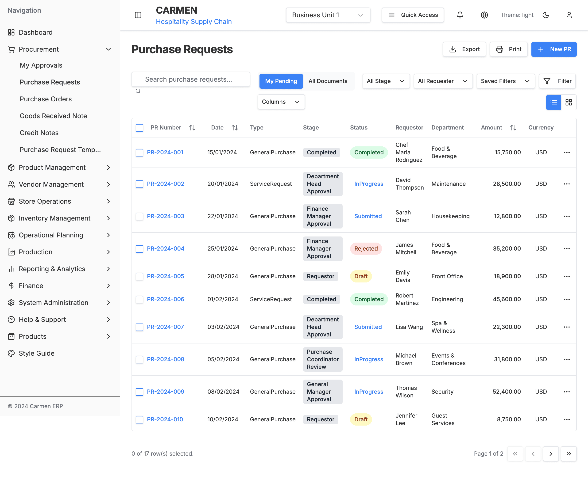
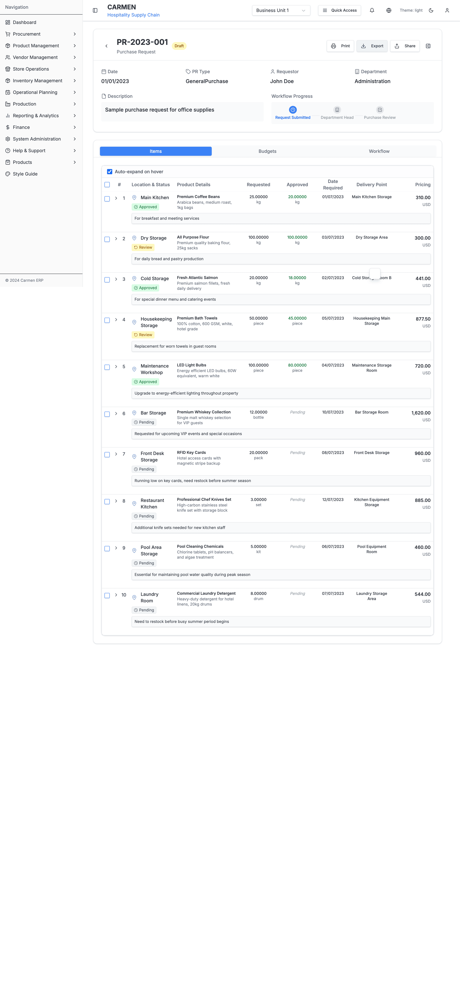

# Purchase Request Module - Implementation Specification

## Implementation Overview

**Document Type**: Technical Implementation Specification
**Module**: Purchase Request Management System
**Implementation Phase**: MVP Development
**Target Completion**: Q1 2024

This document provides detailed implementation guidance for developers building the Purchase Request module, focusing on architectural patterns, design decisions, implementation strategies, and best practices. Rather than providing specific code examples, this specification emphasizes the reasoning behind technical decisions, implementation patterns, and strategic approaches that ensure scalable, maintainable, and performant software delivery.

## Visual System Reference

### Purchase Request List Implementation

*Reference implementation showing data table patterns, filtering controls, status indicators, and responsive design principles used throughout the system.*

### Purchase Request Detail Implementation

*Implementation example demonstrating tab-based navigation, workflow status indicators, data formatting, and interactive table components with expandable rows.*

### Budget Management Implementation

*Reference for budget allocation interfaces showing color-coded status indicators, data validation feedback, and financial data presentation patterns.*

## Architecture Implementation

### 1. Technology Stack Implementation

#### 1.1 Frontend Architecture Strategy

**Framework Selection Rationale**
- Next.js 14 with App Router provides server-side rendering capabilities and optimal performance for large-scale applications
- React 18 enables concurrent features and improved user experience through progressive hydration
- TypeScript ensures type safety across the entire codebase and reduces runtime errors

**Styling and Component Strategy**
- Tailwind CSS provides utility-first approach for consistent design implementation
- shadcn/ui components offer accessible, customizable building blocks that maintain design system consistency
- Component composition pattern ensures reusability and maintainability

**Form Management Philosophy**
- React Hook Form minimizes re-renders and provides performant form handling
- Zod validation ensures runtime type safety and provides clear validation error messages
- Schema-driven approach enables sharing validation logic between frontend and backend

**State Management Architecture**
- React Query handles server state with intelligent caching and background synchronization
- Zustand manages client-side UI state with minimal boilerplate
- Context API provides user authentication and permission state across components

#### 1.2 Backend Integration Strategy

**API Communication Patterns**
- RESTful endpoints with consistent HTTP status codes and error handling
- Request/response interceptors for authentication token management and error processing
- Optimistic updates for immediate UI feedback with automatic rollback on failures

**Authentication and Authorization Approach**
- JWT tokens for stateless authentication with automatic refresh mechanisms
- Role-based access control implemented at both route and component levels
- Permission checks integrated into UI components to hide/show functionality based on user roles

**Data Validation Strategy**
- Shared validation schemas between frontend and backend ensure consistency
- Client-side validation provides immediate feedback while server-side validation ensures data integrity
- Progressive validation approach validates fields as users interact with forms

**Error Handling Philosophy**
- Centralized error boundaries catch and handle unexpected errors gracefully
- User-friendly error messages with actionable recovery suggestions
- Automatic retry mechanisms for transient network errors

**Real-time Communication**
- WebSocket integration for instant notifications and status updates
- Polling fallback for environments where WebSockets are not supported
- Event-driven architecture for workflow state changes and approvals

### 2. File Structure Implementation Strategy

#### 2.1 Directory Organization Philosophy

**Route-Based Organization**
- Next.js App Router structure with nested routes for intuitive navigation
- Dynamic routes ([id]) for parameterized pages like detail views
- Co-located loading and error components for enhanced user experience
- Separate creation routes for dedicated purchase request creation workflows

**Component Categorization Strategy**
- List components handle data display, filtering, and bulk operations
- Detail components manage individual purchase request viewing and editing
- Form components provide reusable input handling with validation
- Modal components offer overlay functionality for supplementary actions
- Tab components organize complex information into digestible sections

**Business Logic Organization**
- Custom hooks encapsulate component logic and provide reusable functionality
- Service layer abstracts API communication and business operations
- Type definitions ensure consistency across the entire module
- Utility functions provide pure, testable business logic

#### 2.2 Component Architecture Principles

**Separation of Concerns**
- Presentation components focus solely on UI rendering
- Container components handle state management and business logic
- Service components manage external API communication
- Utility components provide reusable helper functionality

**Dependency Management**
- Clear import/export patterns with barrel exports for cleaner imports
- Dependency injection pattern for testability and flexibility
- Interface-driven development for loose coupling between components
- Props-based composition for maximum reusability

**Performance Considerations**
- Lazy loading for heavy components and modals
- Code splitting at the route level for optimal bundle sizes
- Memoization strategies for expensive calculations and rendering
- Virtual scrolling for large data sets

### 3. Component Implementation Patterns

#### 3.1 Page Component Architecture

**Route Component Responsibilities**
- Parameter extraction from URL segments and query strings for dynamic routing
- Initial data fetching using custom hooks with proper loading and error states
- Permission checking based on user role and purchase request ownership
- Error boundary implementation for graceful error handling
- Mode detection for view/edit state management

**State Management Strategy**
- URL-driven state for navigation and deep linking capabilities
- React Query for server state management with automatic caching
- Local state for UI interactions that don't require persistence
- Permission state derived from user context and data ownership

**Error Handling Approach**
- Nested error boundaries to catch errors at different component levels
- Fallback UI components for various error states (network, permission, not found)
- User-friendly error messages with actionable recovery suggestions
- Automatic retry mechanisms for transient failures

**Loading State Management**
- Skeleton components for content areas during data fetching
- Progressive loading for different sections of complex pages
- Optimistic updates for immediate user feedback during mutations
- Suspense integration for code-split components

#### 3.2 Form Component Design Philosophy

**Form State Management Strategy**
- React Hook Form integration for performant form handling with minimal re-renders
- Zod schema validation for type-safe form validation with runtime checking
- Default value initialization based on templates or existing data for editing scenarios
- Real-time validation feedback with debounced field validation

**Validation Implementation Approach**
- Progressive validation that validates fields as users interact with them
- Cross-field validation for complex business rules (budget allocation matching total amounts)
- Async validation for external dependencies (vendor verification, budget code validation)
- Client-side validation with server-side validation as backup for data integrity

**User Experience Considerations**
- Auto-save functionality for draft purchase requests to prevent data loss
- Dynamic form sections that appear based on user selections or data requirements
- Intelligent field pre-population based on user history and preferences
- Clear visual feedback for validation errors with actionable correction guidance

**Data Flow Management**
- Controlled components for form inputs with proper state synchronization
- Optimistic updates for immediate user feedback during form submission
- Rollback mechanisms for failed submissions with preserved user input
- Integration with global state for user preferences and default values

**Accessibility Implementation**
- Proper ARIA labels and descriptions for screen reader compatibility
- Keyboard navigation support for all form elements
- Focus management for modal forms and multi-step workflows
- High contrast support and proper color coding for validation states

#### 3.3 Custom Hook Architecture

**Data Fetching Hook Design**
- Query key standardization for consistent cache management across components
- Intelligent stale time configuration based on data volatility and user interaction patterns
- Conditional query execution based on required parameters and user permissions
- Background refetching strategies for keeping data fresh without disrupting user experience

**Mutation Hook Strategy**
- Optimistic update patterns for immediate UI feedback during data modifications
- Cache invalidation strategies that maintain data consistency across related queries
- Error handling with automatic retry for transient failures and user notification for permanent errors
- Success callback integration for navigation and user feedback management

**State Synchronization Approach**
- Manual cache updates for predictable data changes to avoid unnecessary network requests
- Intelligent query invalidation that only refetches affected data
- Relationship management between related data entities (purchase requests, vendors, items)
- Cache warming strategies for anticipated user navigation patterns

**Performance Optimization Techniques**
- Debounced queries for search and filter operations to reduce API calls
- Pagination support with infinite scroll capabilities for large data sets
- Selective data fetching to minimize payload sizes and improve response times
- Background synchronization for offline-first functionality

**Business Logic Integration**
- Permission checking integrated into data fetching hooks for security
- Role-based data filtering at the hook level for appropriate data access
- Workflow state management with automatic status polling for real-time updates
- Integration with notification systems for workflow events and status changes

### 4. State Management Implementation Strategy

#### 4.1 React Query Configuration Approach

**Cache Management Philosophy**
- Intelligent stale time configuration based on data volatility and business requirements
- Differentiated cache times for various data types (user data vs. transactional data)
- Strategic cache invalidation that balances data freshness with performance
- Background refetching to keep frequently accessed data current

**Error Handling and Retry Logic**
- Conditional retry strategies based on error types and HTTP status codes
- Exponential backoff for transient network errors to avoid overwhelming servers
- Immediate failure for client errors (4xx) that won't resolve with retries
- User notification integration for permanent failures requiring manual intervention

**Performance Optimization Strategies**
- Query deduplication to prevent multiple identical requests
- Selective query invalidation to minimize unnecessary network requests
- Intelligent prefetching for anticipated user navigation patterns
- Memory management for large data sets with appropriate garbage collection

#### 4.2 UI State Management Architecture

**Client State Separation Strategy**
- Clear separation between server state (React Query) and client UI state (Zustand)
- Persistent UI preferences stored in local storage for user experience continuity
- Temporary UI state for modal management and user interactions
- Global UI state for cross-component communication and shared user preferences

**State Structure Design Philosophy**
- Flat state structure for optimal performance and predictable updates
- Normalized state for complex nested data relationships
- Immutable update patterns to ensure proper re-rendering and state consistency
- Action-based state modifications for clear state transition tracking

**Modal and Overlay Management**
- Centralized modal state management for consistent user experience
- Context-aware modal data passing for dynamic content rendering
- Stack-based modal management for nested overlay scenarios
- Focus management and keyboard navigation for accessibility compliance

**Filter and Search State Management**
- URL synchronization for shareable filter states and deep linking
- Debounced filter application to balance responsiveness with performance
- Filter history for improved user experience and quick access to common filters
- Real-time filter feedback with loading states during data fetching

**Selection and Bulk Operation State**
- Efficient selection state management for large data sets
- Cross-page selection persistence during pagination
- Bulk operation state with progress tracking and error handling
- Undo functionality for accidental bulk operations

### 5. Service Layer Implementation Architecture

#### 5.1 API Service Design Patterns

**Service Abstraction Philosophy**
- Clean separation between API communication logic and business components
- Consistent interface patterns across all service modules for predictable usage
- Error handling abstraction that provides meaningful error messages to components
- Request/response transformation to normalize data formats between frontend and backend

**HTTP Client Configuration**
- Centralized HTTP client with request/response interceptors for consistent handling
- Authentication token management with automatic refresh mechanisms
- Request timeout configuration appropriate for different operation types
- Response data normalization to ensure consistent data structures

**Parameter Handling Strategy**
- URL parameter encoding for complex filter objects and search criteria
- Query string optimization to minimize URL length while maintaining functionality
- Type-safe parameter validation to prevent runtime errors
- Default parameter handling for common use cases and user preferences

**CRUD Operation Patterns**
- Standardized method signatures across all entity services for consistency
- Partial update support for efficient data modification without full object replacement
- Bulk operation support with progress tracking and partial failure handling
- Optimistic locking for concurrent modification prevention

**Workflow Integration Approach**
- Dedicated workflow methods that encapsulate business logic for state transitions
- Action validation to ensure only permitted transitions based on current state and user permissions
- Audit trail integration for compliance and tracking requirements
- Real-time notification triggers for workflow events and status changes

#### 5.2 Workflow Engine Implementation Strategy

**Business Rule Engine Design**
- Configurable approval thresholds that can be modified without code changes
- Multi-criteria decision making based on amount, department, urgency, and item types
- Conditional routing logic that adapts to organizational structure changes
- Exception handling for special cases and emergency approvals

**State Transition Management**
- Finite state machine implementation for predictable workflow progression
- Validation rules that prevent invalid state transitions and maintain data integrity
- Rollback capabilities for correcting workflow errors and handling disputes
- Audit logging for compliance and tracking of all workflow decisions

**Permission-Based Action Filtering**
- Dynamic action availability based on user roles and current purchase request state
- Context-aware permissions that consider ownership, delegation, and temporary assignments
- Hierarchical approval chains with automatic escalation for time-sensitive requests
- Cross-departmental approval routing for complex organizational structures

**Workflow Automation Features**
- Timer-based automatic escalation for requests that exceed approval timeframes
- Notification triggers for stakeholders at each workflow stage transition
- Batch approval capabilities for routine, low-value purchase requests
- Integration with external approval systems and document management platforms

**Workflow Analytics and Monitoring**
- Performance metrics tracking for approval times and bottleneck identification
- Workflow efficiency analysis with recommendations for process improvement
- Exception reporting for requests that require manual intervention
- Historical workflow data for compliance auditing and process optimization

### 6. Validation Implementation Strategy

#### 6.1 Schema-Driven Validation Architecture

**Type-Safe Validation Philosophy**
- Runtime type checking using Zod schemas to ensure data integrity across client and server
- Compile-time type generation from validation schemas for consistent TypeScript types
- Centralized validation rules that can be shared between frontend and backend systems
- Progressive validation that provides immediate feedback during user input

**Field-Level Validation Rules**
- String field validation with appropriate length limits and format requirements
- Numeric field validation with business-appropriate ranges and precision constraints
- Date validation with business logic for required dates and deadline constraints
- Enum validation for controlled vocabularies and status fields

**Cross-Field Validation Logic**
- Budget allocation validation ensuring totals match line item amounts
- Business rule validation for organizational policies and approval thresholds
- Dependency validation between related fields (vendor selection affects pricing)
- Conditional validation based on user roles and request characteristics

**Custom Validation Rules**
- Regular expression patterns for reference number formats and identifiers
- Business logic validation for workflow transitions and state changes
- External validation for vendor codes, budget codes, and organizational references
- Asynchronous validation for duplicate checking and external system integration

**Error Message Strategy**
- User-friendly error messages with clear guidance for correction
- Contextual validation messages that explain business rules and requirements
- Field-specific error highlighting with accessible color and icon indicators
- Summary validation messages for form-level errors and complex validation failures

### 7. Testing Implementation Strategy

#### 7.1 Component Testing Philosophy

**Testing Library Integration Approach**
- User-centric testing that focuses on behavior rather than implementation details
- Accessibility-driven test queries using roles, labels, and text content
- Real user interaction simulation with proper event handling and timing
- Mock-free testing where possible to ensure realistic component behavior

**Test Environment Setup Strategy**
- Provider wrapper patterns for context providers and query clients
- Test-specific configuration that disables retries and other production behaviors
- Mock data factories for consistent and maintainable test scenarios
- Cleanup utilities to ensure test isolation and prevent state leakage

**Component Testing Patterns**
- Rendering tests that verify proper component structure and content display
- Interaction tests that simulate user workflows and verify expected outcomes
- Validation testing that confirms form validation rules and error handling
- State management testing that verifies proper state updates and side effects

**Assertion Strategies**
- Behavior-focused assertions that verify user-visible outcomes
- Accessibility assertions using screen reader compatible queries
- Async assertion patterns with proper waiting for state changes
- Snapshot testing for complex component structures with careful maintenance

**Mock Management Philosophy**
- Minimal mocking to preserve realistic component behavior and integration
- Service layer mocking to isolate component logic from external dependencies
- User event mocking that accurately simulates real user interactions
- Time-based mocking for testing time-sensitive features and workflows

#### 7.2 Custom Hook Testing Strategy

**Hook Testing Methodology**
- Isolated hook testing that focuses on hook logic without component dependencies
- Provider pattern testing that ensures proper context integration
- State transition testing that verifies hook behavior across different states
- Side effect testing that confirms proper cleanup and dependency management

**Mock Strategy for External Dependencies**
- Service layer mocking to control API responses and error conditions
- Timer mocking for testing debounced operations and time-based logic
- Browser API mocking for local storage, network status, and other web APIs
- React Query testing utilities for cache management and query state verification

**Async Hook Testing Patterns**
- Loading state verification during asynchronous operations
- Success state testing with proper data transformation and caching
- Error state testing with various error types and recovery mechanisms
- Race condition testing for concurrent operations and request cancellation

**Hook Integration Testing**
- Multi-hook interaction testing for complex state dependencies
- Context provider integration testing for global state management
- Custom hook composition testing for reusable hook patterns
- Performance testing for expensive operations and memoization effectiveness

**Test Data Management**
- Mock data factories for consistent and varied test scenarios
- Edge case data generation for boundary testing and error conditions
- Realistic data patterns that reflect actual usage scenarios
- Test data versioning for maintaining consistency across test suites

#### 7.3 End-to-End Testing Strategy

**User Journey Testing Philosophy**
- Complete workflow testing that simulates real user scenarios from start to finish
- Role-based testing that verifies different user permissions and access levels
- Cross-browser testing to ensure consistent functionality across different environments
- Mobile and responsive testing for optimal user experience on all devices

**Test Environment Management**
- Isolated test databases with predictable data states for consistent test results
- User authentication setup with test accounts for different roles and permissions
- Mock external services to eliminate dependencies on third-party systems
- Test data seeding for complex scenarios and edge cases

**Page Object Model Implementation**
- Reusable page objects that encapsulate UI interactions and element selectors
- Component-based page objects that match the application's component architecture
- Action-based methods that focus on user workflows rather than technical implementation
- Assertion helpers that provide meaningful error messages and debugging information

**Workflow Testing Patterns**
- Purchase request creation workflows with various templates and configurations
- Approval workflow testing with different approval paths and decision points
- Bulk operation testing for efficiency and error handling verification
- Integration testing between related modules and external systems

**Visual and Accessibility Testing**
- Screenshot comparison testing for visual regression detection
- Accessibility testing with automated tools and manual verification
- Performance testing for page load times and user interaction responsiveness
- Cross-device testing for responsive design and mobile functionality

**Error Scenario Testing**
- Network failure simulation and recovery testing
- Validation error testing with various invalid input combinations
- Permission error testing for unauthorized access attempts
- System error testing for graceful degradation and error recovery

### 8. Performance Implementation Strategy

#### 8.1 Code Splitting and Lazy Loading Architecture

**Dynamic Import Strategy**
- Route-level code splitting for optimal initial bundle size and faster page loads
- Component-level lazy loading for heavy components that are not immediately visible
- Modal and overlay lazy loading to defer loading until user interaction requires them
- Feature-based code splitting for optional functionality and advanced features

**Suspense Integration Patterns**
- Loading fallback components that provide immediate visual feedback during module loading
- Error boundary integration for graceful handling of code splitting failures
- Progressive loading strategies that prioritize critical content over supplementary features
- Preloading strategies for anticipated user interactions and navigation patterns

**Bundle Optimization Techniques**
- Tree shaking configuration to eliminate unused dependencies and reduce bundle size
- Dynamic imports with proper chunk naming for better caching and debugging
- Library splitting to leverage browser caching for stable third-party dependencies
- Critical path optimization to ensure essential functionality loads first

#### 8.2 React Performance Optimization Strategy

**Component Memoization Philosophy**
- Strategic use of React.memo for components that receive stable props and render expensive content
- Careful consideration of memoization overhead versus actual performance benefits
- Props comparison strategies to ensure memoization effectiveness
- Component splitting to maximize memoization benefits for specific component sections

**Hook Optimization Patterns**
- useMemo for expensive calculations that depend on specific dependencies
- useCallback for event handlers passed to child components to prevent unnecessary re-renders
- Custom hook memoization for complex business logic and derived state calculations
- Dependency array optimization to minimize unnecessary recalculations

**Render Optimization Techniques**
- Stable key props for list rendering to optimize React's reconciliation process
- Component composition patterns that minimize prop drilling and context usage
- State co-location to prevent unnecessary parent component re-renders
- Virtualization for large lists and data tables to manage DOM node count

**Memory Management Strategy**
- Cleanup functions for subscriptions, timers, and event listeners to prevent memory leaks
- Proper dependency management to avoid closure-related memory retention
- Image and asset optimization with appropriate sizing and format selection
- Cache management strategies that balance performance with memory usage

#### 8.3 Large Data Set Optimization Strategy

**Virtualization Implementation Philosophy**
- Virtual scrolling for lists exceeding 100 items to maintain consistent DOM performance
- Dynamic item sizing for variable content heights while maintaining smooth scrolling
- Viewport-based rendering that only creates DOM nodes for visible items
- Buffer zone implementation to provide smooth scrolling experience with slight content preloading

**Pagination and Infinite Loading Patterns**
- Server-side pagination with appropriate page sizes based on user interaction patterns
- Infinite scroll implementation with intersection observer for automatic data loading
- Search result pagination with proper state management and URL synchronization
- Load more patterns for user-controlled data fetching with clear progress indicators

**Data Fetching Optimization**
- Background data prefetching for anticipated user navigation and interactions
- Incremental data loading that prioritizes essential information over supplementary details
- Query batching to reduce network requests and improve perceived performance
- Cache-first strategies that leverage previously fetched data for immediate display

**Search and Filter Performance**
- Debounced search input to balance responsiveness with API request frequency
- Client-side filtering for small data sets with server-side filtering for large collections
- Filter state optimization that minimizes unnecessary data refetching
- Search result highlighting with efficient string matching algorithms

### 9. Implementation Best Practices Summary

#### 9.1 Development Workflow Guidelines

**Code Quality Standards**
- TypeScript strict mode enforcement for comprehensive type safety
- ESLint and Prettier integration for consistent code formatting and style
- Pre-commit hooks for automated testing and quality checks
- Code review processes that emphasize maintainability and performance

**Testing Integration Strategy**
- Test-driven development approach for critical business logic and workflows
- Continuous integration testing with automated test execution on code changes
- Coverage requirements that ensure adequate testing without obsessing over arbitrary metrics
- Performance testing integration for regression detection and optimization verification

**Documentation and Knowledge Sharing**
- Inline documentation for complex business logic and algorithmic decisions
- Component documentation with usage examples and prop specifications
- Architecture decision records for significant technical choices and trade-offs
- Regular knowledge sharing sessions for team alignment and continuous learning

#### 9.2 Deployment and Monitoring Considerations

**Performance Monitoring Implementation**
- Real User Monitoring (RUM) integration for actual user experience measurement
- Core Web Vitals tracking for Google search performance optimization
- Error tracking and alerting for proactive issue identification and resolution
- Performance budgets with automated alerts for regression prevention

**Scalability Planning**
- Database query optimization for efficient data retrieval at scale
- CDN integration for static asset delivery and global performance optimization
- Caching strategies at multiple levels (browser, CDN, application, database)
- Load balancing considerations for high-availability deployment scenarios

**Security Implementation Guidelines**
- Input sanitization and validation at both client and server levels
- HTTPS enforcement for all data transmission and API communication
- Role-based access control implementation with principle of least privilege
- Regular security audits and dependency vulnerability scanning

## Document History

| Version | Date | Author | Changes |
|---------|------|--------|---------|
| 1.0.0 | 2025-11-19 | Documentation Team | Initial version |
---

This implementation specification provides comprehensive guidance for developers to build the Purchase Request module according to established patterns and best practices, ensuring consistency, maintainability, performance, and scalability across the entire application. The focus on explanations rather than code examples allows developers to adapt these principles to their specific implementation needs while maintaining architectural integrity.