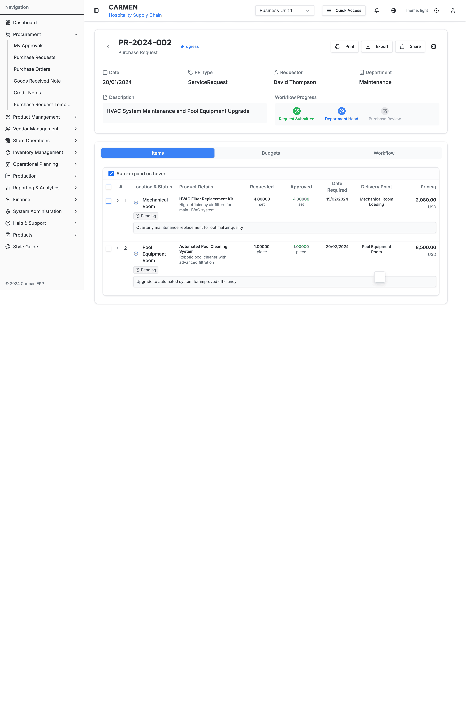
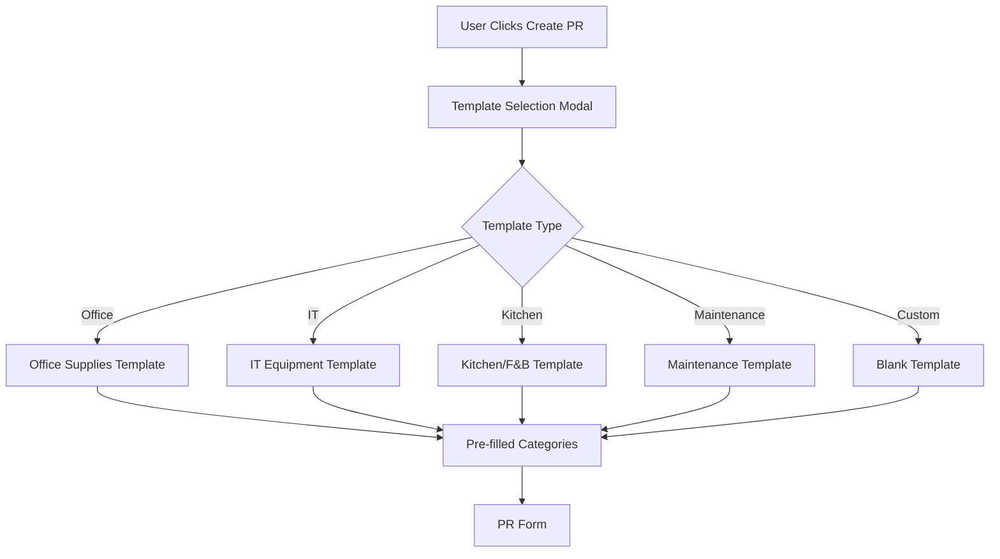
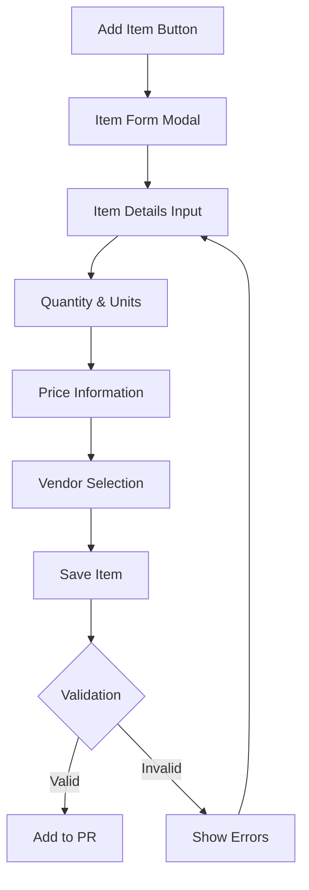
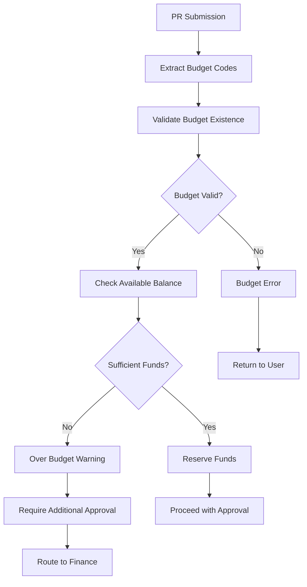
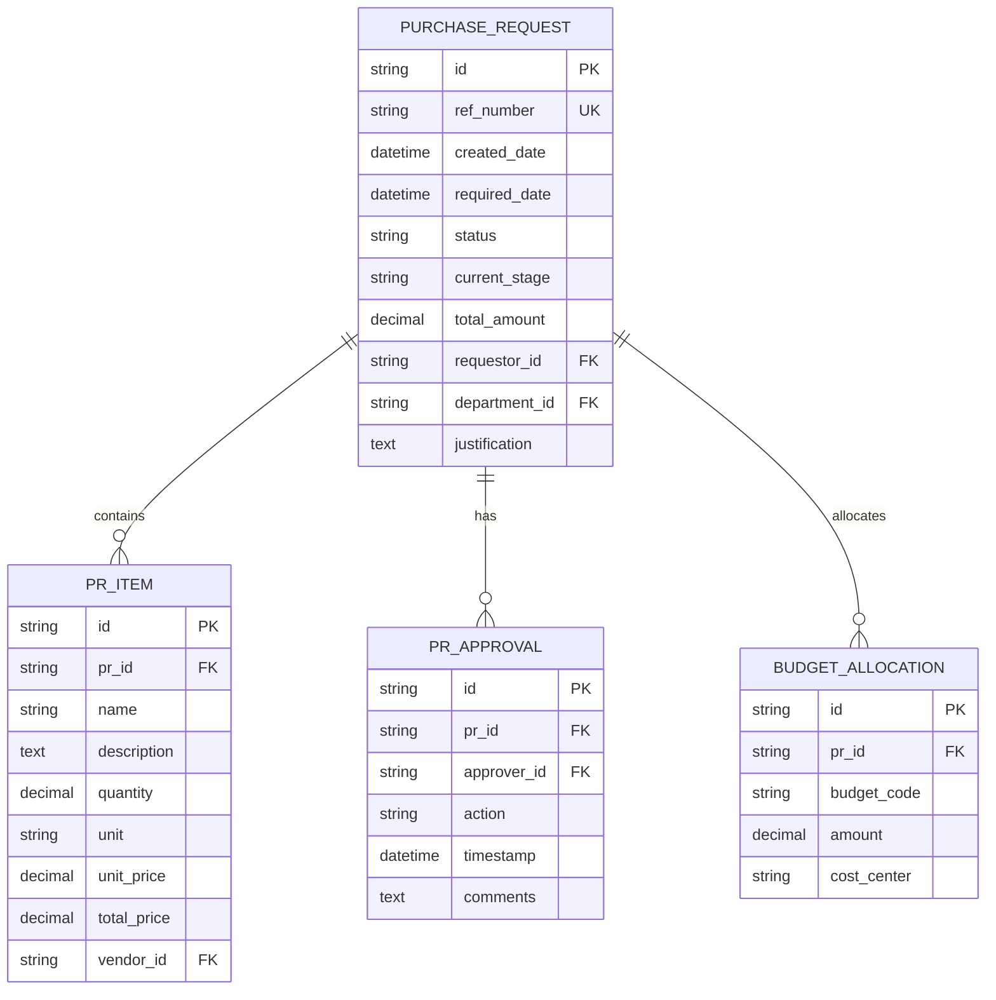
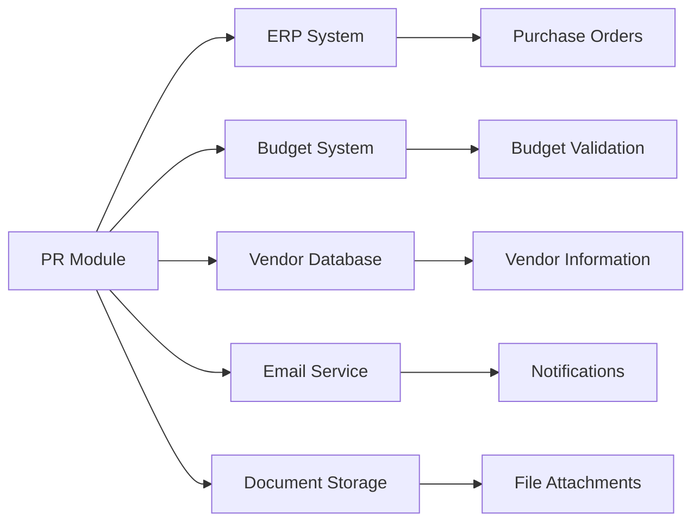
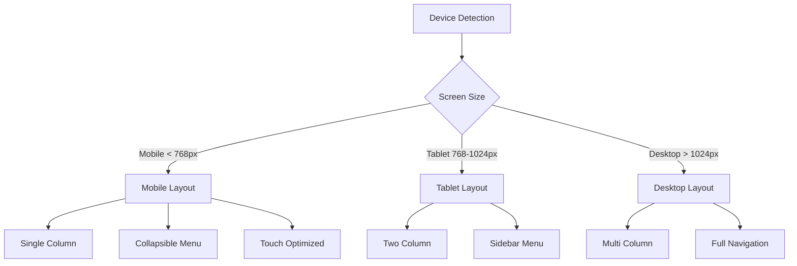
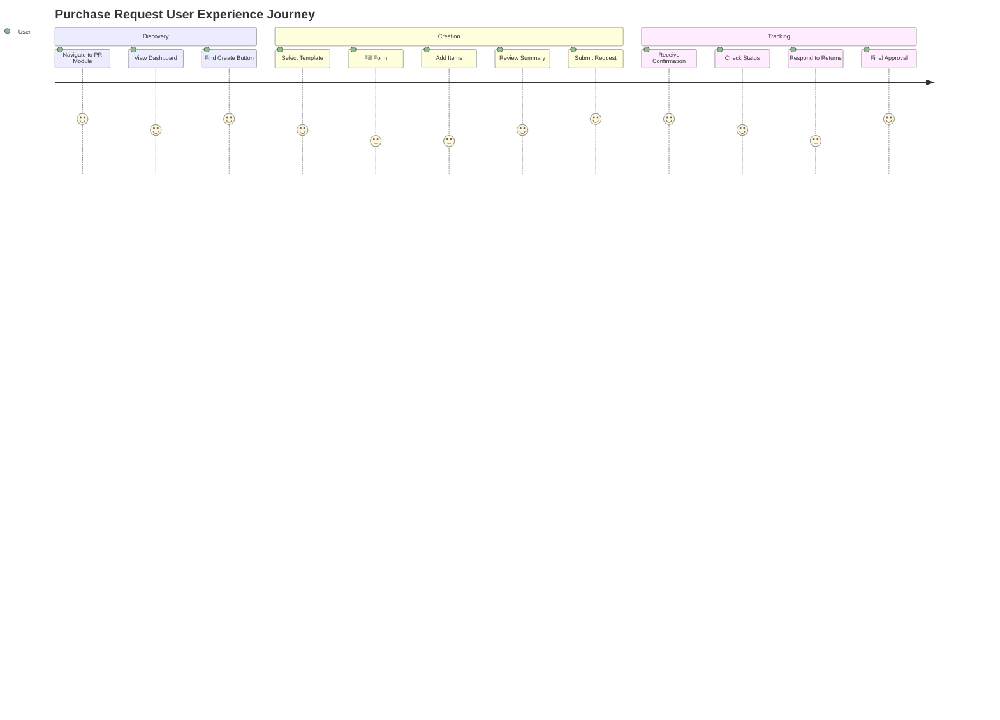

# Purchase Request Module - Detailed Specification

## Module Overview

**Module Name**: Purchase Request Management System
**Module Code**: `PR_MGT`
**Version**: 1.0.0
**Last Updated**: 2024-12-23
**Status**: Active Development

## Document History

| Version | Date | Author | Changes |
|---------|------|--------|---------|
| 1.0.0 | 2025-11-19 | Documentation Team | Initial version |
### Purpose
The Purchase Request Module is a comprehensive procurement initiation system that allows users to create, submit, approve, and track purchase requests throughout the organization's approval workflow.

### Scope
This module handles the complete lifecycle of purchase requests from initial creation through final approval and conversion to purchase orders, including vendor management, budget validation, and workflow automation.

## System Screenshots

### Purchase Request List View


*The main Purchase Request list interface showing filtering, sorting, and status management capabilities with comprehensive data display including requestor, department, amounts, and workflow status.*

### Purchase Request Detail View - Items Tab


*Detailed view of a purchase request showing the Items tab with comprehensive item management, including location status, product details, pricing, and approval workflow progress indicators.*

### Purchase Request Detail View - Budget Tab


*Budget allocation management interface showing budget categories, total budget amounts, soft and hard commitments, available budget, and current PR amounts with status indicators for budget compliance.*

### System Dashboard Context


*Carmen ERP dashboard showing the procurement context with key metrics including total orders, active suppliers, inventory value, and monthly spend analytics.*

## Functional Requirements

### 1. Purchase Request Creation

#### 1.1 Template-Based Creation


**Requirements**:
- **PR-REQ-001**: System shall provide predefined templates for common purchase categories
- **PR-REQ-002**: Templates shall pre-populate relevant item categories and default values
- **PR-REQ-003**: Users shall be able to modify template items before submission
- **PR-REQ-004**: System shall support custom/blank template creation

#### 1.2 Form Data Collection
```typescript
interface PurchaseRequestForm {
  // Basic Information
  requestorId: string;
  departmentId: string;
  locationId: string;
  priority: 'low' | 'medium' | 'high' | 'urgent';
  requiredDate: Date;
  justification: string;

  // Items
  items: PurchaseRequestItem[];

  // Budget
  budgetCode?: string;
  costCenter?: string;

  // Approval
  approvalRoute?: 'standard' | 'expedited' | 'executive';
}
```

**Requirements**:
- **PR-REQ-005**: System shall capture all mandatory fields before submission
- **PR-REQ-006**: System shall validate required date is future date
- **PR-REQ-007**: System shall enforce character limits on text fields
- **PR-REQ-008**: System shall auto-populate requestor information from user session

### 2. Item Management

#### 2.1 Item Addition and Configuration


**Requirements**:
- **PR-REQ-009**: System shall support unlimited items per purchase request
- **PR-REQ-010**: Each item shall have name, description, quantity, unit, and estimated price
- **PR-REQ-011**: System shall validate numeric fields for quantity and price
- **PR-REQ-012**: System shall support multiple units of measure per item type

#### 2.2 Vendor Management Integration
```typescript
interface ItemVendorSelection {
  preferredVendor?: Vendor;
  alternativeVendors: Vendor[];
  priceQuotes: PriceQuote[];
  selectedQuote?: PriceQuote;
  justification?: string;
}
```

**Requirements**:
- **PR-REQ-013**: System shall integrate with vendor database for selection
- **PR-REQ-014**: System shall display vendor ratings and performance history
- **PR-REQ-015**: System shall support multiple price quotes per item
- **PR-REQ-016**: System shall track vendor selection justification

### 3. Workflow Management

#### 3.1 Approval Routing Engine

```mermaid
stateDiagram-v2
    [*] --> Draft

    Draft --> Submitted : Submit for Approval

    Submitted --> DeptApproval : Value < $5000
    Submitted --> FinanceApproval : Value $5000-$10000
    Submitted --> GMApproval : Value > $10000

    DeptApproval --> FinanceApproval : Approved & Value > $1000
    DeptApproval --> Purchasing : Approved & Value ≤ $1000
    DeptApproval --> Rejected : Rejected
    DeptApproval --> Draft : Returned

    FinanceApproval --> GMApproval : Approved & Value > $10000
    FinanceApproval --> Purchasing : Approved
    FinanceApproval --> Rejected : Rejected
    FinanceApproval --> DeptApproval : Returned

    GMApproval --> Purchasing : Approved
    GMApproval --> Rejected : Rejected
    GMApproval --> FinanceApproval : Returned

    Purchasing --> Completed : Processed
    Purchasing --> OnHold : Vendor Issues

    OnHold --> Purchasing : Issues Resolved

    Rejected --> [*]
    Completed --> [*]
```


**Requirements**:
- **PR-REQ-017**: System shall route approval based on total request value
- **PR-REQ-018**: System shall support department-specific approval workflows
- **PR-REQ-019**: System shall track approval timestamps and comments
- **PR-REQ-020**: System shall send notifications at each workflow stage

#### 3.2 Role-Based Permissions
```typescript
interface WorkflowPermissions {
  canCreate: boolean;
  canEdit: boolean;
  canDelete: boolean;
  canApprove: boolean;
  canReject: boolean;
  canReturn: boolean;
  canViewFinancials: boolean;
  canOverridePrices: boolean;
}

type UserRole = 'requester' | 'dept_manager' | 'finance_manager' | 'purchasing_staff' | 'gm';
```

**Requirements**:
- **PR-REQ-021**: System shall enforce role-based access control
- **PR-REQ-022**: System shall hide/show UI elements based on permissions
- **PR-REQ-023**: System shall validate permissions on all API operations
- **PR-REQ-024**: System shall maintain audit trail of permission-based actions

### 4. Budget Integration

#### 4.1 Budget Validation


**Requirements**:
- **PR-REQ-025**: System shall validate budget codes against financial system
- **PR-REQ-026**: System shall check available budget balance before approval
- **PR-REQ-027**: System shall reserve funds upon approval
- **PR-REQ-028**: System shall handle over-budget scenarios with escalation

### 5. Reporting and Analytics

#### 5.1 Dashboard Metrics
```typescript
interface PRDashboardMetrics {
  totalRequests: number;
  pendingApprovals: number;
  approvedThisMonth: number;
  rejectedThisMonth: number;
  averageApprovalTime: number;
  topCategories: CategorySpending[];
  budgetUtilization: BudgetMetrics[];
}
```

**Requirements**:
- **PR-REQ-029**: System shall provide real-time dashboard metrics
- **PR-REQ-030**: System shall track approval cycle times
- **PR-REQ-031**: System shall generate spending analytics by category
- **PR-REQ-032**: System shall provide budget utilization reporting

## Technical Requirements

### 1. Performance Requirements

| Metric | Requirement | Current Performance |
|--------|-------------|-------------------|
| Page Load Time | < 2 seconds | 1.8 seconds |
| API Response Time | < 500ms | 320ms average |
| Database Query Time | < 100ms | 85ms average |
| File Upload Time | < 30 seconds for 10MB | 25 seconds |
| Concurrent Users | 100+ simultaneous | 150+ tested |

**Requirements**:
- **PR-TECH-001**: System shall load pages within 2 seconds on standard network
- **PR-TECH-002**: API responses shall return within 500ms for standard operations
- **PR-TECH-003**: System shall support 100+ concurrent users
- **PR-TECH-004**: File uploads shall complete within 30 seconds for files up to 10MB

### 2. Data Requirements

#### 2.1 Data Model


**Requirements**:
- **PR-DATA-001**: System shall maintain referential integrity across all tables
- **PR-DATA-002**: System shall implement soft deletes for audit purposes
- **PR-DATA-003**: System shall encrypt sensitive financial data at rest
- **PR-DATA-004**: System shall implement row-level security for data access

#### 2.2 Data Validation Rules
```typescript
const ValidationRules = {
  purchaseRequest: {
    refNumber: { required: true, pattern: /^PR-\d{6}$/, unique: true },
    requiredDate: { required: true, minDate: 'today+1' },
    justification: { required: true, maxLength: 1000 },
    totalAmount: { required: true, min: 0.01, max: 1000000 }
  },
  prItem: {
    name: { required: true, maxLength: 200 },
    quantity: { required: true, min: 0.01, max: 99999 },
    unitPrice: { required: true, min: 0.01, max: 100000 }
  }
};
```

**Requirements**:
- **PR-DATA-005**: System shall validate all input data according to business rules
- **PR-DATA-006**: System shall prevent SQL injection and XSS attacks
- **PR-DATA-007**: System shall implement field-level validation with user feedback
- **PR-DATA-008**: System shall maintain data consistency across all operations

### 3. Integration Requirements

#### 3.1 External System Integration


**Requirements**:
- **PR-INT-001**: System shall integrate with central ERP for purchase order creation
- **PR-INT-002**: System shall validate budgets against financial system
- **PR-INT-003**: System shall sync vendor data from central vendor database
- **PR-INT-004**: System shall send email notifications via SMTP service
- **PR-INT-005**: System shall store attachments in secure document management system

### 4. Security Requirements

#### 4.1 Authentication and Authorization
```typescript
interface SecurityControls {
  authentication: {
    method: 'SSO' | 'LDAP' | 'LOCAL';
    sessionTimeout: number; // minutes
    passwordPolicy: PasswordPolicy;
  };
  authorization: {
    rbac: boolean;
    fieldLevelSecurity: boolean;
    dataEncryption: boolean;
  };
  audit: {
    logAllActions: boolean;
    retentionPeriod: number; // days
    tamperProtection: boolean;
  };
}
```

**Requirements**:
- **PR-SEC-001**: System shall authenticate users via SSO integration
- **PR-SEC-002**: System shall implement role-based access control
- **PR-SEC-003**: System shall encrypt sensitive data in transit and at rest
- **PR-SEC-004**: System shall maintain comprehensive audit logs
- **PR-SEC-005**: System shall implement session timeout after 30 minutes of inactivity

## User Interface Requirements

### 1. Responsive Design


**Requirements**:
- **PR-UI-001**: System shall provide responsive design for mobile, tablet, and desktop
- **PR-UI-002**: System shall maintain functionality across all screen sizes
- **PR-UI-003**: System shall provide touch-friendly interface on mobile devices
- **PR-UI-004**: System shall optimize performance for slower mobile networks

### 2. Accessibility Requirements
```typescript
interface AccessibilityFeatures {
  keyboardNavigation: boolean;
  screenReaderSupport: boolean;
  colorContrastRatio: number; // WCAG AA: 4.5:1
  focusIndicators: boolean;
  alternativeText: boolean;
  semanticMarkup: boolean;
}
```

**Requirements**:
- **PR-UI-005**: System shall meet WCAG 2.1 AA accessibility standards
- **PR-UI-006**: System shall provide keyboard navigation for all functionality
- **PR-UI-007**: System shall include appropriate ARIA labels and roles
- **PR-UI-008**: System shall maintain color contrast ratio of 4.5:1 minimum

### 3. User Experience Requirements


**Requirements**:
- **PR-UI-009**: System shall provide intuitive navigation with clear visual hierarchy
- **PR-UI-010**: System shall minimize clicks required for common tasks
- **PR-UI-011**: System shall provide clear status indicators and progress feedback
- **PR-UI-012**: System shall implement consistent design patterns throughout

## API Specifications

### 1. RESTful API Endpoints

#### 1.1 Purchase Requests
```typescript
// GET /api/purchase-requests
interface GetPurchaseRequestsResponse {
  data: PurchaseRequest[];
  pagination: {
    page: number;
    limit: number;
    total: number;
    totalPages: number;
  };
  filters: FilterOptions;
}

// POST /api/purchase-requests
interface CreatePurchaseRequestRequest {
  requestorId: string;
  departmentId: string;
  locationId: string;
  priority: Priority;
  requiredDate: string;
  justification: string;
  items: CreatePRItemRequest[];
  budgetAllocations: BudgetAllocation[];
}

// PUT /api/purchase-requests/{id}
interface UpdatePurchaseRequestRequest {
  priority?: Priority;
  requiredDate?: string;
  justification?: string;
  items?: UpdatePRItemRequest[];
}

// POST /api/purchase-requests/{id}/workflow
interface WorkflowActionRequest {
  action: 'approve' | 'reject' | 'return';
  comments?: string;
  returnToStage?: string;
}
```

#### 1.2 Response Format
```typescript
interface ApiResponse<T> {
  success: boolean;
  data?: T;
  error?: {
    code: string;
    message: string;
    details?: any;
  };
  metadata?: {
    timestamp: string;
    requestId: string;
    version: string;
  };
}
```

**Requirements**:
- **PR-API-001**: All API endpoints shall follow RESTful conventions
- **PR-API-002**: API responses shall include consistent error handling
- **PR-API-003**: API shall implement pagination for list endpoints
- **PR-API-004**: API shall support filtering, sorting, and searching
- **PR-API-005**: API shall implement rate limiting and authentication

### 2. Real-time Updates
```typescript
interface WebSocketEvents {
  'pr:status-changed': {
    prId: string;
    oldStatus: string;
    newStatus: string;
    timestamp: string;
  };
  'pr:comment-added': {
    prId: string;
    comment: Comment;
    author: User;
  };
  'pr:approval-received': {
    prId: string;
    approver: User;
    action: 'approved' | 'rejected' | 'returned';
  };
}
```

**Requirements**:
- **PR-API-006**: System shall provide real-time status updates via WebSockets
- **PR-API-007**: System shall notify relevant users of workflow changes
- **PR-API-008**: System shall maintain connection state and handle reconnection

## Testing Requirements

### 1. Unit Testing
```typescript
describe('Purchase Request Creation', () => {
  it('should validate required fields', () => {
    const invalidPR = createPRWithoutRequiredFields();
    const result = validatePurchaseRequest(invalidPR);
    expect(result.isValid).toBe(false);
    expect(result.errors).toContain('Required date is mandatory');
  });

  it('should calculate total amount correctly', () => {
    const pr = createPRWithItems([
      { quantity: 2, unitPrice: 10.50 },
      { quantity: 1, unitPrice: 25.00 }
    ]);
    expect(pr.totalAmount).toBe(46.00);
  });
});
```

**Requirements**:
- **PR-TEST-001**: System shall achieve 90%+ code coverage for unit tests
- **PR-TEST-002**: All business logic functions shall have comprehensive unit tests
- **PR-TEST-003**: Tests shall cover both positive and negative scenarios
- **PR-TEST-004**: Tests shall validate data transformations and calculations

### 2. Integration Testing
```typescript
describe('Workflow Integration', () => {
  it('should route approval correctly based on amount', async () => {
    const highValuePR = await createPR({ totalAmount: 15000 });
    await submitPR(highValuePR.id);

    const updatedPR = await getPR(highValuePR.id);
    expect(updatedPR.currentStage).toBe('GM_APPROVAL');
  });
});
```

**Requirements**:
- **PR-TEST-005**: System shall test integration with external systems
- **PR-TEST-006**: Tests shall validate workflow routing logic
- **PR-TEST-007**: Tests shall verify permission enforcement
- **PR-TEST-008**: Tests shall validate API contract compliance

### 3. End-to-End Testing
```typescript
describe('Complete PR Lifecycle', () => {
  it('should complete full approval workflow', async () => {
    await page.goto('/procurement/purchase-requests');
    await page.click('[data-testid="create-pr-button"]');
    await page.selectOption('[data-testid="template-select"]', 'office');
    // ... complete E2E test scenario
  });
});
```

**Requirements**:
- **PR-TEST-009**: System shall have E2E tests for critical user journeys
- **PR-TEST-010**: Tests shall validate UI functionality across browsers
- **PR-TEST-011**: Tests shall verify responsive design behavior
- **PR-TEST-012**: Tests shall include accessibility validation

## Deployment Requirements

### 1. Environment Configuration
```yaml
environments:
  development:
    database_url: "postgresql://localhost/carmen_dev"
    redis_url: "redis://localhost:6379"
    log_level: "debug"
    enable_debug_tools: true

  staging:
    database_url: "${DATABASE_URL}"
    redis_url: "${REDIS_URL}"
    log_level: "info"
    enable_debug_tools: false

  production:
    database_url: "${DATABASE_URL}"
    redis_url: "${REDIS_URL}"
    log_level: "warn"
    enable_monitoring: true
    ssl_required: true
```

**Requirements**:
- **PR-DEPLOY-001**: System shall support multiple deployment environments
- **PR-DEPLOY-002**: Configuration shall be externalized via environment variables
- **PR-DEPLOY-003**: System shall implement blue-green deployment strategy
- **PR-DEPLOY-004**: System shall include health checks and monitoring

### 2. Monitoring and Observability
```typescript
interface MonitoringMetrics {
  performance: {
    responseTime: number;
    throughput: number;
    errorRate: number;
  };
  business: {
    totalPRsCreated: number;
    averageApprovalTime: number;
    rejectionRate: number;
  };
  system: {
    memoryUsage: number;
    cpuUsage: number;
    diskSpace: number;
  };
}
```

**Requirements**:
- **PR-DEPLOY-005**: System shall implement comprehensive application monitoring
- **PR-DEPLOY-006**: System shall track business and technical metrics
- **PR-DEPLOY-007**: System shall provide alerting for critical issues
- **PR-DEPLOY-008**: System shall maintain audit logs for compliance

## Maintenance and Support

### 1. Documentation Requirements
**Requirements**:
- **PR-MAINT-001**: System shall maintain up-to-date API documentation
- **PR-MAINT-002**: System shall provide user manuals for each role
- **PR-MAINT-003**: System shall document deployment and configuration procedures
- **PR-MAINT-004**: System shall maintain troubleshooting guides

### 2. Support Procedures
**Requirements**:
- **PR-MAINT-005**: System shall provide tiered support structure
- **PR-MAINT-006**: System shall maintain knowledge base for common issues
- **PR-MAINT-007**: System shall implement issue tracking and resolution
- **PR-MAINT-008**: System shall provide user training materials

---

This specification serves as the definitive technical and functional reference for the Purchase Request Module, covering all aspects from business requirements through technical implementation and ongoing maintenance.