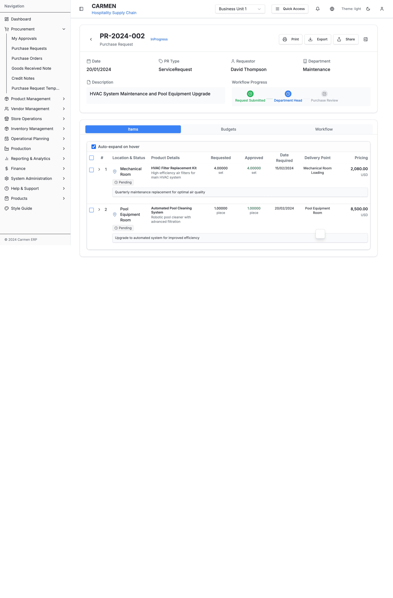
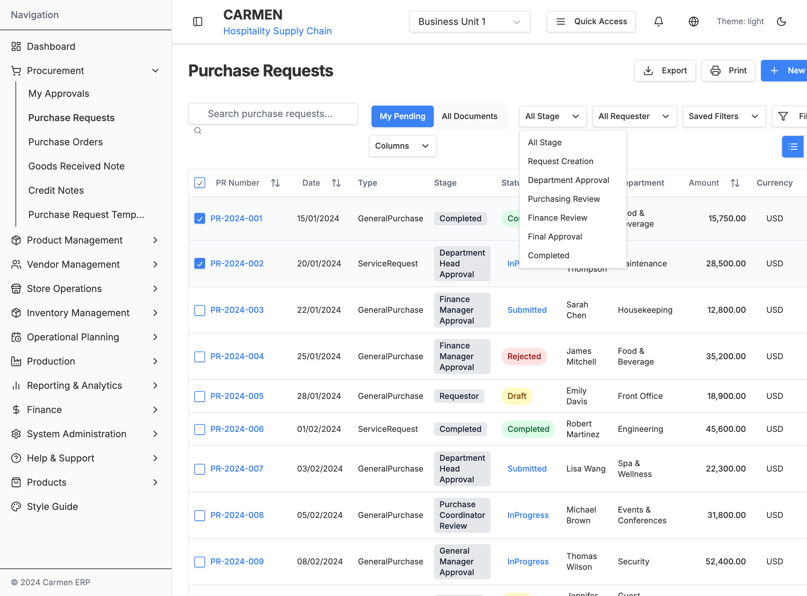
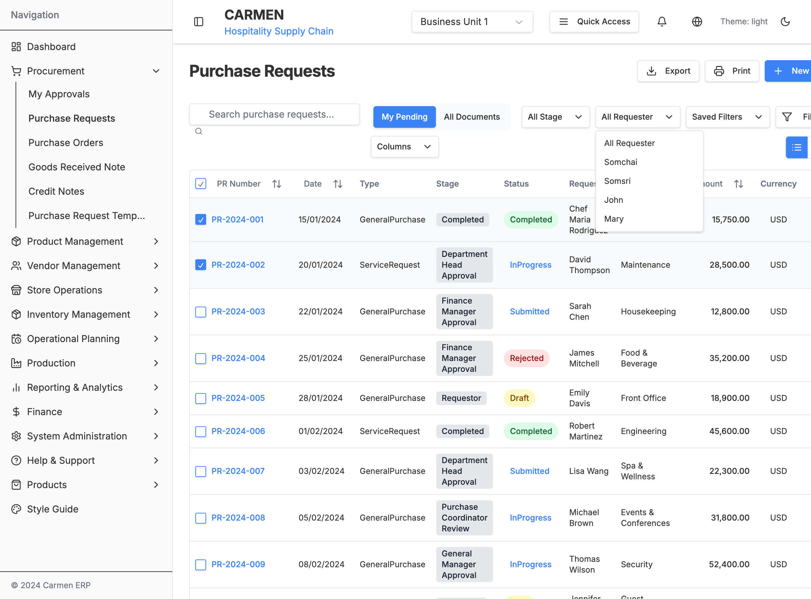
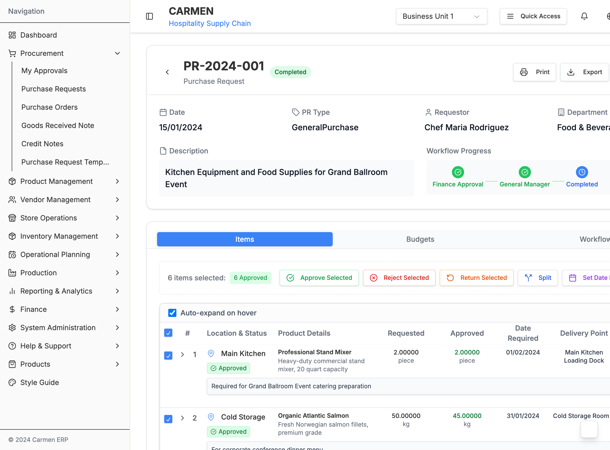
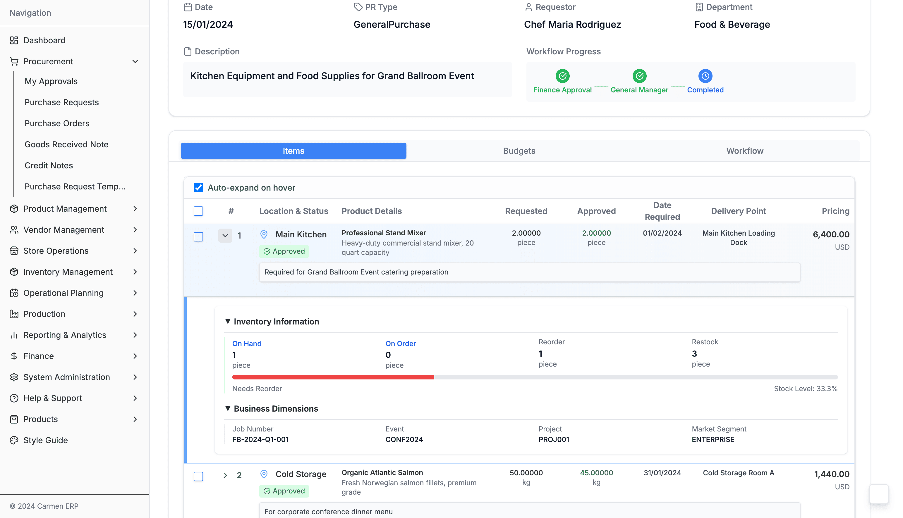
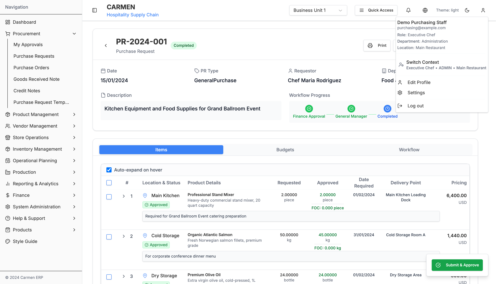
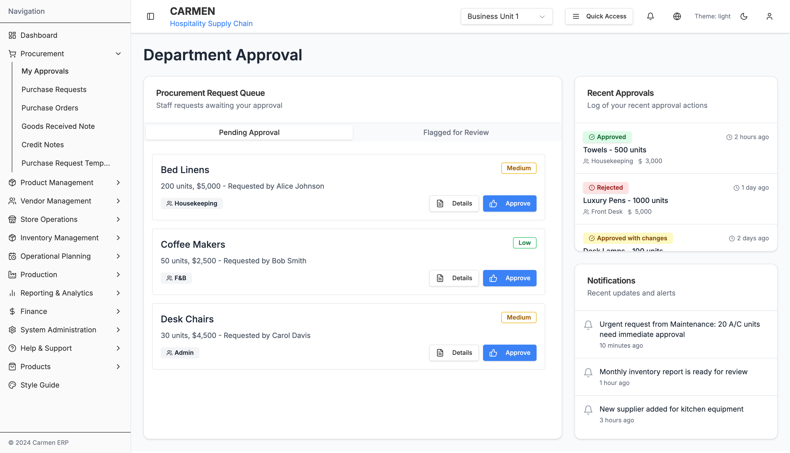
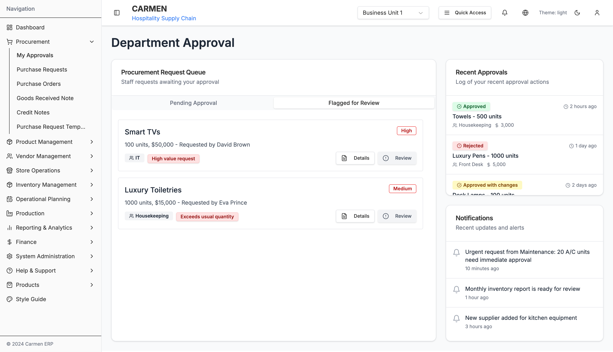
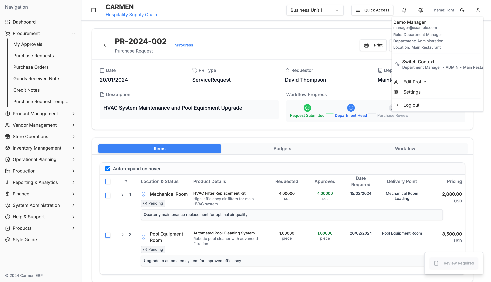

# Purchase Request System - Comprehensive Analysis

This document provides a complete analysis of the Carmen ERP Purchase Request system, including system architecture, component hierarchy, user flows, and technical implementation details.

## Table of Contents

1. [System Overview](#system-overview)
2. [Component Architecture](#component-architecture)
3. [User Journey Flows](#user-journey-flows)
4. [User Interface Screenshots](#user-interface-screenshots)
5. [Modal and Dialog System](#modal-and-dialog-system)
6. [Data Flow and State Management](#data-flow-and-state-management)
7. [Workflow Engine](#workflow-engine)
8. [RBAC and Permissions](#rbac-and-permissions)
9. [API Integration](#api-integration)

## System Overview

```mermaid
graph TB
    subgraph "Purchase Request System"
        A[Purchase Request List] --> B[PR Detail View]
        A --> C[Create New PR]
        B --> D[Edit Mode]
        B --> E[Workflow Actions]

        subgraph "Core Components"
            F[ModernPurchaseRequestList]
            G[PRDetailPage]
            H[PRForm]
            I[Workflow Engine]
        end

        subgraph "Supporting Systems"
            J[RBAC Service]
            K[Notification System]
            L[Modal System]
            M[Data Management]
        end
    end
```

## Component Architecture

```mermaid
graph TD
    subgraph "Main Pages"
        A["/procurement/purchase-requests<br/>page.tsx"] --> B[ModernPurchaseRequestList]
        C["/procurement/purchase-requests/[id]<br/>page.tsx"] --> D[PRDetailPage]
        E["/procurement/purchase-requests/new-pr<br/>page.tsx"] --> F[PRForm]
    end

    subgraph "List View Components"
        B --> G[PurchaseRequestsDataTable]
        B --> H[PurchaseRequestsCardView]
        B --> I[BulkOperations]
        B --> J[FilterControls]
    end

    subgraph "Detail View Components"
        D --> K[PRHeader]
        D --> L[CompactWorkflowIndicator]
        D --> M[TabSystem]
        D --> N[SummaryTotal]
        D --> O[FloatingActionMenu]

        M --> P[ItemsTab]
        M --> Q[BudgetsTab]
        M --> R[WorkflowTab]
        M --> S[PRCommentsAttachmentsTab]
        M --> T[ActivityTab]
    end

    subgraph "Modal Components"
        U[VendorComparisonModal]
        V[PriceHistoryModal]
        W[ReturnStepSelector]
        X[ItemDetailsModal]
        Y[BulkOperationDialog]
    end

    subgraph "Form Components"
        F --> Z[ItemForm]
        F --> AA[VendorSelection]
        F --> BB[BudgetAllocation]
        F --> CC[WorkflowSubmission]
    end
```

## User Journey Flows

### Main Purchase Request Flow

```mermaid
flowchart TD
    A[User Logs In] --> B{User Role?}

    B -->|Requestor| C[View My PRs]
    B -->|Manager| D[View Department PRs]
    B -->|Finance| E[View All PRs - Financial]
    B -->|Purchasing| F[View All PRs - Procurement]

    C --> G[Create New PR]
    D --> H[Review PRs for Approval]
    E --> I[Financial Review]
    F --> J[Procurement Processing]

    G --> K[Select Template]
    K --> L[Fill PR Form]
    L --> M[Add Items]
    M --> N[Submit for Approval]

    H --> O{Approve/Reject?}
    O -->|Approve| P[Send to Next Stage]
    O -->|Reject| Q[Return with Comments]
    O -->|Send Back| R[Select Return Stage]

    I --> S[Budget Validation]
    S --> T{Within Budget?}
    T -->|Yes| U[Approve]
    T -->|No| V[Request Additional Approval]

    J --> W[Vendor Assignment]
    W --> X[Price Negotiation]
    X --> Y[Create Purchase Order]
```

### Create Purchase Request Flow

```mermaid
flowchart TD
    A[Click Create PR] --> B[Template Selection Dialog]

    B --> C{Select Template}
    C -->|Office Supplies| D[Office Template]
    C -->|IT Equipment| E[IT Template]
    C -->|Kitchen/F&B| F[Kitchen Template]
    C -->|Maintenance| G[Maintenance Template]
    C -->|Custom| H[Blank Form]

    D --> I[Pre-filled Office Items]
    E --> I
    F --> I
    G --> I
    H --> I

    I[PR Form] --> J[Basic Information]
    J --> K[Add Items]
    K --> L{More Items?}
    L -->|Yes| M[Item Form Modal]
    M --> N[Save Item]
    N --> L
    L -->|No| O[Review Summary]

    O --> P{Valid?}
    P -->|No| Q[Show Validation Errors]
    Q --> J
    P -->|Yes| R[Save as Draft or Submit]

    R --> S{Save Option}
    S -->|Draft| T[Save Draft]
    S -->|Submit| U[Submit for Approval]

    U --> V[Workflow Engine]
    V --> W[Determine Next Stage]
    W --> X[Send Notifications]
    X --> Y[Redirect to PR Detail]
```

### Approval Workflow

```mermaid
stateDiagram-v2
    [*] --> Draft

    Draft --> Submitted : Submit for Approval

    Submitted --> DeptApproval : Workflow Engine Route
    Submitted --> FinApproval : High Value Items
    Submitted --> Purchasing : Low Value / Auto-approve

    DeptApproval --> FinApproval : Manager Approve
    DeptApproval --> Rejected : Manager Reject
    DeptApproval --> Draft : Send Back to Requester

    FinApproval --> GMApproval : High Value (>$10k)
    FinApproval --> Purchasing : Standard Approval
    FinApproval --> Rejected : Finance Reject
    FinApproval --> DeptApproval : Send Back to Manager

    GMApproval --> Purchasing : GM Approve
    GMApproval --> Rejected : GM Reject
    GMApproval --> FinApproval : Send Back to Finance

    Purchasing --> Completed : Process Complete
    Purchasing --> OnHold : Vendor Issues
    Purchasing --> FinApproval : Send Back for Budget Review

    OnHold --> Purchasing : Issues Resolved

    Rejected --> [*]
    Completed --> [*]
```

## Modal and Dialog System

```mermaid
graph TD
    subgraph "Modal System Architecture"
        A[Component Trigger] --> B{Modal Type}

        B -->|Vendor Comparison| C[VendorComparisonModal]
        B -->|Price History| D[PriceHistoryModal]
        B -->|Return Workflow| E[ReturnStepSelector]
        B -->|Item Details| F[ItemDetailsModal]
        B -->|Bulk Operations| G[BulkOperationDialog]
        B -->|Confirmations| H[ConfirmationDialog]

        C --> I[Vendor Data Fetch]
        I --> J[Price Comparison Table]
        J --> K[Vendor Selection]
        K --> L[Update PR Item]

        D --> M[Historical Price Fetch]
        M --> N[Price Trend Chart]
        N --> O[Price Analytics]

        E --> P[Workflow Stage Selection]
        P --> Q[Return Comments]
        Q --> R[Workflow Engine Update]

        F --> S[Inventory Check]
        S --> T[On-hand Quantities]
        T --> U[Alternative Suggestions]

        G --> V[Selected Items Validation]
        V --> W[Bulk Action Confirmation]
        W --> X[Batch Processing]
    end
```

### Modal Interaction Flow

```mermaid
sequenceDiagram
    participant User
    participant Component
    participant Modal
    participant API
    participant State

    User->>Component: Click Action Button
    Component->>Modal: Open Modal
    Modal->>API: Fetch Required Data
    API-->>Modal: Return Data
    Modal->>User: Display Modal Content

    User->>Modal: Interact (Select/Input)
    Modal->>Modal: Validate Input

    alt Valid Input
        User->>Modal: Confirm Action
        Modal->>API: Submit Changes
        API-->>Modal: Confirm Success
        Modal->>State: Update Component State
        Modal->>Component: Close Modal
        Component->>User: Show Success Notification
    else Invalid Input
        Modal->>User: Show Validation Errors
    end
```

## Data Flow and State Management

```mermaid
graph TB
    subgraph "Data Layer"
        A[Mock Data Store] --> B[API Service Layer]
        C[TypeScript Types] --> B
        D[Zod Validation] --> B
    end

    subgraph "State Management"
        E[React Query Cache] --> F[Component State]
        G[User Context] --> F
        H[Workflow Context] --> F
        I[Form State] --> F
    end

    subgraph "Component Layer"
        F --> J[List Components]
        F --> K[Detail Components]
        F --> L[Form Components]
        F --> M[Modal Components]
    end

    subgraph "User Interface"
        J --> N[PR List View]
        K --> O[PR Detail View]
        L --> P[PR Create/Edit]
        M --> Q[Dialogs & Modals]
    end

    B --> E
    E --> R[Optimistic Updates]
    R --> S[Background Sync]
```

### State Update Flow

```mermaid
flowchart LR
    A[User Action] --> B[Component Handler]
    B --> C{Action Type}

    C -->|Create/Update| D[Form Validation]
    C -->|Delete| E[Confirmation Dialog]
    C -->|Workflow| F[RBAC Check]

    D --> G[API Call]
    E --> G
    F --> G

    G --> H[Optimistic Update]
    H --> I[Background Sync]

    I --> J{Success?}
    J -->|Yes| K[Update Cache]
    J -->|No| L[Rollback State]

    K --> M[Refresh UI]
    L --> N[Show Error]

    M --> O[Success Notification]
    N --> P[Error Notification]
```

## Workflow Engine

```mermaid
graph TD
    subgraph "Workflow Decision Engine"
        A[PR Submission] --> B[Analyze Items]
        B --> C[Calculate Total Value]
        C --> D[Check Budget Requirements]
        D --> E[Determine Approval Path]

        E --> F{Value Threshold}
        F -->|< $1000| G[Auto-Approve to Purchasing]
        F -->|$1000-$5000| H[Department Manager]
        F -->|$5000-$10000| I[Finance Manager]
        F -->|> $10000| J[GM Approval]

        G --> K[Purchasing Queue]
        H --> L{Manager Decision}
        I --> M{Finance Decision}
        J --> N{GM Decision}

        L -->|Approve| O[Next Stage Routing]
        L -->|Reject| P[Rejected State]
        L -->|Return| Q[Previous Stage]

        M -->|Approve| O
        M -->|Reject| P
        M -->|Return| Q

        N -->|Approve| O
        N -->|Reject| P
        N -->|Return| Q

        O --> R[Notification System]
        P --> S[Rejection Notifications]
        Q --> T[Return Notifications]
    end
```

### Workflow Rules Engine

```mermaid
flowchart TD
    A[Workflow Action Request] --> B[Load PR Data]
    B --> C[Get User Permissions]
    C --> D[Apply Business Rules]

    D --> E{Budget Check}
    E -->|Over Budget| F[Require Additional Approval]
    E -->|Within Budget| G[Standard Process]

    F --> H[Escalate to Finance]
    G --> I[Check Item Categories]

    I --> J{Special Categories?}
    J -->|IT Equipment| K[IT Manager Approval]
    J -->|Controlled Items| L[Additional Compliance]
    J -->|Standard Items| M[Normal Flow]

    K --> N[Route to IT Department]
    L --> O[Compliance Check]
    M --> P[Standard Approval Path]

    N --> Q[Update Workflow State]
    O --> Q
    P --> Q

    Q --> R[Send Notifications]
    R --> S[Log Activity]
    S --> T[Update UI State]
```

## RBAC and Permissions

```mermaid
graph TD
    subgraph "Role-Based Access Control"
        A[User Login] --> B[Load User Profile]
        B --> C[Determine Roles]
        C --> D[Load Permissions]

        D --> E{User Role}
        E -->|Requestor| F[Requestor Permissions]
        E -->|Department Manager| G[Manager Permissions]
        E -->|Finance Manager| H[Finance Permissions]
        E -->|Purchasing Staff| I[Purchasing Permissions]
        E -->|GM| J[Executive Permissions]

        F --> K[Create, Edit Own PRs]
        G --> L[Approve Department PRs]
        H --> M[Financial Oversight]
        I --> N[Procurement Actions]
        J --> O[All System Access]

        K --> P[Component Rendering]
        L --> P
        M --> P
        N --> P
        O --> P

        P --> Q[Dynamic UI Elements]
        Q --> R[Action Buttons]
        Q --> S[Field Editing]
        Q --> T[Data Visibility]
    end
```

### Permission Matrix

```mermaid
graph LR
    subgraph "Actions vs Roles"
        A[Create PR] --> B{Role Check}
        B -->|All Roles| C[✓ Allowed]

        D[Edit PR] --> E{Ownership + Status}
        E -->|Owner + Draft| F[✓ Allowed]
        E -->|Manager + Pending| F
        E -->|Other| G[✗ Denied]

        H[Approve PR] --> I{Role + Stage}
        I -->|Manager + Dept Stage| J[✓ Allowed]
        I -->|Finance + Finance Stage| J
        I -->|Other| K[✗ Denied]

        L[Delete PR] --> M{Owner + Status}
        M -->|Owner + Draft| N[✓ Allowed]
        M -->|Other| O[✗ Denied]
    end
```

## API Integration

```mermaid
graph TB
    subgraph "API Architecture"
        A[Frontend Components] --> B[React Query Hooks]
        B --> C[API Service Layer]
        C --> D[HTTP Client]
        D --> E[Backend Services]

        E --> F[Mock Data Store]
        E --> G[Business Logic]
        E --> H[Validation Layer]

        subgraph "API Endpoints"
            I[GET /api/purchase-requests]
            J[GET /api/purchase-requests/*id*]
            K[POST /api/purchase-requests]
            L[PUT /api/purchase-requests/*id*]
            M[DELETE /api/purchase-requests/*id*]
            N[POST /api/purchase-requests/*id/workflow]
        end

        C --> I
        C --> J
        C --> K
        C --> L
        C --> M
        C --> N
    end
```

### API Flow Sequence

```mermaid
sequenceDiagram
    participant UI as UI Component
    participant RQ as React Query
    participant API as API Service
    participant BE as Backend
    participant DS as Data Store

    UI->>RQ: Request Data
    RQ->>API: HTTP Request
    API->>BE: Service Call
    BE->>DS: Data Query
    DS-->>BE: Return Data
    BE-->>API: Processed Data
    API-->>RQ: JSON Response
    RQ-->>UI: Cached Data

    Note over UI,RQ: Optimistic Updates
    UI->>RQ: Update Request
    RQ->>UI: Immediate UI Update
    RQ->>API: Background Sync

    alt Success
        API-->>RQ: Confirm Success
        RQ->>UI: Maintain Update
    else Failure
        API-->>RQ: Error Response
        RQ->>UI: Rollback Update
        RQ->>UI: Show Error
    end
```

## Notification and Message System

```mermaid
graph TD
    subgraph "Notification System"
        A[User Action] --> B[Action Handler]
        B --> C{Action Result}

        C -->|Success| D[Success Toast]
        C -->|Error| E[Error Toast]
        C -->|Warning| F[Warning Alert]
        C -->|Info| G[Info Banner]

        D --> H[Auto-dismiss Timer]
        E --> I[Manual Dismiss]
        F --> J[Action Required]
        G --> K[Persistent Display]

        subgraph "Message Types"
            L[Form Validation]
            M[Workflow Updates]
            N[System Alerts]
            O[Business Rules]
        end

        L --> P[Field-level Errors]
        M --> Q[Status Changes]
        N --> R[System Maintenance]
        O --> S[Budget Warnings]

        P --> T[Form Component]
        Q --> U[Status Badge]
        R --> V[Global Banner]
        S --> W[Alert Component]
    end
```

## User Interface Screenshots

This section provides visual documentation of the key user interface screens in the Carmen ERP Purchase Request system. Screenshots were captured from the running application to show the actual implementation of the designs and workflows described in this document.

### Purchase Request List View
*Screenshot captured: Purchase Request main list interface*

The main Purchase Request list view shows:
- **Navigation sidebar** with procurement module expanded
- **Filter controls** including "My Pending", "All Documents", stage filters, and saved filters
- **Action buttons** for Export, Print, and New PR creation
- **Data table** with sortable columns: PR Number, Date, Type, Stage, Status, Requestor, Department, Amount, Currency
- **Status indicators** with color coding (Completed in green, InProgress in blue, Submitted in blue, Rejected in red, Draft in yellow)
- **Pagination controls** at the bottom
- **View toggle** between list and card views
- **Bulk selection** capability with checkboxes

### Purchase Request Detail View
*Screenshot captured: Purchase Request detail interface (PR-2024-002)*

The Purchase Request detail view displays:
- **Header section** with PR number, status badge, and action buttons (Print, Export, Share)
- **Basic information** including Date, PR Type, Requestor, and Department
- **Description field** with full PR details
- **Workflow progress indicator** showing current stage in the approval process
- **Tabbed interface** with Items, Budgets, and Workflow tabs
- **Items table** with expandable rows showing:
  - Item numbers and location/status
  - Product details with descriptions
  - Requested vs Approved quantities
  - Date required and delivery points
  - Pricing information
- **Auto-expand on hover** functionality for better UX
- **Status badges** for individual items (Pending, Approved, etc.)
- **Comments & Attachments** section with file upload and download capabilities
- **Activity Log** showing complete history of all actions performed on the PR

### Purchase Request Creation Form
*Screenshot captured: Purchase Request creation/editing interface (PR-2023-001 Draft)*

The Purchase Request creation form includes:
- **Form header** with PR number and draft status
- **Basic details** including Date, PR Type, Requestor, and Department
- **Description field** for PR purpose
- **Workflow progress** showing submission stage
- **Items management** with detailed table including:
  - Item numbering and location selection
  - Product details with full descriptions
  - Quantity requested vs approved tracking
  - Date requirements and delivery points
  - Pricing calculations
- **Item status indicators** (Approved, Review, Pending, etc.)
- **Auto-expand functionality** for better data visibility
- **Comments & Attachments** section for collaboration
- **Activity Log** for tracking all changes and actions
- **Validation and submission** controls

### Dynamic UI Elements and Interactions
*Screenshots captured: Interactive menus, dropdowns, and popup elements*

#### Action Menu (Three-dot Menu)

The row-level action menu provides context-specific actions for each Purchase Request:
- **Approve** option with green checkmark icon for pending requests
- **Reject** option with red X icon for declining requests
- **Delete** option with red trash icon for removing requests
- **Visual separator** between approval/rejection actions and destructive delete action
- **Contextual availability** - options appear based on current PR status and user permissions

#### Filter Dropdown Menus

##### Stage Filter Dropdown

The Stage filter dropdown allows filtering by approval workflow stages:
- **All Stage** (default selection showing all requests)
- **Request Creation** for newly created PRs
- **Department Approval** for requests pending department head approval
- **Purchasing Review** for requests under purchasing team review
- **Finance Review** for requests requiring financial approval
- **Final Approval** for requests pending final sign-off
- **Completed** for fully processed requests

##### Requester Filter Dropdown

The Requester filter dropdown enables filtering by the person who created the PR:
- **All Requester** (default selection showing all requesters)
- **Individual staff members** including:
  - Somchai
  - Somsri
  - John
  - Mary
- **Dynamic population** based on users who have created Purchase Requests

#### Bulk Operations Menu (In PR Detail Form)

The bulk operations functionality is located within the Purchase Request detail form, specifically in the Items tab:

**Selection Interface:**
- **Item checkboxes** on each row for individual selection
- **Select all checkbox** in the table header for bulk selection
- **Selection counter** displays "X items selected: Y Approved" showing total and status breakdown
- **Auto-expand on hover** toggle for better visibility during bulk operations

**Bulk Action Buttons:**
- **Approve Selected** (green checkmark icon) - Approve multiple items simultaneously
- **Reject Selected** (red X icon) - Reject multiple items at once
- **Return Selected** (orange return icon) - Return selected items for revision
- **Split** (blue split icon) - Split selected items into separate requests
- **Set Date Required** (purple calendar icon) - Update delivery dates for multiple items

**Context-Aware Functionality:**
- Button availability changes based on current item status and user permissions
- Visual feedback shows the impact of bulk operations before execution
- Actions apply only to currently selected items, maintaining granular control

#### Auto-Expand Item Details on Hover

The auto-expand functionality provides detailed information when hovering over item rows:

**Inventory Information Panel:**
- **On Hand**: Current stock quantity with piece/unit indicators
- **On Order**: Pending incoming stock quantities
- **Reorder**: Minimum threshold for reordering
- **Restock**: Target quantity for restocking
- **Stock Level**: Percentage indicator with visual status bar
- **Needs Reorder** alert when stock falls below threshold

**Business Dimensions Panel:**
- **Job Number**: Project/job reference (e.g., FB-2024-Q1-001)
- **Event**: Associated event name (e.g., CONF2024)
- **Project**: Project code (e.g., PROJ001)
- **Market Segment**: Business classification (e.g., ENTERPRISE)

#### Role-Based UI Differences

The system displays different information based on user roles:

**Chef/Requestor Role (Original View):**
- Comment section shows user initials "CMR" (Chef Maria Rodriguez)
- Standard approval quantities without additional procurement details
- Focus on operational requirements and item specifications

**Purchasing Staff Role:**
- Comment section shows "DPS" (Demo Purchasing Staff)
- **Additional FOC (Free of Charge) information** displayed in Approved column:
  - "FOC: 0.000 piece" for each item showing free quantities
  - Critical for procurement cost calculations and vendor negotiations
- **Submit & Approve button** appears at bottom for procurement workflow actions
- User profile shows "Demo Purchasing Staff" with "purchasing@example.com"
- Department context switches from "Kitchen Operations" to "Administration"

**Dynamic Panel Visibility:**
- **Inventory panels** may show/hide based on role permissions
- **Business dimensions** visibility controlled by departmental access
- **Pricing details** and FOC information restricted to procurement roles
- **Auto-expand behavior** may differ based on user's data access level

#### UI Interaction Patterns
- **Hover states** provide visual feedback for interactive elements
- **Dropdown menus** close when clicking outside or pressing Escape
- **Status color coding** maintains consistency across all views:
  - Green for Completed/Approved states
  - Blue for InProgress/Submitted states
  - Red for Rejected states
  - Yellow for Draft states
- **Progressive disclosure** with expandable rows and hover details
- **Contextual actions** that adapt based on item status and user permissions
- **Role-based information display** with procurement-specific details for purchasing staff

## Workflow Action Buttons

The system implements workflow action buttons for approval processes through a dedicated approval interface rather than on individual purchase request detail pages.

### Approval Workflow Interface

The workflow actions are primarily handled through the **My Approvals** page (`/procurement/my-approvals`) which provides:

#### 1. Two-Tab Approval System

**Pending Approval Tab:**
- Items ready for immediate approval
- Direct "Approve" buttons for straightforward requests
- Standard approval workflow for routine procurement

**Flagged for Review Tab:**
- High-value or exceptional requests requiring detailed review
- "Review" buttons for complex approval scenarios
- Additional scrutiny for requests exceeding normal parameters

#### 2. Purchase Request Detail Page Behavior

On individual PR detail pages, the workflow action appears as:

- **"Review Required" button** (typically disabled until specific conditions are met)
- Located at the bottom-right of the page interface
- Serves as an indicator rather than primary action interface

#### 3. Workflow Action Patterns

**Approve Actions:**
- Single-click approval for standard requests
- Immediate state change with visual feedback
- Auto-navigation or list update upon completion

**Review Actions:**
- Opens detailed review interface for complex items
- Allows for additional scrutiny and documentation
- May provide multiple action options (approve, reject, request changes)

**Role-Based Access:**
- Actions only visible to users with appropriate approval permissions
- Department Manager role enables approval capabilities
- Context-sensitive button activation based on workflow stage

#### 4. Workflow States and Button Behavior

- **Disabled State**: "Review Required" button appears disabled when user lacks permissions or item isn't ready for approval
- **Active State**: Buttons become interactive when approval criteria are met
- **Processing State**: Visual feedback during approval processing
- **Completion State**: State updates and potential navigation after action completion

### Implementation Notes

The workflow system prioritizes:
- **Separation of concerns**: Dedicated approval interface separate from viewing interface
- **Role-based access control**: Buttons only appear for authorized users
- **Two-tier approval process**: Standard vs. flagged items require different approval paths
- **Visual state management**: Clear indication of approval status and available actions

## Technical Implementation Details

### Component Communication

```mermaid
graph LR
    subgraph "Component Communication Patterns"
        A[Parent Component] --> B[Props Down]
        B --> C[Child Component]
        C --> D[Events Up]
        D --> A

        E[Sibling A] --> F[Shared State]
        F --> G[Sibling B]

        H[Deep Child] --> I[Context Provider]
        I --> J[Any Consumer]

        K[Component] --> L[Custom Hook]
        L --> M[API Service]
        M --> N[React Query]
        N --> K
    end
```

### Performance Optimizations

```mermaid
flowchart TD
    A[Performance Strategy] --> B[Code Splitting]
    A --> C[Lazy Loading]
    A --> D[Memoization]
    A --> E[Virtual Scrolling]

    B --> F[Dynamic Imports]
    F --> G[Route-based Chunks]

    C --> H[Modal Components]
    C --> I[Tab Content]

    D --> J[React.memo]
    D --> K[useMemo]
    D --> L[useCallback]

    E --> M[Large Lists]
    E --> N[Data Tables]

    O[Caching Strategy] --> P[React Query]
    P --> Q[Background Refetch]
    P --> R[Stale While Revalidate]
    P --> S[Optimistic Updates]
```

---

This comprehensive analysis provides a complete technical overview of the Carmen ERP Purchase Request system, covering all aspects from high-level architecture to detailed implementation patterns. The Mermaid diagrams illustrate the relationships between components, data flow, user interactions, and system behavior.