# Purchase Request User Flows

This document details all user interaction flows within the Purchase Request system, including role-based workflows, UI interactions, and business process flows.

## User Role Definitions

```mermaid
graph TD
    subgraph "User Roles & Responsibilities"
        A["👤 Requestor"] --> B["📝 Create PRs<br/>📋 Track Status<br/>💬 Respond to Returns"]
        C["👨‍💼 Department Manager"] --> D["✅ Approve Department PRs<br/>❌ Reject with Comments<br/>🔄 Return for Changes"]
        E["💰 Finance Manager"] --> F["💳 Budget Validation<br/>💰 Financial Approval<br/>📊 Cost Analysis"]
        G["🛒 Purchasing Staff"] --> H["🏪 Vendor Management<br/>💲 Price Negotiation<br/>📦 Order Processing"]
        I["👔 General Manager"] --> J["💎 High-Value Approvals<br/>🎯 Strategic Decisions<br/>📈 Executive Oversight"]
    end
```

## Main User Journey Map

## Create Purchase Request Flow

## Purchase Request Detail View Flow

```mermaid
flowchart TD
    A["🔗 Access PR Detail"] --> B["Load PR Data"]
    B --> C["🔐 Check User Permissions"]
    C --> D["📋 Render PR Header"]
    D --> E["📊 Display Workflow Progress"]
    E --> F["📑 Initialize Tab System"]

    F --> G{Default Tab Selection}
    G -->|"Items"| H["📦 Items Tab Active"]
    G -->|"Budget"| I["💰 Budget Tab Active"]
    G -->|"Workflow"| J["🔄 Workflow Tab Active"]

    H --> K["📋 Items Data Table"]
    K --> L["🎯 Row Actions Available"]
    L --> M{User Action on Item}
    M -->|"Edit"| N["✏️ Edit Item Modal"]
    M -->|"Vendor Compare"| O["🏪 Vendor Comparison Modal"]
    M -->|"Price History"| P["📈 Price History Modal"]
    M -->|"Delete"| Q["❌ Delete Confirmation"]

    I --> R["💳 Budget Allocation View"]
    R --> S["📊 Spending Analysis"]
    R --> T["⚠️ Budget Warnings"]

    J --> U["🔄 Workflow Timeline"]
    U --> V["📝 Approval Comments"]
    U --> W["🎯 Available Actions"]

    W --> X{Workflow Action}
    X -->|"Approve"| Y["✅ Approval Confirmation"]
    X -->|"Reject"| Z["❌ Rejection with Comments"]
    X -->|"Return"| AA["🔄 Return Step Selector"]

    Y --> BB["🔄 Update Workflow State"]
    Z --> BB
    AA --> BB
    BB --> CC["📧 Send Notifications"]
    CC --> DD["🔄 Refresh Page Data"]
```

## Approval Workflow Decision Tree

```mermaid
flowchart TD
    A["📤 PR Submitted"] --> B["🔄 Workflow Engine Analysis"]
    B --> C["💰 Calculate Total Value"]
    C --> D["📋 Analyze Item Categories"]
    D --> E["🎯 Determine Approval Path"]

    E --> F{Value Threshold Check}
    F -->|"< $1,000"| G["🚀 Auto-Approve to Purchasing"]
    F -->|"$1,000 - $5,000"| H["👨‍💼 Department Manager Required"]
    F -->|"$5,000 - $10,000"| I["💰 Finance Manager Required"]
    F -->|"> $10,000"| J["👔 GM Approval Required"]

    H --> K{Manager Decision}
    K -->|"✅ Approve"| L["Check Next Stage"]
    K -->|"❌ Reject"| M["📧 Rejection Notification"]
    K -->|"🔄 Return"| N["📧 Return Notification"]

    I --> O{Finance Decision}
    O -->|"✅ Approve"| L
    O -->|"❌ Reject"| M
    O -->|"🔄 Return"| N

    J --> P{GM Decision}
    P -->|"✅ Approve"| L
    P -->|"❌ Reject"| M
    P -->|"🔄 Return"| N

    L --> Q{Special Categories?}
    Q -->|"💻 IT Equipment"| R["🔧 IT Manager Approval"]
    Q -->|"🔒 Controlled Items"| S["📋 Compliance Check"]
    Q -->|"🏢 Standard Items"| T["🛒 Route to Purchasing"]

    G --> T
    R --> U{IT Manager Decision}
    U -->|"✅ Approve"| T
    U -->|"❌ Reject"| M
    U -->|"🔄 Return"| N

    S --> V{Compliance Check}
    V -->|"✅ Pass"| T
    V -->|"❌ Fail"| W["📋 Additional Documentation Required"]
    W --> X["📧 Documentation Request"]

    T --> Y["🛒 Purchasing Queue"]
    Y --> Z["✅ Process Complete"]
```

## Bulk Operations Flow

## Modal Interaction Flows

### Vendor Comparison Modal

```mermaid
flowchart TD
    A["🏪 Open Vendor Comparison"] --> B["📊 Load Vendor Data"]
    B --> C["💰 Display Price Grid"]
    C --> D["⭐ Show Vendor Ratings"]
    D --> E["📋 Display Terms & Conditions"]

    E --> F{User Interaction}
    F -->|"Select Vendor"| G["✅ Highlight Selection"]
    F -->|"Override Price"| H["💰 Price Override Input"]
    F -->|"View Details"| I["📋 Vendor Detail Popup"]
    F -->|"Add Notes"| J["📝 Notes Input Field"]

    G --> K["💾 Save Selection"]
    H --> L["🔍 Validate Override"]
    L --> M{Valid Override?}
    M -->|"✅ Yes"| K
    M -->|"❌ No"| N["🚨 Error Message"]
    N --> H

    I --> O["📊 Vendor Performance History"]
    J --> P["💬 Save Notes"]

    K --> Q["🔄 Update PR Item"]
    P --> Q
    Q --> R["📧 Change Notifications"]
    R --> S["❌ Close Modal"]
    S --> T["🔄 Refresh Parent View"]
```

### Price History Modal

```mermaid
flowchart TD
    A["📈 Open Price History"] --> B["📊 Load Historical Data"]
    B --> C["📈 Render Price Chart"]
    C --> D["📋 Display Price Table"]
    D --> E["🏪 Show Vendor Breakdown"]

    E --> F{User Interaction}
    F -->|"Change Date Range"| G["📅 Date Range Picker"]
    F -->|"Filter by Vendor"| H["🏪 Vendor Filter"]
    F -->|"Export Data"| I["📄 Export Options"]
    F -->|"View Trends"| J["📊 Trend Analysis"]

    G --> K["🔄 Update Chart Data"]
    H --> L["🎯 Filter Chart Points"]
    I --> M["⬇️ Download File"]
    J --> N["📊 Display Trend Analysis"]

    K --> O["📈 Re-render Chart"]
    L --> O
    N --> P["📋 Show Insights"]

    O --> Q{More Actions?}
    Q -->|"Yes"| F
    Q -->|"No"| R["❌ Close Modal"]
    R --> S["🔄 Return to Parent"]
```

## Error Handling and Recovery Flows

```mermaid
flowchart TD
    A["🚨 Error Detected"] --> B{Error Type Classification}

    B -->|"🔧 Validation Error"| C["📋 Form Field Highlighting"]
    B -->|"🌐 Network Error"| D["🔄 Retry Mechanism"]
    B -->|"🔐 Permission Error"| E["🚫 Access Denied Message"]
    B -->|"⚠️ Business Rule Error"| F["📋 Business Rule Explanation"]
    B -->|"💥 Unexpected Error"| G["🚨 Generic Error Handler"]

    C --> H["📝 Display Field Errors"]
    H --> I["👤 User Correction Required"]
    I --> J["🔄 Re-validate on Change"]

    D --> K["⏰ Show Retry Button"]
    K --> L{User Choice}
    L -->|"🔄 Retry"| M["🔄 Retry Request"]
    L -->|"❌ Cancel"| N["❌ Cancel Operation"]
    M --> O{Retry Success?}
    O -->|"✅ Yes"| P["✅ Continue Normal Flow"]
    O -->|"❌ No"| Q["🚨 Escalate Error"]

    E --> R["🔐 Show Permission Details"]
    R --> S["📧 Contact Admin Option"]

    F --> T["📋 Show Rule Details"]
    T --> U["💡 Suggested Actions"]
    U --> V["🔄 Return to Form"]

    G --> W["📧 Error Logging"]
    W --> X["🚨 Show Generic Message"]
    X --> Y["📞 Support Contact Info"]

    Q --> Z["📊 Error Analytics"]
    Z --> AA["📧 Admin Notification"]
```

## Notification System Flow

```mermaid
flowchart TD
    A["🎯 System Event Triggered"] --> B{Event Type}

    B -->|"✅ Success Action"| C["🎉 Success Toast"]
    B -->|"❌ Error Action"| D["🚨 Error Toast"]
    B -->|"⚠️ Warning"| E["⚠️ Warning Alert"]
    B -->|"ℹ️ Information"| F["ℹ️ Info Banner"]
    B -->|"📧 Workflow Update"| G["📬 Email Notification"]

    C --> H["⏰ Auto-dismiss Timer (3s)"]
    H --> I["✨ Fade Out Animation"]

    D --> J["👤 Manual Dismiss Required"]
    J --> K["❌ Close Button"]
    K --> L["📊 Error Logging"]

    E --> M["⚠️ Action Required Indicator"]
    M --> N{User Action}
    N -->|"✅ Acknowledge"| O["✅ Clear Warning"]
    N -->|"🔄 Fix Issue"| P["🔄 Navigate to Fix"]

    F --> Q["📍 Persistent Display"]
    Q --> R{Context Change}
    R -->|"🔄 Page Change"| S["❌ Auto Clear"]
    R -->|"📍 Same Context"| T["📍 Keep Visible"]

    G --> U["📧 Email Composition"]
    U --> V["📤 Send to Recipients"]
    V --> W["📋 Delivery Tracking"]

    I --> X["🔄 Remove from DOM"]
    O --> X
    S --> X
```

## Search and Filter Flow

```mermaid
flowchart TD
    A["🔍 User Initiates Search"] --> B{Search Type}

    B -->|"📝 Quick Search"| C["🔍 Search Input Field"]
    B -->|"🎯 Advanced Filter"| D["📋 Filter Panel"]

    C --> E["⌨️ Real-time Typing"]
    E --> F["⏰ Debounce (300ms)"]
    F --> G["🔍 Execute Search"]

    D --> H["📋 Filter Categories"]
    H --> I["📅 Date Range"]
    H --> J["📊 Status Selection"]
    H --> K["👤 User Selection"]
    H --> L["💰 Amount Range"]
    H --> M["🏢 Department Filter"]

    I --> N["📅 Date Picker UI"]
    J --> O["☑️ Multi-select Checkboxes"]
    K --> P["👥 User Dropdown"]
    L --> Q["💰 Range Slider"]
    M --> R["🏢 Department Dropdown"]

    G --> S["🔄 Apply Search Query"]
    N --> T["🎯 Apply Date Filter"]
    O --> T
    P --> T
    Q --> T
    R --> T

    S --> U["📊 Filter Results"]
    T --> U

    U --> V{Results Found?}
    V -->|"✅ Yes"| W["📋 Display Results"]
    V -->|"❌ No"| X["📭 Empty State"]

    W --> Y["📊 Update Result Count"]
    X --> Z["💡 Search Suggestions"]

    Y --> AA["📄 Pagination Update"]
    Z --> BB["🔄 Clear Filters Option"]

    AA --> CC{More Actions?}
    CC -->|"Yes"| DD["🔄 User Continues"]
    CC -->|"No"| EE["✅ Search Complete"]

    BB --> FF["🔄 Reset to Full List"]
    FF --> W
```

## Mobile Responsive Flows

```mermaid
flowchart TD
    A["📱 Mobile Device Detection"] --> B["🎨 Apply Mobile Styles"]
    B --> C["📋 Responsive Layout"]

    C --> D{Screen Size}
    D -->|"📱 < 640px"| E["📱 Mobile Layout"]
    D -->|"📟 640px-1024px"| F["📟 Tablet Layout"]
    D -->|"🖥️ > 1024px"| G["🖥️ Desktop Layout"]

    E --> H["🍔 Hamburger Menu"]
    H --> I["📋 Collapsible Sidebar"]
    I --> J["🃏 Card-only View"]
    J --> K["📱 Touch-friendly Buttons"]

    F --> L["📟 Mixed Layout"]
    L --> M["📋 Collapsible Panels"]
    M --> N["🃏 Grid Card View"]

    G --> O["🖥️ Full Table View"]
    O --> P["📋 Extended Sidebar"]
    P --> Q["🖱️ Hover Interactions"]

    K --> R["👆 Touch Gestures"]
    R --> S["📱 Swipe Actions"]
    S --> T["📋 Pull to Refresh"]

    N --> U["👆 Touch & Mouse"]
    Q --> V["🖱️ Desktop Interactions"]

    T --> W["📱 Mobile Optimization"]
    U --> X["📟 Hybrid Experience"]
    V --> Y["🖥️ Full Feature Set"]

    W --> Z["✅ Mobile Flow Complete"]
    X --> Z
    Y --> Z
```

---

This comprehensive user flow documentation provides detailed insight into all user interactions within the Purchase Request system, covering every aspect from basic navigation to complex workflow approvals and error handling scenarios.