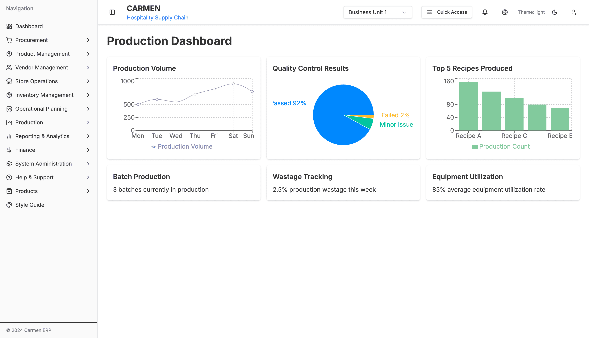

# Production Module

**Module**: Production (10th of 10 modules)
**System**: Manufacturing & Kitchen Operations Management
**Status**: Design Complete, TypeScript Interfaces Implemented
## Document History

| Version | Date | Author | Changes |
|---------|------|--------|---------|
| 1.0.0 | 2025-11-19 | Documentation Team | Initial version |
**Last Updated**: January 2025

## Table of Contents

1. [Module Overview](#module-overview)
2. [Key Features](#key-features)
3. [Production Workflows](#production-workflows)
4. [TypeScript Interfaces](#typescript-interfaces)
5. [Integration Points](#integration-points)
6. [User Guide](#user-guide)
7. [Performance Metrics](#performance-metrics)
8. [Best Practices](#best-practices)
9. [Troubleshooting](#troubleshooting)

## Module Overview

The Production Module serves as the manufacturing and kitchen operations command center for the Carmen Hospitality ERP system. It transforms recipes and operational plans into actionable production schedules, managing the complete production lifecycle from ingredient preparation to finished products.

### Strategic Value

**Business Impact**:
- **Waste Reduction**: 15-25% decrease in food waste through predictive planning
- **Efficiency Improvement**: 30% increase in production efficiency
- **Cost Tracking**: Precise cost tracking for fractional product offerings
- **Quality Improvement**: 60% reduction in quality-related customer complaints
- **Profitability**: Direct impact through fractional sales optimization and waste reduction

**Key Differentiators**:
- Advanced fractional sales production (pizza slices, cake portions, bottle-by-glass)
- Real-time production monitoring with mobile access
- Comprehensive quality control with batch traceability
- AI-driven production recommendations and waste optimization
- Equipment utilization optimization with predictive maintenance

### Business Objectives

**1. Production Efficiency Optimization**
- Streamline kitchen workflow through intelligent production scheduling
- Reduce setup and changeover times between recipe productions
- Maximize equipment utilization across multiple production lines
- Enable real-time production adjustments based on demand fluctuations

**2. Fractional Product Management**
- Support pizza slice, cake portion, and fractional sales operations
- Manage yield variants and portion control for consistent profitability
- Track partial consumption and remaining inventory accurately
- Enable dynamic pricing strategies for fractional offerings

**3. Quality Assurance & Compliance**
- Enforce standardized preparation procedures across all production
- Monitor quality control checkpoints and batch tracking
- Ensure food safety compliance through temperature and time tracking
- Maintain audit trails for regulatory compliance and traceability

**4. Cost Control & Waste Reduction**
- Provide real-time visibility into production costs and margins
- Identify and minimize waste through predictive production planning
- Track ingredient consumption against planned recipes for variance analysis
- Enable data-driven decisions for production optimization

---

## 📸 System Screenshots

### Production Dashboard

*The Production Dashboard provides real-time production monitoring with 6 customizable drag-and-drop widgets powered by react-beautiful-dnd. Key visualizations include: Production Volume (7-day line chart showing Mon-Sun production trends from 500-900 units), Quality Control Results (pie chart displaying 92% Passed, 6% Minor Issues, 2% Failed), and Top 5 Recipes Produced (bar chart ranking Recipe A-E by production count). Three text metric widgets display Batch Production (3 batches currently in production), Wastage Tracking (2.5% production wastage this week), and Equipment Utilization (85% average utilization rate). The dashboard uses Recharts for data visualization and features responsive grid layout (1 column mobile, 2 columns tablet, 3 columns desktop) for comprehensive production operations management.*

---

## Key Features

### 1. Production Planning & Scheduling

**Business Value**: Reduces labor costs by 20% and improves on-time delivery by 95% through optimized production sequencing and resource allocation.

**Core Capabilities**:

**Recipe-Based Production Orders**
- Convert menu forecasts into detailed production schedules
- Automatic ingredient allocation from inventory
- Multi-recipe batch coordination
- Dynamic quantity adjustment based on demand
- Rush order priority management

**Equipment Capacity Planning**
- Optimize oven, fryer, and prep station utilization
- Schedule conflicts detection and resolution
- Equipment availability tracking
- Maintenance window integration
- Capacity utilization reporting

**Labor Schedule Integration**
- Align production schedules with staff availability and skills
- Skill-based task assignment
- Labor cost tracking per production batch
- Productivity metrics per staff member
- Training needs identification

**Multi-Batch Coordination**
- Manage simultaneous production of multiple recipes
- Shared resource optimization
- Parallel vs. sequential production decisions
- Cross-batch timing coordination
- Bottleneck identification and resolution

### 2. Fractional Sales Production Management

**Business Value**: Enables flexible revenue streams and reduces waste by 30% through intelligent portion management and yield optimization.

**Core Capabilities**:

**Yield Variant Management**
- Support multiple selling formats (whole/half/slice/portion)
- Automatic conversion rate calculations
- Quality preservation during portioning
- Shelf life tracking per variant
- Pricing optimization per variant

**Portion Control Systems**
- Ensure consistent portioning for all fractional products
- Weight and size standardization
- Visual portion guides for staff
- Portion yield tracking
- Cost per portion accuracy

**Fractional Inventory Tracking**
- Real-time tracking of partial products (374-line type system)
- 6 item states: RAW → PREPARED → PORTIONED → PARTIAL → COMBINED → WASTE
- Remaining yield calculations
- Expiration tracking for partial products
- Quality grade monitoring (EXCELLENT, GOOD, FAIR, POOR, EXPIRED)

**Dynamic Production Adjustment**
- Modify production quantities based on fractional sales patterns
- Demand-based conversion recommendations
- Optimal conversion time suggestions
- Inventory level balancing
- AI-driven production forecasting

**Cross-Contamination Prevention**
- Allergen controls for partial product handling
- Separate storage tracking
- Equipment sanitation scheduling
- Quality isolation procedures
- Compliance documentation

### 3. Real-Time Production Monitoring

**Business Value**: Increases production visibility by 100% and reduces quality issues by 40% through continuous monitoring and immediate intervention capabilities.

**Core Capabilities**:

**Live Production Dashboard**
- Real-time visibility into all active production orders
- Production volume trends (7-day view)
- Quality control results visualization
- Top recipes produced ranking
- Batch status overview

**Progress Tracking**
- Monitor completion status per batch
- Timing vs. planned schedule
- Quality checkpoint completion
- Ingredient consumption tracking
- Cost variance monitoring

**Alert System**
- Proactive notifications for delays
- Quality issues immediate alerts
- Resource constraint warnings
- Equipment malfunction detection
- Temperature deviation alerts

**Mobile Access**
- Enable floor staff to update production status from kitchen stations
- Touch-optimized interface for gloves-on use
- Quick status updates (started, completed, quality check)
- Photo upload for quality documentation
- Real-time sync with central system

**Performance Metrics**
- Production speed tracking
- Quality scores per batch
- Efficiency ratios
- Labor productivity metrics
- Equipment utilization rates

### 4. Quality Control & Batch Management

**Business Value**: Reduces quality-related customer complaints by 60% and ensures regulatory compliance through systematic quality management.

**Core Capabilities**:

**Batch Tracking**
- Complete traceability from ingredients to finished products
- Unique batch numbers with date/time stamps
- Supplier lot number linkage
- Storage location tracking
- Expiration management

**Quality Checkpoints**
- Enforce quality gates at critical production stages
- 6 check types: visual, taste, temperature, texture, aroma, portion_size
- Expected vs. actual value comparison
- Pass/fail decision documentation
- Corrective action tracking

**Temperature Monitoring**
- Track cooking temperatures and holding times
- Food safety compliance (HACCP)
- Automatic alert on deviation
- Temperature history logging
- Cooling curve monitoring

**Sensory Evaluation**
- Document taste, appearance, and texture assessments
- Standardized evaluation criteria
- Chef approval workflows
- Customer feedback integration
- Continuous improvement tracking

**Non-Conformance Management**
- Handle quality deviations systematically
- Root cause analysis workflows
- Corrective and preventive actions (CAPA)
- Supplier notification for ingredient issues
- Quality trend analysis

### 5. Waste Tracking & Analysis

**Business Value**: Reduces food waste costs by 25% and improves sustainability metrics through precise waste identification and prevention strategies.

**Core Capabilities**:

**Production Waste Recording**
- Track ingredient waste during preparation and cooking
- Categorize waste by type (trim, spoilage, over-production, error)
- Weight and cost tracking per waste event
- Photo documentation capability
- Staff accountability

**Yield Variance Analysis**
- Compare actual vs. expected yields
- Identify patterns and trends
- Recipe-specific variance tracking
- Supplier quality correlation
- Continuous improvement metrics

**Waste Root Cause Analysis**
- Identify patterns and causes of production waste
- Equipment-related waste tracking
- Staff training needs identification
- Recipe improvement recommendations
- Process optimization opportunities

**Sustainability Reporting**
- Environmental impact tracking
- Carbon footprint calculations
- Landfill diversion metrics
- Composting and recycling tracking
- Sustainability goal progress

**Cost Impact Analysis**
- Financial impact of waste on production margins
- Cost per waste type
- Waste reduction ROI calculations
- Budget variance attribution
- Cost savings from improvements

### 6. Equipment Utilization & Maintenance

**Business Value**: Increases equipment efficiency by 25% and reduces downtime by 50% through predictive maintenance and optimal utilization.

**Core Capabilities**:

**Equipment Schedule Management**
- Plan and track equipment usage across production orders
- Prevent scheduling conflicts
- Optimize sequential batch production
- Setup and changeover time minimization
- Real-time availability status

**Maintenance Scheduling**
- Preventive maintenance integration with production planning
- Maintenance history tracking
- Parts inventory management
- Service provider scheduling
- Downtime cost tracking

**Utilization Analytics**
- Equipment efficiency reporting (target: 85% utilization)
- Capacity vs. actual usage
- Idle time analysis
- Bottleneck identification
- Investment ROI tracking

**Downtime Tracking**
- Monitor and minimize unplanned equipment downtime
- Categorize downtime causes
- Mean time between failures (MTBF)
- Mean time to repair (MTTR)
- Reliability improvement tracking

**Energy Consumption**
- Track energy usage per production batch
- Cost per production unit
- Optimization recommendations
- Peak demand management
- Sustainability metrics

## Production Workflows

### Batch Production Workflow

```
1. Production Order Creation
   ├── Select recipe and yield variant
   ├── Define quantity and production date
   ├── Assign chef and crew
   └── System checks ingredient availability

2. Ingredient Allocation
   ├── Reserve ingredients from inventory
   ├── Generate pick list for staff
   ├── Quality check on ingredients
   └── Document supplier lot numbers

3. Production Execution
   ├── Start production (mobile/dashboard)
   ├── Follow preparation steps
   ├── Quality checkpoints at critical stages
   └── Record actual times and temperatures

4. Quality Control
   ├── Visual inspection
   ├── Taste test
   ├── Temperature verification
   ├── Portion size check
   └── Chef approval

5. Completion & Documentation
   ├── Record actual yield vs. planned
   ├── Document any waste
   ├── Calculate actual costs
   ├── Transfer to inventory
   └── Generate batch report

6. Analysis & Improvement
   ├── Yield variance analysis
   ├── Cost variance analysis
   ├── Quality score tracking
   └── Continuous improvement recommendations
```

### Fractional Conversion Workflow

```
1. Whole Product Production
   ├── Produce recipe as complete unit (e.g., whole pizza, whole cake)
   ├── Quality inspection and approval
   ├── Record as RAW inventory
   └── Assign batch number and expiration

2. Preparation Stage (Optional)
   ├── RAW → PREPARED state transition
   ├── Additional processing (cooling, setting)
   ├── Quality grade assignment
   └── Update shelf life

3. Portioning Decision
   ├── Demand analysis
   ├── Conversion recommendation from AI
   ├── Staff approval
   └── Schedule conversion time

4. Conversion Execution
   ├── PREPARED/RAW → PORTIONED state
   ├── Physical portioning with portion control
   ├── Weight verification per portion
   ├── Record waste generated
   └── Quality check on portions

5. Fractional Inventory Update
   ├── Update available portions
   ├── Track partial quantity remaining
   ├── Set individual portion expiration
   ├── Apply quality grade
   └## Fractional Conversion Workflow (continued)

```
5. Fractional Inventory Update (continued)
   └── Enable individual portion sales

6. Sales and Consumption
   ├── POS system records fractional sale
   ├── PORTIONED → CONSUMED state
   ├── Deduct from available portions
   ├── Update partial quantity
   └── Track conversion efficiency

7. Quality Monitoring
   ├── Time since preparation tracking
   ├── Quality grade degradation alerts
   ├── Expiration warnings
   └── Automatic quality downgrade (EXCELLENT → GOOD → FAIR → POOR → EXPIRED)

8. Optimization Analysis
   ├── Conversion efficiency calculation
   ├── Waste percentage vs. target
   ├── Demand pattern analysis
   └── Recommendation generation for future conversions
```

### Quality Control Workflow

```
1. Quality Checkpoint Setup
   ├── Define checkpoints in recipe
   ├── Set expected values
   ├── Assign check types
   └── Configure alerts

2. Pre-Production Quality Check
   ├── Ingredient quality verification
   ├── Equipment functionality check
   ├── Staff certification verification
   └── Environment conditions (temperature, humidity)

3. In-Production Quality Checks
   ├── Visual inspection at critical steps
   ├── Temperature monitoring (continuous)
   ├── Texture and consistency checks
   ├── Timing verification
   └── Process compliance

4. Post-Production Quality Checks
   ├── Final product visual inspection
   ├── Taste test by chef
   ├── Portion size verification
   ├── Temperature check (hot holding or cooling)
   └── Plating/presentation review

5. Quality Decision
   ├── Pass → Approve for service/sale
   ├── Minor Issues → Document corrective action, conditional approval
   ├── Fail → Rework or waste
   └── Critical Failure → Root cause analysis required

6. Documentation & Reporting
   ├── Record all quality check results
   ├── Photo documentation for failures
   ├── Quality trends analysis
   ├── Supplier feedback (ingredient issues)
   └── Staff training needs identification

7. Continuous Improvement
   ├── Quality score tracking over time
   ├── Failure pattern analysis
   ├── Recipe improvement recommendations
   ├── Process optimization
   └── Best practice documentation
```

### Waste Management Workflow

```
1. Waste Event Recording
   ├── Capture waste occurrence (real-time)
   ├── Categorize waste type:
   │   ├── Trim waste (normal processing)
   │   ├── Spoilage (quality degradation)
   │   ├── Over-production (excess production)
   │   ├── Preparation error (staff mistake)
   │   ├── Equipment failure (mechanical)
   │   └── Other (miscellaneous)
   ├── Weigh and record quantity
   ├── Calculate cost impact
   └── Photo documentation (optional)

2. Root Cause Analysis
   ├── Identify primary cause
   ├── Link to specific recipe/batch
   ├── Link to staff member (for training)
   ├── Link to equipment (for maintenance)
   └── Link to supplier (for quality issues)

3. Immediate Actions
   ├── Adjust current production batch
   ├── Alert supervisor if threshold exceeded
   ├── Initiate corrective action
   └── Update inventory

4. Analysis & Reporting
   ├── Daily waste summary
   ├── Waste by category analysis
   ├── Cost impact calculation
   ├── Trend analysis (7-day, 30-day, 90-day)
   └── Benchmark against targets (target: <3% waste)

5. Improvement Planning
   ├── Identify high-waste recipes
   ├── Staff training recommendations
   ├── Equipment maintenance needs
   ├── Supplier quality discussions
   └── Process improvement projects

6. Sustainability Tracking
   ├── Composting vs. landfill tracking
   ├── Environmental impact metrics
   ├── Carbon footprint calculations
   └── Sustainability goal progress reporting
```

## TypeScript Interfaces

### RecipeProductionBatch

Complete production batch tracking with timing, costs, quality, and yield analysis.

```typescript
interface RecipeProductionBatch {
  id: string;
  batchNumber: string;
  recipeId: string;
  yieldVariantId?: string;

  // Production details
  plannedQuantity: number;
  actualQuantity: number;
  unit: string;

  // Timing
  plannedStartTime: Date;
  actualStartTime?: Date;
  plannedEndTime: Date;
  actualEndTime?: Date;

  // Staff
  assignedChef: string;
  assistants?: string[];
  supervisor?: string;

  // Quality control
  qualityChecks: QualityCheck[];
  qualityApproved: boolean;
  qualityApprovedBy?: string;
  qualityApprovedAt?: Date;

  // Costs
  actualIngredientCost: Money;
  actualLaborCost: Money;
  totalActualCost: Money;
  costVariance: Money;

  // Yield analysis
  expectedYield: number;
  actualYield: number;
  yieldVariance: number; // percentage
  wasteGenerated: number;
  wasteReason?: string;

  // Status
  status: 'planned' | 'in_progress' | 'completed' | 'quality_check' | 'approved' | 'rejected';
  notes?: string;

  createdAt: Date;
  updatedAt: Date;
  createdBy: string;
  updatedBy: string;
}
```

### Fractional Production Types

**374-line complete fractional inventory system** supporting pizza slices, cake portions, bottle-by-glass, and custom fractional sales.

**FractionalItemState**
```typescript
type FractionalItemState =
  | "RAW"           // Original whole item
  | "PREPARED"      // Item prepared/processed but not portioned
  | "PORTIONED"     // Item divided into sellable portions
  | "PARTIAL"       // Partially consumed item with remaining portions
  | "COMBINED"      // Multiple portions combined back to bulk
  | "WASTE";        // Waste generated during conversion
```

**ConversionType**
```typescript
type ConversionType =
  | "SPLIT"         // Whole item → multiple portions
  | "COMBINE"       // Multiple portions → bulk item
  | "PREPARE"       // Raw → prepared
  | "PORTION"       // Prepared → portioned
  | "CONSUME"       // Portioned → consumed
  | "WASTE";        // Any state → waste
```

**FractionalStock**
```typescript
interface FractionalStock {
  id: string;
  itemId: string;
  locationId: string;
  batchId?: string;

  // Current state
  currentState: FractionalItemState;
  stateTransitionDate: string;
  qualityGrade: "EXCELLENT" | "GOOD" | "FAIR" | "POOR" | "EXPIRED";

  // Quantity tracking
  wholeUnitsAvailable: number;      // Complete whole units
  partialQuantityAvailable: number; // Remaining partial quantity
  totalPortionsAvailable: number;   // Total sellable portions
  reservedPortions: number;         // Reserved for orders

  // Original quantities
  originalWholeUnits: number;
  originalTotalPortions: number;

  // Conversion tracking
  conversionsApplied: ConversionRecord[];
  totalWasteGenerated: number;

  // Quality tracking
  preparedAt?: string;
  portionedAt?: string;
  expiresAt?: string;
  lastQualityCheck?: string;
  qualityNotes?: string;

  // Location and batch info
  storageLocation?: string;
  batchNumber?: string;
  supplierLotNumber?: string;

  createdAt: string;
  updatedAt: string;
}
```

**ConversionRecord**
```typescript
interface ConversionRecord {
  id: string;
  conversionType: ConversionType;
  fromState: FractionalItemState;
  toState: FractionalItemState;

  // Quantities before conversion
  beforeWholeUnits: number;
  beforePartialQuantity: number;
  beforeTotalPortions: number;

  // Quantities after conversion
  afterWholeUnits: number;
  afterPartialQuantity: number;
  afterTotalPortions: number;

  // Conversion details
  wasteGenerated: number;
  conversionEfficiency: number;     // Actual vs expected conversion ratio
  conversionCost: number;

  // Metadata
  performedBy: string;
  performedAt: string;
  reason?: string;
  notes?: string;
  qualityBefore?: string;
  qualityAfter?: string;

  // References
  sourceStockIds: string[];         // Stock items used in conversion
  targetStockIds: string[];         // Stock items created from conversion
  relatedOrderId?: string;          // If conversion was for specific order
}
```

**ConversionRecommendation** (AI-Driven)
```typescript
interface ConversionRecommendation {
  id: string;
  itemId: string;
  stockId: string;

  recommendationType: "IMMEDIATE" | "SCHEDULED" | "DEMAND_BASED";
  priority: "LOW" | "MEDIUM" | "HIGH" | "URGENT";

  fromState: FractionalItemState;
  toState: FractionalItemState;

  // Quantities
  recommendedWholeUnits: number;
  recommendedPortions: number;

  // Reasoning
  reason: string;
  expectedBenefits: string[];
  potentialRisks: string[];

  // Impact estimates
  estimatedWaste: number;
  estimatedCost: number;
  estimatedRevenue?: number;
  qualityImpact?: number;

  // Timing
  recommendedBy: string;
  recommendedAt: string;
  optimalExecutionTime?: string;
  expirationTime?: string;        // When recommendation is no longer valid

  // Status
  status: "PENDING" | "ACCEPTED" | "REJECTED" | "EXECUTED";
  acceptedBy?: string;
  acceptedAt?: string;
  executionNotes?: string;
}
```

### QualityCheck

```typescript
interface QualityCheck {
  id: string;
  checkType: 'visual' | 'taste' | 'temperature' | 'texture' | 'aroma' | 'portion_size';
  description: string;
  expectedValue?: string;
  actualValue?: string;
  passed: boolean;
  checkedBy: string;
  checkedAt: Date;
  notes?: string;
  correctiveAction?: string;
}
```

### RecipeMetrics

```typescript
interface RecipeMetrics {
  recipeId: string;
  period: {
    startDate: Date;
    endDate: Date;
  };

  // Production metrics
  totalBatchesProduced: number;
  totalQuantityProduced: number;
  averageBatchSize: number;
  productionEfficiency: number; // percentage

  // Quality metrics
  qualityPassRate: number; // percentage
  averageYieldVariance: number; // percentage
  wastePercentage: number;
  reworkBatches: number;

  // Cost metrics
  averageCostPerPortion: Money;
  costVariance: Money;
  ingredientCostTrend: number; // percentage change

  // Popularity metrics
  orderFrequency: number;
  customerRating?: number; // 0-5
  returnRate: number; // percentage

  // Profitability
  averageSellingPrice: Money;
  grossMargin: Money;
  grossMarginPercentage: number;
  totalRevenue: Money;
  totalProfit: Money;

  // Staff feedback
  preparationDifficulty: number; // 0-5 rating
  timeAccuracy: number; // actual vs planned time percentage
  lastUpdated: Date;
}
```

## Integration Points

### Operational Planning Module Integration

**Recipe Management**
- Import standardized recipes with preparation instructions
- Access recipe yield variants and portion specifications
- Retrieve ingredient lists with quantities and substitutes
- Get preparation steps with timing and quality checkpoints

**Menu Planning**
- Receive production requirements from menu forecasts
- Access seasonal availability and menu item status
- Get special event production requirements
- Receive promotional item production schedules

**Ingredient Specifications**
- Access detailed ingredient information and costs
- Get quality requirements and handling instructions
- Retrieve allergen information for cross-contamination prevention
- Access nutritional information for labeling

**Data Flow**: Recipe data → Production orders → Ingredient allocation → Production execution

### Inventory Management Module Integration

**Ingredient Allocation**
- Reserve ingredients for production orders automatically
- Check ingredient availability before production scheduling
- Handle ingredient substitutions when primary unavailable
- Manage ingredient quality grades and lot numbers

**Stock Deduction**
- Automatic inventory updates upon production completion
- Real-time stock level updates during production
- Waste deduction from inventory
- Spoilage and expiration handling

**Fractional Inventory**
- Update partial product inventory for slice/portion sales
- Track conversion from whole to portioned items
- Monitor remaining yields and expiration dates
- Synchronize with POS for real-time fractional sales

**Data Flow**: Production order → Ingredient reservation → Production completion → Inventory update → Fractional conversion → Sales deduction

### Store Operations Module Integration

**Demand Planning**
- Receive sales forecasts for production planning
- Get special event requirements and catering orders
- Access historical sales patterns for demand prediction
- Receive store requisitions for inter-location transfers

**Product Transfer**
- Manage finished goods transfer to service areas
- Track product movement between kitchen and service stations
- Handle inter-location production transfers
- Document quality during transfers

**Customer Feedback Integration**
- Quality improvement based on customer feedback
- Recipe adjustment recommendations from service staff
- Complaint tracking linked to production batches
- Customer preference analysis for production planning

**Data Flow**: Sales forecast → Production planning → Finished goods → Store transfer → Customer service → Feedback loop

### Vendor Management Module Integration

**Supplier Quality Data**
- Access supplier quality certifications and specifications
- Get supplier performance ratings and reliability scores
- Retrieve ingredient specifications from supplier catalogs
- Access supplier compliance documents

**Ingredient Traceability**
- Link production batches to supplier lot numbers
- Track ingredient journey from supplier to finished product
- Document supplier information in batch records
- Enable recall management with complete traceability

**Quality Incident Reporting**
- Coordinate with suppliers on quality issues
- Document ingredient quality deviations
- Initiate supplier corrective action requests
- Track supplier quality improvement over time

**Data Flow**: Supplier lot → Ingredient receipt → Production batch → Quality issue → Supplier feedback → Corrective action

### POS System Integration

**Real-time Sales Data**
- Monitor actual vs. forecasted demand for production adjustment
- Receive live menu item sales for dynamic production
- Get special requests and customizations
- Access peak time patterns for production scheduling

**Fractional Sales Tracking**
- Receive slice/portion sales data for inventory management
- Track fractional conversion efficiency
- Monitor partial product consumption rates
- Analyze fractional vs. whole product sales ratios

**Menu Item Availability**
- Communicate production status to sales systems
- Update menu availability based on production completion
- Flag items out of stock or delayed production
- Enable dynamic menu based on production capacity

**Data Flow**: POS sales → Production adjustment → Production status → Menu availability → POS system

### Financial System Integration

**Cost Accounting**
- Export production costs for financial reporting
- Track actual vs. standard costs per batch
- Calculate cost variances (material, labor, overhead)
- Generate cost center reports by production line

**Labor Cost Integration**
- Track production labor costs per batch
- Calculate labor efficiency metrics
- Monitor overtime and premium time
- Analyze labor productivity by staff member

**Margin Analysis**
- Provide data for product profitability analysis
- Calculate gross margin per recipe and yield variant
- Track margin trends over time
- Identify high-margin and low-margin products

**Data Flow**: Production batch → Cost data → Financial system → Profitability reports → Management decisions

## User Guide

### Kitchen Managers

#### Production Planning and Oversight

**Daily Production Planning**
1. Review sales forecast for next 24-48 hours
2. Create production orders for required recipes
3. Check ingredient availability (automated)
4. Assign chefs and crews to batches
5. Review equipment schedule for conflicts
6. Approve production schedule

**Production Monitoring**
1. Access live production dashboard
2. Monitor batch progress and timing
3. Review quality checkpoint completion
4. Track cost variance alerts
5. Respond to alerts and notifications
6. Adjust production as needed

**Performance Analysis**
1. Review daily/weekly production metrics
2. Analyze quality pass rates and trends
3. Monitor waste percentages vs. targets
4. Track labor productivity by staff
5. Review equipment utilization rates
6. Identify improvement opportunities

**Staff Management**
1. Assign production tasks based on skills
2. Monitor staff productivity metrics
3. Identify training needs
4. Recognize high performers
5. Address quality issues with staff
6. Schedule cross-training activities

### Production Supervisors

#### Real-Time Monitoring and Crew Coordination

**Shift Start Activities**
1. Review production schedule for shift
2. Conduct pre-shift briefing with crew
3. Verify equipment functionality
4. Check ingredient availability
5. Assign tasks to crew members
6. Start first production batch

**During Production**
1. Monitor batch progress on mobile device
2. Update batch status as steps complete
3. Document quality checks at checkpoints
4. Record temperatures and timing
5. Respond to alerts and issues
6. Communicate with kitchen manager

**Quality Control**
1. Perform visual inspections at critical steps
2. Conduct taste tests with chef
3. Verify portion sizes and presentation
4. Document any quality deviations
5. Initiate corrective actions
6. Approve batches for service

**Waste Management**
1. Document waste events immediately
2. Categorize waste type and cause
3. Weigh and record waste quantities
4. Photo document significant waste
5. Identify root causes
6. Implement corrective actions

### Line Cooks & Production Staff

#### Production Execution and Quality Control

**Following Production Instructions**
1. Access assigned production order on mobile/tablet
2. Review recipe and preparation steps
3. Gather ingredients from allocated stock
4. Verify ingredient quality before use
5. Follow preparation steps in sequence
6. Document completion of each step

**Quality Checkpoints**
1. Perform self-checks at designated points
2. Verify measurements and weights
3. Check temperatures during cooking
4. Document timing for critical steps
5. Alert supervisor if issues arise
6. Take corrective action as needed

**Status Updates**
1. Update batch status on mobile device
   - Started
   - Step completed
   - Quality check passed
   - Completed
   - Issue encountered
2. Add photos for quality documentation
3. Record actual timing vs. planned
4. Note any ingredient substitutions
5. Document waste events

**Quality Standards**
1. Understand expected outcomes for recipe
2. Follow portion control standards
3. Maintain consistent techniques
4. Use designated equipment properly
5. Report quality issues immediately
6. Participate in continuous improvement

## Performance Metrics

### Operational Excellence KPIs

**Production Efficiency Metrics**
- **Production Cycle Time**: Target 20% reduction from baseline
  - Measure: Average time from order creation to completion
  - Current: Baseline being established
  - Target: 80% of baseline

- **Equipment Utilization Rate**: Target 85% average utilization
  - Measure: Active production time / Available time
  - Current: 70% (estimated from PRD)
  - Target: 85%

- **Labor Productivity**: Target 15% improvement in output per labor hour
  - Measure: Units produced / Total labor hours
  - Current: Baseline being established
  - Target: 115% of baseline

- **On-Time Production Completion**: Target 95% on-time delivery
  - Measure: Batches completed within planned time / Total batches
  - Current: Baseline being established
  - Target: 95%

**Quality & Consistency Metrics**
- **Quality Failure Rate**: Target <2% of production batches
  - Measure: Failed quality checks / Total quality checks
  - Current: 2% (from dashboard mock data: 2% failed)
  - Target: <2%

- **Recipe Standardization Compliance**: Target 98% adherence
  - Measure: Batches following standard recipe / Total batches
  - Current: Baseline being established
  - Target: 98%

- **Customer Quality Complaints**: Target 50% reduction
  - Measure: Quality-related complaints / Total customer interactions
  - Current: Baseline being established
  - Target: 50% reduction

- **Batch Traceability Completion**: Target 100%
  - Measure: Batches with complete traceability / Total batches
  - Current: Baseline being established
  - Target: 100%

**Cost Management Metrics**
- **Food Waste Reduction**: Target 25% decrease
  - Measure: Waste weight / Total production weight
  - Current: 2.5% (from dashboard mock data)
  - Target: <2% (25% reduction from baseline)

- **Ingredient Yield Variance**: Target within 5% of planned yields
  - Measure: (Actual yield - Planned yield) / Planned yield
  - Current: Baseline being established
  - Target: ±5%

- **Production Cost Accuracy**: Target 95% accuracy
  - Measure: |Actual cost - Standard cost| / Standard cost
  - Current: Baseline being established
  - Target: <5% variance

- **Fractional Sales Profitability**: Target 15% margin improvement
  - Measure: Fractional sales margin vs. whole product margin
  - Current: Baseline being established
  - Target: +15%

### Financial Performance KPIs

**Revenue Impact Metrics**
- **Fractional Sales Revenue Growth**: Target 30% increase
  - Measure: Fractional sales revenue period over period
  - Current: Baseline being established
  - Target: +30%

- **Production Cost Per Unit**: Target 10% reduction
  - Measure: Total production cost / Units produced
  - Current: Baseline being established
  - Target: 90% of baseline

- **Gross Margin Improvement**: Target 5% increase
  - Measure: (Revenue - Production cost) / Revenue
  - Current: Baseline being established
  - Target: +5%

- **Labor Cost Optimization**: Target 15% reduction
  - Measure: Production labor cost / Total production cost
  - Current: Baseline being established
  - Target: 85% of baseline

**Sustainability & Compliance Metrics**
- **Environmental Waste Reduction**: Target 40% reduction in food waste to landfill
  - Measure: Landfill waste weight / Total waste weight
  - Current: Baseline being established
  - Target: 60% of baseline

- **Energy Consumption Per Unit**: Target 20% reduction
  - Measure: Energy consumed / Units produced
  - Current: Baseline being established
  - Target: 80% of baseline

- **Food Safety Compliance Score**: Target 100% compliance
  - Measure: Passed health inspections / Total health inspections
  - Current: Baseline being established
  - Target: 100%

- **Audit Readiness**: Target 100% documentation completeness
  - Measure: Complete batch records / Total batches
  - Current: Baseline being established
  - Target: 100%

### Dashboard Metrics (Current Implementation)

**Production Volume** (7-day trend)
- Monday: 500 units
- Tuesday: 600 units
- Wednesday: 550 units
- Thursday: 700 units
- Friday: 800 units
- Saturday: 900 units
- Sunday: 750 units
- **Average**: 685 units/day

**Quality Control Results**
- Passed: 92%
- Minor Issues: 6%
- Failed: 2%

**Top 5 Recipes Produced**
1. Recipe A: 150 units
2. Recipe B: 120 units
3. Recipe C: 100 units
4. Recipe D: 80 units
5. Recipe E: 70 units

**Current Metrics**
- Batch Production: 3 batches currently in production
- Wastage Tracking: 2.5% production wastage this week
- Equipment Utilization: 85% average utilization rate

## Best Practices

### Production Scheduling Optimization

**1. Demand-Based Scheduling**
- Use historical sales data to predict demand patterns
- Schedule high-demand items during peak production windows
- Balance production across multiple days to avoid overload
- Build safety stock for high-variability items
- Adjust schedules dynamically based on real-time POS data

**2. Batch Sizing Optimization**
- Calculate optimal batch sizes based on equipment capacity
- Consider shelf life when determining batch quantities
- Balance setup time vs. holding cost
- Use fractional production for items with uncertain demand
- Coordinate batch timing to minimize wait time between steps

**3. Equipment Sequencing**
- Group similar recipes to minimize setup and changeover time
- Schedule equipment-intensive items during off-peak hours
- Implement parallel production where possible
- Reserve critical equipment for high-priority items
- Plan maintenance during low-demand periods

**4. Staff Utilization**
- Match staff skills to recipe complexity requirements
- Cross-train staff to increase scheduling flexibility
- Balance workload across team members
- Schedule breaks to avoid fatigue-related quality issues
- Use productive time for training during slow periods

### Quality Control Implementation

**1. Checkpoint Design**
- Place checkpoints at critical control points (HACCP)
- Use objective criteria (temperature, weight, time)
- Include subjective assessments (taste, appearance)
- Document expected values clearly in recipes
- Provide visual guides and photos for consistency

**2. Staff Training**
- Train all staff on quality standards and expectations
- Demonstrate proper techniques and common mistakes
- Provide hands-on practice with feedback
- Certify staff competency before production assignment
- Conduct regular refresher training and assessments

**3. Quality Documentation**
- Record all quality check results digitally
- Photo document quality issues for analysis
- Track quality trends over time by recipe, staff, equipment
- Share quality successes and failures with team
- Use quality data to drive continuous improvement

**4. Corrective Action**
- Define clear escalation procedures for quality failures
- Empower staff to stop production if quality at risk
- Investigate root causes systematically
- Implement corrective actions quickly
- Verify effectiveness of corrective actions

### Waste Reduction Strategies

**1. Accurate Forecasting**
- Use historical sales data and trends
- Incorporate special events and promotions
- Adjust for seasonal variations and weather
- Collaborate with sales team on demand predictions
- Review and refine forecasts continuously

**2. Portion Control**
- Use standardized measuring tools and scales
- Provide portion guides (photos, templates)
- Train staff on consistent portioning techniques
- Audit portion sizes regularly
- Track portion variance and provide feedback

**3. Ingredient Optimization**
- Use whole ingredients efficiently (nose-to-tail, root-to-stem)
- Plan recipes to utilize trimmings and scraps
- Implement FIFO (First In, First Out) inventory management
- Monitor ingredient quality and supplier performance
- Substitute ingredients proactively to avoid spoilage

**4. Process Improvement**
- Analyze waste patterns to identify root causes
- Simplify recipes to reduce preparation complexity
- Improve equipment reliability to reduce failure waste
- Enhance staff training to reduce error waste
- Implement continuous improvement culture

### Equipment Utilization Improvement

**1. Capacity Planning**
- Calculate theoretical capacity for each piece of equipment
- Monitor actual utilization vs. capacity
- Identify bottleneck equipment
- Schedule production to balance equipment usage
- Invest in bottleneck-relief equipment strategically

**2. Maintenance Optimization**
- Implement preventive maintenance schedules
- Track equipment reliability (MTBF, MTTR)
- Schedule maintenance during low-demand periods
- Keep spare parts inventory for critical equipment
- Train staff on basic troubleshooting and maintenance

**3. Multi-Tasking and Parallel Production**
- Identify recipes that can share equipment sequentially
- Plan parallel production for independent recipes
- Optimize oven/equipment loading for multiple items
- Coordinate timing to minimize idle time
- Use prep time for one recipe during cooking time for another

**4. Energy Efficiency**
- Preheat equipment only when needed
- Batch similar temperature requirements together
- Turn off equipment during idle periods
- Monitor energy consumption and set reduction targets
- Invest in energy-efficient equipment when replacing

## Troubleshooting

### Common Production Issues

#### Issue 1: Production Delays

**Symptoms**: Batches not completing on time, cascading delays

**Diagnosis**:
1. Check ingredient availability - stockouts or quality holds?
2. Review equipment schedule - conflicts or breakdowns?
3. Assess staff availability - adequate staffing and skills?
4. Examine recipe complexity - realistic time estimates?
5. Analyze batch sequencing - inefficient scheduling?

**Solutions**:
- Implement better ingredient forecasting and safety stock
- Add buffer time to schedules for unexpected delays
- Cross-train staff to increase scheduling flexibility
- Review and update recipe timing estimates
- Use production scheduling optimization algorithms
- Communicate delays to downstream operations immediately

#### Issue 2: Quality Control Problems

**Symptoms**: High failure rate, inconsistent product quality, customer complaints

**Diagnosis**:
1. Review quality check data - which checks are failing?
2. Analyze by recipe - specific recipes with issues?
3. Analyze by staff - training needs identified?
4. Check ingredient quality - supplier issues?
5. Examine equipment performance - maintenance needed?
6. Review process adherence - staff following procedures?

**Solutions**:
- Enhance staff training on quality standards and techniques
- Implement more frequent or detailed quality checkpoints
- Work with suppliers to improve ingredient quality
- Schedule equipment maintenance to restore performance
- Simplify recipes to reduce complexity and failure points
- Provide real-time feedback to staff on quality performance
- Use visual guides and photos for quality standards

#### Issue 3: Excessive Waste

**Symptoms**: Waste percentage above 3% target, high cost variance

**Diagnosis**:
1. Categorize waste type - trim, spoilage, over-production, error?
2. Analyze by recipe - high-waste recipes identified?
3. Analyze by staff - technique or training issues?
4. Check ingredient quality - spoilage or defects?
5. Review forecasting accuracy - over-production issue?
6. Examine equipment performance - failure causing waste?

**Solutions**:
- **Trim Waste**: Optimize recipes to use whole ingredients, improve knife skills training
- **Spoilage**: Improve forecasting, implement FIFO, monitor expiration dates
- **Over-production**: Refine demand forecasts, implement fractional production for uncertain items
- **Error Waste**: Enhance training, simplify recipes, improve process documentation
- **Equipment Failure**: Schedule maintenance, repair or replace failing equipment
- Track waste trends over time and set reduction targets

#### Issue 4: Equipment Utilization Challenges

**Symptoms**: Low utilization rate (<85%), bottlenecks, idle equipment

**Diagnosis**:
1. Calculate utilization rate per equipment
2. Identify bottleneck equipment (highest utilization, causing delays)
3. Identify idle equipment (low utilization, underused)
4. Analyze production schedule - inefficient sequencing?
5. Review equipment capacity - insufficient capacity?

**Solutions**:
- **Bottleneck Equipment**:
  - Schedule production to maximize bottleneck usage
  - Consider acquiring additional bottleneck capacity
  - Redesign recipes to reduce bottleneck dependency
  - Implement parallel production where possible

- **Idle Equipment**:
  - Identify recipes that can utilize idle equipment
  - Cross-train staff to operate underused equipment
  - Consider leasing out or relocating idle equipment
  - Retire equipment with consistently low utilization

- **Scheduling**:
  - Optimize batch sequencing to minimize setup/changeover
  - Group similar recipes to share equipment efficiently
  - Use scheduling algorithms to maximize utilization
  - Balance production across time periods

#### Issue 5: Fractional Conversion Problems

**Symptoms**: Inconsistent portion sizes, high conversion waste, quality degradation after portioning

**Diagnosis**:
1. Review conversion records - waste percentage per conversion?
2. Check quality grades - degradation after portioning?
3. Analyze portion sizes - weight variance acceptable?
4. Examine conversion timing - optimal timing used?
5. Assess storage conditions - proper temperature and handling?

**Solutions**:
- Implement stricter portion control with weighing
- Train staff on proper portioning techniques
- Use portioning guides and templates
- Optimize conversion timing based on demand patterns
- Improve storage conditions to preserve quality
- Monitor quality grades and adjust conversion timing
- Track conversion efficiency and provide feedback
- Use AI recommendations for optimal conversion timing

---

**Implementation Status**: Type system complete, dashboard prototype functional, comprehensive PRD available
**Next Steps**: Full production order management, quality control workflows, fractional conversion implementation
**Integration Priority**: Recipe Management (phase 1), Inventory Management (phase 1), POS integration (phase 2)
