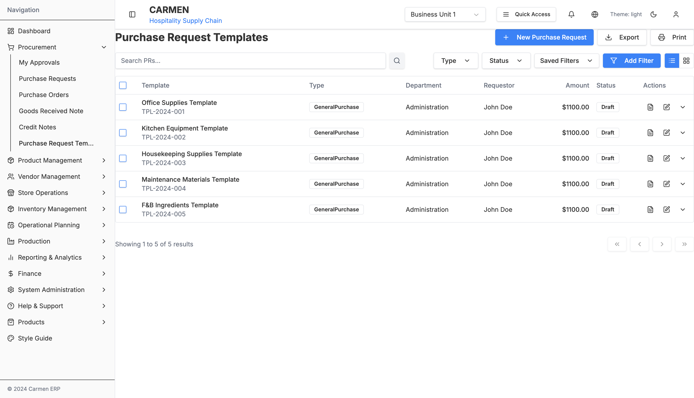
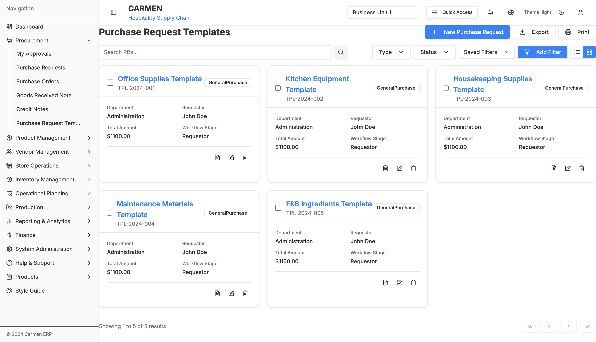
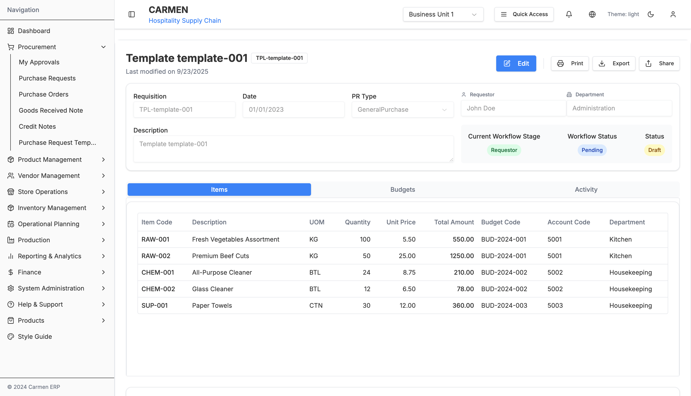
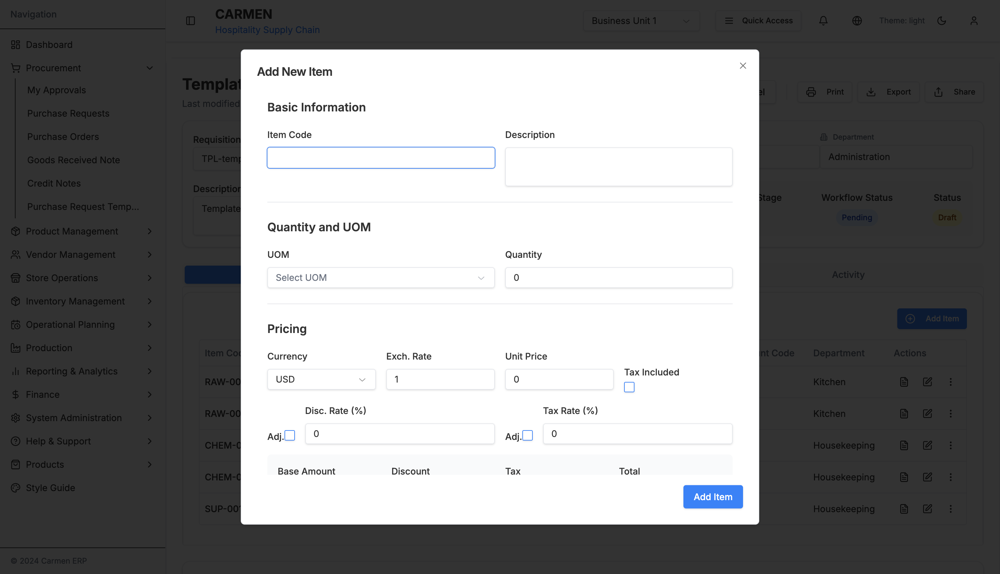
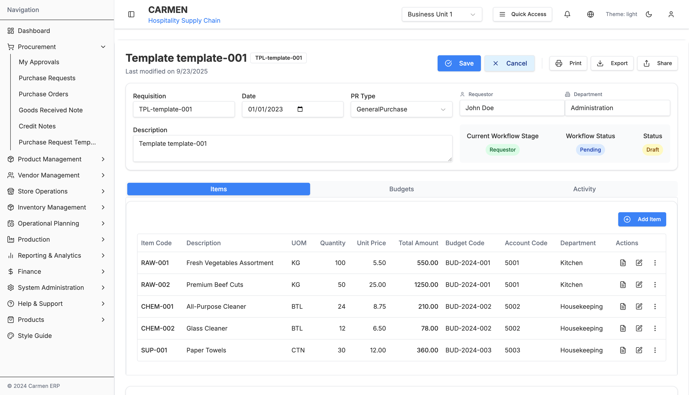

# Purchase Request Template Module - User Interaction Guide

## Table of Contents
1. [Navigation & Entry Points](#navigation--entry-points)
2. [Primary User Workflows](#primary-user-workflows)
3. [Dialog Interactions](#dialog-interactions)
4. [Form Interactions](#form-interactions)
5. [Data Management](#data-management)
6. [Advanced Features](#advanced-features)

## Navigation & Entry Points

### Main Navigation
- **Primary Access:** Procurement → Purchase Request Templates (sidebar menu)
- **Breadcrumb:** Dashboard → Procurement → Purchase Request Templates
- **URL Pattern:** `/procurement/purchase-request-templates`

### Direct Links
- **Specific Template:** `/procurement/purchase-request-templates/[TEMPLATE-ID]`
- **Create New:** `/procurement/purchase-request-templates/new?mode=add`
- **Edit Mode:** `/procurement/purchase-request-templates/[TEMPLATE-ID]?mode=edit`
- **View Mode:** `/procurement/purchase-request-templates/[TEMPLATE-ID]?mode=view`

## Primary User Workflows

### 1. Create New Purchase Request Template

**Step-by-Step Process:**

1. **Navigate to Template List**
   - Click "Procurement" in sidebar
   - Select "Purchase Request Templates"

2. **Initiate Template Creation**
   - Click "New Template" button in the header
   - System navigates to new template creation page

3. **Enter Template Header Information**
   - **Template Name**: Enter descriptive name for the template
   - **Reference Number**: Auto-generated or manual entry
   - **Template Type**: Select from dropdown (General Purchase, Asset Purchase)
   - **Department**: Choose from department list
   - **Requestor**: Select requesting person
   - **Description**: Enter detailed description of template purpose
   - **Date Created**: Automatically set to current date

4. **Configure Template Items**
   - Navigate to "Items" tab
   - Click "Add Item" button to add template items
   - Fill item details in the item form dialog

5. **Add Individual Items**
   - Use the "Add Item" dialog to configure each template item
   - Enter item code, description, quantity, and pricing
   - Set budget codes and account codes
   - Configure unit of measure (UOM)

6. **Review and Save Template**
   - Review all template information
   - Verify item details and calculations
   - Click "Save" to create the template
   - Template becomes available for use in purchase requests

### 2. Edit Existing Template

**Edit Workflow:**

1. **Access Template for Editing**
   - Open specific template from list (table or card view)
   - Click "Edit" button or switch to edit mode
   - System enables editing capabilities

2. **Modify Template Information**
   - Update header information as needed
   - Modify template name, description, or type
   - Change department or requestor assignments
   - Update any other template metadata

3. **Update Template Items**
   - Navigate to Items tab
   - Edit existing items using the edit button
   - Add new items or remove unnecessary ones
   - Modify quantities, pricing, or specifications

4. **Save Changes**
   - Review all modifications
   - Click "Save" to commit changes
   - System returns to view mode after successful save

### 3. Clone Template

**Cloning Workflow:**

1. **Select Template to Clone**
   - Navigate to template detail page
   - Click "Clone Template" action button
   - System creates a copy with new ID

2. **Modify Cloned Template**
   - Update template name to distinguish from original
   - Modify items and quantities as needed
   - Adjust any template-specific information

3. **Save Cloned Template**
   - Review cloned template details
   - Save with new reference number
   - New template becomes available for use

### 4. Set Template as Default

**Default Template Workflow:**

1. **Access Template Configuration**
   - Open desired template for department
   - Click "Set as Default" action button
   - Confirm default template assignment

2. **Department Default Configuration**
   - Template becomes default for specified department
   - New purchase requests auto-populate from default template
   - Users can still choose other templates if needed

3. **Verify Default Settings**
   - Check department-specific template assignments
   - Test new purchase request creation
   - Ensure proper template auto-population

### 5. Use Template for Purchase Request Creation

**Template Usage Workflow:**

1. **Create Purchase Request from Template**
   - Navigate to Purchase Requests module
   - Select "Create from Template" option
   - Choose desired template from list

2. **Customize Request from Template**
   - Template items automatically populate
   - Modify quantities or specifications as needed
   - Add or remove items based on actual requirements
   - Update request-specific information

3. **Submit Purchase Request**
   - Review auto-populated information
   - Make necessary adjustments
   - Submit for approval following standard workflow

## Dialog Interactions

### 1. Add/Edit Item Dialog

**Interface Elements:**
- **Basic Information Section**: Item code, description
- **Quantity and UOM Section**: Measurements and units
- **Pricing Section**: Currency, unit price, calculations
- **Additional Information Section**: Budget codes, departments

**User Actions:**
- **Item Code Entry**: Enter or search for item codes
- **Description**: Provide detailed item description
- **Quantity Setup**: Set template quantities with UOM
- **Pricing Configuration**: Enter unit prices with currency
- **Budget Assignment**: Select appropriate budget and account codes

**Form Validation:**
- **Required Fields**: Item code, description, UOM, quantity
- **Positive Numbers**: Quantities and prices must be positive
- **Currency Validation**: Proper currency format and rates
- **Code Validation**: Valid budget and account codes

### 2. Template Deletion Confirmation

**Dialog Triggers:**
- **Single Template Delete**: Delete button on template row
- **Bulk Template Delete**: Bulk delete action

**Interface Elements:**
- **Confirmation Message**: "Are you sure you want to delete this template?"
- **Impact Information**: Number of related records affected
- **Action Buttons**: "Delete" and "Cancel" options

**User Actions:**
- **Confirm Deletion**: Proceed with template removal
- **Cancel**: Abort deletion and return to list

### 3. Template Clone Confirmation

**Dialog Elements:**
- **Clone Options**: Template name modification
- **Copy Settings**: Which elements to include in clone
- **Confirmation Buttons**: "Clone" and "Cancel"

**User Actions:**
- **Name New Template**: Provide name for cloned template
- **Select Clone Options**: Choose what to copy
- **Confirm Clone**: Create new template from existing

## Form Interactions

### 1. Template Header Form

**Field Types and Validation:**

**Text Fields:**
- **Template Name**: Required, unique within organization
- **Reference Number**: Auto-generated or manual entry
- **Description**: Multi-line text area for details
- **Requestor**: Dropdown with user selection

**Selection Fields:**
- **Template Type**: Radio buttons or dropdown
- **Department**: Dropdown with department list
- **Currency**: Multi-currency support

**Date Fields:**
- **Date Created**: Auto-populated, read-only
- **Last Modified**: System-maintained

**Validation Rules:**
- **Required Fields**: Name, type, department marked with indicators
- **Uniqueness**: Template name must be unique
- **Character Limits**: Text fields have maximum length validation

### 2. Items Tab Interactions

**Item Management:**
- **Add New Item**: Button opens item creation dialog
- **Edit Item**: Click edit icon for item modification
- **Delete Item**: Trash icon with confirmation
- **Reorder Items**: Drag and drop for item sequence

**Bulk Operations:**
- **Select Multiple Items**: Checkbox selection
- **Bulk Delete**: Remove multiple items
- **Bulk Edit**: Modify common properties

**Item Display:**
- **Table View**: Detailed item information in columns
- **Responsive Layout**: Adapts to screen size
- **Action Column**: Edit and delete buttons per row

### 3. Budget Configuration

**Budget Assignment:**
- **Budget Code Selection**: Dropdown with available codes
- **Account Code Assignment**: Related account selection
- **Department Mapping**: Automatic or manual assignment
- **Validation**: Ensure valid code combinations

## Data Management

### 1. Search and Filtering

**Quick Filters:**
- **Template Type**: General Purchase, Asset Purchase
- **Department**: Filter by department assignment
- **Status**: Active, Inactive, Draft templates
- **Date Range**: Created or modified date filtering

**Advanced Search:**
- **Template Name**: Partial or exact match
- **Item Content**: Search within template items
- **Requestor**: Filter by template creator
- **Budget Code**: Search by budget assignments

**Search Features:**
- **Auto-complete**: Template name suggestions
- **Search History**: Recently used search terms
- **Saved Searches**: Store frequently used filters
- **Clear Filters**: Reset all search criteria

### 2. View Modes

**Table View:**
- **Sortable Columns**: Click headers to sort
- **Customizable Display**: Show/hide columns
- **Row Actions**: Edit, delete, clone per row
- **Pagination**: Navigate through template pages

**Card View:**
- **Visual Layout**: Template cards with key information
- **Responsive Grid**: Adapts to screen size
- **Quick Actions**: Buttons on each card
- **Batch Selection**: Multi-select for bulk operations

### 3. Bulk Operations

**Selection Methods:**
- **Individual Selection**: Click checkboxes for specific templates
- **Page Selection**: Select all templates on current page
- **Filter-based Selection**: Select all matching criteria

**Bulk Actions:**
- **Delete Multiple**: Remove selected templates
- **Clone Multiple**: Create copies of selected templates
- **Export**: Generate reports for selected templates
- **Status Updates**: Change status for multiple templates

## Advanced Features

### 1. Template Inheritance

**Department Templates:**
- **Default Templates**: Set department-specific defaults
- **Inheritance Rules**: Child departments inherit parent templates
- **Override Capability**: Departments can override inherited templates
- **Template Hierarchy**: Multi-level template organization

### 2. Template Versioning

**Version Control:**
- **Version History**: Track template modifications
- **Version Comparison**: Compare different template versions
- **Rollback Capability**: Restore previous template versions
- **Change Tracking**: Log all template modifications

### 3. Template Analytics

**Usage Metrics:**
- **Usage Frequency**: Track how often templates are used
- **Popular Templates**: Identify most-used templates
- **Department Usage**: Analyze usage by department
- **Trend Analysis**: Usage patterns over time

**Optimization Insights:**
- **Unused Templates**: Identify templates never used
- **Incomplete Templates**: Templates missing critical information
- **Efficiency Metrics**: Template effectiveness measurements

### 4. Integration Features

**Purchase Request Integration:**
- **Seamless Creation**: Direct PR creation from templates
- **Auto-population**: Template data fills PR forms
- **Customization**: Ability to modify template-based PRs
- **Workflow Integration**: Template PRs follow approval workflows

**Budget Integration:**
- **Budget Validation**: Verify budget availability
- **Cost Centers**: Link templates to cost centers
- **Approval Limits**: Budget-based approval routing
- **Spending Tracking**: Monitor template-based spending

### 5. Template Collaboration

**Multi-user Editing:**
- **Concurrent Access**: Multiple users can view templates
- **Edit Locking**: Prevent simultaneous edits
- **Change Notifications**: Alert users of template modifications
- **Permission Control**: Role-based template access

**Approval Workflows:**
- **Template Approval**: Templates require approval before use
- **Review Process**: Multi-level template review
- **Stakeholder Involvement**: Include relevant parties in review
- **Version Approval**: Approve specific template versions

### 6. Template Sharing

**Cross-Department Sharing:**
- **Shared Templates**: Templates available across departments
- **Permission Management**: Control sharing permissions
- **Template Libraries**: Organized template collections
- **Best Practice Sharing**: Share effective templates

**Import/Export:**
- **Template Export**: Export templates to external systems
- **Bulk Import**: Import templates from spreadsheets
- **Template Exchange**: Share templates between organizations
- **Format Support**: Multiple export formats available

## Document History

| Version | Date | Author | Changes |
|---------|------|--------|---------|
| 1.0.0 | 2025-11-19 | Documentation Team | Initial version |
---

*Generated on: 2025-09-23*
*User Interaction Guide Version: 1.0*
*Carmen ERP - Hospitality Supply Chain Management*