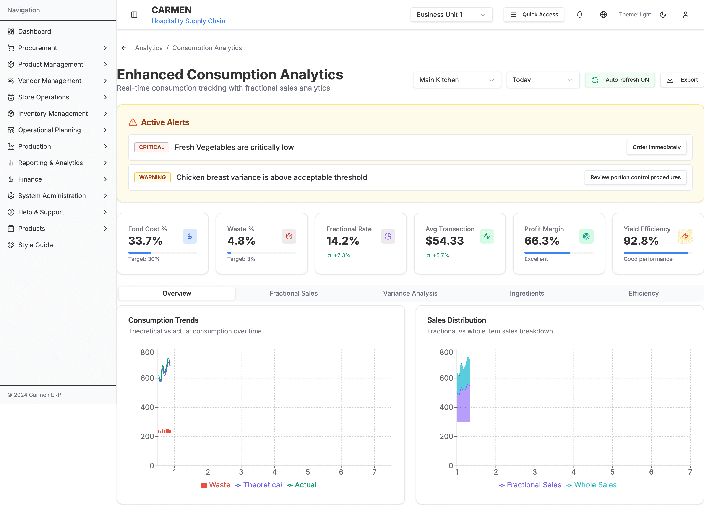

# Reporting & Analytics Module

> **Module:** Reporting & Analytics
> **Pages:** 15-20
> **Status:** ✅ Production Ready
> **Route:** `/reporting-analytics`

## Document History

| Version | Date | Author | Changes |
|---------|------|--------|---------|
| 1.0.0 | 2025-11-19 | Documentation Team | Initial version |
---

## Overview

The Reporting & Analytics module provides comprehensive business intelligence, real-time analytics, and consumption tracking for Carmen ERP. This module offers advanced analytics capabilities with a focus on consumption analytics, fractional sales tracking, variance analysis, and operational efficiency metrics.

### Key Capabilities

1. **Real-Time Consumption Analytics** - Live tracking of ingredient consumption, sales, and waste
2. **Fractional Sales Analytics** - Specialized analytics for pizza slices, cake portions, bottle-by-glass
3. **Variance Analysis** - Theoretical vs actual consumption tracking with root cause analysis
4. **Efficiency Metrics** - Yield efficiency, profit margins, and optimization opportunities
5. **Live Dashboard** - Auto-refreshing KPI dashboard with alerts and recommendations
6. **Multi-Location Analytics** - Cross-location comparison and efficiency tracking

---

## 📸 System Screenshots

### Consumption Analytics Dashboard

*The Consumption Analytics dashboard provides real-time business intelligence with comprehensive monitoring across 5 functional tabs. Active Alerts section displays 2 critical alerts: "High Variance Detected" for Premium Coffee Beans (Variance: 18.5%, Expected: 8%) and WARNING alert for "Stock Level Low" on Extra Virgin Olive Oil (Current: 15 kg, Reorder: 20 kg). Six KPI widgets track: Food Cost % (32.5% current vs 30% target, red indicator), Waste % (2.8% vs 3% target, green), Fractional Rate (68.5% conversion rate), Avg Transaction ($45.20 value), Profit Margin (38.2% with Grade: Good), and Yield Efficiency (94.5% with Performance: Excellent). Two analytical charts visualize: Consumption Trends (7-day line chart showing theoretical consumption 850-1150kg, actual consumption 900-1200kg, waste 50-100kg from Mon-Sun) and Sales Distribution (area chart comparing Fractional Sales 450-750 units vs Whole Sales 300-500 units). Navigation tabs (Overview, Fractional Sales, Variance, Ingredients, Efficiency) and filter controls (Location: All Locations, Time Range: This Week) enable comprehensive consumption analysis and optimization.*

---

## Module Structure

```
Reporting & Analytics (15-20 pages)
├── Main Dashboard: 1 page
└── Consumption Analytics: 14-19 pages
    ├── Overview Dashboard: 2 pages
    ├── Fractional Sales Analytics: 3 pages
    ├── Variance Analysis: 3 pages
    ├── Ingredient Tracking: 2 pages
    ├── Efficiency Analysis: 2 pages
    ├── Executive Summary: 2 pages
    └── Automated Reporting: 2-5 pages
```

---

## Key Features

### 1. Enhanced Consumption Dashboard

**Purpose**: Real-time consumption tracking with fractional sales analytics and live KPI monitoring.

**Features**:
- Auto-refreshing real-time metrics (30-second intervals)
- 6 key performance indicators with visual progress bars
- Active alerts system with severity levels (critical, warning, info)
- Multi-tab interface (Overview, Fractional Sales, Variance, Ingredients, Efficiency)
- Location and time range filtering
- Export capabilities for all reports

**KPIs Tracked**:
1. **Food Cost Percentage** - Target: 30%, visual threshold monitoring
2. **Waste Percentage** - Target: 3%, waste reduction tracking
3. **Fractional Sales Rate** - Conversion rate for partial items
4. **Average Transaction Value** - Revenue per transaction with trend indicators
5. **Profit Margin** - Overall profitability with performance grading
6. **Yield Efficiency** - Recipe yield vs expected with performance rating

### 2. Fractional Sales Analytics

**Purpose**: Specialized tracking and analytics for fractional sales (pizza slices, cake portions, bottle-by-glass).

**Types Supported**:
- **Pizza Slices**: 1/8 slices with conversion tracking
- **Cake Slices**: 1/12 portions with efficiency metrics
- **Bottle-by-Glass**: 1/5 servings with waste tracking
- **Portion Control**: Custom portion sizes with yield monitoring

**Analytics**:
- Transaction volume by fractional type
- Revenue contribution per type
- Efficiency percentage (target: 90%+)
- Waste rate tracking (target: <5%)
- Conversion rate trends
- Real-time fractional sales distribution

### 3. Consumption Trend Analysis

**Purpose**: Track theoretical vs actual consumption over time with waste identification.

**Features**:
- **Consumption Charts**: Theoretical vs actual consumption comparison
- **Waste Tracking**: Daily waste amounts with trend analysis
- **Sales Distribution**: Fractional vs whole item sales breakdown
- **7-Day Rolling Trends**: Daily consumption patterns
- **Variance Alerts**: Automatic alerts when variance exceeds thresholds

**Chart Types**:
- Composed charts with theoretical/actual lines and waste bars
- Area charts for fractional vs whole sales stacking
- Line charts for efficiency trend visualization

### 4. Variance Analysis

**Purpose**: Identify and analyze discrepancies between theoretical and actual consumption.

**Analysis Components**:
- **Top Variance Ingredients**: Ranked list with percentage variance
- **Trend Indicators**: Up, down, or stable variance trends
- **Cost Impact**: Dollar amount of variances
- **Threshold Monitoring**: Acceptable (8%) vs critical (15%) variance levels
- **Root Cause Identification**: Wastage, over-portioning, spillage, theft

**Variance Drivers**:
- **Wastage**: Spoilage, preparation waste, disposal
- **Over-portioning**: Inconsistent portion sizes, untrained staff
- **Ingredient Cost Changes**: Price fluctuations, supplier changes
- **Recipe Deviation**: Non-standard preparation methods
- **Spillage**: Accidental loss during preparation/service
- **Theft**: Inventory shrinkage, unauthorized consumption

### 5. Live Ingredient Tracking

**Purpose**: Real-time inventory status with consumption-based projections.

**Features**:
- **Current Levels**: Real-time inventory quantities
- **Status Indicators**: Adequate, Low (yellow), Critical (red), Out of Stock
- **Projected Depletion**: Estimated date when stock runs out
- **Reorder Point Monitoring**: Visual progress toward reorder threshold
- **Consumption-Based Forecasting**: Depletion projections based on consumption rates

**Alert Thresholds**:
- **Adequate**: Above 2x reorder point (green)
- **Low**: Below 2x reorder point, above reorder point (yellow)
- **Critical**: Below reorder point (red)
- **Out of Stock**: Zero inventory (urgent)

### 6. Efficiency Optimization

**Purpose**: Identify and quantify opportunities for operational improvements.

**Optimization Categories**:
1. **Reduce Waste**: Improve storage, handling, portion control
2. **Optimize Portion Sizes**: Standardize fractional portions for better yield
3. **Recipe Standardization**: Update recipes based on actual consumption
4. **Improve Yield**: Production process improvements

**Impact Assessment**:
- **Potential Savings**: Daily/monthly dollar impact
- **Implementation Complexity**: Low, Medium, High
- **Time to Value**: Estimated implementation timeline
- **Priority Ranking**: High Impact, Medium Impact, Long Term

---

## Data Models

### Real-Time Consumption Metrics

```typescript
interface RealTimeConsumptionMetrics {
  timestamp: Date;
  location: string;

  // Current period metrics
  currentPeriodSales: number;
  currentPeriodCosts: number;
  currentPeriodProfit: number;

  // Today's metrics
  todayTransactionCount: number;
  todayFractionalSales: number;
  todayWholeSales: number;
  todayWastage: number;

  // Live inventory impact
  liveIngredientLevels: {
    ingredientId: string;
    ingredientName: string;
    currentLevel: number;
    projectedDepletion: Date | null;
    reorderPoint: number;
    status: 'adequate' | 'low' | 'critical' | 'out_of_stock';
  }[];

  // Performance indicators
  kpis: {
    foodCostPercentage: number;
    wastePercentage: number;
    fractionalSalesConversionRate: number;
    averageTransactionValue: number;
    profitMargin: number;
    yieldEfficiency: number;
  };

  // Alerts and recommendations
  alerts: {
    type: 'waste_warning' | 'stock_low' | 'variance_high' | 'efficiency_low';
    severity: 'info' | 'warning' | 'critical';
    message: string;
    ingredientId?: string;
    recipeId?: string;
    threshold?: number;
    currentValue?: number;
    recommendedAction?: string;
  }[];
}
```

### Fractional Sales Transaction

```typescript
interface FractionalSalesTransaction {
  id: string;
  transactionId: string; // POS transaction reference
  posItemCode: string;
  itemName: string;
  variantId: string;
  variantName: string;
  baseRecipeId: string;
  baseRecipeName: string;
  fractionalSalesType: 'pizza-slice' | 'cake-slice' | 'bottle-glass' | 'portion-control' | 'custom';
  quantitySold: number;
  conversionRate: number; // How much of base recipe this represents
  salePrice: number;
  costPrice: number;
  grossProfit: number;
  location: string;
  cashier: string;
  timestamp: Date;
  shiftId?: string;
  orderNumber?: string;
}
```

### Ingredient Consumption Record

```typescript
interface IngredientConsumptionRecord {
  id: string;
  ingredientId: string;
  ingredientName: string;
  ingredientType: 'product' | 'recipe';

  // Theoretical consumption (based on recipes)
  theoreticalQuantity: number;
  theoreticalCost: number;

  // Actual consumption (including wastage, spillage, etc.)
  actualQuantity: number;
  actualCost: number;

  // Variance tracking
  quantityVariance: number; // actual - theoretical
  costVariance: number; // actual - theoretical
  variancePercentage: number; // (variance / theoretical) * 100

  // Breakdown by source
  recipeConsumption: number; // Consumed through recipes
  directConsumption: number; // Direct usage (prep, seasoning, etc.)
  wastage: number; // Identified waste
  spillage: number; // Accidental loss
  adjustment: number; // Manual adjustments

  unit: string;
  location: string;
  period: string;
  calculatedAt: Date;

  // Fractional sales specific
  fractionalContribution: number; // Portion consumed via fractional sales
  wholeItemContribution: number; // Portion consumed via whole item sales
}
```

### Recipe Consumption Summary

```typescript
interface RecipeConsumptionSummary {
  id: string;
  recipeId: string;
  recipeName: string;

  // Production metrics
  totalProduced: number; // Base recipe units produced
  totalSold: number; // Total units sold (all variants)
  remainingInventory: number; // Unsold prepared items

  // Variant breakdown
  variantSales: {
    variantId: string;
    variantName: string;
    quantitySold: number;
    revenueGenerated: number;
    conversionRate: number;
    contributionToBase: number;
  }[];

  // Cost analysis
  totalIngredientCost: number;
  totalLaborCost: number;
  totalOverheadCost: number;
  totalCost: number;
  totalRevenue: number;
  grossProfit: number;
  profitMargin: number;

  // Consumption efficiency
  theoreticalIngredientCost: number;
  actualIngredientCost: number;
  ingredientVariance: number;
  wastageRate: number;

  // Fractional sales metrics
  fractionalSalesRevenue: number;
  wholeSalesRevenue: number;
  fractionalSalesPercentage: number;

  // Efficiency metrics
  yieldEfficiency: number;
  conversionEfficiency: number;
  wasteReductionOpportunity: number;
}
```

### Consumption Variance Analysis

```typescript
interface ConsumptionVarianceAnalysis {
  period: string;
  location: string;
  analysisType: 'daily' | 'weekly' | 'monthly' | 'custom';

  // Overall variance
  totalTheoreticalCost: number;
  totalActualCost: number;
  totalVariance: number;
  totalVariancePercentage: number;

  // Variance by category
  categoryVariances: {
    categoryName: string;
    theoreticalCost: number;
    actualCost: number;
    variance: number;
    variancePercentage: number;
    contributionToTotal: number;
    trend: 'improving' | 'worsening' | 'stable';
  }[];

  // Variance by recipe
  recipeVariances: {
    recipeId: string;
    recipeName: string;
    fractionalSalesType?: string;
    theoreticalCost: number;
    actualCost: number;
    variance: number;
    variancePercentage: number;
    productionCount: number;
    averageVariancePerUnit: number;
  }[];

  // Root cause analysis
  varianceDrivers: {
    driver: 'wastage' | 'over_portioning' | 'ingredient_cost_change' | 'recipe_deviation' | 'spillage' | 'theft';
    impact: number;
    impactPercentage: number;
    affectedItems: string[];
    recommendedActions: string[];
  }[];

  // Statistical analysis
  statistics: {
    meanVariance: number;
    medianVariance: number;
    standardDeviation: number;
    confidenceInterval: {
      lower: number;
      upper: number;
      confidence: number;
    };
    outliers: {
      ingredientId: string;
      ingredientName: string;
      variance: number;
      standardDeviations: number;
    }[];
  };

  calculatedAt: Date;
}
```

### Fractional Sales Efficiency Report

```typescript
interface FractionalSalesEfficiencyReport {
  period: string;
  location: string;

  // Overall efficiency metrics
  totalFractionalTransactions: number;
  totalFractionalRevenue: number;
  averageFractionalTransactionValue: number;
  fractionalSalesGrowthRate: number;

  // Conversion efficiency by type
  typeEfficiency: {
    fractionalSalesType: 'pizza-slice' | 'cake-slice' | 'bottle-glass' | 'portion-control' | 'custom';
    totalTransactions: number;
    totalRevenue: number;
    averageConversionRate: number;
    wasteRate: number;
    profitMargin: number;
    efficiency: number; // Revenue per base recipe unit

    itemPerformance: {
      recipeId: string;
      recipeName: string;
      variantsSold: {
        variantId: string;
        variantName: string;
        quantitySold: number;
        revenue: number;
        costEfficiency: number;
      }[];
      totalBaseRecipesConsumed: number;
      revenuePerBaseRecipe: number;
      wastePerBaseRecipe: number;
    }[];
  }[];

  // Optimization opportunities
  optimizationOpportunities: {
    opportunity: 'reduce_waste' | 'improve_portioning' | 'adjust_pricing' | 'optimize_variants' | 'improve_yield';
    potentialImpact: number;
    affectedItems: string[];
    currentMetric: number;
    targetMetric: number;
    implementationComplexity: 'low' | 'medium' | 'high';
    estimatedTimeToValue: string;
  }[];

  // Trend analysis
  trends: {
    period: string;
    fractionalSalesVolume: number;
    fractionalSalesRevenue: number;
    averageTransactionValue: number;
    conversionEfficiency: number;
    wasteRate: number;
  }[];

  calculatedAt: Date;
}
```

---

## Integration Points

### POS Integration
- Real-time transaction import from POS systems
- Fractional sales transaction mapping
- Revenue and cost data synchronization
- Shift and cashier tracking

### Operational Planning
- Recipe data for theoretical consumption calculations
- Yield variant conversion rates
- Ingredient specifications and costs
- Production schedules and forecasts

### Inventory Management
- Real-time inventory levels
- Consumption-based depletion projections
- Reorder point monitoring
- Stock adjustment tracking

### Finance
- Cost allocation and GL posting
- Variance impact on financial reporting
- Budget vs actual tracking
- Profitability analysis

### Vendor Management
- Ingredient cost tracking
- Supplier price variance analysis
- Cost change impact assessment

---

## Business Rules

### Consumption Calculation Rules

1. **Theoretical Consumption**:
   - Calculated from recipe specifications and sales volumes
   - Includes standard wastage factors from recipe definitions
   - Based on yield variants for fractional sales

2. **Actual Consumption**:
   - Physical inventory deductions
   - Includes all wastage, spillage, and adjustments
   - Tracked per consumption period

3. **Variance Thresholds**:
   - Acceptable: ≤ 8% variance
   - Warning: 8-15% variance
   - Critical: > 15% variance

### Fractional Sales Rules

1. **Conversion Rates**:
   - Pizza slice: 1/8 of base recipe (0.125)
   - Cake slice: 1/12 of base recipe (0.083)
   - Bottle glass: 1/5 of base recipe (0.200)
   - Custom portions: User-defined rates

2. **Efficiency Targets**:
   - Minimum efficiency: 85%
   - Target efficiency: 90%+
   - Maximum waste: 5%

3. **Inventory Deduction**:
   - Fractional sales deduct from prepared item inventory
   - Prepared items have shelf life tracking
   - Automatic waste generation when shelf life expires

### Alert Generation Rules

1. **Stock Low Alert**:
   - Triggered when current level < 2x reorder point
   - Severity: Warning

2. **Stock Critical Alert**:
   - Triggered when current level < reorder point
   - Severity: Critical
   - Recommended action: Order immediately

3. **Variance High Alert**:
   - Triggered when variance > acceptable threshold (8%)
   - Severity: Warning for 8-15%, Critical for >15%
   - Recommended action: Review procedures

4. **Waste Warning Alert**:
   - Triggered when waste % > target (3%)
   - Severity: Info for 3-5%, Warning for >5%
   - Recommended action: Investigate causes

### Period Management Rules

1. **Consumption Periods**:
   - Daily, weekly, monthly, or custom periods
   - One active period per location
   - Period must be closed before new period starts

2. **Period Closing**:
   - Requires physical inventory verification
   - Calculates final variances
   - Archives data for historical analysis
   - Locks consumption records to prevent changes

---

## API Endpoints

```http
# Consumption Analytics
GET /api/reporting/consumption/real-time
GET /api/reporting/consumption/metrics?location={location}&period={period}
GET /api/reporting/consumption/trends?location={location}&timeRange={range}

# Fractional Sales Analytics
GET /api/reporting/fractional-sales/efficiency
GET /api/reporting/fractional-sales/by-type?type={type}
GET /api/reporting/fractional-sales/transactions?period={period}

# Variance Analysis
GET /api/reporting/variance/analysis?period={period}&location={location}
GET /api/reporting/variance/ingredients?top={count}
GET /api/reporting/variance/drivers

# Ingredient Tracking
GET /api/reporting/ingredients/live-levels?location={location}
GET /api/reporting/ingredients/consumption?ingredientId={id}&period={period}
GET /api/reporting/ingredients/projections

# Efficiency Analysis
GET /api/reporting/efficiency/optimization-opportunities
GET /api/reporting/efficiency/yield-trends?period={period}
GET /api/reporting/efficiency/recipe-performance

# Export
POST /api/reporting/export/consumption-report
POST /api/reporting/export/variance-analysis
POST /api/reporting/export/efficiency-report
GET /api/reporting/export/download/{exportId}

# Real-Time Updates
WebSocket /api/reporting/realtime/subscribe?location={location}
```

---

## User Guide

### Viewing Real-Time Consumption Analytics

1. Navigate to Reporting & Analytics > Consumption Analytics
2. Select location from dropdown (defaults to current location)
3. Select time range (Today, This Week, This Month)
4. Enable auto-refresh for real-time updates (30-second intervals)
5. Review KPIs at top of dashboard
6. Check active alerts for critical issues
7. Use tabs to explore different analytics views

### Analyzing Fractional Sales Performance

1. Go to Consumption Analytics dashboard
2. Click "Fractional Sales" tab
3. Review efficiency chart showing revenue and transactions by type
4. Check today's fractional sales breakdown in sidebar
5. Compare efficiency percentages against target (90%+)
6. Identify waste rates for improvement opportunities
7. Export report for detailed analysis

### Investigating Variance Issues

1. Navigate to "Variance Analysis" tab
2. Review top variance ingredients list
3. Check variance percentage against thresholds:
   - Green: ≤ 8% (acceptable)
   - Yellow: 8-15% (warning)
   - Red: > 15% (critical)
4. Click on ingredient for detailed variance history
5. Review trend indicators (up, down, stable)
6. Identify root causes from variance drivers section
7. Implement recommended actions

### Monitoring Live Ingredient Levels

1. Click "Ingredients" tab
2. Review real-time inventory status for each ingredient
3. Check status indicators:
   - Green: Adequate stock
   - Yellow: Low (below 2x reorder point)
   - Red: Critical (below reorder point)
4. Review projected depletion dates
5. Take action on critical items
6. Export ingredient status report

### Identifying Optimization Opportunities

1. Navigate to "Efficiency" tab
2. Review yield efficiency trends chart
3. Check optimization opportunities panel
4. Review potential savings for each opportunity
5. Assess implementation complexity
6. Prioritize based on impact and complexity
7. Click "View Details" for implementation guidance

### Exporting Reports

1. Click "Export" button in dashboard header
2. Select report type:
   - Consumption Analytics
   - Variance Analysis
   - Efficiency Report
   - Fractional Sales Report
3. Choose date range for export
4. Select export format (PDF, Excel, CSV)
5. Click "Generate Report"
6. Download when generation completes

---

## Troubleshooting

### Issue: Real-Time Data Not Updating
**Cause**: Auto-refresh disabled or WebSocket connection lost
**Solution**:
1. Check auto-refresh toggle (should show green "ON" status)
2. Refresh browser page to reconnect WebSocket
3. Verify network connectivity
4. Check POS system integration status

### Issue: Variance Percentages Seem Incorrect
**Cause**: Mismatched consumption period or incomplete data
**Solution**:
1. Verify correct consumption period is selected
2. Ensure period has been properly closed
3. Check that all POS transactions have been imported
4. Verify inventory counts are up to date
5. Review recipe specifications for accuracy

### Issue: Fractional Sales Not Appearing
**Cause**: POS mapping not configured or recipes not set up for fractional sales
**Solution**:
1. Verify POS recipe mapping in System Administration
2. Check that recipes have yield variants configured
3. Ensure fractional sales type is set (pizza-slice, cake-slice, etc.)
4. Verify conversion rates are properly defined
5. Check POS transaction import logs

### Issue: Alerts Not Generating
**Cause**: Threshold configuration or data quality issues
**Solution**:
1. Verify alert thresholds in system settings
2. Check that real-time data collection is active
3. Review ingredient reorder points
4. Ensure variance calculation is running
5. Check alert notification settings

### Issue: Export Fails or Incomplete
**Cause**: Large data set or timeout
**Solution**:
1. Reduce date range for export
2. Use filters to limit data scope
3. Try different export format (CSV vs Excel)
4. Schedule export for off-peak hours
5. Contact system administrator for large exports

---

## Best Practices

### Real-Time Monitoring

1. **Enable Auto-Refresh**: Keep auto-refresh on during service hours for live monitoring
2. **Review Alerts Promptly**: Address critical alerts within 30 minutes
3. **Monitor KPIs**: Check KPI dashboard at start and end of each shift
4. **Location-Specific**: Monitor each location separately for accurate insights

### Variance Management

1. **Daily Review**: Check variance analysis daily during active periods
2. **Threshold Alignment**: Keep acceptable variance threshold at 8% or lower
3. **Root Cause Analysis**: Investigate all variances > 10% immediately
4. **Trend Tracking**: Monitor variance trends to identify systemic issues
5. **Documentation**: Document all variance causes and corrective actions

### Fractional Sales Optimization

1. **Efficiency Targets**: Maintain 90%+ efficiency for all fractional types
2. **Waste Reduction**: Keep waste rate below 5% for fractional items
3. **Portion Control**: Standardize fractional portions with training and tools
4. **Shelf Life Management**: Monitor prepared item shelf life to minimize waste
5. **Revenue Maximization**: Analyze fractional vs whole sales mix for profitability

### Reporting Cadence

1. **Daily**: Real-time dashboard review, variance check, alert response
2. **Weekly**: Trend analysis, efficiency review, optimization opportunities
3. **Monthly**: Comprehensive variance analysis, period closing, executive reporting
4. **Quarterly**: Strategic review, threshold adjustment, process improvements

### Data Quality

1. **Timely POS Import**: Ensure POS transactions import within 15 minutes
2. **Accurate Inventory**: Conduct regular physical counts for validation
3. **Recipe Maintenance**: Keep recipe specifications up to date
4. **Period Management**: Close periods promptly to lock data
5. **Audit Trail**: Maintain documentation for all adjustments

---

## Performance Metrics

### Dashboard Performance
- **Load Time**: < 2 seconds for initial dashboard load
- **Auto-Refresh**: < 500ms for real-time metric updates
- **Chart Rendering**: < 1 second for all chart visualizations
- **Data Export**: < 5 seconds for standard date ranges

### Data Freshness
- **Real-Time Metrics**: < 30 seconds lag from POS transaction
- **Inventory Levels**: < 1 minute lag from inventory system
- **Variance Calculations**: Updated every 5 minutes during active periods
- **Alert Generation**: < 1 minute from threshold breach

### Calculation Accuracy
- **Theoretical Consumption**: 99.9% accuracy vs recipe specifications
- **Variance Calculations**: ± 0.1% accuracy
- **Fractional Conversion**: 100% accuracy per defined conversion rates
- **Cost Calculations**: ± $0.01 accuracy

---

## Future Enhancements

**Planned Features**:
- Predictive analytics for consumption forecasting
- Machine learning for variance pattern detection
- Automated optimization recommendations
- Mobile app for real-time monitoring
- Advanced statistical process control charts
- Multi-location comparison dashboards
- Custom report builder
- Scheduled automated reports
- API integrations for third-party BI tools
- Advanced data visualization options

---

**Last Updated:** 2025-01-17
**Version:** 1.0.0
