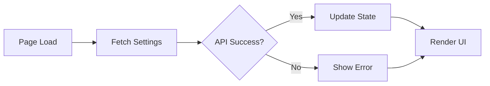
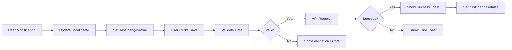

# Notification Settings - Technical Implementation Guide

**Module**: System Administration
**Feature**: Notification Settings
**Document Type**: Technical Implementation Guide
**Version**: 1.0
**Last Updated**: October 21, 2025

---

## Table of Contents

1. [Architecture Overview](#architecture-overview)
2. [Component Structure](#component-structure)
3. [State Management](#state-management)
4. [Data Flow](#data-flow)
5. [API Integration](#api-integration)
6. [Type Definitions](#type-definitions)
7. [Implementation Details](#implementation-details)
8. [Testing Strategy](#testing-strategy)

---

## Architecture Overview

### Technology Stack

- **Framework**: Next.js 14 with App Router
- **Language**: TypeScript with strict mode enabled
- **UI Components**: Shadcn/ui (Radix UI primitives)
- **State Management**: React useState with local component state
- **Form Handling**: React Hook Form + Zod validation (future enhancement)
- **Styling**: Tailwind CSS

### File Structure

```
app/(main)/system-administration/settings/notifications/
├── page.tsx                          # Main notification settings page
├── components/
│   ├── global-defaults-tab.tsx       # Global defaults configuration
│   ├── email-templates-tab.tsx       # Template management
│   ├── delivery-settings-tab.tsx     # Delivery infrastructure
│   ├── routing-rules-tab.tsx         # Routing configuration
│   ├── notification-history-tab.tsx  # History and logs
│   └── testing-tab.tsx               # Testing functionality

lib/
├── types/
│   └── settings.ts                   # TypeScript interfaces
├── mock-data/
│   └── settings.ts                   # Mock data for development
└── api/
    └── notifications/                # API route handlers (future)
```

---

## Component Structure

### Main Page Component (`page.tsx`)

```typescript
"use client";

import { useState } from "react";
import { Tabs, TabsContent, TabsList, TabsTrigger } from "@/components/ui/tabs";

export default function NotificationSettingsPage() {
  const [activeTab, setActiveTab] = useState("defaults");

  return (
    <div className="px-9 pt-9 pb-6">
      {/* Page Header */}
      <div className="mb-8">
        <h1 className="text-3xl font-bold tracking-tight">
          Notification Settings
        </h1>
        <p className="text-muted-foreground mt-2">
          Manage organization-wide notification preferences, templates,
          routing rules, and delivery settings
        </p>
      </div>

      {/* Tab Navigation */}
      <Tabs value={activeTab} onValueChange={setActiveTab}>
        <TabsList className="grid w-full grid-cols-6">
          {/* Tab triggers with icons */}
        </TabsList>

        {/* Tab content areas */}
        <TabsContent value="defaults">
          <GlobalDefaultsTab />
        </TabsContent>
        {/* Other tabs... */}
      </Tabs>
    </div>
  );
}
```

### Tab Components

Each tab is a separate component with its own state management and logic:

#### Global Defaults Tab (`global-defaults-tab.tsx`)

**Key Features**:
- Event category organization
- Channel selection per event
- Frequency configuration
- Bulk enable/disable operations

**State Management**:
```typescript
const [preferences, setPreferences] = useState<NotificationPreference[]>(
  mockNotificationPreferences
);
const [hasChanges, setHasChanges] = useState(false);
```

**Event Handlers**:
```typescript
const handleToggleChannel = (
  eventType: NotificationEventType,
  channel: keyof NotificationPreference['channels']
) => {
  setPreferences(prev => prev.map(pref => {
    if (pref.eventType === eventType) {
      return {
        ...pref,
        channels: { ...pref.channels, [channel]: !pref.channels[channel] }
      };
    }
    return pref;
  }));
  setHasChanges(true);
};
```

#### Delivery Settings Tab (`delivery-settings-tab.tsx`)

**Key Features**:
- Rate limiting configuration
- Retry policy management
- Batching settings
- Channel infrastructure setup

**State Management**:
```typescript
const [settings, setSettings] = useState<DeliverySettings>(
  mockDeliverySettings
);
```

**Nested State Updates**:
```typescript
const handleRateLimitingChange = (field: string, value: boolean | number) => {
  setSettings(prev => ({
    ...prev,
    rateLimiting: { ...prev.rateLimiting, [field]: value }
  }));
  setHasChanges(true);
};
```

---

## State Management

### Local Component State

Each tab manages its own state using React's `useState` hook:

```typescript
// Global Defaults Tab
const [preferences, setPreferences] = useState<NotificationPreference[]>([]);
const [hasChanges, setHasChanges] = useState(false);

// Delivery Settings Tab
const [settings, setSettings] = useState<DeliverySettings>({});

// History Tab
const [filters, setFilters] = useState<HistoryFilters>({});
const [historyData, setHistoryData] = useState<NotificationHistoryEntry[]>([]);
```

### Change Detection

Track modifications to enable/disable save buttons:

```typescript
const [hasChanges, setHasChanges] = useState(false);

// Set to true on any modification
const handleChange = () => {
  setHasChanges(true);
};

// Reset after save
const handleSave = async () => {
  await saveSettings();
  setHasChanges(false);
};
```

### Future State Management

For production implementation, consider:
- **React Query**: For server state management and caching
- **Zustand**: For global notification settings state
- **Context API**: For sharing settings across tabs

---

## Data Flow

### Data Loading Flow



### Data Saving Flow



---

## API Integration

### API Endpoints (Future Implementation)

```typescript
// GET /api/notifications/settings
// Fetch all notification settings
interface GetSettingsResponse {
  globalDefaults: NotificationPreference[];
  deliverySettings: DeliverySettings;
  routingRules: RoutingRule[];
  templates: NotificationTemplate[];
}

// PUT /api/notifications/settings/defaults
// Update global defaults
interface UpdateDefaultsRequest {
  preferences: NotificationPreference[];
}

// PUT /api/notifications/settings/delivery
// Update delivery settings
interface UpdateDeliveryRequest {
  settings: DeliverySettings;
}

// POST /api/notifications/test
// Send test notification
interface TestNotificationRequest {
  eventType: NotificationEventType;
  recipient: string;
  channels: string[];
  templateData: Record<string, any>;
}

// GET /api/notifications/history
// Fetch notification history
interface GetHistoryRequest {
  startDate?: string;
  endDate?: string;
  eventType?: NotificationEventType;
  status?: 'delivered' | 'failed' | 'pending';
  limit?: number;
  offset?: number;
}
```

### API Client Implementation

```typescript
// lib/api/notifications.ts
export class NotificationAPI {
  static async getSettings(): Promise<GetSettingsResponse> {
    const response = await fetch('/api/notifications/settings');
    if (!response.ok) throw new Error('Failed to fetch settings');
    return response.json();
  }

  static async updateDefaults(
    preferences: NotificationPreference[]
  ): Promise<void> {
    const response = await fetch('/api/notifications/settings/defaults', {
      method: 'PUT',
      headers: { 'Content-Type': 'application/json' },
      body: JSON.stringify({ preferences }),
    });
    if (!response.ok) throw new Error('Failed to update defaults');
  }

  static async sendTestNotification(
    request: TestNotificationRequest
  ): Promise<TestNotificationResponse> {
    const response = await fetch('/api/notifications/test', {
      method: 'POST',
      headers: { 'Content-Type': 'application/json' },
      body: JSON.stringify(request),
    });
    if (!response.ok) throw new Error('Failed to send test notification');
    return response.json();
  }
}
```

---

## Type Definitions

### Core Types (`lib/types/settings.ts`)

```typescript
// Notification event types
export type NotificationEventType =
  | 'purchase-request-submitted'
  | 'purchase-request-approved'
  | 'purchase-request-rejected'
  | 'purchase-order-created'
  | 'purchase-order-approved'
  | 'goods-received'
  | 'invoice-received'
  | 'payment-due'
  | 'low-stock-alert'
  | 'stock-count-required'
  | 'workflow-assignment'
  | 'comment-mention'
  | 'document-shared'
  | 'price-update'
  | 'vendor-update'
  | 'system-maintenance'
  | 'security-alert';

// Notification preference for a single event type
export interface NotificationPreference {
  id: string;
  eventType: NotificationEventType;
  enabled: boolean;
  channels: {
    email: boolean;
    inApp: boolean;
    sms: boolean;
    push: boolean;
  };
  frequency: 'instant' | 'hourly' | 'daily' | 'weekly';
}

// Delivery settings configuration
export interface DeliverySettings {
  rateLimiting: {
    enabled: boolean;
    perUserPerHour: number;
    organizationPerHour: number;
  };
  retryPolicy: {
    maxRetries: number;
    initialDelaySeconds: number;
    backoffMultiplier: number;
  };
  batching: {
    enabled: boolean;
    windowMinutes: number;
    maxBatchSize: number;
  };
  channels: {
    email: EmailChannelConfig;
    sms: SmsChannelConfig;
    push: PushChannelConfig;
    webhook: WebhookChannelConfig;
  };
}

// Channel-specific configurations
export interface EmailChannelConfig {
  enabled: boolean;
  quotaPerDay: number;
  provider?: string;
  fromAddress?: string;
  smtpConfig?: {
    host: string;
    port: number;
    secure: boolean;
    auth: {
      user: string;
      pass: string;
    };
  };
}

export interface SmsChannelConfig {
  enabled: boolean;
  quotaPerDay: number;
  provider?: string;
  apiKey?: string;
  fromNumber?: string;
}

export interface PushChannelConfig {
  enabled: boolean;
  quotaPerDay: number;
  fcmServerKey?: string;
  apnsKeyId?: string;
  apnsTeamId?: string;
}

export interface WebhookChannelConfig {
  enabled: boolean;
  endpoints: WebhookEndpoint[];
}

export interface WebhookEndpoint {
  id: string;
  url: string;
  events: NotificationEventType[];
  headers?: Record<string, string>;
  authType?: 'none' | 'bearer' | 'basic';
  authToken?: string;
}

// Routing rule
export interface RoutingRule {
  id: string;
  name: string;
  description?: string;
  conditions: {
    eventType?: NotificationEventType;
    role?: string;
    department?: string;
    amountThreshold?: number;
    customField?: Record<string, any>;
  };
  recipients: {
    type: 'role' | 'user' | 'department';
    values: string[];
  };
  escalation?: {
    enabled: boolean;
    delayMinutes: number;
    escalateTo: {
      type: 'role' | 'user';
      values: string[];
    };
  };
  priority: 'high' | 'medium' | 'low';
  isActive: boolean;
  createdAt: string;
  updatedAt: string;
}

// Notification history entry
export interface NotificationHistoryEntry {
  id: string;
  eventType: NotificationEventType;
  recipient: {
    id: string;
    name: string;
    email: string;
  };
  channels: {
    channel: 'email' | 'inApp' | 'sms' | 'push' | 'webhook';
    status: 'delivered' | 'failed' | 'pending';
    sentAt?: string;
    deliveredAt?: string;
    error?: string;
  }[];
  createdAt: string;
  metadata?: Record<string, any>;
}

// Template definition
export interface NotificationTemplate {
  id: string;
  eventType: NotificationEventType;
  name: string;
  subject: string;
  htmlBody: string;
  textBody: string;
  variables: TemplateVariable[];
  isActive: boolean;
  lastModifiedBy?: string;
  lastModifiedAt?: string;
}

export interface TemplateVariable {
  name: string;
  description: string;
  required: boolean;
  defaultValue?: string;
}
```

---

## Implementation Details

### Component Best Practices

#### 1. Immutable State Updates

Always use spread operators to maintain immutability:

```typescript
// ✅ Good
setPreferences(prev => prev.map(pref =>
  pref.id === id ? { ...pref, enabled: !pref.enabled } : pref
));

// ❌ Bad
setPreferences(prev => {
  const item = prev.find(p => p.id === id);
  item.enabled = !item.enabled; // Mutates state directly
  return prev;
});
```

#### 2. Nested State Updates

For deeply nested objects, use helper functions:

```typescript
const updateNestedSetting = (
  path: string[],
  value: any
) => {
  setSettings(prev => {
    const updated = { ...prev };
    let current: any = updated;

    for (let i = 0; i < path.length - 1; i++) {
      current[path[i]] = { ...current[path[i]] };
      current = current[path[i]];
    }

    current[path[path.length - 1]] = value;
    return updated;
  });
};

// Usage
updateNestedSetting(['rateLimiting', 'perUserPerHour'], 100);
```

#### 3. Loading and Error States

Always handle loading and error states:

```typescript
const [isLoading, setIsLoading] = useState(true);
const [error, setError] = useState<string | null>(null);

useEffect(() => {
  async function loadSettings() {
    try {
      setIsLoading(true);
      const data = await NotificationAPI.getSettings();
      setPreferences(data.globalDefaults);
      setError(null);
    } catch (err) {
      setError(err instanceof Error ? err.message : 'Failed to load settings');
    } finally {
      setIsLoading(false);
    }
  }

  loadSettings();
}, []);

if (isLoading) return <LoadingSpinner />;
if (error) return <ErrorMessage message={error} />;
```

#### 4. Debounced Save

Implement auto-save with debouncing:

```typescript
import { useCallback } from 'react';
import { debounce } from 'lodash';

const debouncedSave = useCallback(
  debounce(async (settings: DeliverySettings) => {
    try {
      await NotificationAPI.updateDeliverySettings(settings);
      toast({ title: 'Settings saved automatically' });
    } catch (error) {
      toast({
        title: 'Auto-save failed',
        variant: 'destructive'
      });
    }
  }, 2000),
  []
);

// Call on every change
useEffect(() => {
  if (hasChanges) {
    debouncedSave(settings);
  }
}, [settings, hasChanges]);
```

### Form Validation

Implement validation rules:

```typescript
const validateRateLimiting = (settings: DeliverySettings['rateLimiting']) => {
  const errors: string[] = [];

  if (settings.perUserPerHour < 1 || settings.perUserPerHour > 1000) {
    errors.push('Per user rate limit must be between 1 and 1000');
  }

  if (settings.organizationPerHour < settings.perUserPerHour) {
    errors.push('Organization limit must be >= per user limit');
  }

  return errors;
};

const handleSave = async () => {
  const errors = validateRateLimiting(settings.rateLimiting);

  if (errors.length > 0) {
    toast({
      title: 'Validation Error',
      description: errors.join('. '),
      variant: 'destructive',
    });
    return;
  }

  // Proceed with save
  await NotificationAPI.updateDeliverySettings(settings);
};
```

---

## Testing Strategy

### Unit Tests

Test individual functions and components:

```typescript
// global-defaults-tab.test.tsx
import { render, screen, fireEvent } from '@testing-library/react';
import { GlobalDefaultsTab } from './global-defaults-tab';

describe('GlobalDefaultsTab', () => {
  it('should toggle event enabled state', () => {
    render(<GlobalDefaultsTab />);

    const toggle = screen.getByLabelText('Purchase Request Submitted');
    expect(toggle).not.toBeChecked();

    fireEvent.click(toggle);
    expect(toggle).toBeChecked();
  });

  it('should enable save button when changes made', () => {
    render(<GlobalDefaultsTab />);

    const saveButton = screen.getByText('Save Changes');
    expect(saveButton).toBeDisabled();

    const toggle = screen.getByLabelText('Purchase Request Submitted');
    fireEvent.click(toggle);

    expect(saveButton).not.toBeDisabled();
  });
});
```

### Integration Tests

Test component interactions:

```typescript
describe('Notification Settings Integration', () => {
  it('should save settings and show success message', async () => {
    render(<NotificationSettingsPage />);

    // Make changes
    const toggle = screen.getByLabelText('Purchase Request Submitted');
    fireEvent.click(toggle);

    // Save
    const saveButton = screen.getByText('Save Changes');
    fireEvent.click(saveButton);

    // Verify API call and toast
    await waitFor(() => {
      expect(screen.getByText('Settings Saved')).toBeInTheDocument();
    });
  });
});
```

### E2E Tests

Test complete user workflows:

```typescript
// e2e/notification-settings.spec.ts
import { test, expect } from '@playwright/test';

test('configure notification defaults', async ({ page }) => {
  await page.goto('/system-administration/settings/notifications');

  // Navigate to defaults tab
  await page.click('button:has-text("Defaults")');

  // Enable email for purchase requests
  await page.click('[data-testid="pr-submitted-toggle"]');
  await page.click('[data-testid="pr-submitted-email"]');

  // Save changes
  await page.click('button:has-text("Save Changes")');

  // Verify success
  await expect(page.locator('.toast')).toContainText('Settings Saved');
});
```

---

## Performance Optimization

### Code Splitting

Lazy load tab components:

```typescript
import dynamic from 'next/dynamic';

const GlobalDefaultsTab = dynamic(() =>
  import('./components/global-defaults-tab').then(mod => ({
    default: mod.GlobalDefaultsTab
  }))
);

const DeliverySettingsTab = dynamic(() =>
  import('./components/delivery-settings-tab').then(mod => ({
    default: mod.DeliverySettingsTab
  }))
);
```

### Memoization

Use React.memo for expensive components:

```typescript
import { memo } from 'react';

export const EventConfigCard = memo(({
  eventType,
  preference,
  onToggle
}: EventConfigCardProps) => {
  // Component implementation
}, (prevProps, nextProps) => {
  // Custom comparison
  return prevProps.preference === nextProps.preference;
});
```

### Virtual Scrolling

For large lists in history tab:

```typescript
import { useVirtualizer } from '@tanstack/react-virtual';

const HistoryList = ({ items }: { items: NotificationHistoryEntry[] }) => {
  const parentRef = useRef<HTMLDivElement>(null);

  const virtualizer = useVirtualizer({
    count: items.length,
    getScrollElement: () => parentRef.current,
    estimateSize: () => 80,
  });

  return (
    <div ref={parentRef} style={{ height: '600px', overflow: 'auto' }}>
      <div style={{ height: `${virtualizer.getTotalSize()}px` }}>
        {virtualizer.getVirtualItems().map(virtualItem => (
          <div
            key={virtualItem.key}
            style={{
              position: 'absolute',
              top: 0,
              left: 0,
              width: '100%',
              height: `${virtualItem.size}px`,
              transform: `translateY(${virtualItem.start}px)`,
            }}
          >
            <HistoryItem item={items[virtualItem.index]} />
          </div>
        ))}
      </div>
    </div>
  );
};
```

---

## Deployment Checklist

### Pre-Deployment

- [ ] All TypeScript types defined
- [ ] Component unit tests passing
- [ ] Integration tests passing
- [ ] E2E tests passing
- [ ] Accessibility audit completed
- [ ] Performance benchmarks met
- [ ] Code review completed
- [ ] Documentation updated

### Post-Deployment

- [ ] Monitor error rates
- [ ] Check API performance
- [ ] Verify notification delivery
- [ ] Collect user feedback
- [ ] Review analytics data

---

## Troubleshooting

### Common Development Issues

**Issue**: State not updating
```typescript
// Problem: Direct mutation
settings.rateLimiting.enabled = true;

// Solution: Immutable update
setSettings(prev => ({
  ...prev,
  rateLimiting: { ...prev.rateLimiting, enabled: true }
}));
```

**Issue**: Infinite re-render
```typescript
// Problem: Object dependency in useEffect
useEffect(() => {
  fetchData();
}, [settings]); // Object reference changes every render

// Solution: Specific dependencies
useEffect(() => {
  fetchData();
}, [settings.rateLimiting.enabled]);
```

---

## Support & Resources

### Documentation
- [React Documentation](https://react.dev)
- [Next.js Documentation](https://nextjs.org/docs)
- [Tailwind CSS](https://tailwindcss.com/docs)
- [Shadcn/ui](https://ui.shadcn.com)

### Internal Resources
- Type Definitions: `lib/types/settings.ts`
- Mock Data: `lib/mock-data/settings.ts`
- API Specs: `docs/documents/sa/features/notification-settings/api/`

---

*Last Updated: October 21, 2025*
