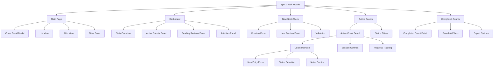

# Spot Check Module - Complete Specification

**Carmen ERP System - Inventory Management**

## Table of Contents

1. [Overview](#overview)
2. [Module Structure](#module-structure)
3. [Pages and Components](#pages-and-components)
4. [User Interface Elements](#user-interface-elements)
5. [Data Flow](#data-flow)
6. [Actions and Options](#actions-and-options)
7. [Screenshots](#screenshots)
8. [Site Map](#site-map)

---

## Overview

The Spot Check module is a core component of Carmen ERP's Inventory Management system designed to facilitate random inventory verification and accuracy checking. It allows authorized personnel to perform targeted inventory counts on specific items or locations to maintain inventory accuracy and identify discrepancies.

### Key Features

- **Random Item Selection**: Automatically select items for spot checking based on criteria
- **High-Value Item Focus**: Target expensive items for more frequent verification
- **Real-time Count Tracking**: Live progress monitoring during active counts
- **Variance Analysis**: Automatic calculation and tracking of inventory discrepancies
- **Dashboard Overview**: Comprehensive monitoring of all spot check activities
- **Multi-user Support**: Role-based access for different user types

### Business Objectives

- Maintain inventory accuracy through regular spot checks
- Identify potential inventory issues before full cycle counts
- Reduce inventory shrinkage through targeted verification
- Improve overall inventory control and visibility

---

## Module Structure

### File Structure
```
app/(main)/inventory-management/spot-check/
├── page.tsx                       # Main spot check listing
├── layout.tsx                     # Module layout wrapper
├── types.ts                       # TypeScript interfaces
├── dashboard/
│   └── page.tsx                   # Dashboard overview
├── new/
│   ├── page.tsx                   # New spot check creation
│   └── layout.tsx                 # New spot check layout
├── active/
│   ├── page.tsx                   # Active spot checks listing
│   └── [id]/
│       └── page.tsx               # Individual active count
├── completed/
│   ├── page.tsx                   # Completed spot checks
│   └── [id]/
│       └── page.tsx               # Individual completed count details
├── components/
│   ├── new-spot-check-form.tsx    # Form for creating new spot checks
│   ├── count-detail-form.tsx      # Form for entering count data
│   ├── count-list-item.tsx        # List item component
│   ├── count-detail-card.tsx      # Card view component
│   ├── spot-check-nav.tsx         # Navigation component
│   └── [other components]         # Additional UI components
```

### Core TypeScript Interfaces

```typescript
interface SpotCheckDetails {
  countId: string
  counter: string
  department: string
  store: string
  date: Date
  selectedItems: Array<{
    id: string
    code: string
    name: string
    description: string
    expectedQuantity: number
    unit: string
  }>
}

interface CountDetailData {
  items: {
    id: string
    name: string
    code: string
    currentStock: number
    actualCount: number
    unit: string
    status: 'good' | 'damaged' | 'missing' | 'expired'
    isSubmitted: boolean
    variance: number
  }[]
  notes: string
}
```

---

## Pages and Components

### 1. Main Spot Check Page (`/spot-check`)

**File**: `page.tsx`
**Route**: `/inventory-management/spot-check`

#### Description
The main landing page displaying all spot check entries with filtering and search capabilities.

#### Key Features
- List and grid view toggle
- Status filtering (All, Pending, In Progress, Completed)
- Department and location filtering
- Search functionality
- Quick actions for each spot check entry

#### UI Elements
- **Header Section**:
  - Page title: "Spot Check"
  - Description: "Random inventory spot checks for accuracy verification"
  - "New Spot Check" button with Plus icon

- **Filter Controls Card**:
  - Search input field
  - Status dropdown (All Statuses, Pending, In Progress, Completed)
  - Department dropdown (populated from mockData)
  - Location filter toggle button (Building icon)
  - View toggle buttons (List/Grid icons)

- **Location Filter Panel** (conditional):
  - Location dropdown selector
  - Active filter tags with remove option

- **Content Display**:
  - List View: `CountListItem` components
  - Grid View: `CountDetailCard` components

#### Mock Data Structure
```javascript
const spotCheckData = [
  {
    storeName: "Main Kitchen Store",
    department: "F&B",
    userName: "John Doe",
    date: "2024-04-20",
    status: "pending",
    itemCount: 10,
    lastCountDate: "2024-03-20",
    variance: 5.2,
    notes: "Spot check of dry goods section",
    completedCount: 5
  }
]
```

---

### 2. Dashboard Page (`/spot-check/dashboard`)

**File**: `dashboard/page.tsx`
**Route**: `/inventory-management/spot-check/dashboard`

#### Description
Comprehensive dashboard providing real-time overview of all spot check activities and key metrics.

#### Key Features
- Statistics overview cards
- Active counts monitoring
- Pending reviews management
- Recent activity feed
- Quick access actions

#### UI Elements
- **Statistics Cards**:
  - Active Counters: Shows number of users currently performing counts
  - Items Counted Today: Total items counted across all active sessions
  - Pending Reviews: Number of completed counts awaiting approval

- **Active Counts Panel**:
  - Real-time list of ongoing spot checks
  - Progress indicators (percentage complete)
  - Counter and location information
  - Start time and duration tracking
  - "View All Active Counts" action button

- **Pending Reviews Panel**:
  - Completed counts awaiting review/approval
  - Variance count indicators
  - Counter and completion date information
  - Status badges (Pending Review, Pending Approval)
  - "Review All Pending" action button

- **Latest Activities Panel**:
  - Timeline of recent spot check activities
  - Activity type indicators (Count Completed, Count Started, Variance Approved)
  - User attribution and timestamps
  - Descriptive activity messages

#### Mock Data Examples
```javascript
const stats = [
  { title: "Active Counters", value: "4", icon: Users },
  { title: "Items Counted Today", value: "245", icon: Boxes },
  { title: "Pending Reviews", value: "8", icon: ClipboardList }
]
```

---

### 3. New Spot Check Page (`/spot-check/new`)

**File**: `new/page.tsx`
**Route**: `/inventory-management/spot-check/new`

#### Description
Form interface for creating new spot check sessions with customizable selection criteria.

#### Key Features
- Counter assignment
- Location and department selection
- Item selection methodology (Random vs High-Value)
- Real-time item preview
- Form validation

#### UI Elements
- **Form Section** (Left Panel):
  - Counter dropdown selector
  - Department dropdown selector
  - Store location dropdown selector
  - Count date picker (calendar widget)
  - Selection method radio buttons:
    - Random Selection
    - High Value Items (with minimum price field)
  - Number of items input (1-100 range)

- **Selected Items Preview** (Right Panel):
  - Sticky sidebar showing selected items
  - Real-time updates based on form criteria
  - Item cards displaying:
    - Item name and code
    - Category and location
    - Stock level and unit
    - Item value
    - Last count date

#### Form Validation Schema
```typescript
const formSchema = z.object({
  counterId: z.string().nonempty("Please select a counter"),
  departmentId: z.string().nonempty("Please select a department"),
  storeId: z.string().nonempty("Please select a store"),
  countDate: z.date(),
  selectionType: z.enum(["random", "highValue"]),
  itemCount: z.number().min(1).max(100),
  minimumPrice: z.number().optional(),
})
```

---

### 4. Active Spot Checks Page (`/spot-check/active`)

**File**: `active/page.tsx`
**Route**: `/inventory-management/spot-check/active`

#### Description
Lists all currently active or pending spot check sessions that can be started or resumed.

#### Key Features
- Status filtering (All, Pending, In Progress, Paused)
- Progress tracking with visual indicators
- Quick start/resume actions
- Comprehensive session details

#### UI Elements
- **Header Section**:
  - Title: "Pending Counts"
  - Description: "Start or resume your inventory counts"
  - Status filter dropdown

- **Count Session Cards**:
  - Session ID with status badge
  - Counter and department information
  - Start time and duration display
  - Location badges
  - Progress bar with completion percentage
  - Item count tracking (completed/total)
  - Match/variance/pending counters
  - Start/Resume action button

#### Status Badge Variants
- **Pending**: Blue background, "Pending" text
- **In Progress**: Green background, "In Progress" text
- **Paused**: Yellow background, "Paused" text

---

### 5. Individual Active Count Page (`/spot-check/active/[id]`)

**File**: `active/[id]/page.tsx`
**Route**: `/inventory-management/spot-check/active/{countId}`

#### Description
Interactive counting interface for performing actual spot checks on selected items.

#### Key Features
- Item-by-item counting interface
- Real-time variance calculation
- Item status tracking (good, damaged, missing, expired)
- Progress persistence
- Session controls (pause, complete)

#### UI Elements
- **Header Navigation Bar**:
  - Back to Spot Checks button
  - Session controls (Pause, Complete Count)
  - Sticky positioning

- **Session Info Card**:
  - Counter name with User icon
  - Count date with Calendar icon
  - Session reference with FileText icon
  - Grid layout for information display

- **Count Detail Form**:
  - Full-screen counting interface
  - Integrated `CountDetailForm` component
  - Item listing with current stock levels
  - Actual count input fields
  - Status dropdown selectors
  - Notes section for additional information

---

### 6. Completed Spot Checks Page (`/spot-check/completed`)

**File**: `completed/page.tsx`
**Route**: `/inventory-management/spot-check/completed`

#### Description
Historical view of all completed spot check sessions with search and filtering capabilities.

#### Key Features
- Search functionality across multiple fields
- Date range filtering
- Accuracy percentage display
- Export capabilities
- Detailed view access

#### UI Elements
- **Search and Filter Bar**:
  - Search input with Search icon
  - Date range filter dropdown (All Time, Today, This Week, This Month)

- **Completed Count Cards**:
  - Count ID with accuracy percentage badge
  - Counter and department information
  - Completion timestamp and duration
  - Location badges
  - Progress indicator (always 100%)
  - Match/variance counters
  - Notes preview (truncated)
  - Action buttons (View Details, Export)

#### Accuracy Badge Colors
- **95%+**: Green background (high accuracy)
- **85-94%**: Yellow background (medium accuracy)
- **<85%**: Red background (low accuracy)

---

### 7. Individual Completed Count Page (`/spot-check/completed/[id]`)

**File**: `completed/[id]/page.tsx`
**Route**: `/inventory-management/spot-check/completed/{countId}`

#### Description
Detailed read-only view of a completed spot check session with full audit information.

#### Key Features
- Complete session history
- Detailed variance analysis
- Item-level results
- Audit trail information
- Export/print capabilities

*Note: Implementation details to be added based on actual component development.*

---

## User Interface Elements

### Buttons and Actions

#### Primary Actions
- **New Spot Check** (Plus icon): Creates new spot check session
- **Start Count** (PlayCircle icon): Initiates pending count
- **Resume Count** (PlayCircle icon): Continues paused count
- **Complete Count** (CheckCircle icon): Finalizes active count
- **Pause** (PauseCircle icon): Temporarily suspends count

#### Secondary Actions
- **View Details** (FileText icon): Shows detailed information
- **Export** (Download icon): Downloads count data
- **Back** (ChevronLeft icon): Navigation return
- **Delete** (X icon): Removes count session

### Input Controls

#### Form Elements
- **Text Inputs**: Standard text entry with validation
- **Number Inputs**: Numeric fields with min/max constraints
- **Dropdowns**: Single-select with search capabilities
- **Radio Buttons**: Exclusive choice selection
- **Checkboxes**: Multiple selection options
- **Date Pickers**: Calendar-based date selection
- **Textareas**: Multi-line text entry for notes

#### Filter Controls
- **Search Bars**: Real-time filtering with search icons
- **Status Filters**: Dropdown selection for status types
- **View Toggles**: List/Grid display mode switching
- **Location Filters**: Collapsible panel with multi-select

### Visual Indicators

#### Status Badges
- **Pending**: Blue with "Pending" text
- **In Progress**: Green with "In Progress" text
- **Completed**: Gray with "Completed" text
- **Paused**: Yellow with "Paused" text

#### Progress Indicators
- **Progress Bars**: Visual completion tracking
- **Percentage Displays**: Numeric progress indicators
- **Item Counters**: "X of Y items" format

#### Variance Indicators
- **Positive Variance**: Green badge with "+" prefix
- **Negative Variance**: Red badge with "-" prefix
- **Zero Variance**: Gray outline badge

---

## Data Flow

### Spot Check Creation Flow

1. **User navigates** to `/spot-check/new`
2. **Form renders** with empty state
3. **User selects** counter, department, store, date
4. **System filters** available items based on criteria
5. **Preview updates** with selected items in real-time
6. **User submits** form with validation
7. **System creates** spot check session with unique ID
8. **Navigation redirects** to active count page

### Count Execution Flow

1. **User accesses** active count via `/spot-check/active/[id]`
2. **System loads** session data and selected items
3. **Count form renders** with item listing
4. **User enters** actual counts for each item
5. **System calculates** variance in real-time
6. **User selects** item status (good/damaged/missing/expired)
7. **Progress tracking** updates completion percentage
8. **User submits** individual items or entire session
9. **System saves** count data and updates session status

### Data Persistence

#### Session Storage
- Count sessions persist across browser refreshes
- Form state maintained during navigation
- Progress automatically saved on item submission

#### Mock Data Integration
- Uses centralized mock data from `@/lib/mockData`
- Simulates real database operations
- Maintains data consistency across components

---

## Actions and Options

### User Actions by Page

#### Main Spot Check Page (`/spot-check`)
| Action | Description | Icon | Behavior |
|--------|-------------|------|----------|
| New Spot Check | Creates new count session | Plus | Navigate to `/spot-check/new` |
| Filter by Status | Filters entries by status | None | Updates displayed items |
| Filter by Department | Filters entries by department | None | Updates displayed items |
| Filter by Location | Filters entries by location | Building | Shows/hides location panel |
| Toggle View | Switches between list/grid | List/Grid | Changes display layout |
| Search | Filters entries by text | None | Real-time filtering |
| Start Count | Opens count detail form | None | Shows modal overlay |
| Delete Count | Removes count entry | None | Confirms and deletes |

#### Dashboard Page (`/spot-check/dashboard`)
| Action | Description | Icon | Behavior |
|--------|-------------|------|----------|
| View All Active Counts | Navigate to active counts | ArrowRight | Route to `/spot-check/active` |
| Review All Pending | Navigate to reviews | ArrowRight | Route to review interface |

#### New Spot Check Page (`/spot-check/new`)
| Action | Description | Icon | Behavior |
|--------|-------------|------|----------|
| Select Counter | Choose count performer | None | Dropdown selection |
| Select Department | Choose department | None | Dropdown selection |
| Select Store | Choose location | None | Dropdown selection |
| Pick Date | Choose count date | Calendar | Date picker modal |
| Choose Selection Type | Random vs High-Value | None | Radio button toggle |
| Set Item Count | Number of items to count | None | Numeric input |
| Set Minimum Price | High-value threshold | None | Currency input |
| Create Spot Check | Submit form | None | Validation and creation |

#### Active Counts Page (`/spot-check/active`)
| Action | Description | Icon | Behavior |
|--------|-------------|------|----------|
| Filter by Status | Filter active counts | None | Dropdown filtering |
| Start Count | Begin pending count | PlayCircle | Navigate to count interface |
| Resume Count | Continue paused count | PlayCircle | Navigate to count interface |

#### Individual Count Page (`/spot-check/active/[id]`)
| Action | Description | Icon | Behavior |
|--------|-------------|------|----------|
| Back to Spot Checks | Return to main page | ChevronLeft | Navigate back |
| Pause Count | Temporarily stop | PauseCircle | Save state and pause |
| Complete Count | Finish counting | CheckCircle | Finalize and submit |
| Enter Actual Count | Input count value | None | Update item data |
| Set Item Status | Mark item condition | None | Dropdown selection |
| Submit Item | Confirm item count | Check | Lock item entry |
| Add Notes | Enter additional info | None | Textarea input |

### Dropdown Options

#### Status Filter Options
- **All Statuses**: Shows all entries
- **Pending**: Not yet started
- **In Progress**: Currently being counted
- **Completed**: Finished counting

#### Department Filter Options
*(Populated from mock data)*
- **F&B**: Food & Beverage operations
- **Housekeeping**: Room and facility maintenance
- **Maintenance**: Equipment and infrastructure

#### Location Filter Options
*(Populated from mock data)*
- **Main Kitchen Store**: Primary food storage
- **Cold Room**: Refrigerated storage
- **Dry Store**: Non-perishable storage
- **Linen Room**: Housekeeping supplies

#### Item Selection Methods
- **Random Selection**: Computer-generated random item selection
- **High Value Items**: Focus on expensive inventory items

#### Item Status Options
- **Good**: Item in acceptable condition
- **Damaged**: Item has defects but may be usable
- **Missing**: Item not found at expected location
- **Expired**: Item past expiration date

---

## Screenshots

*Note: Screenshots to be captured and placed in this section showing:*

1. **Main Spot Check Page**: List and grid views with filters
2. **Dashboard Overview**: Statistics and active monitoring
3. **New Spot Check Form**: Creation interface with item preview
4. **Active Count Interface**: Item-by-item counting screen
5. **Completed Counts**: Historical view with search
6. **Count Detail Modal**: Item entry form
7. **Mobile Responsive Views**: All pages on mobile devices

---

## Site Map



---

## Technical Implementation Notes

### State Management
- Uses React hooks (`useState`) for local component state
- Form state managed with React Hook Form and Zod validation
- Session persistence through browser storage for active counts

### Data Sources
- Mock data imported from `@/lib/mockData`
- TypeScript interfaces defined in `types.ts`
- Real-time calculations for variances and progress

### Navigation
- Next.js App Router for routing
- `useRouter` for programmatic navigation
- Nested layouts for consistent page structure

### Styling
- Tailwind CSS for styling
- Shadcn/ui components for consistent UI
- Responsive design with mobile-first approach
- Card-based layouts with consistent spacing

### Key Dependencies
- React 18+ with Next.js 14
- React Hook Form for form handling
- Zod for schema validation
- Lucide React for icons
- Date-fns for date formatting

---

## Future Enhancement Opportunities

1. **Real-time Collaboration**: Multiple counters on same session
2. **Barcode Integration**: Scanner support for item identification
3. **Photo Documentation**: Attach images for damaged/missing items
4. **Advanced Analytics**: Trend analysis and predictive insights
5. **Mobile App**: Native mobile application for counting
6. **Integration APIs**: Connection to external inventory systems
7. **Automated Scheduling**: Recurring spot check automation
8. **Approval Workflows**: Multi-level approval for variances

---

*This specification document serves as the complete reference for the Carmen ERP Spot Check module implementation and functionality.*