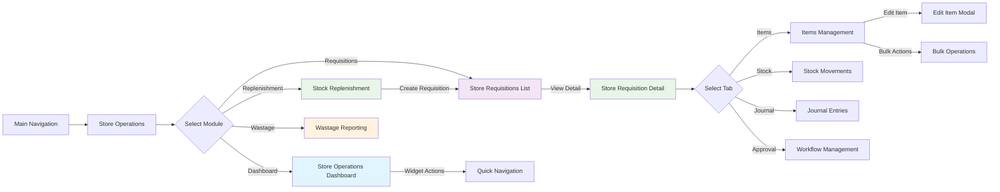
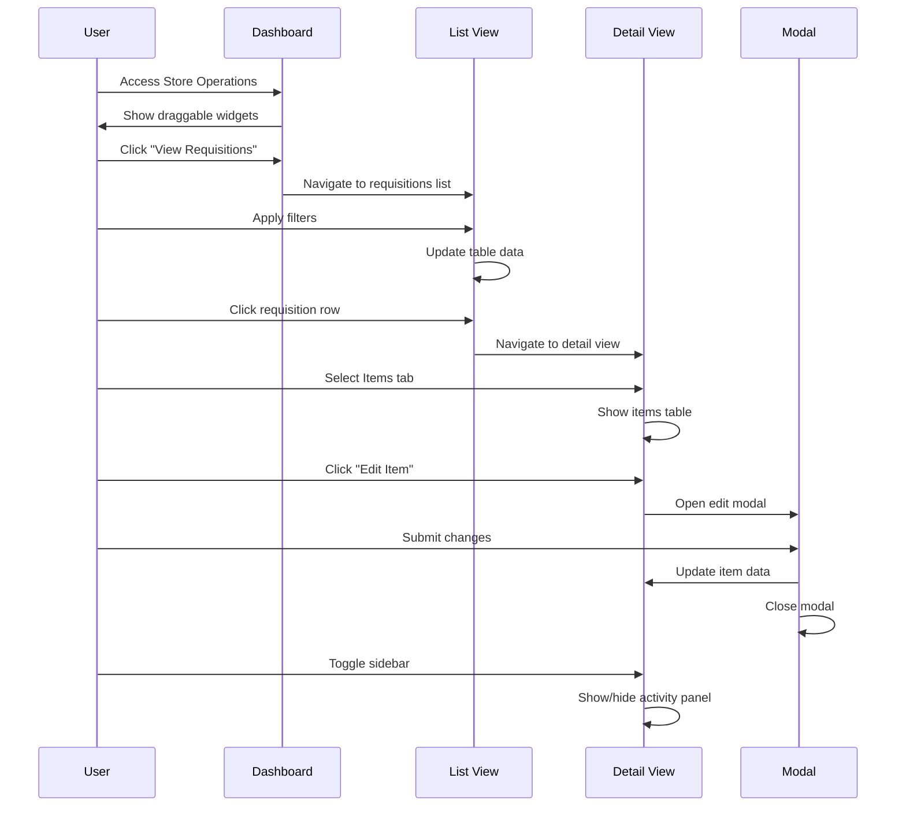

# Store Operations Module - Sitemap

## Document History

| Version | Date | Author | Changes |
|---------|------|--------|---------|
| 1.0.0 | 2025-11-19 | Documentation Team | Initial version |

```mermaid
graph TD
    SO[Store Operations] --> SOD[Store Operations Dashboard]
    SO --> SR[Store Requisitions]
    SO --> SRP[Stock Replenishment]
    SO --> WR[Wastage Reporting]

    %% Dashboard Components
    SOD --> SOD_WIDGETS[Draggable Widgets]
    SOD_WIDGETS --> SOD_W1[Stock Replenishment Trend Chart]
    SOD_WIDGETS --> SOD_W2[Wastage by Type Chart]
    SOD_WIDGETS --> SOD_W3[Top 5 Stores by Requisitions]
    SOD_WIDGETS --> SOD_W4[Pending Approvals Count]
    SOD_WIDGETS --> SOD_W5[Low Stock Alerts]
    SOD_WIDGETS --> SOD_W6[Recent Activity Feed]

    %% Store Requisitions Module
    SR --> SRL[Store Requisitions List]
    SR --> SRD[Store Requisition Detail]

    %% Store Requisitions List Components
    SRL --> SRL_FILTERS[Advanced Filters]
    SRL --> SRL_SEARCH[Search Bar]
    SRL --> SRL_TABLE[Data Table View]
    SRL --> SRL_CARDS[Card View]
    SRL --> SRL_PAGINATION[Pagination Controls]
    SRL --> SRL_BULK[Bulk Actions]

    %% Store Requisition Detail Components
    SRD --> SRD_HEADER[Requisition Header]
    SRD --> SRD_TABS[Tab Navigation]
    SRD --> SRD_SIDEBAR[Activity Sidebar]

    %% Requisition Detail Tabs
    SRD_TABS --> SRD_T1[Items Tab]
    SRD_TABS --> SRD_T2[Stock Movements Tab]
    SRD_TABS --> SRD_T3[Journal Entries Tab]
    SRD_TABS --> SRD_T4[Approval Workflow Tab]

    %% Items Tab Components
    SRD_T1 --> SRD_T1_TABLE[Items Data Table]
    SRD_T1 --> SRD_T1_EDIT[Edit Item Modal]
    SRD_T1 --> SRD_T1_APPROVAL[Item Approval Controls]
    SRD_T1 --> SRD_T1_BULK[Bulk Item Actions]

    %% Stock Movements Tab
    SRD_T2 --> SRD_T2_MOVEMENTS[Stock Movement Records]
    SRD_T2 --> SRD_T2_LOT[Lot Tracking]
    SRD_T2 --> SRD_T2_HISTORY[Movement History]

    %% Journal Entries Tab
    SRD_T3 --> SRD_T3_ENTRIES[Journal Entry List]
    SRD_T3 --> SRD_T3_DETAILS[Entry Details View]

    %% Approval Workflow Tab
    SRD_T4 --> SRD_T4_WORKFLOW[Workflow Status]
    SRD_T4 --> SRD_T4_APPROVERS[Approver List]
    SRD_T4 --> SRD_T4_ACTIONS[Approval Actions]

    %% Activity Sidebar Components
    SRD_SIDEBAR --> SRD_S1[Comments Section]
    SRD_SIDEBAR --> SRD_S2[Attachments Section]
    SRD_SIDEBAR --> SRD_S3[Activity Log]
    SRD_SIDEBAR --> SRD_S4[Toggle Controls]

    %% Stock Replenishment Components
    SRP --> SRP_STATS[Summary Statistics Cards]
    SRP --> SRP_CHART[Stock Level Trend Chart]
    SRP --> SRP_ALERT[Low Stock Alert]
    SRP --> SRP_TABLE[Inventory Status Table]
    SRP --> SRP_FILTERS[Search and Filters]
    SRP --> SRP_BULK[Bulk Selection]
    SRP --> SRP_CREATE[Create Requisition Action]

    %% Wastage Reporting Components
    WR --> WR_STATS[Wastage Statistics Cards]
    WR --> WR_CHART[Monthly Wastage Trend]
    WR --> WR_TABLE[Wastage Records Table]
    WR --> WR_FILTERS[Date and Category Filters]
    WR --> WR_EXPORT[Export Actions]

    %% Shared Components
    SO --> SHARED[Shared Components]
    SHARED --> FILTER_BUILDER[Advanced Filter Builder]
    SHARED --> DATE_PICKER[Date Range Picker]
    SHARED --> STATUS_BADGES[Status Badge Components]
    SHARED --> PAGINATION[Pagination Component]
    SHARED --> BULK_ACTIONS[Bulk Action Toolbar]
    SHARED --> MODAL_DIALOGS[Modal Dialogs]
    SHARED --> DROPDOWN_MENUS[Dropdown Menus]

    %% Modal Dialogs
    MODAL_DIALOGS --> EDIT_ITEM_MODAL[Edit Item Modal]
    MODAL_DIALOGS --> CONFIRMATION_MODAL[Confirmation Dialog]
    MODAL_DIALOGS --> FILTER_MODAL[Advanced Filter Modal]

    %% Dropdown Menus
    DROPDOWN_MENUS --> STATUS_DROPDOWN[Status Dropdown]
    DROPDOWN_MENUS --> ACTIONS_DROPDOWN[Actions Dropdown]
    DROPDOWN_MENUS --> UNIT_DROPDOWN[Unit Selection Dropdown]
    DROPDOWN_MENUS --> LOCATION_DROPDOWN[Location Dropdown]

    %% Navigation Links
    SRL -.->|Navigate to Detail| SRD
    SRP -.->|Create Requisition| SRL
    SOD -.->|Quick Access| SR
    SOD -.->|Quick Access| SRP
    SOD -.->|Quick Access| WR

    %% Style Classes
    classDef dashboardNode fill:#e1f5fe,stroke:#01579b,stroke-width:2px
    classDef listNode fill:#f3e5f5,stroke:#4a148c,stroke-width:2px
    classDef detailNode fill:#e8f5e8,stroke:#1b5e20,stroke-width:2px
    classDef componentNode fill:#fff3e0,stroke:#e65100,stroke-width:2px
    classDef sharedNode fill:#fce4ec,stroke:#880e4f,stroke-width:2px

    class SOD,SOD_WIDGETS,SOD_W1,SOD_W2,SOD_W3,SOD_W4,SOD_W5,SOD_W6 dashboardNode
    class SRL,SRL_FILTERS,SRL_SEARCH,SRL_TABLE,SRL_CARDS,SRL_PAGINATION,SRL_BULK listNode
    class SRD,SRD_HEADER,SRD_TABS,SRD_SIDEBAR,SRD_T1,SRD_T2,SRD_T3,SRD_T4,SRD_T1_TABLE,SRD_T1_EDIT,SRD_T1_APPROVAL,SRD_T1_BULK,SRD_T2_MOVEMENTS,SRD_T2_LOT,SRD_T2_HISTORY,SRD_T3_ENTRIES,SRD_T3_DETAILS,SRD_T4_WORKFLOW,SRD_T4_APPROVERS,SRD_T4_ACTIONS,SRD_S1,SRD_S2,SRD_S3,SRD_S4 detailNode
    class SRP,SRP_STATS,SRP_CHART,SRP_ALERT,SRP_TABLE,SRP_FILTERS,SRP_BULK,SRP_CREATE,WR,WR_STATS,WR_CHART,WR_TABLE,WR_FILTERS,WR_EXPORT componentNode
    class SHARED,FILTER_BUILDER,DATE_PICKER,STATUS_BADGES,PAGINATION,BULK_ACTIONS,MODAL_DIALOGS,DROPDOWN_MENUS,EDIT_ITEM_MODAL,CONFIRMATION_MODAL,FILTER_MODAL,STATUS_DROPDOWN,ACTIONS_DROPDOWN,UNIT_DROPDOWN,LOCATION_DROPDOWN sharedNode
```

## Navigation Flow

## User Interaction Patterns

