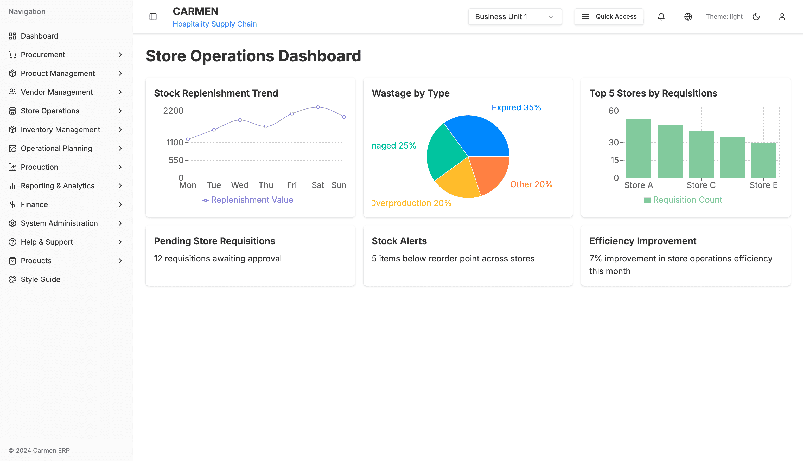
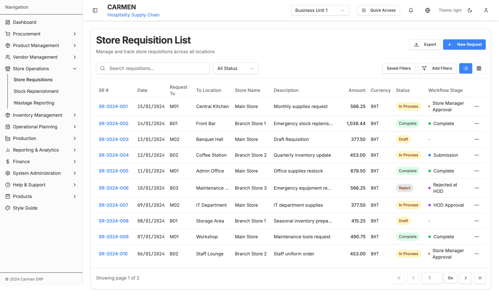
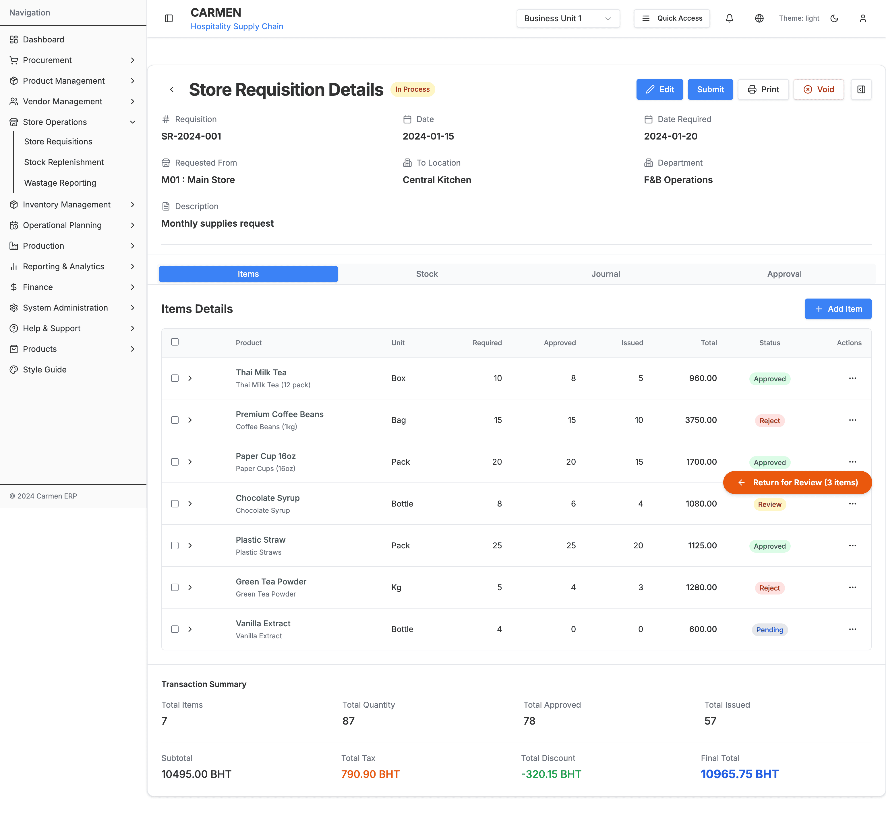
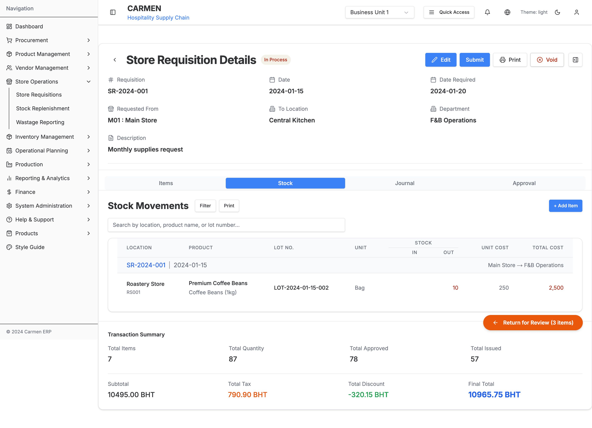
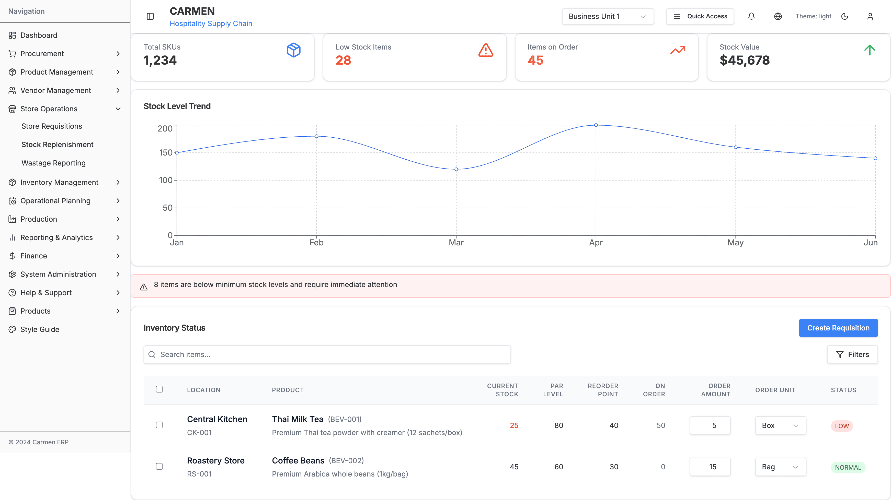
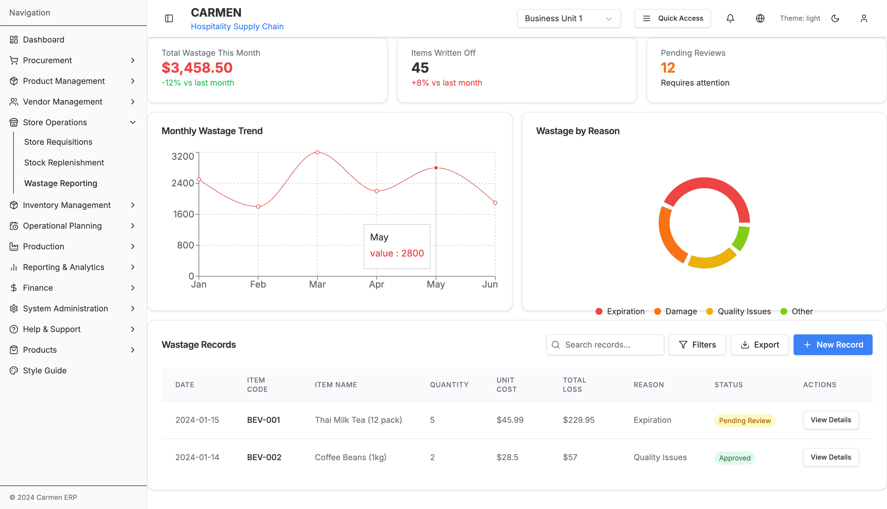
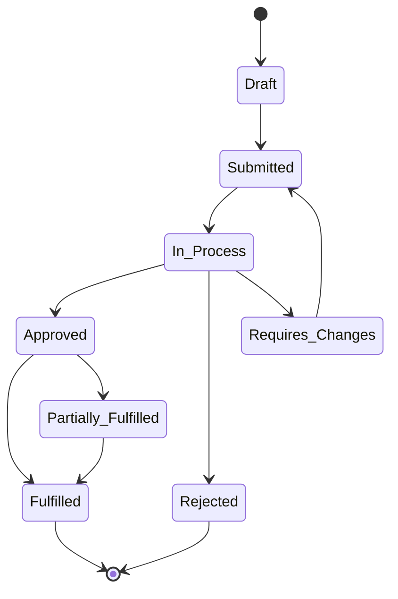
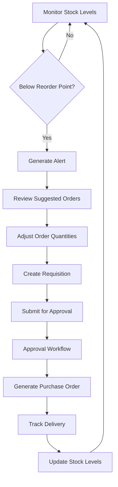
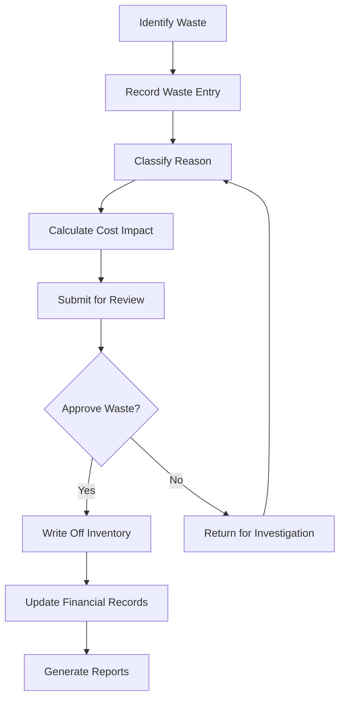

# Store Operations Module - Complete Specification

## Module Overview

The Store Operations module is a comprehensive inventory and requisition management system designed for hospitality operations. It manages store-to-store requisitions, stock replenishment tracking, and wastage reporting through an integrated interface.

**Primary Functions:**
- Store requisition lifecycle management
- Stock replenishment monitoring and alerts
- Wastage tracking and reporting
- Drag-and-drop dashboard customization
- Multi-level approval workflows

## Architecture Overview

```
app/(main)/store-operations/
├── page.tsx                           # Dashboard with draggable widgets
├── components/
│   ├── store-requisition-list.tsx     # Main requisitions list component
│   ├── store-replenishment.tsx        # Stock replenishment dashboard
│   └── wastage-reporting.tsx          # Wastage analytics component
├── store-requisitions/
│   └── components/
│       └── store-requisition-detail.tsx # Detailed requisition management (1950 lines)
├── stock-replenishment/
│   └── page.tsx                       # Stock replenishment page wrapper
└── wastage-reporting/
    └── page.tsx                       # Wastage reporting page wrapper
```

## Document History

| Version | Date | Author | Changes |
|---------|------|--------|---------|
| 1.0.0 | 2025-11-19 | Documentation Team | Initial version |
---

## 1. Store Operations Dashboard



**File:** `app/(main)/store-operations/page.tsx`

### Features
- **Draggable Widget System**: 6 customizable dashboard widgets using React Beautiful DnD
- **Interactive Charts**: Recharts integration for data visualization
- **Real-time Statistics**: Key performance indicators for store operations

### Widgets Available

#### 1. Stock Replenishment Trend
- **Type**: Line Chart (Recharts)
- **Data**: Monthly stock level trends
- **Interactions**: Hover tooltips, trend analysis

#### 2. Wastage by Type
- **Type**: Bar Chart (Recharts)
- **Categories**: Food, Beverages, Supplies, Equipment
- **Color Coding**: Category-specific color scheme

#### 3. Top 5 Stores by Requisitions
- **Type**: Horizontal Bar Chart
- **Metrics**: Requisition count, value totals
- **Sorting**: Descending by requisition count

#### 4. Pending Approvals Count
- **Type**: Metric Card
- **Data**: Real-time approval queue count
- **Alert**: Red indicator for overdue approvals

#### 5. Low Stock Alerts
- **Type**: Alert List
- **Threshold**: Below reorder point
- **Actions**: Quick requisition creation

#### 6. Recent Activity Feed
- **Type**: Timeline List
- **Events**: Requisitions, approvals, stock movements
- **Real-time**: Auto-refresh capability

### Drag and Drop Implementation
```typescript
// Widget dragging using React Beautiful DnD
const onDragEnd = (result: DropResult) => {
  if (!result.destination) return;

  const newItems = Array.from(items);
  const [reorderedItem] = newItems.splice(result.source.index, 1);
  newItems.splice(result.destination.index, 0, reorderedItem);

  setItems(newItems);
};
```

---

## 2. Store Requisitions List



**File:** `app/(main)/store-operations/components/store-requisition-list.tsx`

### Primary Features

#### View Toggle System
- **Table View**: Comprehensive data grid with sorting
- **Card View**: Visual card layout for mobile-friendly browsing
- **Toggle Control**: Seamless switching between views

#### Advanced Filter System
- **Filter Builder**: Dynamic filter construction
- **Pre-built Filters**: Quick access to common filter combinations
- **Date Range Picker**: Custom date range selection
- **Status Filters**: Multi-select status filtering
- **Location Filters**: Store and department filtering

#### Data Table Features
- **Column Sorting**: All columns sortable (ascending/descending)
- **Multi-select**: Checkbox selection for bulk operations
- **Row Actions**: Context menu for individual items
- **Pagination**: Server-side pagination with page size selection
- **Go-to-page**: Direct page navigation input

#### Search Functionality
- **Global Search**: Searches across all visible columns
- **Real-time**: Debounced search with instant results
- **Highlight**: Search term highlighting in results

### Data Structure
```typescript
interface Requisition {
  date: string
  refNo: string              // Unique reference number
  requestTo: string          // Target location/department
  toLocation: string         // Physical location
  storeName: string          // Requesting store name
  description: string        // Requisition description
  status: 'In Process' | 'Complete' | 'Reject' | 'Void' | 'Draft'
  workflowStage?: string     // Current workflow stage
  totalAmount: number        // Total monetary value
  currency: string           // Currency code (USD, etc.)
}
```

### Status Badge System
- **In Process**: Blue badge with processing icon
- **Complete**: Green badge with checkmark
- **Reject**: Red badge with X icon
- **Void**: Gray badge with void indicator
- **Draft**: Orange badge with draft icon

### Bulk Actions Available
- **Bulk Approve**: Approve multiple requisitions
- **Bulk Reject**: Reject multiple with reason
- **Export Selected**: Export to CSV/Excel
- **Print Selected**: Print requisition documents
- **Bulk Status Update**: Change status for multiple items

---

## 3. Store Requisition Detail




**File:** `app/(main)/store-operations/store-requisitions/components/store-requisition-detail.tsx`
**Size:** 1,950 lines - Most complex component in the module

### Tab Navigation System

#### Tab 1: Items Management
**Primary Focus:** Individual item management within requisitions

##### Item Data Table
- **Columns**: Description, Unit, Required Qty, Approved Qty, Issued Qty, Cost, Total, Tax, Discount
- **Inline Editing**: Direct cell editing for quantity adjustments
- **Approval Controls**: Individual item approval/rejection
- **Status Tracking**: Per-item approval status (Pending, Approved, Reject, Review)

##### Item Detail Modal
**Triggered by:** Edit button on any item row

**Fields Available:**
- Product Information (Name, SKU, Description)
- Quantity Management (Required, Approved, Issued)
- Pricing (Unit Cost, Tax Rate, Discount Rate)
- Approval Status and Comments
- Inventory Details (Current Stock, Location)

##### Bulk Item Operations
- **Bulk Approve**: Approve all selected items
- **Bulk Reject**: Reject with bulk reason
- **Quantity Adjustments**: Bulk quantity changes
- **Price Updates**: Bulk pricing modifications

#### Tab 2: Stock Movements
**Primary Focus:** Inventory transaction tracking

##### Movement Records Table
- **Columns**: Date, Type, Item, Quantity, From Location, To Location, Lot Number, Expiry
- **Movement Types**: Issue, Receipt, Transfer, Adjustment, Return
- **Lot Tracking**: Full lot number traceability
- **Expiry Management**: Date tracking for perishables

##### Movement History
- **Chronological**: Time-ordered movement log
- **Filtering**: By date range, movement type, item
- **Export**: Movement history export capability

#### Tab 3: Journal Entries
**Primary Focus:** Financial transaction recording

##### Journal Entry List
- **Columns**: Date, Account, Description, Debit, Credit, Reference
- **Auto-generation**: Automatic entry creation from approvals
- **Manual Entries**: Ability to add manual journal entries
- **Validation**: Account balance validation

#### Tab 4: Approval Workflow
**Primary Focus:** Multi-stage approval management

##### Workflow Status Display
- **Stage Indicators**: Visual workflow progress
- **Approver Queue**: Current and pending approvers
- **History**: Complete approval history log
- **Escalation**: Automatic escalation for overdue approvals

##### Approval Actions
- **Approve**: Full requisition approval
- **Reject**: Rejection with mandatory reason
- **Request Changes**: Send back for modifications
- **Delegate**: Delegate approval to another user
- **Add Comments**: Approval comments and notes

### Activity Sidebar

#### Comments Section
- **Threaded Comments**: Reply capability
- **User Attribution**: Commenter identification and timestamp
- **Rich Text**: Basic formatting support
- **Notifications**: Comment notification system

#### Attachments Section
- **File Upload**: Drag-and-drop file upload
- **File Types**: Documents, images, spreadsheets
- **File Preview**: In-browser file preview
- **Version Control**: File version management

#### Activity Log
- **Event Tracking**: All requisition activities logged
- **User Actions**: Who, what, when for all changes
- **System Events**: Automatic system-generated events
- **Export**: Activity log export capability

#### Toggle Controls
- **Show/Hide Sidebar**: Collapsible sidebar for screen space
- **Section Toggles**: Individual section show/hide
- **Persistent Settings**: User preference storage

### Complex Data Structures
```typescript
interface RequisitionItem {
  id: number
  description: string
  unit: string
  qtyRequired: number
  qtyApproved: number
  qtyIssued: number
  costPerUnit: number
  total: number
  taxRate: number
  discountRate: number
  approvalStatus: 'Pending' | 'Approved' | 'Reject' | 'Review'
  inventory: InventoryInfo
  itemInfo: ItemInfo
  comments?: string[]
  attachments?: AttachmentInfo[]
}

interface StockMovement {
  id: number
  date: string
  type: 'Issue' | 'Receipt' | 'Transfer' | 'Adjustment' | 'Return'
  itemId: number
  quantity: number
  fromLocation: string
  toLocation: string
  lotNumber?: string
  expiryDate?: string
  reference: string
  userId: number
}

interface JournalEntry {
  id: number
  date: string
  account: string
  description: string
  debitAmount: number
  creditAmount: number
  reference: string
  requisitionId: number
  userId: number
}
```

---

## 4. Stock Replenishment



**File:** `app/(main)/store-operations/components/stock-replenishment.tsx`

### Dashboard Components

#### Statistics Cards
1. **Total SKUs**: Overall product count (1,234)
2. **Low Stock Items**: Items below reorder point (28 - Red alert)
3. **Items on Order**: Currently ordered items (45 - Orange indicator)
4. **Stock Value**: Total inventory value ($45,678 - Green trending up)

#### Stock Level Trend Chart
- **Type**: Responsive Line Chart (Recharts)
- **Data Period**: 6-month rolling trend
- **Interactions**: Hover tooltips, zoom capability
- **Y-axis**: Stock level quantities
- **X-axis**: Monthly periods (Jan-Jun)

#### Low Stock Alert Banner
- **Alert Type**: Warning banner with red styling
- **Message**: "8 items are below minimum stock levels and require immediate attention"
- **Icon**: Alert Triangle (Lucide React)
- **Action**: Click to filter low stock items

### Inventory Status Table

#### Table Structure
| Column | Type | Description | Actions |
|--------|------|-------------|---------|
| Select | Checkbox | Multi-select for bulk operations | Select all/individual |
| Location | Text + Code | Store location with code | Sortable |
| Product | Text + SKU | Product name, SKU, description | Searchable |
| Current Stock | Number | Current quantity on hand | Color-coded alerts |
| PAR Level | Number | Periodic Automatic Replenishment level | Editable |
| Reorder Point | Number | Minimum stock trigger point | Editable |
| On Order | Number | Quantity currently on order | Read-only |
| Order Amount | Number Input | Suggested/manual order quantity | Editable |
| Order Unit | Dropdown | Unit of measure selection | Selectable |
| Status | Badge | Stock status indicator | Visual |

#### Advanced Features

##### Smart Reorder Calculations
```typescript
const suggestedOrder = Math.max(0, item.parLevel - (item.currentStock + item.onOrder));
```

##### Status Color Coding
- **LOW**: Red background, white text - Below reorder point
- **NORMAL**: Green background, white text - Above reorder point
- **HIGH**: Blue background, white text - Above PAR level

##### Unit Selection Options
- Box, Bag, Pack, Piece, Kg (Dropdown selection)
- Dynamic unit conversion capability
- Vendor-specific unit preferences

#### Search and Filter System
- **Global Search**: Product name, SKU, location search
- **Advanced Filters**: Status, location, stock level ranges
- **Quick Filters**: Low stock, on order, specific locations

#### Bulk Operations
- **Create Requisition**: Generate requisition from selected items
- **Bulk Order Amount**: Set order amounts for multiple items
- **Export**: Export selection to CSV/Excel
- **Print**: Print stock status report

---

## 5. Wastage Reporting



**File:** `app/(main)/store-operations/wastage-reporting/page.tsx`

### Statistics Dashboard

#### Key Metrics Cards
1. **Total Wastage**: Monthly wastage value ($2,450)
2. **Items Written Off**: Count of written-off items (23 items)
3. **Pending Reviews**: Items awaiting review (5 pending)

#### Monthly Wastage Trend
- **Chart Type**: Area Chart (Recharts)
- **Time Period**: 12-month rolling view
- **Data Points**: Monthly wastage values
- **Trend Analysis**: Month-over-month comparison

### Wastage Records Management

#### Records Table Structure
| Column | Data Type | Description | Actions |
|--------|-----------|-------------|---------|
| Date | Date | Wastage occurrence date | Sortable |
| Location | Text | Store/department location | Filterable |
| Item | Text + SKU | Product details | Searchable |
| Quantity | Number | Waste quantity | Numeric input |
| Unit | Text | Unit of measure | Dropdown |
| Reason | Text | Wastage reason/category | Categorized |
| Cost | Currency | Financial impact | Calculated |
| Status | Badge | Review status | Workflow |
| Actions | Buttons | Record management | CRUD operations |

#### Wastage Categories
- **Expiry**: Items past expiration date
- **Damage**: Physical damage during handling/storage
- **Spoilage**: Natural spoilage/deterioration
- **Contamination**: Cross-contamination incidents
- **Over-preparation**: Excess food preparation
- **Quality Issues**: Below quality standards
- **Other**: Miscellaneous reasons

#### Advanced Analytics
- **Cost Analysis**: Wastage cost breakdown by category
- **Trend Analysis**: Seasonal and monthly patterns
- **Location Comparison**: Store-by-store wastage comparison
- **Item Analysis**: Most wasted items identification
- **Root Cause**: Recurring wastage pattern analysis

---

## Shared Components and Utilities

### 1. Advanced Filter Builder
```typescript
interface FilterRule {
  field: string
  operator: 'equals' | 'contains' | 'greater_than' | 'less_than' | 'between'
  value: string | number | Date
  condition: 'and' | 'or'
}
```

**Features:**
- Dynamic filter rule construction
- Multiple condition support (AND/OR logic)
- Field-specific operators
- Saved filter profiles
- Quick filter templates

### 2. Status Badge Component
```typescript
interface StatusBadgeProps {
  status: string
  variant: 'success' | 'warning' | 'error' | 'info' | 'neutral'
  icon?: boolean
  size?: 'sm' | 'md' | 'lg'
}
```

**Variants:**
- **Success**: Green background, checkmark icon
- **Warning**: Orange background, warning icon
- **Error**: Red background, X icon
- **Info**: Blue background, info icon
- **Neutral**: Gray background, no icon

### 3. Pagination Component
```typescript
interface PaginationProps {
  currentPage: number
  totalPages: number
  pageSize: number
  totalItems: number
  onPageChange: (page: number) => void
  onPageSizeChange: (size: number) => void
}
```

**Features:**
- First/Previous/Next/Last navigation
- Direct page input (go-to-page)
- Page size selection (10, 25, 50, 100)
- Total count display
- Responsive design

### 4. Modal Dialog System
**Types Available:**
- **Edit Item Modal**: Full item editing interface
- **Confirmation Dialog**: Action confirmation with details
- **Advanced Filter Modal**: Complex filter construction
- **Upload Modal**: File upload interface
- **Comment Modal**: Comment creation/editing

**Common Features:**
- Backdrop click to close (configurable)
- Escape key handling
- Focus management
- Size variants (sm, md, lg, xl, full)
- Scrollable content areas

---

## Data Flow and State Management

### 1. Requisition Lifecycle


### 2. Stock Replenishment Flow


### 3. Wastage Reporting Workflow


---

## API Integration Points

### 1. Data Fetching Patterns
```typescript
// Requisition data fetching with filtering
const fetchRequisitions = async (filters: FilterOptions) => {
  const params = new URLSearchParams({
    page: filters.page.toString(),
    pageSize: filters.pageSize.toString(),
    status: filters.status,
    dateRange: JSON.stringify(filters.dateRange),
    searchTerm: filters.searchTerm
  });

  const response = await fetch(`/api/requisitions?${params}`);
  return response.json();
};

// Real-time stock level monitoring
const useStockLevels = () => {
  const [stockData, setStockData] = useState([]);

  useEffect(() => {
    const interval = setInterval(async () => {
      const data = await fetch('/api/stock-levels').then(r => r.json());
      setStockData(data);
    }, 30000); // Update every 30 seconds

    return () => clearInterval(interval);
  }, []);

  return stockData;
};
```

### 2. State Management Patterns
```typescript
// Zustand store for requisition management
interface RequisitionStore {
  requisitions: Requisition[]
  filters: FilterOptions
  selectedItems: string[]
  loading: boolean

  setRequisitions: (requisitions: Requisition[]) => void
  updateFilters: (filters: Partial<FilterOptions>) => void
  toggleItemSelection: (id: string) => void
  clearSelection: () => void
}

// React Query for server state
const useRequisitionDetail = (id: string) => {
  return useQuery({
    queryKey: ['requisition', id],
    queryFn: () => fetchRequisitionDetail(id),
    staleTime: 5 * 60 * 1000, // 5 minutes
    refetchOnWindowFocus: false,
  });
};
```

---

## Performance Considerations

### 1. Code Splitting
```typescript
// Lazy loading for heavy components
const StoreRequisitionDetail = lazy(() =>
  import('./components/store-requisition-detail')
);

// Route-based code splitting
const StockReplenishment = lazy(() =>
  import('./stock-replenishment/page')
);
```

### 2. Data Virtualization
- **Large Tables**: Virtual scrolling for 1000+ rows
- **Infinite Scroll**: Progressive data loading
- **Pagination**: Server-side pagination for performance
- **Caching**: Intelligent data caching strategies

### 3. Optimization Strategies
- **Memoization**: React.memo for expensive components
- **Debouncing**: Search input debouncing (300ms)
- **Bundle Splitting**: Route-based code splitting
- **Image Optimization**: Next.js Image component usage

---

## Accessibility Features

### 1. Keyboard Navigation
- **Tab Order**: Logical tab sequence through all interactive elements
- **Skip Links**: Skip to main content functionality
- **Focus Management**: Visible focus indicators
- **Shortcuts**: Keyboard shortcuts for common actions

### 2. Screen Reader Support
- **ARIA Labels**: Comprehensive ARIA labeling
- **Role Attributes**: Proper semantic roles
- **Live Regions**: Dynamic content announcements
- **Alt Text**: Descriptive alternative text for images

### 3. Visual Accessibility
- **Color Contrast**: WCAG AA compliant contrast ratios
- **Font Sizes**: Scalable text with rem units
- **Motion Preferences**: Respects reduced motion preferences
- **High Contrast**: High contrast mode support

---

## Testing Strategy

### 1. Unit Testing
```typescript
// Component testing with Jest and React Testing Library
describe('StoreRequisitionList', () => {
  it('should filter requisitions by status', async () => {
    render(<StoreRequisitionList />);

    const statusFilter = screen.getByRole('combobox', { name: /status/i });
    fireEvent.change(statusFilter, { target: { value: 'approved' } });

    await waitFor(() => {
      expect(screen.getByText('Approved')).toBeInTheDocument();
    });
  });
});
```

### 2. Integration Testing
- **API Integration**: Mock API responses for consistent testing
- **User Workflows**: End-to-end user journey testing
- **Data Flow**: State management integration testing

### 3. Performance Testing
- **Load Testing**: Large dataset rendering performance
- **Memory Testing**: Memory leak detection
- **Bundle Analysis**: Bundle size optimization testing

---

## Security Considerations

### 1. Data Protection
- **Input Sanitization**: XSS prevention through proper sanitization
- **CSRF Protection**: Cross-site request forgery protection
- **Authentication**: Role-based access control
- **Authorization**: Permission-based feature access

### 2. Data Validation
```typescript
// Zod schema validation
const requisitionSchema = z.object({
  description: z.string().min(1).max(500),
  totalAmount: z.number().positive(),
  status: z.enum(['draft', 'submitted', 'approved', 'rejected']),
  items: z.array(requisitionItemSchema).min(1),
});
```

---

This specification provides comprehensive documentation of the Store Operations module, covering all UI elements, workflows, actions, and technical implementation details. The module represents a sophisticated inventory management system with complex approval workflows, real-time monitoring, and comprehensive reporting capabilities.