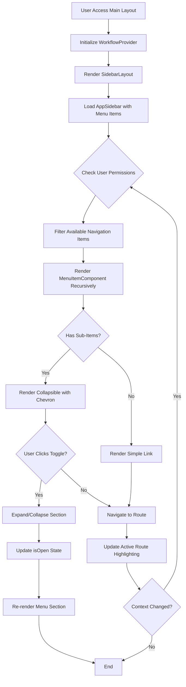

# Feature: Navigation and UI System

## Description
The Carmen ERP Navigation and UI System provides a comprehensive three-level hierarchical sidebar navigation that supports the entire application architecture. The system uses modern UI patterns with collapsible sections, active state management, and responsive design for both desktop and mobile interfaces. It integrates with a sophisticated user context system that allows dynamic switching between roles, departments, and locations, affecting available navigation options and functional permissions throughout the application.

## Process Flow (Step by Step)
1. User accesses the main application layout via `/app/(main)/layout.tsx`
2. System initializes the WorkflowProvider context for global state management
3. SidebarLayout component wraps the entire application providing navigation structure
4. AppSidebar component renders with predefined menu structure from menuItems array
5. System determines which navigation items are accessible based on user permissions and current context
6. User can expand/collapse menu sections using chevron indicators
7. MenuItemComponent recursively handles up to 3 levels of nesting with proper indentation
8. Active route highlighting updates automatically based on current pathname
9. Mobile users access navigation via SidebarTrigger for responsive sheet overlay
10. User context switching (role/department/location) updates available navigation options dynamically
11. Footer displays copyright and system information

## Flow Diagram (Mermaid)

## Screen Capture Locations
- Capture: Main dashboard with sidebar fully expanded showing all menu sections
- Capture: Collapsed sidebar view with icon-only mode
- Capture: Mobile responsive navigation with sheet overlay
- Capture: Deep nested menu (e.g., System Administration > Permission Management > Policy Management)
- Capture: Active route highlighting on different menu levels
- Capture: User context switcher affecting navigation options

## Schema Entities (Plain Text)
MenuItem: Core navigation structure containing title, path, icon, and optional subItems array for hierarchical organization.
SubMenuItem: Nested navigation items supporting up to 3 levels deep with name, path, optional icon, and description fields.
UserContext: Manages current user role, department, location, and price visibility affecting navigation accessibility.
WorkflowProvider: Global state management for workflow-related operations and user context.
SidebarState: Manages sidebar open/closed state, particularly for mobile responsive behavior.

## Major Navigation Sections
1. **Dashboard** - Overview and analytics hub
2. **Procurement** - Purchase requests, orders, GRN, credit notes, templates, approvals
3. **Product Management** - Products, categories, units, reports
4. **Vendor Management** - Vendor directory, pricelists, templates, campaigns, vendor portal
5. **Store Operations** - Store requisitions, stock replenishment, wastage reporting
6. **Inventory Management** - Stock overview, adjustments, counts, period-end operations
7. **Operational Planning** - Recipe management, menu engineering, forecasting
8. **Production** - Recipe execution, batch production, quality control
9. **Reporting & Analytics** - Operational, financial, inventory, vendor performance reports
10. **Finance** - Account mapping, currency management, exchange rates, budgets
11. **System Administration** - User management, permissions, workflows, integrations
12. **Help & Support** - Manuals, tutorials, FAQs, support tickets

## Ambiguities & Assumptions
Assumption: All users have access to at least the Dashboard section, with additional sections filtered by role permissions.
Assumption: Three-level nesting is the maximum depth supported by the MenuItemComponent recursive structure.
Ambiguity: The specific permission logic for filtering navigation items is not explicitly defined in the navigation component.
Assumption: The WorkflowProvider context manages cross-module state that affects navigation behavior.
Ambiguity: Mobile breakpoint behavior and exact responsive thresholds are not clearly specified in the navigation implementation.
Assumption: Icons use Lucide React library with fallback to Circle icon for missing mappings.