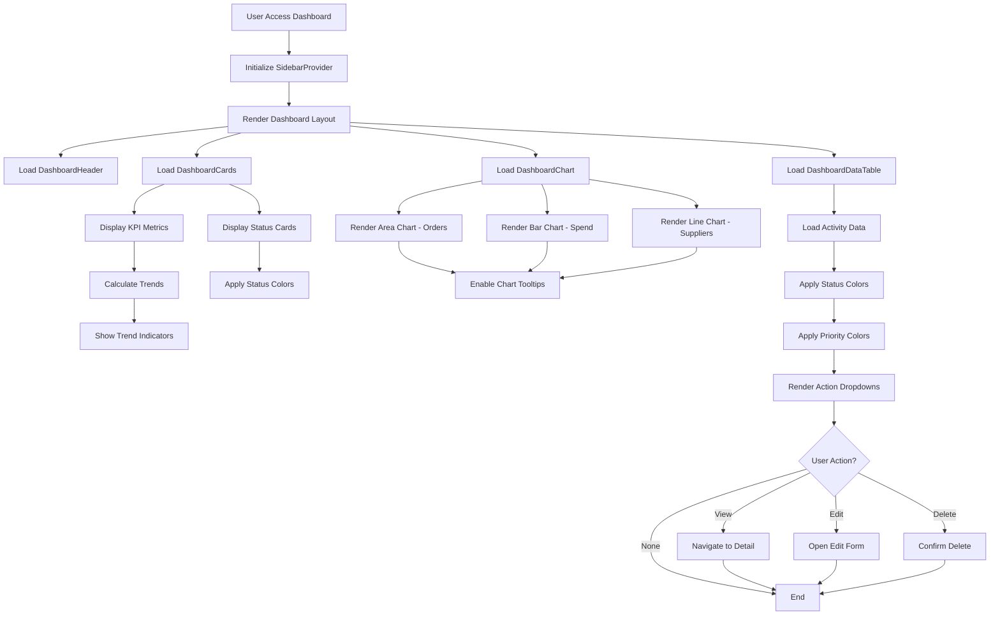

# Feature: Dashboard and Analytics

## Description
The Carmen ERP Dashboard and Analytics system provides a comprehensive overview of the organization's procurement, inventory, and operational performance through an interactive dashboard interface. The system displays real-time key performance indicators (KPIs), trend analysis charts, and recent activity monitoring. It features responsive card-based layouts with metric cards showing current values and percentage changes, interactive charts for trend visualization, and a comprehensive activity table that tracks recent system activities across all modules.

## Process Flow (Step by Step)
1. User navigates to `/dashboard` from the main navigation menu
2. System initializes SidebarProvider with custom spacing configuration
3. Dashboard layout renders with DashboardHeader, DashboardCards, DashboardChart, and DashboardDataTable components
4. DashboardCards loads and displays main KPI metrics with trend indicators
5. System calculates percentage changes and displays trending icons (up/down arrows)
6. Status cards section loads with critical alerts and operational status indicators
7. DashboardChart renders three different chart types: Area chart for order trends, Bar chart for spend analysis, Line chart for supplier network growth
8. Chart components use ChartContainer with accessibility layers and interactive tooltips
9. DashboardDataTable loads recent activities data with status and priority color coding
10. Activity table provides dropdown actions for each record (View, Edit, Delete)
11. All components update automatically based on data refresh intervals
12. User can interact with charts through hover tooltips and activity table actions

## Flow Diagram (Mermaid)

## Screen Capture Locations
- Capture: Full dashboard with all KPI cards showing positive and negative trends
- Capture: Status cards section highlighting critical stock items and pending approvals
- Capture: Interactive chart tooltips on hover for each chart type
- Capture: Recent activities table with dropdown actions menu open
- Capture: Mobile responsive dashboard layout showing card stacking
- Capture: Dashboard during data loading states
- Capture: Empty state when no recent activities exist

## Schema Entities (Plain Text)
DashboardCard: Contains title, value, change percentage, trend direction, icon, and description for KPI display.
StatusCard: Represents operational status with title, value, status level (critical/warning/success), icon, and description.
ChartData: Time-series data structure with month, orders, spend, and suppliers values for trend visualization.
ActivityRecord: Recent system activities with id, type, header, status, target, reviewer, priority, and date information.
ChartConfig: Configuration object defining chart colors and labels for consistent theming.

## Key Dashboard Sections

### Main KPI Cards
1. **Total Orders** - Purchase orders count with monthly trend
2. **Active Suppliers** - Verified supplier count with growth percentage
3. **Inventory Value** - Current stock value with change indicator
4. **Monthly Spend** - Total procurement expenditure with trend

### Status Alert Cards
1. **Critical Stock Items** - Items below minimum threshold (red alert)
2. **Orders Pending Approval** - Awaiting manager approval (yellow warning)
3. **Completed Deliveries** - Successfully delivered orders (green success)

### Analytics Charts
1. **Order Trends** - Area chart showing 6-month purchase order patterns
2. **Spend Analysis** - Bar chart displaying monthly procurement spend
3. **Supplier Network Growth** - Line chart correlating supplier count with order volume

### Recent Activities Table
- Displays latest procurement and inventory activities
- Status-coded badges for document states
- Priority indicators for urgent items
- Reviewer assignments and dates
- Action dropdown menus for each record

## Ambiguities & Assumptions
Assumption: Dashboard data refreshes automatically without explicit user refresh action.
Assumption: KPI calculations use month-over-month comparison for trend percentages.
Ambiguity: The exact refresh interval for real-time data updates is not specified.
Assumption: Chart data represents last 6 months of historical information.
Ambiguity: User permission levels for accessing different KPI data are not clearly defined.
Assumption: Critical stock threshold is predetermined and configurable elsewhere in the system.
Ambiguity: The maximum number of recent activities displayed in the table is not specified.
Assumption: All monetary values are displayed in the system's default currency setting.