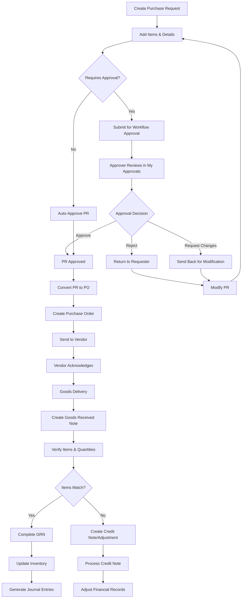

# Feature: Procurement Management System

## Document History

| Version | Date | Author | Changes |
|---------|------|--------|---------|
| 1.0.0 | 2025-11-19 | Documentation Team | Initial version |
## Description
The Carmen ERP Procurement Management System provides a comprehensive end-to-end procurement workflow encompassing Purchase Requests, Purchase Orders, Goods Received Notes, Credit Notes, and My Approvals. The system features a sophisticated workflow engine with role-based approvals, vendor comparison capabilities, multi-level item management with pricing transparency controls, and integrated inventory tracking. The procurement process supports both manual entry and automated creation from templates, with real-time status tracking and document lifecycle management.

## Process Flow (Step by Step)

### Purchase Request Flow
1. User navigates to `/procurement/purchase-requests` to view existing requests or create new ones
2. System displays ModernPurchaseRequestList with filtering, sorting, and status-based organization
3. User can create new PR via "New PR" button or from templates
4. PR creation form loads with tabs: Items, Details, Budgets, Workflow, Attachments
5. User adds items using ItemsTab component with search functionality and vendor comparison
6. System applies role-based pricing visibility (user.context.showPrices controls price display)
7. Workflow engine determines approval routing based on business rules and user roles
8. PR submits for approval and enters workflow status tracking
9. Approvers receive notifications and can view/approve via My Approvals section
10. Upon approval, PR can be converted to Purchase Order automatically or manually

### Purchase Order Flow
11. Approved PRs convert to POs via `/procurement/purchase-orders/create/from-pr` workflow
12. PO creation supports bulk operations and vendor consolidation
13. PO tabs include: Items, Vendor Info, Financial Details, Related Documents, Activity Log
14. System tracks PO status: Draft, Sent, Acknowledged, Partially Received, Completed
15. Vendor receives PO and can update delivery schedules via vendor portal integration

### Goods Received Note Flow
16. Users create GRN from `/procurement/goods-received-note/new` with vendor/PO selection
17. GRN creation wizard: PO Selection → Item Selection → Location Assignment → Confirmation
18. System supports manual entry mode for non-PO receipts
19. GRN tabs manage: Items, Stock Movement, Extra Costs, Tax, Financial Summary, Comments
20. Stock movements automatically update inventory levels upon GRN completion
21. System generates journal entries for accounting integration

## Flow Diagram (Mermaid)

## Screen Capture Locations
- Capture: Purchase Requests list with various status filters and search functionality
- Capture: PR detail page showing all tabs (Items, Details, Budgets, Workflow, Attachments)
- Capture: Item addition form with vendor comparison modal open
- Capture: My Approvals page showing pending approvals with workflow timeline
- Capture: PO creation from PR with item consolidation and vendor selection
- Capture: GRN creation wizard showing step-by-step process
- Capture: GRN detail with stock movement tab showing inventory updates
- Capture: Credit Note creation linked to GRN discrepancies
- Capture: Role-based price visibility differences (staff vs manager view)

## Schema Entities (Plain Text)
PurchaseRequest: Core document with id, requestNumber, description, requestDate, requiredDate, department, requestedBy, status, workflow stage, priority level, and items array.
PurchaseRequestItem: Individual line items with productId, description, quantity, unit, estimatedPrice, preferredVendor, notes, and status tracking.
PurchaseOrder: Generated from PR with vendorId, orderDate, deliveryDate, terms, paymentTerms, currency, exchangeRate, and lineItems.
GoodsReceiveNote: Receipt document with grnNumber, date, vendorId, invoiceNumber, receivedBy, items, stockMovements, extraCosts, and financialTotals.
WorkflowStep: Approval stages with stepNumber, approverRole, status, comments, decisionDate, and nextStep routing.
CreditNote: Adjustment document for discrepancies with originalGRN, reason, adjustmentType, items, and financial impact.

## Major Procurement Features

### Purchase Request Management
- **List View**: Filter by status, date range, department, requester with search functionality
- **Detail View**: Tabbed interface for Items, Details, Budgets, Workflow, Attachments
- **Item Management**: Add/edit items with vendor comparison and price history
- **Template System**: Reusable PR templates for common requests
- **Workflow Integration**: Role-based approval routing with status tracking

### Purchase Order Management
- **Creation Methods**: Convert from PR, bulk creation, manual entry
- **Vendor Management**: Vendor selection with pricelist integration
- **Financial Controls**: Currency management, tax calculations, budget validation
- **Document Tracking**: Status progression from draft to completion
- **Related Documents**: Link to originating PRs and resulting GRNs

### Goods Received Note Management
- **Multi-Source Creation**: From PO, manual entry, or partial receipts
- **Verification Process**: Item-by-item quantity and quality validation
- **Inventory Integration**: Automatic stock level updates and location assignment
- **Cost Management**: Handle extra costs, freight, taxes separately
- **Discrepancy Handling**: Generate credit notes for variances

### Approval Workflow System
- **My Approvals**: Centralized approval queue for all pending items
- **Workflow Engine**: Business rule-driven approval routing
- **Decision Types**: Approve, reject, request changes, delegate approval
- **Audit Trail**: Complete workflow history with timestamps and comments
- **Escalation**: Automatic escalation for overdue approvals

### Vendor Comparison & Pricing
- **Price Comparison**: Side-by-side vendor pricing for items
- **Historical Pricing**: Track price trends and vendor performance
- **Role-Based Visibility**: Price display controlled by user permissions
- **Vendor Rating**: Quality and delivery performance metrics

## Ambiguities & Assumptions
Assumption: Workflow approval rules are configured in System Administration and applied automatically based on user roles and document values.
Assumption: Price visibility is controlled by user.context.showPrices setting, with different roles having different access levels.
Ambiguity: The exact business rules for workflow routing (amount thresholds, department-specific approvals) are not explicitly defined in the code.
Assumption: GRN creation automatically updates inventory levels and generates accounting journal entries.
Ambiguity: Credit note approval workflow and its integration with the main procurement workflow is not clearly specified.
Assumption: Multiple currencies are supported with automatic exchange rate conversion for reporting purposes.
Assumption: Template system allows for both organization-wide and department-specific PR templates.
Ambiguity: Integration points with external vendor portals and their data synchronization methods are not detailed.