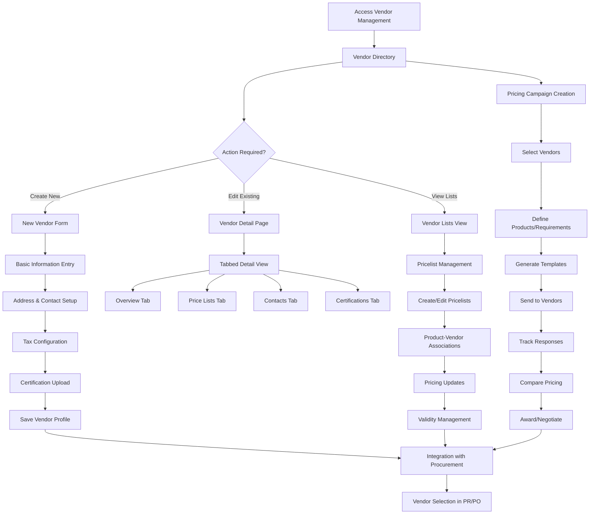

# Feature: Vendor Management System

## Description
The Carmen ERP Vendor Management System provides comprehensive vendor lifecycle management including vendor directory management, pricelist management, template-based pricing requests, campaign management, and vendor portal integration. The system features advanced vendor profiling with tax configuration, certification tracking, performance metrics, contact management, and address management. The vendor management module integrates with procurement processes to provide vendor comparison capabilities, pricing intelligence, and vendor performance analytics throughout the procurement workflow.

## Process Flow (Step by Step)

### Vendor Directory Management
1. User navigates to `/vendor-management/manage-vendors` to access vendor directory
2. System displays vendor list with filtering by status, business type, search functionality
3. User can create new vendor via "Add Vendor" button or edit existing vendors
4. New vendor creation includes: Basic Info, Addresses, Contacts, Tax Configuration, Certifications
5. System validates vendor information and checks for duplicates
6. Vendor profile creation includes performance metrics initialization and rating setup
7. Tax configuration supports multiple profiles: VAT, GST, Sales Tax, None VAT, Custom Rate
8. Vendor status can be toggled between Active/Inactive with immediate effect on procurement
9. System provides vendor deletion with dependency checking for existing POs/PRs

### Vendor Detail Management
10. Vendor detail page provides tabbed interface: Overview, Price Lists, Contacts & Addresses, Certifications
11. Overview tab displays vendor rating, performance metrics, tax configuration, and basic information
12. Contacts & Addresses tab supports multiple addresses and contact persons with role assignments
13. Certifications tab manages compliance documents and certification expiry tracking
14. Price Lists tab shows all active pricelists associated with the vendor

### Pricelist Management
15. User navigates to `/vendor-management/pricelists` for pricelist overview
16. System displays all pricelists with vendor association, status, and campaign tracking
17. Pricelist creation supports manual entry or template-based generation
18. Product-vendor pricing relationships are managed with validity periods and quantity breaks
19. System supports multiple currencies with automatic conversion rates
20. Bulk pricing updates are supported through Excel import/export functionality

### Campaign Management (RFP/RFQ Process)
21. User creates pricing campaign via `/vendor-management/campaigns/new`
22. Campaign wizard allows vendor selection, product specification, and timeline setup
23. System generates pricelist templates customized for each selected vendor
24. Email templates are automatically generated and sent to vendor contacts
25. Vendor responses are tracked with automated reminders for pending submissions
26. Campaign analytics provide response rates, pricing comparisons, and vendor performance

### Vendor Portal Integration
27. Vendors access simplified interface via `/vendor-management/vendor-portal/sample`
28. Portal allows vendors to update pricing, view assigned campaigns, and manage profile
29. System provides secure authentication and role-based access for vendor users
30. Vendor submissions integrate back into main system with approval workflows

## Flow Diagram (Mermaid)

## Screen Capture Locations
- Capture: Vendor directory with status filters and search functionality
- Capture: New vendor creation form showing all tabs (Basic Info, Address, Tax Config, Certifications)
- Capture: Vendor detail page with performance rating and summary information
- Capture: Tax configuration section showing different tax profiles and rates
- Capture: Pricelist management page with vendor associations and status indicators
- Capture: Campaign creation wizard with vendor selection and product requirements
- Capture: Vendor portal simple interface for price entry
- Capture: Vendor comparison modal during procurement process
- Capture: Bulk pricelist upload/download functionality

## Schema Entities (Plain Text)
Vendor: Core vendor entity with id, name, status, businessType, contactEmail, contactPhone, address, taxId, taxProfile, taxRate, companyRegistration, certifications, performanceMetrics, and metadata.
VendorAddress: Physical addresses with street, city, state, postalCode, country, and addressType (primary, billing, shipping).
VendorContact: Contact persons with name, email, phone, role, and isPrimary flag for vendor communication.
VendorPricelist: Pricing associations with vendorId, productId, price, currency, validFrom, validTo, minimumQuantity, and campaignId.
PricingCampaign: RFP/RFQ campaigns with campaignId, name, description, vendors, products, startDate, endDate, status, and responses.
VendorCertification: Compliance documents with certificationType, issueDate, expiryDate, certificationBody, and documentReference.
PerformanceMetrics: Vendor performance tracking with qualityScore, deliveryScore, priceCompetitiveness, responseTime, and overallRating.

## Major Vendor Management Features

### Vendor Directory
- **Search & Filtering**: Advanced search by name, business type, status, location
- **Status Management**: Active/Inactive toggles with immediate procurement impact
- **Performance Ratings**: 5-star rating system with quality and delivery metrics
- **Bulk Operations**: Mass status updates and data export functionality
- **Vendor Validation**: Duplicate checking and data quality validation

### Vendor Profiling
- **Basic Information**: Company details, business type, registration numbers
- **Tax Configuration**: Multi-jurisdiction tax setup with profile templates
- **Address Management**: Multiple addresses with type classification
- **Contact Management**: Multiple contacts with role-based assignments
- **Certification Tracking**: Document management with expiry monitoring

### Pricing & Procurement Integration
- **Pricelist Management**: Product-vendor price associations with validity periods
- **Campaign Management**: RFP/RFQ process automation with vendor notifications
- **Template System**: Customizable Excel templates for pricing submissions
- **Vendor Comparison**: Side-by-side pricing and performance comparison
- **Integration**: Seamless connection with Purchase Request and Purchase Order processes

### Vendor Portal
- **Simple Interface**: Streamlined vendor access for pricing updates
- **Campaign Response**: Direct response to pricing campaigns and RFPs
- **Profile Management**: Vendor self-service for contact and certification updates
- **Document Upload**: Secure document submission for certifications and proposals

### Analytics & Reporting
- **Performance Dashboards**: Vendor performance metrics and trends
- **Price Analysis**: Historical pricing trends and market comparisons
- **Response Analytics**: Campaign response rates and vendor engagement
- **Compliance Monitoring**: Certification expiry alerts and compliance status

## Ambiguities & Assumptions
Assumption: Tax configuration supports multiple jurisdictions with automatic rate application based on vendor location and tax profile.
Assumption: Vendor performance metrics are calculated automatically based on procurement history and delivery performance.
Ambiguity: The exact criteria and weighting for vendor performance ratings are not explicitly defined in the system.
Assumption: Campaign emails are automatically generated and sent to vendor contacts based on predefined templates.
Ambiguity: Integration between vendor portal submissions and main system approval workflows requires clarification.
Assumption: Pricelist validity periods are enforced automatically during procurement processes.
Assumption: Multiple currencies are supported with real-time exchange rate conversion for pricing comparisons.
Ambiguity: The specific business rules for vendor deletion and dependency checking need detailed specification.