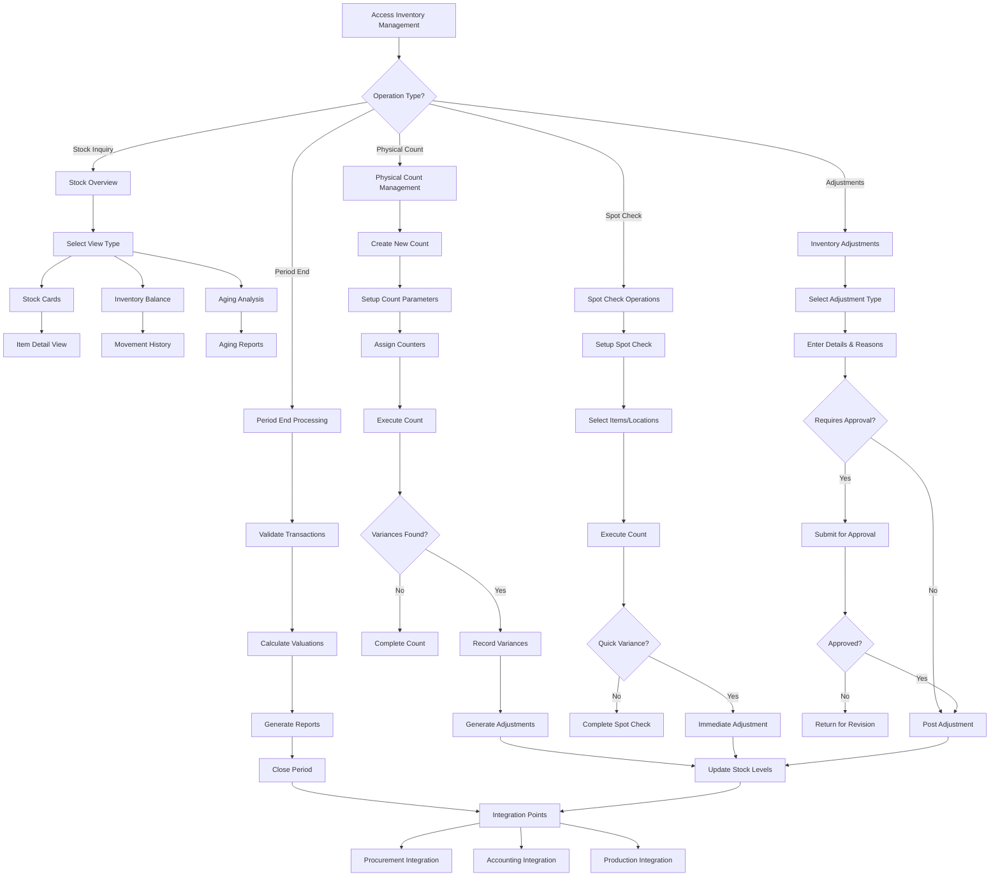

# Feature: Inventory Management System

## Description
The Carmen ERP Inventory Management System provides comprehensive inventory control through multiple specialized modules including Stock Overview, Inventory Adjustments, Physical Count Management, Spot Checks, and Period End processing. The system features real-time inventory tracking with multiple views (stock cards, inventory balance, aging analysis), sophisticated count management with variance tracking, automated stock movement recording, and integration with procurement and production processes. The inventory system supports multi-location operations with location-specific stock tracking and movement history.

## Process Flow (Step by Step)

### Stock Overview Management
1. User navigates to `/inventory-management/stock-overview` to access inventory dashboard
2. System provides multiple views: Overview, Inventory Balance, Stock Cards, Slow Moving, Inventory Aging
3. Stock Cards view displays detailed item-level information with lot tracking and valuation
4. Inventory Balance provides real-time stock levels with movement history
5. System applies filters for location, category, status, and date ranges
6. User can drill down into specific items for detailed stock card information
7. Movement history tracks all stock transactions with source document references

### Physical Count Management
8. User accesses `/inventory-management/physical-count-management` for count operations
9. System supports creating new counts with location, department, and counter assignment
10. Count setup includes item selection, location assignment, and counting instructions
11. Physical count process tracks progress with completed vs. pending items
12. System records variances between physical count and system quantities
13. Count completion triggers inventory adjustments and variance analysis
14. Approval workflow manages count acceptance and adjustment posting

### Spot Check Operations
15. User initiates spot checks via `/inventory-management/spot-check` for targeted counts
16. Spot check wizard guides through: Setup → Item Selection → Location → Counting → Review
17. System supports random item selection or specific item targeting
18. Quick count interface allows rapid quantity verification
19. Variance reporting highlights discrepancies requiring investigation
20. Integration with adjustment process for immediate corrections

### Inventory Adjustments
21. User creates adjustments via `/inventory-management/inventory-adjustments`
22. Adjustment types include: Physical Count Variance, Damage/Loss, Transfer, Conversion
23. System requires reason codes and approval based on adjustment value thresholds
24. Stock movements are automatically generated with journal entry integration
25. Audit trail maintains complete history of all adjustment transactions

### Period End Processing
26. User initiates period end via `/inventory-management/period-end`
27. System validates all pending transactions and count completions
28. Inventory valuation calculations using FIFO, LIFO, or weighted average methods
29. Period closing prevents backdated transactions and locks inventory balances
30. Reporting generates period-end inventory statements and variance summaries

## Flow Diagram (Mermaid)

## Screen Capture Locations
- Capture: Stock overview dashboard with multiple view options and filters
- Capture: Stock card detail showing lot information, movements, and valuation
- Capture: Physical count management list with status indicators and progress tracking
- Capture: Count creation wizard showing location and item selection
- Capture: Spot check interface with quick count entry forms
- Capture: Inventory adjustment form with reason codes and approval workflow
- Capture: Period end processing screen with validation results
- Capture: Movement history with detailed transaction tracking
- Capture: Variance report showing discrepancies and resolution status

## Schema Entities (Plain Text)
InventoryItem: Core inventory entity with itemId, description, category, unit, location, currentQuantity, reservedQuantity, availableQuantity, reorderLevel, maxLevel, status.
StockMovement: Transaction record with movementId, itemId, movementType, quantity, fromLocation, toLocation, documentReference, transactionDate, userId, notes.
PhysicalCount: Count header with countId, countDate, location, department, counter, status, itemCount, varianceCount, totalVariance, approvedBy.
CountDetail: Individual count lines with countId, itemId, systemQuantity, countedQuantity, variance, varianceValue, reason, status.
InventoryAdjustment: Adjustment document with adjustmentId, adjustmentType, reason, items, totalValue, approvedBy, postingDate, journalReference.
StockCard: Item-specific tracking with itemId, location, openingBalance, receipts, issues, adjustments, closingBalance, movements, lotDetails.

## Major Inventory Management Features

### Stock Overview & Tracking
- **Real-Time Balances**: Live inventory levels across all locations
- **Stock Cards**: Detailed item history with lot tracking and FIFO/LIFO calculations
- **Movement History**: Complete audit trail of all stock transactions
- **Multi-Location Support**: Location-specific stock tracking and transfers
- **Aging Analysis**: Inventory aging reports for slow-moving identification

### Physical Count Management
- **Count Planning**: Scheduled and ad-hoc count creation with assignment management
- **Progress Tracking**: Real-time count progress with completion percentages
- **Variance Management**: Automatic variance calculation and investigation workflows
- **Multi-User Counts**: Parallel counting with consolidation and review processes
- **Approval Workflow**: Count approval process with variance thresholds

### Spot Check Operations
- **Random Selection**: System-generated random item selection for spot verification
- **Targeted Checks**: Specific item or location-focused counting
- **Quick Interface**: Streamlined counting interface for rapid verification
- **Immediate Corrections**: Real-time adjustment capability for minor variances
- **Exception Reporting**: Variance alerts and investigation queues

### Adjustment Management
- **Multiple Adjustment Types**: Support for various adjustment reasons and categories
- **Approval Workflows**: Value-based approval routing with delegation capability
- **Batch Processing**: Bulk adjustment creation and posting functionality
- **Journal Integration**: Automatic accounting journal entry generation
- **Audit Compliance**: Complete audit trail with reversal capabilities

### Valuation & Reporting
- **Costing Methods**: FIFO, LIFO, weighted average, and standard costing support
- **Valuation Reports**: Period-end inventory valuation with variance analysis
- **Movement Analysis**: Detailed transaction reporting with drill-down capability
- **Performance Metrics**: Inventory turnover, accuracy, and variance trending
- **Integration Reports**: Cross-module reporting with procurement and production data

## Ambiguities & Assumptions
Assumption: Stock movements are automatically generated from procurement (GRN) and production processes.
Assumption: Physical count variances above defined thresholds require management approval before posting.
Ambiguity: The specific business rules for automatic reorder point calculations and purchase suggestions are not defined.
Assumption: Multi-location inventory transfers require approval and generate automatic stock movements.
Ambiguity: Integration timing with external systems (POS, production) for real-time inventory updates needs clarification.
Assumption: Period-end closing prevents all backdated inventory transactions and requires special permissions to reopen.
Assumption: Lot tracking is supported with expiry date management and FEFO (First Expired, First Out) logic.
Ambiguity: The exact workflow for handling negative inventory situations and backorder management requires specification.