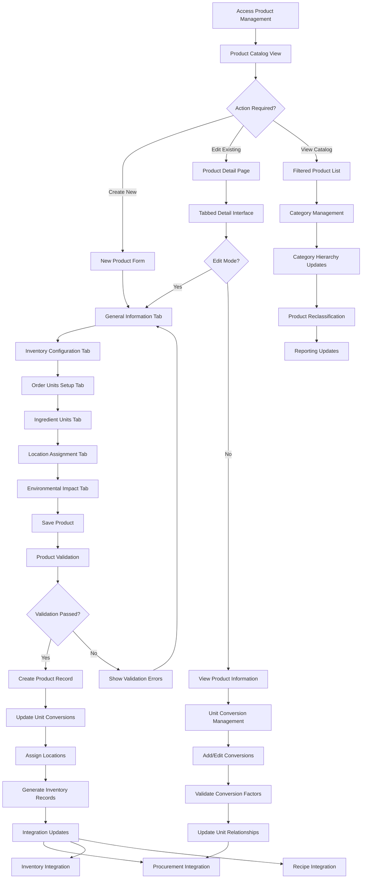

# Feature: Product Management and Catalog System

## Description
The Carmen ERP Product Management System provides comprehensive product catalog management with sophisticated product profiling, multi-unit conversions, environmental impact tracking, location assignment management, and inventory integration. The system supports complex product configurations including pricing structures, tax management, unit conversions for ordering/inventory/recipes, location-specific parameters, and environmental sustainability metrics. Products can be configured for sale items, ingredients, or both, with complete lifecycle management from creation to discontinuation.

## Process Flow (Step by Step)

### Product Catalog Management
1. User navigates to `/product-management/products` to access product catalog
2. System displays product list with filtering by category, status, and search functionality
3. User can create new products via "Add Product" button or edit existing products
4. Product creation includes comprehensive tabs: General, Inventory, Order Units, Ingredient Units, Locations, Environmental Impact
5. System validates product information including unique product codes and barcode verification
6. Product profile setup includes category assignment, item group classification, and primary unit designation
7. Advanced pricing configuration supports base price, standard cost, tax types, and deviation limits
8. System maintains product relationships with vendors through pricing and procurement integration

### Unit Conversion Management
9. System supports three types of unit conversions: Inventory, Order, and Recipe units
10. Conversion factors enable seamless unit transitions (e.g., KG to Grams, Liters to Bottles)
11. Order units facilitate procurement processes with vendor-specific ordering units
12. Recipe units enable recipe management with precise ingredient measurements
13. System validates conversion factor accuracy and prevents circular conversion chains
14. Bulk conversion updates support mass product unit changes

### Location Assignment System
15. Products can be assigned to multiple storage locations with specific parameters
16. Location assignments include min/max quantities, reorder points, and par levels
17. System tracks location-specific inventory levels and movement restrictions
18. Assignment validation ensures logical min/max relationships and stock level constraints
19. Bulk location assignment supports consistent parameter application across products
20. Integration with inventory management provides real-time location-specific stock updates

### Environmental Impact Tracking
21. System captures comprehensive environmental metrics: carbon footprint, water usage, recyclability
22. Sustainability certifications tracking includes Organic, Fair Trade, MSC, FSC certifications
23. Energy efficiency ratings from A (most efficient) to F (least efficient) classification
24. Biodegradability and packaging recyclability percentages for environmental compliance
25. Environmental reports support sustainability initiatives and regulatory compliance
26. Integration with procurement provides supplier environmental performance tracking

### Category and Classification System
27. Hierarchical category structure supports Category → Subcategory → Item Group organization
28. Dynamic category management allows real-time classification updates
29. Item groups enable cross-category product clustering (e.g., Organic Products, Premium Items)
30. Classification affects reporting, pricing strategies, and procurement workflows
31. Bulk reclassification supports organizational structure changes

## Flow Diagram (Mermaid)

## Screen Capture Locations
- Capture: Product catalog list with category filters and search functionality
- Capture: New product creation form showing General tab with complete product information
- Capture: Unit conversions setup showing inventory, order, and recipe unit relationships
- Capture: Location assignment tab with min/max quantities and reorder points
- Capture: Environmental impact tab with sustainability metrics and certifications
- Capture: Product detail view with all tabs and comprehensive product information
- Capture: Category management interface showing hierarchical structure
- Capture: Bulk operations interface for mass product updates
- Capture: Product integration with procurement showing vendor pricing associations

## Schema Entities (Plain Text)
Product: Core product entity with productCode, name, description, localDescription, category hierarchy, primaryInventoryUnit, pricing, costs, deviationLimits, stockLevels, flags (isActive, isForSale, isIngredient), physicalAttributes (weight, shelfLife, size, color, barcode), and environmentalMetrics.
UnitConversion: Unit relationship with productId, fromUnit, toUnit, conversionFactor, unitType (INVENTORY/ORDER/RECIPE), and validation rules.
LocationAssignment: Product-location relationship with productId, locationId, minQuantity, maxQuantity, reorderPoint, parLevel, and status.
ProductCategory: Hierarchical classification with categoryId, name, parentCategory, subcategories, and itemGroups.
EnvironmentalMetrics: Sustainability tracking with carbonFootprint, waterUsage, packagingRecyclability, biodegradabilityMonths, energyEfficiencyRating, and sustainableCertification.
PricingConfiguration: Product pricing with basePrice, standardCost, lastCost, currency, taxType, taxRate, priceDeviationLimit, and quantityDeviationLimit.

## Major Product Management Features

### Product Catalog
- **Comprehensive Profiling**: Complete product information including descriptions, categories, and classifications
- **Multi-Language Support**: Local language descriptions for international operations
- **Barcode Management**: Barcode generation and validation with duplicate checking
- **Status Management**: Active/inactive status with workflow impact control
- **Bulk Operations**: Mass updates for pricing, categories, and status changes

### Unit Management System
- **Multi-Unit Support**: Inventory, order, and recipe unit conversions
- **Conversion Validation**: Mathematical validation and circular reference prevention
- **Unit Relationships**: Complex conversion chains with accuracy verification
- **Procurement Integration**: Seamless vendor ordering unit management
- **Recipe Integration**: Precise ingredient measurement conversions

### Advanced Pricing Configuration
- **Flexible Pricing**: Base prices with standard and last cost tracking
- **Tax Management**: Multiple tax types (Added, Included, None) with rate configuration
- **Deviation Controls**: Price and quantity deviation limits for procurement control
- **Cost Tracking**: Historical cost analysis and variance reporting
- **Currency Support**: Multi-currency pricing with automatic conversion

### Location-Based Management
- **Multi-Location Assignment**: Products assigned to multiple storage locations
- **Parameter Configuration**: Location-specific min/max quantities and reorder points
- **Inventory Integration**: Real-time location-specific stock tracking
- **Par Level Management**: Optimal stock level maintenance per location
- **Transfer Management**: Inter-location transfer capability and tracking

### Environmental Sustainability
- **Carbon Footprint Tracking**: CO2 equivalent measurements per product unit
- **Water Usage Monitoring**: Water consumption metrics for sustainability reporting
- **Recyclability Assessment**: Packaging recyclability percentage tracking
- **Certification Management**: Sustainability certification tracking and expiry monitoring
- **Energy Efficiency**: Product energy efficiency rating and classification
- **Biodegradability**: Natural decomposition timeframe tracking

### Category and Classification
- **Hierarchical Organization**: Category → Subcategory → Item Group structure
- **Dynamic Classification**: Real-time category updates with workflow integration
- **Cross-Category Grouping**: Item groups spanning multiple categories
- **Reporting Integration**: Classification-based reporting and analytics
- **Bulk Reclassification**: Mass category updates with validation

## Ambiguities & Assumptions
Assumption: Product codes must be unique across the entire system and cannot be reused even after product deletion.
Assumption: Unit conversion factors are bidirectional and automatically calculate reverse conversions.
Ambiguity: The specific business rules for automatic reorder point calculations based on historical consumption are not defined.
Assumption: Environmental impact metrics are required for sustainability reporting and compliance tracking.
Ambiguity: Integration timing with external systems (POS, e-commerce) for product catalog synchronization needs clarification.
Assumption: Location assignments support both physical locations and virtual/logical location categories.
Assumption: Tax configuration supports multi-jurisdiction tax rules with location-based tax rate determination.
Ambiguity: The exact workflow for handling discontinued products and their impact on existing procurement/inventory processes requires specification.