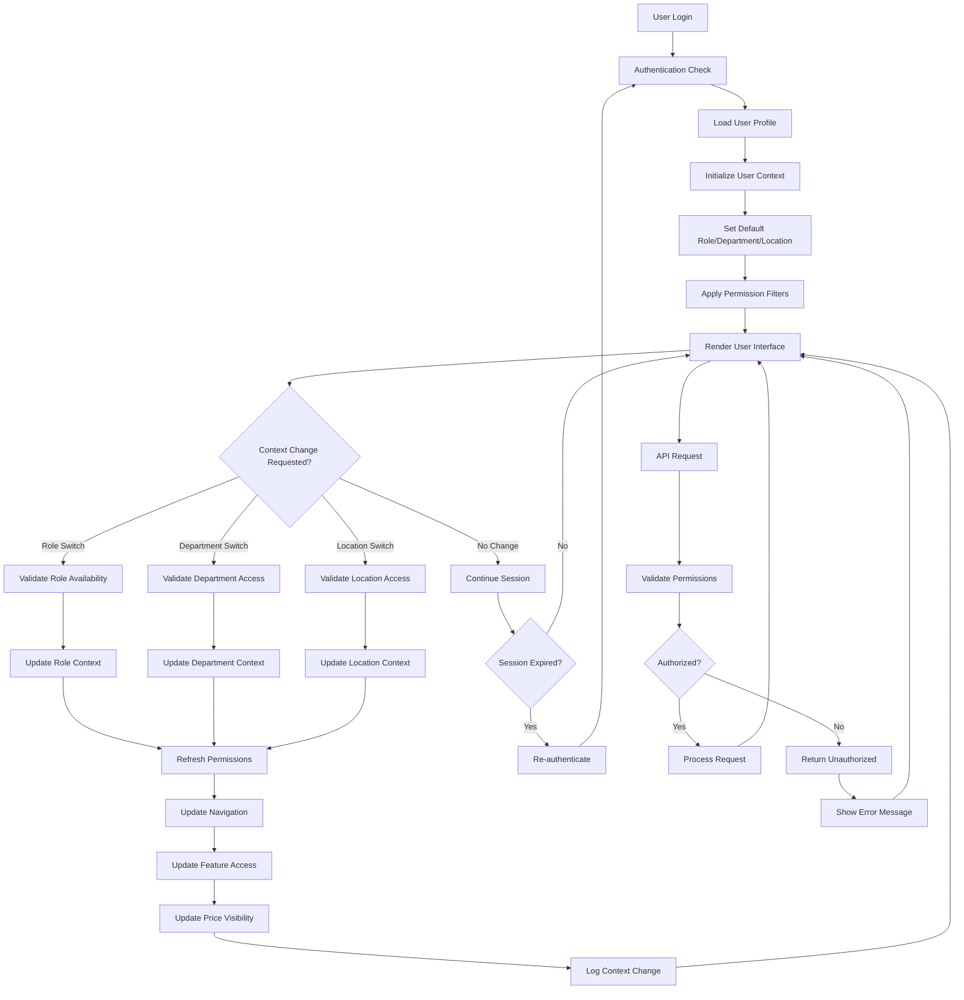

# Feature: User Authentication and Context Management

## Description
The Carmen ERP User Authentication and Context Management System provides a sophisticated multi-role, multi-department, and multi-location user management framework. The system features dynamic user context switching allowing users to operate with different roles across various departments and locations within a single session. It implements role-based access control with granular permissions, price visibility controls based on user roles, and comprehensive user profile management with department and location assignments.

## Process Flow (Step by Step)

### User Authentication
1. User accesses the system and is authenticated through SimpleUserProvider context
2. System loads user profile with available roles, departments, and locations
3. Default user context is established based on user's primary role and assignment
4. Authentication state is maintained throughout the session with automatic refresh
5. System provides role-based navigation filtering and feature access control

### Context Switching
6. User can switch active role via UserContextSwitcher component
7. System validates role availability and updates user context immediately
8. Navigation and feature availability updates based on new role permissions
9. Price visibility toggles automatically based on role-specific settings
10. Department switching updates operational context and data filtering
11. Location switching affects inventory visibility and operational scope
12. All context changes are logged for audit and tracking purposes

### Role-Based Access Control
13. System implements granular permission system through role definitions
14. Each role has specific capabilities: staff, department-manager, financial-manager, purchasing-staff, counter, chef
15. Permission validation occurs at component and API levels
16. Price visibility controlled by user.context.showPrices flag based on role
17. Workflow approval rights determined by role and department combination
18. Feature access dynamically filtered based on role permissions

### User Profile Management
19. Comprehensive user profiles include personal information, role assignments, and preferences
20. Multi-department assignments allow users to operate across organizational units
21. Location assignments define physical or logical operational scope
22. User preferences include language settings, notification preferences, and UI customizations
23. Profile updates require appropriate approval workflows based on change sensitivity

## Flow Diagram (Mermaid)

## Screen Capture Locations
- Capture: Login screen with authentication form
- Capture: User context switcher showing available roles, departments, and locations
- Capture: Navigation menu showing role-based filtering of available options
- Capture: Price visibility differences between staff and manager views
- Capture: User profile management with role assignments and preferences
- Capture: Permission-based feature access (showing enabled/disabled states)
- Capture: Audit log showing context changes and user activities
- Capture: Multi-department user accessing different department contexts

## Schema Entities (Plain Text)
User: Core user entity with id, name, email, role, department, location, availableRoles, availableDepartments, availableLocations, preferences, and context settings.
UserContext: Active session context with currentRole, currentDepartment, currentLocation, showPrices flag, and operational preferences.
Role: Role definition with name, description, permissions array, and system capabilities.
Department: Organizational unit with id, name, description, parent department, and operational scope.
Location: Physical or logical location with id, name, type, address, and operational parameters.
Permission: Granular permission with resource, action, scope, and conditions.
UserSession: Session management with sessionId, userId, loginTime, lastActivity, and contextHistory.

## Major Authentication and Context Features

### Authentication System
- **Simple User Provider**: Mock authentication system for prototype development
- **Session Management**: Persistent session state with automatic refresh
- **Role Validation**: Dynamic role availability checking and assignment
- **Security Context**: Comprehensive security context maintained throughout session
- **Audit Trail**: Complete logging of authentication events and context changes

### Dynamic Context Switching
- **Real-Time Role Switching**: Immediate role changes with permission updates
- **Department Context**: Switch operational context between departments
- **Location Context**: Change location scope for inventory and operations
- **Context History**: Track context changes for audit and user experience
- **Validation Rules**: Ensure users only access authorized contexts

### Role-Based Access Control
- **Granular Permissions**: Fine-grained permission system for features and data
- **Hierarchical Roles**: Role hierarchy with inheritance of permissions
- **Department-Specific Permissions**: Role permissions scoped to departments
- **Dynamic Feature Access**: Real-time feature availability based on role
- **API-Level Security**: Permission validation at all system integration points

### Price Visibility Management
- **Role-Based Price Display**: Price visibility controlled by user role
- **Dynamic Price Hiding**: Real-time price display control throughout system
- **Permission Override**: Administrative override for price visibility
- **Context-Sensitive Display**: Price visibility changes with role switching
- **Audit Compliance**: Tracking of price access for compliance purposes

### User Profile Management
- **Multi-Role Assignment**: Users can hold multiple roles simultaneously
- **Department Assignments**: Users assigned to multiple departments
- **Location Access**: Location-based access control and assignment
- **Preference Management**: User-specific system preferences and customizations
- **Profile Validation**: Validation rules for user assignments and combinations

### Integration and Workflow
- **Workflow Integration**: Role-based approval and workflow routing
- **Navigation Filtering**: Dynamic menu and feature filtering
- **Data Access Control**: Role-based data filtering and access control
- **Cross-Module Integration**: Consistent permission model across all modules
- **Scalable Architecture**: Support for complex organizational structures

## Ambiguities & Assumptions
Assumption: Users can hold multiple roles but only one role is active at any given time during a session.
Assumption: Price visibility is primarily controlled by role but can be overridden by specific permissions.
Ambiguity: The specific permission matrix for each role and the inheritance rules between roles are not explicitly defined.
Assumption: Context switching is immediate and does not require re-authentication within the same session.
Ambiguity: The exact business rules for department and location access validation need detailed specification.
Assumption: All user context changes are logged for audit purposes and compliance tracking.
Assumption: The system supports complex organizational hierarchies with multiple levels of departments and locations.
Ambiguity: Integration with external authentication systems (LDAP, Active Directory) and single sign-on capabilities are not clearly specified.