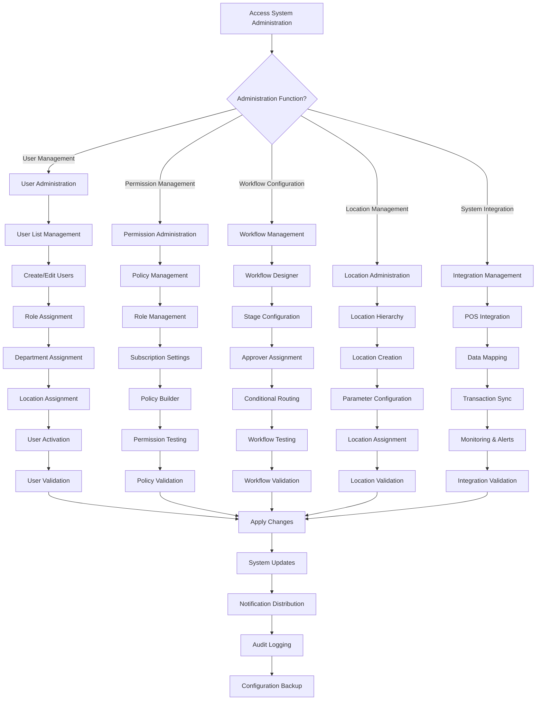

# Feature: System Administration

## Document History

| Version | Date | Author | Changes |
|---------|------|--------|---------|
| 1.0.0 | 2025-11-19 | Documentation Team | Initial version |
## Description
The Carmen ERP System Administration module provides comprehensive system management capabilities including user management, permission management, workflow configuration, location management, system integrations (particularly POS integration), and business rule configuration. The system features advanced role-based policy management, sophisticated workflow engines, location hierarchy management, and extensive integration capabilities. System administration supports both simple and complex organizational structures with scalable permission models and workflow configurations.

## Process Flow (Step by Step)

### User Management
1. User navigates to `/system-administration/user-management` to access user administration
2. System displays user list with filtering by role, department, status, and search functionality
3. Administrator can create new users, edit existing profiles, or manage user assignments
4. User creation includes personal information, role assignments, department access, and location permissions
5. Bulk user operations support mass role updates, status changes, and permission assignments
6. User activity monitoring provides audit trails and access tracking
7. User lifecycle management handles activation, deactivation, and profile archival

### Permission Management
8. Administrator accesses `/system-administration/permission-management` for advanced permission control
9. Policy Management allows creation of custom access policies with complex business rules
10. Role Management provides hierarchical role definition with permission inheritance
11. Subscription Settings manage feature access based on licensing and subscription levels
12. Policy Builder enables visual policy creation with conditional logic and rule testing
13. Permission assignment supports both individual user and group-based permissions
14. Policy validation ensures conflict resolution and logical consistency

### Workflow Configuration
15. Workflow Management accessible via `/system-administration/workflow/workflow-configuration`
16. Workflow designer allows creation of approval workflows with multiple stages and routing
17. Role Assignment component manages approver assignments based on organizational hierarchy
18. Conditional routing supports complex approval logic based on amounts, departments, and request types
19. Workflow templates provide standardized approval processes across different document types
20. Escalation management handles overdue approvals with automatic escalation rules

### Location Management
21. Location hierarchy managed through `/system-administration/location-management`
22. Location creation includes physical address, operational parameters, and parent-child relationships
23. Location types support warehouses, stores, kitchens, offices, and virtual locations
24. Location assignments affect inventory visibility, user access, and operational scope
25. Location-specific configurations include currency, time zones, and local regulations
26. Bulk location operations support organizational restructuring and mass updates

### System Integrations
27. POS Integration accessible via `/system-administration/system-integrations/pos`
28. Integration dashboard provides real-time status monitoring and configuration management
29. Data mapping between Carmen ERP and POS systems for products, units, locations, and recipes
30. Transaction synchronization with bi-directional data flow and conflict resolution
31. Settings management for API endpoints, authentication, and data transformation rules
32. Integration monitoring with error logging, retry mechanisms, and failure alerts

## Flow Diagram (Mermaid)

## Screen Capture Locations
- Capture: User management list with bulk operations and filtering capabilities
- Capture: User creation form with role, department, and location assignments
- Capture: Permission management dashboard with policy and role configuration
- Capture: Policy builder interface showing visual rule creation
- Capture: Workflow configuration designer with approval stages and routing
- Capture: Location management hierarchy with parent-child relationships
- Capture: POS integration dashboard with real-time status monitoring
- Capture: System integration mapping interface for data transformation
- Capture: Permission testing interface with validation results

## Schema Entities (Plain Text)
SystemUser: User entity with id, personalInfo, roles, departments, locations, permissions, status, preferences, and auditLog.
Permission: Granular permission with resource, action, conditions, scope, and inheritance rules.
Policy: Complex access policy with conditions, rules, exceptions, and business logic.
WorkflowDefinition: Workflow template with stages, approvers, conditions, routing rules, and escalation settings.
Location: Physical/logical location with hierarchy, address, parameters, assignments, and operational settings.
Integration: System integration with connectionDetails, mappings, synchronizationRules, monitoring, and errorHandling.
Role: System role with permissions, hierarchy, description, and assignment rules.

## Major System Administration Features

### User Management System
- **Comprehensive User Profiles**: Complete user information with multi-dimensional assignments
- **Bulk Operations**: Mass user updates, role assignments, and status changes
- **User Lifecycle Management**: Account creation, activation, deactivation, and archival processes
- **Access Monitoring**: Real-time user activity tracking and audit trail maintenance
- **Self-Service Capabilities**: User profile updates and preference management
- **Integration Ready**: Support for external authentication systems and directory services

### Advanced Permission Management
- **Policy-Based Access Control**: Sophisticated policy engine with conditional logic
- **Visual Policy Builder**: Graphical interface for creating complex access rules
- **Role Hierarchy**: Multi-level role inheritance with permission cascading
- **Subscription Management**: Feature access control based on licensing tiers
- **Permission Testing**: Validation and testing environment for policy verification
- **Audit Compliance**: Complete permission change tracking and compliance reporting

### Workflow Configuration Engine
- **Visual Workflow Designer**: Drag-and-drop workflow creation with stage management
- **Dynamic Approver Assignment**: Rule-based approver selection with organizational hierarchy
- **Conditional Routing**: Complex routing logic based on document attributes and business rules
- **Escalation Management**: Automatic escalation with time-based and condition-based triggers
- **Workflow Templates**: Reusable workflow patterns for consistent approval processes
- **Performance Monitoring**: Workflow efficiency tracking and bottleneck identification

### Location Management System
- **Hierarchical Structure**: Multi-level location organization with parent-child relationships
- **Location Types**: Support for warehouses, stores, offices, kitchens, and virtual locations
- **Operational Parameters**: Location-specific settings for currency, time zones, and regulations
- **Assignment Management**: User and resource assignment to locations with access control
- **Bulk Operations**: Mass location updates and organizational restructuring support
- **Integration Support**: Location data synchronization with external systems

### System Integration Platform
- **POS Integration**: Comprehensive point-of-sale system integration with bi-directional sync
- **Data Mapping Engine**: Flexible data transformation and mapping capabilities
- **Real-Time Monitoring**: Integration health monitoring with alerting and notification
- **Error Handling**: Robust error detection, logging, and automatic retry mechanisms
- **API Management**: RESTful API endpoints for external system integration
- **Scalable Architecture**: Support for multiple concurrent integrations and high-volume data processing

### Business Rules and Configuration
- **Rule Engine**: Flexible business rule configuration with validation and testing
- **Configuration Management**: Centralized system configuration with version control
- **Template System**: Reusable configuration templates for consistent setup
- **Compliance Monitoring**: Regulatory compliance tracking and reporting capabilities
- **Change Management**: Controlled configuration changes with approval workflows
- **Backup and Recovery**: Automated configuration backup and disaster recovery procedures

## Ambiguities & Assumptions
Assumption: System administration requires elevated privileges and operates under enhanced security protocols.
Assumption: Workflow configurations are validated before activation to prevent system disruptions.
Ambiguity: The specific integration protocols and data formats supported by the POS integration system require detailed specification.
Assumption: Location hierarchy supports unlimited levels of nesting with circular reference prevention.
Ambiguity: The exact permission inheritance rules and conflict resolution mechanisms in complex role hierarchies need clarification.
Assumption: All system configuration changes are logged and can be rolled back if necessary.
Assumption: Integration monitoring includes performance metrics, error rates, and data quality assessments.
Ambiguity: The specific business rules engine capabilities and rule syntax supported by the system require detailed documentation.