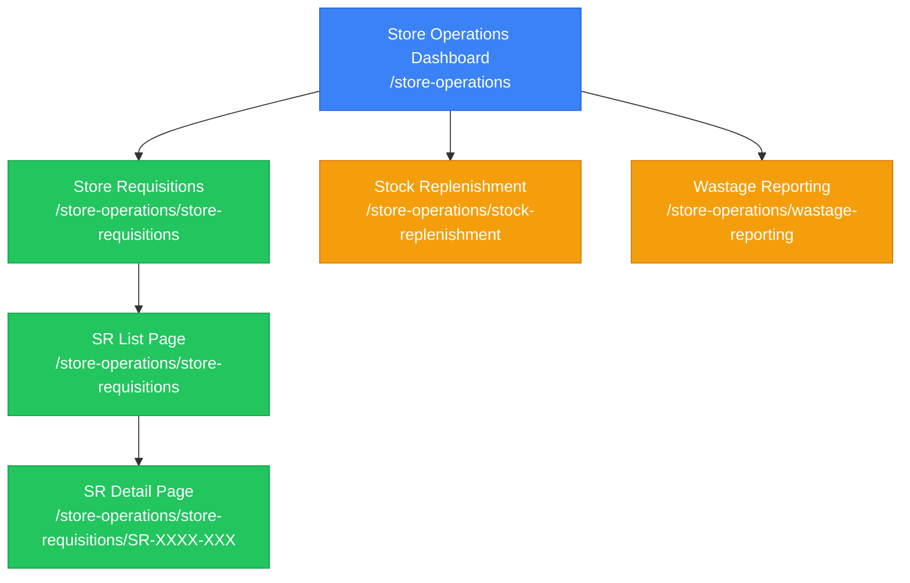

# Store Operations Module

**Module**: Store Operations
**Route**: `/store-operations`
**Status**: ✅ Production (Store Requisitions), 🚧 Prototype (Stock Replenishment, Wastage Reporting)
## Document History

| Version | Date | Author | Changes |
|---------|------|--------|---------|
| 1.0.0 | 2025-11-19 | Documentation Team | Initial version |
**Last Updated**: 2025-10-02

## Table of Contents

- [Overview](#overview)
- [Module Sitemap](#module-sitemap)
- [Submodules](#submodules)
- [Key Features](#key-features)
- [Module Statistics](#module-statistics)
- [Related Documentation](#related-documentation)

## Overview

The Store Operations module manages day-to-day store activities including store requisitions, stock replenishment, and wastage reporting. It provides comprehensive tools for tracking inventory movements between locations, managing stock levels, and monitoring wastage across all stores and operational units.

**Primary Functions**:
- Store-to-store requisition management
- Stock replenishment tracking and alerts
- Wastage reporting and analysis
- Inventory movement tracking
- Approval workflows for requisitions

## Module Sitemap

## Submodules

### 1. Store Requisitions
**Route**: `/store-operations/store-requisitions`
**Status**: ✅ Production
**Purpose**: Manage store-to-store material requisitions with approval workflows
**Documentation**: [STORE-REQUISITIONS.md](STORE-REQUISITIONS.md)

**Key Pages**:
- Store Requisition List Page (with filters, search, table/card views)
- Store Requisition Detail Page (with tabs: Items, Comments, Attachments, Activity Log, Journal Entries)
- Approval Workflow Component

**Features**:
- Create and manage requisitions
- Multi-level approval workflow (HOD → Store Manager)
- Item-level approval/rejection
- Stock movement tracking
- Journal entry generation
- Comments and attachments
- Activity logging

### 2. Stock Replenishment
**Route**: `/store-operations/stock-replenishment`
**Status**: 🚧 Prototype
**Purpose**: Monitor and manage stock replenishment needs across stores
**Documentation**: [STOCK-REPLENISHMENT.md](STOCK-REPLENISHMENT.md)

**Key Features**:
- Stock level monitoring
- Low stock alerts
- Reorder point tracking
- Par level management
- Automated requisition creation

### 3. Wastage Reporting
**Route**: `/store-operations/wastage-reporting`
**Status**: 🚧 Prototype
**Purpose**: Track and analyze wastage across all operational units
**Documentation**: [WASTAGE-REPORTING.md](WASTAGE-REPORTING.md)

**Key Features**:
- Wastage entry recording
- Wastage categorization (Expiration, Damage, Quality Issues, Other)
- Monthly trend analysis
- Wastage by reason breakdown
- Cost impact tracking

## Key Features

### Store Requisition Management
- **Requisition Workflow**: Draft → Submission → HOD Approval → Store Manager Approval → Complete
- **Multi-Level Approvals**: Configurable approval workflow with role-based stages
- **Item-Level Control**: Approve/reject individual items within a requisition
- **Stock Tracking**: Real-time inventory updates upon approval
- **Document Management**: Attach supporting documents and add comments

### Stock Monitoring
- **Real-Time Alerts**: Low stock notifications based on reorder points
- **Par Level Management**: Maintain optimal stock levels per location
- **Usage Tracking**: Monitor consumption patterns
- **Automated Reordering**: Create requisitions from stock alerts

### Wastage Control
- **Reason Tracking**: Categorize wastage by cause
- **Cost Analysis**: Calculate financial impact of wastage
- **Trend Monitoring**: Identify wastage patterns over time
- **Approval Process**: Review and approve wastage entries

## Module Statistics

### Store Requisitions (Production)
- **Total Requisitions**: 15 sample records
- **Status Distribution**:
  - In Process: 40%
  - Complete: 33%
  - Draft: 20%
  - Reject: 7%
  - Void: 0%
- **Approval Stages**: 4 (Submission, HOD, Store Manager, Complete)
- **Average Items per Requisition**: 7 items

### Stock Replenishment (Prototype)
- **Total SKUs**: 1,234
- **Low Stock Items**: 28
- **Items on Order**: 45
- **Total Stock Value**: $45,678

### Wastage Reporting (Prototype)
- **Monthly Wastage**: $3,458.50
- **Items Written Off**: 45
- **Pending Reviews**: 12
- **Wastage Reasons**: 4 categories

## Related Documentation

### Submodule Documentation
1. **[STORE-REQUISITIONS.md](STORE-REQUISITIONS.md)** - Complete store requisitions specification
2. **[STOCK-REPLENISHMENT.md](STOCK-REPLENISHMENT.md)** - Stock replenishment dashboard (prototype)
3. **[WASTAGE-REPORTING.md](WASTAGE-REPORTING.md)** - Wastage reporting dashboard (prototype)

### Supporting Documentation
- **[SHARED-COMPONENTS.md](SHARED-COMPONENTS.md)** - Reusable UI components
- **[FEATURE-GAPS.md](FEATURE-GAPS.md)** - Incomplete features and future development

### Related Modules
- **Inventory Management** - Stock tracking and movements
- **Procurement** - Purchase orders and vendor management
- **Finance** - Journal entries and cost tracking

---

**Module Version**: 1.0.0 (Store Requisitions), 0.5.0 (Stock Replenishment, Wastage Reporting)
**Documentation Status**: In Progress
